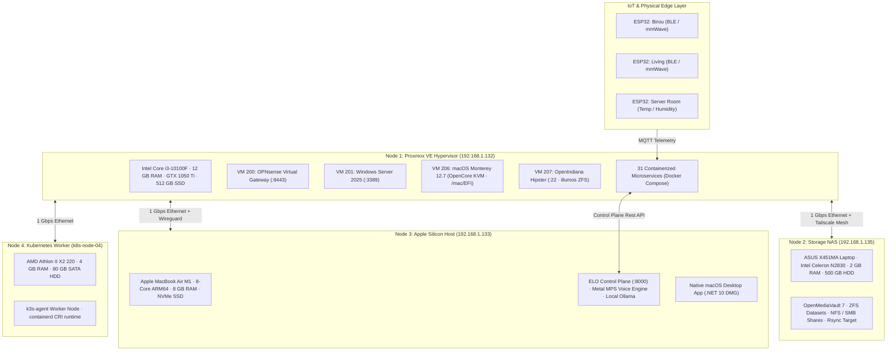
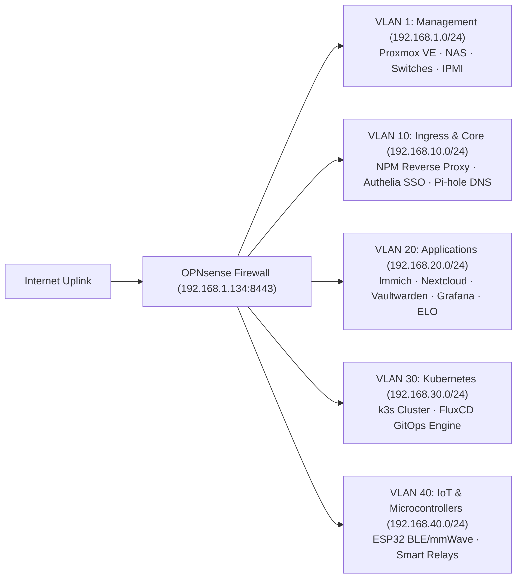
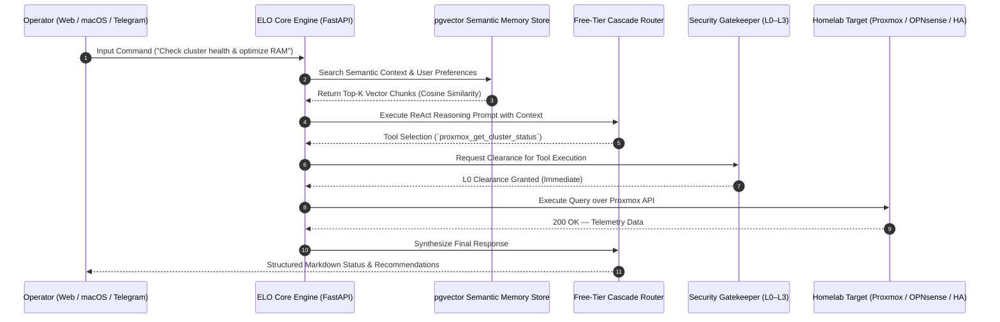
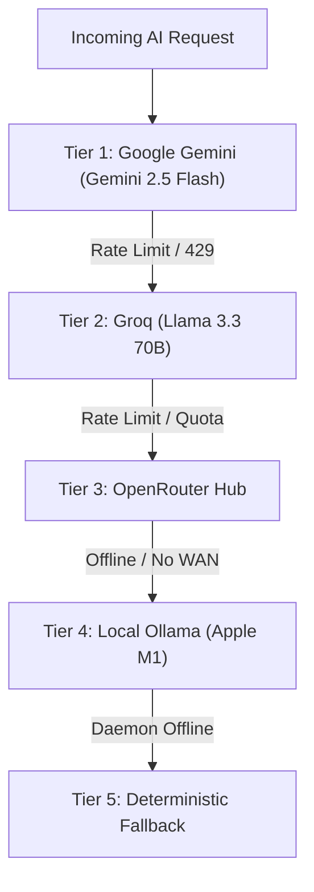

# Homelab & ELO System Architecture Blueprint

This document defines the comprehensive engineering architecture, physical topology, network matrix, autonomous AI orchestration pipeline, and storage subsystems powering the **Homelab & ELO Platform**.

---

## Table of Contents
1. [Physical & Virtual Hardware Topology](#1-physical--virtual-hardware-topology)
2. [Network Matrix & VLAN Architecture](#2-network-matrix--vlan-architecture)
3. [ELO AI Control Plane Architecture](#3-elo-ai-control-plane-architecture)
4. [LLM Fallback Chain](#4-llm-fallback-chain)
5. [Automation Agents](#5-automation-agents)
6. [Storage & ZFS Auto-Healing Architecture](#6-storage--zfs-auto-healing-architecture)
7. [Disaster Recovery & Blackout 10h+ SOP](#7-disaster-recovery--blackout-10h-sop)

---

## 1. Physical & Virtual Hardware Topology

---

## 2. Network Matrix & VLAN Architecture

---

## 3. ELO AI Control Plane Architecture

The ELO engine coordinates autonomous reasoning, security gatekeeping, semantic retrieval, and physical actuation:

---

## 4. LLM Fallback Chain

ELO implements an automated failover router across available LLM providers:

---

## 5. Automation Agents

ELO delegates background operational tasks to modular scripts and agents:

1.  **SecOps Threat-Hunter Agent (`elo_core.agents.secops_agent`)**:
   - Correlates Wazuh XDR and Suricata NIDS event streams.
   - Automatically isolates brute-force attackers by injecting stateful blacklist rules on OPNsense (`192.168.1.134:8443`).
2.  **SysAdmin Optimizer Agent (`elo_core.agents.sysadmin_agent`)**:
   - Monitors cluster memory utilization across nodes.
   - Triggers Kernel Samepage Merging (KSM) deduplication and purges dangling container image caches.
3.  **Smart Home Energy Agent (`elo_core.agents.energy_agent`)**:
   - Interrogates Home Assistant (`192.168.1.10:8123`) power metrics.
   - Detects idle vampire power draws and orchestrates energy-saving schedules.
4.  **Predictive Health Storage Healer (`elo_core.self_healing.predictive`)**:
   - Analyzes SMART disk telemetry on Scrutiny (`192.168.1.18`).
   - Automatically creates ZFS safety snapshots on OpenMediaVault (`192.168.1.135`) before drive failure occurs.

---

## 6. Storage & ZFS Auto-Healing Architecture

### 3-2-1 Backup Strategy
- **3 Copies of Data**: Primary NVMe SSD + Local OMV ZFS Pool + Offsite encrypted backup.
- **2 Different Media Types**: Flash NVMe (Proxmox) + Magnetic SATA HDD (OpenMediaVault NAS).
- **1 Offsite Copy**: Encrypted Rclone synchronization to secondary object storage.

---

## 7. Disaster Recovery & Blackout 10h+ SOP

In the event of an extended utility power outage exceeding battery UPS limits:

1. **Phase 1 (Hour 0–2: Conservation)**:
   - Shutdown non-essential compute workloads (Frigate NVR, Jellyfin transcoding, Woodpecker CI).
   - Throttle CPU frequencies on Proxmox node.
2. **Phase 2 (Hour 2–8: Core Survival Mode)**:
   - Migrate essential networking (Pi-hole DNS, Tailscale relay) to ultra-low-power Apple M1 host.
   - Spin down OpenMediaVault mechanical drives.
3. **Phase 3 (Hour 8+: Clean Controlled Shutdown)**:
   - Flush PostgreSQL WAL logs and trigger database dumps.
   - Execute `zpool sync` and cleanly unmount ZFS datasets.
   - Dispatch final battery telemetry alert to Telegram.
