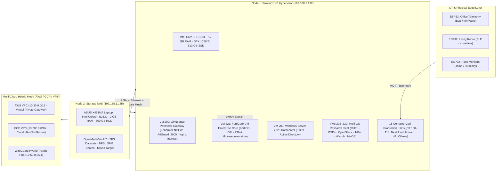
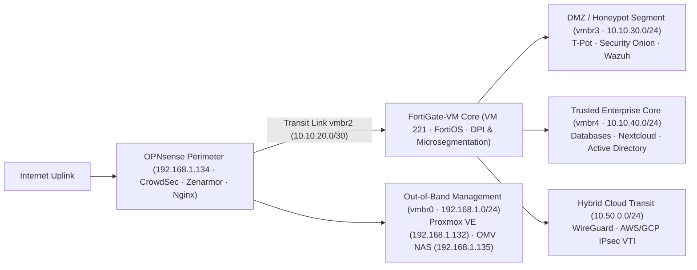
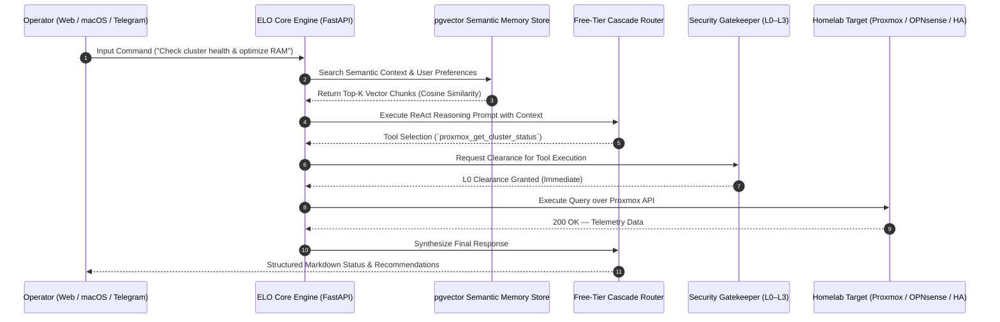
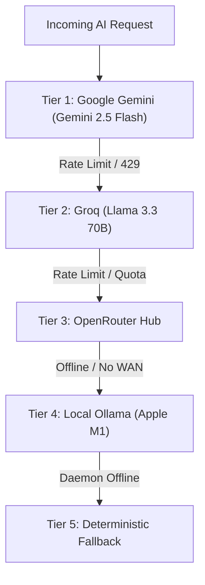

# Datacenter & Enterprise System Architecture Blueprint

This document defines the comprehensive engineering architecture, physical topology, network matrix, autonomous AI orchestration pipeline, storage subsystems, and enterprise defense-in-depth matrix powering the **Datacenter Enterprise Platform**.

---

## Table of Contents
1. [Physical & Virtual Hardware Topology](#1-physical--virtual-hardware-topology)
2. [Dual-Firewall Perimeter & Network Matrix](#2-dual-firewall-perimeter--network-matrix)
3. [Proxmox VE Enterprise Defense-in-Depth Firewall](#3-proxmox-ve-enterprise-defense-in-depth-firewall)
4. [Digital Forensics & Cyber Threat Intelligence](#4-digital-forensics--cyber-threat-intelligence)
5. [ELO AI Control Plane Architecture](#5-elo-ai-control-plane-architecture)
6. [LLM Fallback Chain](#6-llm-fallback-chain)
7. [Storage & ZFS Auto-Healing Architecture](#7-storage--zfs-auto-healing-architecture)
8. [Disaster Recovery & Blackout 10h+ SOP](#8-disaster-recovery--blackout-10h-sop)

---

## 1. Physical & Virtual Hardware Topology

---

## 2. Dual-Firewall Perimeter & Network Matrix

The Datacenter implements a **Dual-Tier Perimeter Defense ("Firewall Sandwich")**:
- **Outer Perimeter (Ingress/Egress)**: **OPNsense Core (`192.168.1.134`)** terminates WAN, executes CrowdSec IPS, Zenarmor L7 application inspection, AdGuard Home DNS sinkhole, and Nginx reverse proxy.
- **Inter-Firewall Transit Network**: Dedicated isolated virtual bridge `vmbr2` (`10.10.20.0/30`) with BGP dynamic routing (OPNsense ASN 65000 $\leftrightarrow$ FortiGate ASN 65002) and IP SLA health probes.
- **Inner Enterprise Core (Microsegmentation)**: **FortiGate-VM (`192.168.1.136` / VM 221)** enforces Deep Packet Inspection (DPI), Antivirus filtering, and Zero-Trust segmentation between DMZ (`vmbr3`), Trusted Core (`vmbr4`), and Out-of-Band Management (`vmbr0`).

---

## 3. Proxmox VE Enterprise Defense-in-Depth Firewall

The hypervisor runs an enterprise-grade, zero-trust Proxmox VE Firewall matrix active across all tiers:
- **Global Policy**: `policy_in: DROP`, `policy_out: ACCEPT`, `policy_forward: DROP`.
- **SYN-Flood Mitigation**: Hardware/kernel rate-limiting (`protection_synflood: 1`, burst 25, 10/sec).
- **TCP Flags Sanitization**: Dropping NULL scans, XMAS scans, SYN-FIN and SYN-RST evasion patterns.
- **Enterprise IPSets**:
  - `management-bastions`: Local admin subnets (`192.168.1.0/24`, `10.10.10.0/24`, `100.64.0.0/10`).
  - `cluster-nodes`: Authorized hypervisors and core gateway endpoints.
  - `bogon-networks`: Strict RFC 5735 / RFC 6598 unrouted blocklists.
  - `threat-blacklist`: Dynamic feed integrated with CrowdSec.
- **Security Groups**: `mgmt` (PVE 8006, SSH 22, SPICE 3121), `cluster` (Corosync 5404:5405/udp, migration 60000:60050), `telemetry` (Prometheus 9100, Process 9256, Loki 3100), `cloud` (WireGuard 51820, IPsec 500/4500).

---

## 4. Digital Forensics & Cyber Threat Intelligence Suite

Integrated directly into `cyber/`, the Datacenter documents and hosts 4 in-depth real-world digital forensics investigations, reverse engineering teardowns, and actionable threat intelligence case studies:

### Case Studies & Research
1. **[`task-scam-infrastructure-analysis/`](./cyber/task-scam-infrastructure-analysis)**: Cybercrime infrastructure tracking, leaky backend configuration APIs (`/api/v1/site/config` withdrawal kill-switch), SQL injection surfaces, and USDT TRC-20 money laundering networks.
2. **[`revolut-vishing-forensics/`](./cyber/revolut-vishing-forensics)**: Telephony fraud and international SIP VoIP Caller ID spoofing (`0749-XXX-XXX`) intercepting real-time 3D Secure SMS OTP codes and biometric push authorizations.
3. **[`tiktok-mrr-scam-infrastructure/`](./cyber/tiktok-mrr-scam-infrastructure)**: Deconstructive analysis of automated "faceless" algorithmic TikTok funnels, LLM-generated generic payloads, recursive Master Resell Rights (MRR) pyramid schemes, and Stripe/PayPal payment gateway abuse escalation.
4. **[`openid-mitm-phishing-forensics/`](./cyber/openid-mitm-phishing-forensics)**: Advanced Adversary-in-the-Middle (AiTM) and Browser-in-the-Middle (BitM) attack analysis capturing Steam OpenID sessions with synthetic in-DOM popup windows, automated Steam Family View PIN lockout, and Web API trade offer hijacking.

### Defensive Correlation with Datacenter Stack
- **OPNsense & FortiGate-VM / Cisco ASAv**: Dynamic IP blacklisting, DPI filtering of malicious payload structures, and DNS sinkholing of known C2 domains.
- **Suricata IDS/IPS (VM 200)**: Custom signature inspection detecting unauthenticated API enumeration, synthetic BitM popup frame assets, and SIP spoofing markers.
- **Wazuh SIEM & XDR (CT 100)**: Centralized event correlation, automated alert triggering, and immediate FIM/log triage.
- **T-Pot Honeynet (VM 213)**: Decoy Cowrie SSH, Dionaea, and RDP honeypots providing early-warning threat feeds directly to the Datacenter SOC.

---

## 3. ELO AI Control Plane Architecture

The ELO engine coordinates autonomous reasoning, security gatekeeping, semantic retrieval, and physical actuation:

---

## 4. LLM Fallback Chain

ELO implements an automated failover router across available LLM providers:

---

## 5. Automation Agents

ELO delegates background operational tasks to modular scripts and agents:

1.  **SecOps Threat-Hunter Agent (`elo_core.agents.secops_agent`)**:
   - Correlates Wazuh XDR and Suricata NIDS event streams.
   - Automatically isolates brute-force attackers by injecting stateful blacklist rules on OPNsense (`192.168.1.134:8443`).
2.  **SysAdmin Optimizer Agent (`elo_core.agents.sysadmin_agent`)**:
   - Monitors cluster memory utilization across nodes.
   - Triggers Kernel Samepage Merging (KSM) deduplication and purges dangling container image caches.
3.  **Smart Home Energy Agent (`elo_core.agents.energy_agent`)**:
   - Interrogates Home Assistant (`192.168.1.10:8123`) power metrics.
   - Detects idle vampire power draws and orchestrates energy-saving schedules.
4.  **Predictive Health Storage Healer (`elo_core.self_healing.predictive`)**:
   - Analyzes SMART disk telemetry on Scrutiny (`192.168.1.18`).
   - Automatically creates ZFS safety snapshots on OpenMediaVault (`192.168.1.135`) before drive failure occurs.

---

## 6. Storage & ZFS Auto-Healing Architecture

### 3-2-1 Backup Strategy
- **3 Copies of Data**: Primary NVMe SSD + Local OMV ZFS Pool + Offsite encrypted backup.
- **2 Different Media Types**: Flash NVMe (Proxmox) + Magnetic SATA HDD (OpenMediaVault NAS).
- **1 Offsite Copy**: Encrypted Rclone synchronization to secondary object storage.

---

## 7. Disaster Recovery & Blackout 10h+ SOP

In the event of an extended utility power outage exceeding battery UPS limits:

1. **Phase 1 (Hour 0–2: Conservation)**:
   - Shutdown non-essential compute workloads (Frigate NVR, Jellyfin transcoding, Woodpecker CI).
   - Throttle CPU frequencies on Proxmox node.
2. **Phase 2 (Hour 2–8: Core Survival Mode)**:
   - Migrate essential networking (Pi-hole DNS, Tailscale relay) to ultra-low-power Apple M1 host.
   - Spin down OpenMediaVault mechanical drives.
3. **Phase 3 (Hour 8+: Clean Controlled Shutdown)**:
   - Flush PostgreSQL WAL logs and trigger database dumps.
   - Execute `zpool sync` and cleanly unmount ZFS datasets.
   - Dispatch final battery telemetry alert to Telegram.
