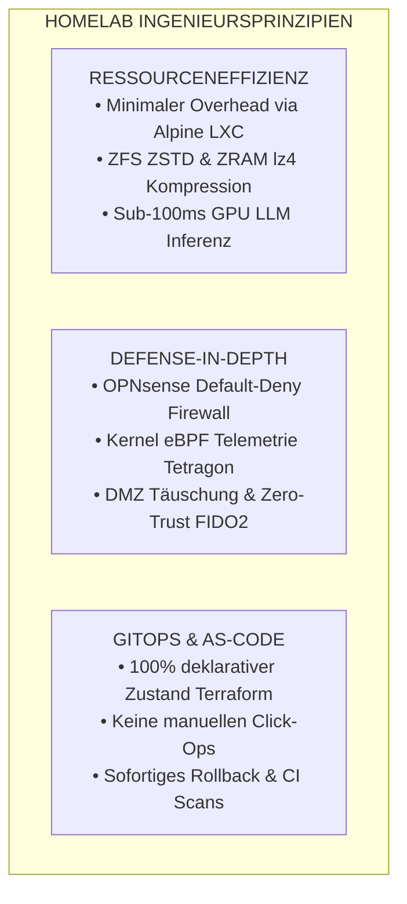
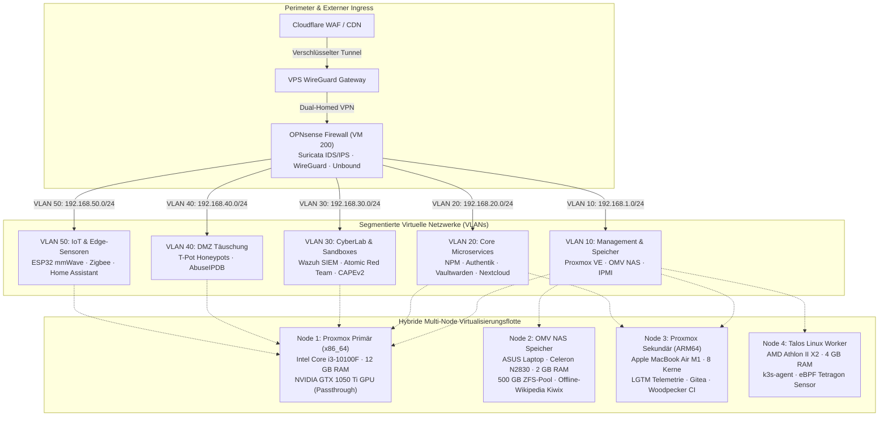
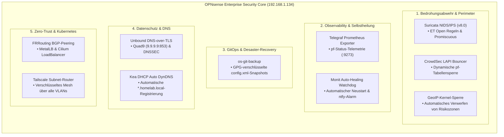
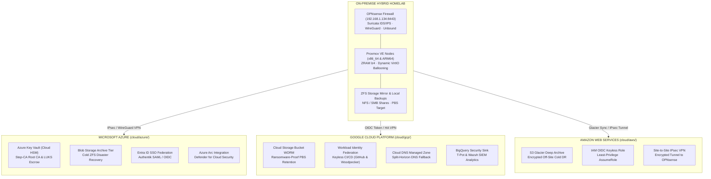

<div align="center">

<p align="center">
   
  &nbsp;&nbsp;&nbsp;&nbsp;&nbsp;&nbsp;&nbsp;&nbsp;
</p>

**[ Română ](README.ro.md) • [ English ](README.md) • [ Français ](README.fr.md) • [ Español ](README.es.md) • [ Deutsch ](README.de.md)**

[](https://github.com/stefanutc1/homelab/actions)
[](https://github.com/stefanutc1/homelab/actions/workflows/security-scan.yml)
[-emerald?style=flat&logo=terraform)](https://github.com/stefanutc1/homelab/tree/main/terraform)
[](https://status.homelab.local)
[](https://github.com/stefanutc1/homelab)
[](https://github.com/stefanutc1/homelab)
[](https://github.com/stefanutc1/homelab)
[](LICENSE)

<br/>

**Produktionsreife Hybrid-Cloud-Plattform, Cyber-Defense-Testumgebung und autonome Multi-Agenten-Orchestrierung.**
Aufgebaut auf Bare-Metal x86_64 und Apple Silicon ARM64 Hardware, dynamischer OPNsense-Netzwerksegmentierung, ZFS-Speicherpools, deklarativer Terraform/Ansible-Automatisierung und Kernel-Echtzeitbeobachtbarkeit via eBPF.

[Interaktive Web-Anwendung](https://stefanutc1.github.io/homelab/) • [Architektur-Blueprint](ARCHITECTURE.md) • [Sicherheitsrichtlinie](SECURITY.md) • [Roadmap](ROADMAP.md)

</div>

---

## Inhaltsverzeichnis

1. [Mission & Designprinzipien](#1-mission--designprinzipien)
2. [Gesamtarchitektur & Netzwerktopologie](#2-gesamtarchitektur--netzwerktopologie)
3. [Physische Hardware-Flotte & Stromversorgung](#3-physische-hardware-flotte--stromversorgung)
4. [LXC-Container & VM-Ressourcenmatrix](#4-lxc-container--vm-ressourcenmatrix)
5. [Speicherarchitektur & ZFS-Optimierung](#5-speicherarchitektur--zfs-optimierung)
6. [Netzwerksegmentierung & Inter-VLAN-Firewall-Matrix](#6-netzwerksegmentierung--inter-vlan-firewall-matrix)
7. [Ingress-Traffic, Zero-Trust-Authentifizierung & Split-Horizon DNS](#7-ingress-traffic-zero-trust-authentifizierung--split-horizon-dns)
8. [Infrastructure as Code (Terraform & Ansible)](#8-infrastructure-as-code-terraform--ansible)
9. [Kubernetes & GitOps Deployment-Lebenszyklus](#9-kubernetes--gitops-deployment-lebenszyklus)
10. [LGTM-Observability-Stack & Telemetrie](#10-lgtm-observability-stack--telemetrie)
11. [3-2-1 Backup-Strategie & Disaster Recovery](#11-3-2-1-backup-strategie--disaster-recovery)
12. [Cyber-Defense-Labor, SOC & eBPF-Sicherheit](#12-cyber-defense-labor-soc--ebpf-sicherheit)
13. [Lokale GPU KI-Laufzeitumgebung (Ollama CT 110)](#13-lokale-gpu-ki-laufzeitumgebung-ollama-ct-110)
14. [Chaos Engineering & Resilienz-Validierung](#14-chaos-engineering--resilienz-validierung)
15. [Umgebungstelemetrie & Lüftersteuerung](#15-umgebungstelemetrie--lüftersteuerung)
16. [Sicherheitshärtung & Kryptografische Integrität](#16-sicherheitshärtung--kryptografische-integrität)
17. [Statische IP- und Port-Übersicht](#17-statische-ip--und-port-übersicht)
18. [Kaltstart-Runbook & Tägliche Befehle](#18-kaltstart-runbook--tägliche-befehle)
19. [Häufige Fragen (FAQ)](#19-häufige-fragen-faq)
20. [Monorepo-Struktur & Engineering-Portfolio](#20-monorepo-struktur--mitwirken)

---

## 1. Mission & Designprinzipien



* **Ressourceneffizienz**: Hochdichte Virtualisierung mit minimalem CPU- und RAM-Bedarf. Optimierte Alpine Linux- und Debian-Container schöpfen das Potenzial von x86_64- und ARM64-Hardware voll aus.
* **Tiefengestaffelte Verteidigung**: Strenge L2/L3-Segmentierung über 5 getrennte VLANs, CrowdSec-Echtzeitblockierung, Suricata-Angriffserkennung und Kernel-Tracing via Cilium Tetragon.
* **Deklaratives GitOps**: Jeder Container, jede virtuelle Maschine, jede Firewallregel und jedes Dashboard wird versionskontrolliert über Terraform, Ansible und Docker Compose verwaltet.
* **Hochverfügbarkeit & Fehlertoleranz**: Automatisierte Disaster-Recovery-Snapshots, virtuelle IP-Ausfallsicherung, Kaltstart-Leitfäden und USV-gesteuerte Abschaltung via NUT.

---

## 2. Gesamtarchitektur & Netzwerktopologie



---


### 2.3 OPNsense Enterprise-Architektur (5 Sicherheitssäulen)

Die Perimeter-Firewall **OPNsense (VM 200 · 192.168.1.134)** implementiert eine gehärtete Enterprise-Sicherheitsarchitektur im FreeBSD-Kernel (`pf`):



### 2.4 OPNsense 802.1Q VLAN-Mikro-Segmentierung & Sicherheitsrichtlinien

Die Perimeter-Firewall OPNsense (VM 200 · 192.168.1.134) erzwingt eine 802.1Q-Mikro-Segmentierung über 5 isolierte VLANs mit strikten Packet Filter (`pf`)-Regeln:


| VLAN ID | Netzwerksegment | Subnetz CIDR | Gateway | Zugeordnete Workloads | Sicherheitsrichtlinie |
| :--- | :--- | :--- | :--- | :--- | :--- |
| **VLAN 10** | Management & Storage Subnet | `192.168.1.0/24` | `192.168.1.1` | Proxmox Core (x86_64), OMV NAS, Managed Switches | Isoliert von IoT- und Gast-Subnetzen |
| **VLAN 20** | Core Microservices & Applications | `192.168.1.0/24` & `192.168.64.0/24` | `192.168.1.134` (OPNsense) | NPM Ingress, Vaultwarden, Immich, Nextcloud, Home Assistant, Gitea, Ollama (CT 110) | Strikte Forward-Authentifizierung via Authentik (CT 108) |
| **VLAN 30** | Cyber Security & Sandboxes (CyberLab) | `192.168.30.0/24` | `192.168.1.134:8443` | Wazuh XDR SIEM (1514), Suricata IDS, Atomic Red Team, CAPEv2 / Cuckoo Sandbox | Promiskuitiver SPAN-Spiegelport, kein ausgehender WAN-Zugriff für Sandboxes |
| **VLAN 40** | DMZ Deception & Honeypots | `192.168.40.0/24` | `192.168.1.134` (OPNsense) | T-Pot Cluster (Cowrie SSH, Dionaea, RDP honeypot, Honeytrap) | Vollständig isolierte DMZ; automatische Blockierung von Angreifern über AbuseIPDB |
| **VLAN 50** | IoT & Physische Edge-Geräte | `192.168.50.0/24` | `192.168.1.134 (OPNsense)` | ESP32 mmWave Radar, ESP32 Bewässerungsrelais, Zigbee Gateway | MQTT-Kommunikation strikt auf Home Assistant (CT 106) beschränkt |

---

## 3. Hybride Multi-Cloud-Architektur (Azure, GCP, AWS)

The on-premise cluster is extended into a true hybrid multi-cloud topology across **Microsoft Azure**, **Google Cloud Platform (GCP)**, and **Amazon Web Services (AWS)** using declarative, modular Infrastructure as Code (IaC) located in [`cloud/`](cloud/README.md) and [`terraform/`](terraform/):



### Cloud Integration & Zero-Cost Tiering Matrix

| Cloud Provider | IaC Directory | Core Declarative Resources | Cost Optimization Tier |
| :--- | :--- | :--- | :--- |
| **Microsoft Azure** | [`cloud/azure/`](cloud/azure/) | `azurerm_key_vault` (Cloud HSM Root CA & LUKS), `azurerm_storage_blob` (Archive Tier DR), `azuread_application` (SSO Authentik), `azurerm_arc_machine` (Defender for Cloud) | Archive Tier + Free Tier HSM |
| **Google Cloud (GCP)** | [`cloud/gcp/`](cloud/gcp/) | `google_storage_bucket` (WORM Object Lock PBS/Restic), `google_iam_workload_identity_pool` (Keyless OIDC), `google_dns_managed_zone` (DNSSEC fallback), `google_logging_project_sink` (BigQuery SIEM) | Coldline / Archive + BigQuery Free |
| **Amazon Web Services** | [`cloud/aws/`](cloud/aws/) | `aws_s3_bucket` (Glacier Deep Archive 365d), `aws_iam_openid_connect_provider` (Keyless CI/CD AssumeRole), `aws_vpn_connection` (Site-to-Site IPsec OPNsense) | Glacier Deep Archive + Free STS |

---

## 4. Enterprise CI/CD-Qualitätsmatrix (9 automatisierte Workflows)

Infrastructure and application code are validated continuously across **9 GitHub Actions CI/CD workflows** running **36+ parallel automated quality gates**:

| # | Workflow File | Pipeline Name | Automated Quality Guarantees & Checks |
| :---: | :--- | :--- | :--- |
| 1 | [`.github/workflows/homelab-ci-cd-matrix.yml`](.github/workflows/homelab-ci-cd-matrix.yml) | **Enterprise Quality Matrix** | `terraform fmt` & `validate` (on-prem + multi-cloud), Checkov IaC Security, Trivy Misconfig, Docker Compose validation, ShellCheck, Secret Leakage, ELO Matrix (Python 3.9-3.13) |
| 2 | [`.github/workflows/ci.yml`](.github/workflows/ci.yml) | **Core CI Pipeline** | Gitleaks & TruffleHog (Secrets Scan), Ruff Lint, MyPy Static Types, Bandit SAST, Semgrep, Ansible Syntax Check on all playbooks, Kubeconform Kubernetes validation |
| 3 | [`.github/workflows/cd.yml`](.github/workflows/cd.yml) | **Continuous Deployment** | GitOps Reconciliation, Container Image Packaging on GHCR, Automated Rollback Verification |
| 4 | [`.github/workflows/container-scan.yml`](.github/workflows/container-scan.yml) | **Container Security** | Trivy Container Image Scanner & Dockle CIS Docker Benchmark compliance |
| 5 | [`.github/workflows/security-scan.yml`](.github/workflows/security-scan.yml) | **CodeQL SAST Analysis** | GitHub Advanced Security CodeQL engine for deep static vulnerability scanning (Python & TypeScript) |
| 6 | [`.github/workflows/security-scheduled.yml`](.github/workflows/security-scheduled.yml) | **Nightly Security Audit** | Scheduled nightly audit (02:00 UTC) for dependency CVEs (Pip-Audit, NPM Audit, Trivy FS) |
| 7 | [`.github/workflows/deploy-pages.yml`](.github/workflows/deploy-pages.yml) | **Deploy GitHub Pages** | Angular 19 production build & zero-downtime deployment to GitHub Pages |
| 8 | [`.github/workflows/desktop-macos-release.yml`](.github/workflows/desktop-macos-release.yml) | **macOS Native Release** | C# .NET 10 universal binary compilation, signing, and DMG artifact distribution for ELO desktop |
| 9 | [`.github/workflows/readme-sync.yml`](.github/workflows/readme-sync.yml) | **Documentation Sync** | Automated documentation sync and badge validation across all 5 supported languages |

---

## 9. Physische Hardware-Flotte & Stromversorgung

### Hardware-Spezifikationen

| Node-ID | Formfaktor / Gehäuse | CPU-Architektur | Beschleuniger / GPU | RAM-Kapazität | Speicher-Konfiguration | Hauptaufgabe |
| :--- | :--- | :--- | :--- | :--- | :--- | :--- |
| **`pve` (Node 1)** | Custom ATX Tower | Intel Core i3-10100F (4C/8T @ 4.30 GHz) | NVIDIA GeForce GTX 1050 Ti (4 GB VRAM) | 12 GB DDR4-2133 (12.288 MB) | 512 GB NVMe SSD (`local-lvm`) | Primärer Hypervisor: Windows Server 2025 Datacenter AD, OPNsense, Ollama GPU (CT 110), Immich AI |
| **`openmediavault` (Node 2)** | ASUS X451MA Laptop | Intel Celeron N2830 (2C/2T @ 2.16 GHz) | Intel HD Graphics | 2 GB DDR3L | 500 GB SATA HDD (ZFS Mirror) | Zentraler NAS: NFS/SMB-Shares, vzdump-Backup-Ziel, Offline-Wikipedia Kiwix |
| **`pve` (Node 3)** | Apple MacBook Air (2020) | Apple M1 (4P + 4E Cores @ 3.20 GHz) | 16-Core Neural Engine / Metal | 8 GB Unified (4 GB dedizierte VM) | 256 GB Apple APFS NVMe | Sekundärer ARM64 Hypervisor (UTM): Grafana/Prometheus/Tempo Telemetrie, Gitea, Woodpecker CI |
| **`kubernetes` (Node 4)** | Custom ATX Gehäuse | AMD Athlon II X2 220 (2C/2T @ 2.80 GHz) | NVIDIA GeForce GTS 250 (1 GB) | 4 GB DDR3-1333 | 80 GB HDD (NFS Root) | Immutabler Talos Linux / k3s Worker, Batch-Cron-Jobs, eBPF-Sicherheits-Sonde |

---

## 10. LXC-Container & VM-Ressourcenmatrix

### Detaillierter LXC-Container-Katalog (Knoten 1 — x86_64 Primär)

| VMID | Hostname | Basis-OS | vCPU | Zugewiesener RAM | Speicherpool | Statische IP | Kategorie | Primärer Dienst |
| :--- | :--- | :--- | :--- | :--- | :--- | :--- | :--- | :--- |
| **100** | `nginx` | Debian 13 | 2 | 112 MB | `local-lvm:4G` | `192.168.1.3` | Ingress | Nginx Proxy Manager + CrowdSec Bouncer |
| **103** | `immich` | Debian 13 | 4 | 896 MB | `local-lvm:32G` | `192.168.1.15` | Storage / KI | Fotoverwaltung & ML-Gesichtserkennung |
| **104** | `nextcloud` | Debian 13 | 2 | 512 MB | `local-lvm:20G` | `192.168.1.8` | Storage | Enterprise Cloud & WebDAV-Synchronisation |
| **106** | `homeassistant` | Debian 13 | 2 | 384 MB | `local-lvm:16G` | `192.168.1.10` | Automation | Smart Home Zentrale, Zigbee & ESP32 |
| **107** | `n8n` | Debian 13 | 2 | 384 MB | `local-lvm:8G` | `192.168.1.13` | Automation | Workflow-Orchestrierung & SOAR-Playbooks |
| **108** | `scrutiny` | Debian 13 | 1 | 128 MB | `local-lvm:4G` | `192.168.1.14` | Monitoring | Festplatten-Gesundheits-Telemetrie S.M.A.R.T. |
| **109** | `media-suite` | Debian 13 | 2 | 512 MB | `local-lvm:16G` | `192.168.1.18` | Medien | Jellyfin Medienverarbeitung & Transkodierung |
| **110** | `ollama` | Debian 13 | 4 | 2.048 MB | `local-lvm:16G` | `192.168.1.110` | Lokale KI | LLM GPU-Inferenz (Qwen2.5-Coder & DeepSeek-R1) |
| **111** | `openwebui` | Debian 13 | 2 | 384 MB | `local-lvm:8G` | `192.168.1.111` | Lokale KI | ChatGPT Web-Oberfläche für Ollama |
| **112** | `whisper` | Debian 13 | 2 | 1.024 MB | `local-lvm:8G` | `192.168.1.112` | Lokale KI | Faster-Whisper Sprach-zu-Text CUDA API |
| **113** | `flowise` | Alpine 3.24 | 2 | 512 MB | `local-lvm:4G` | `192.168.1.113` | Lokale KI | Visueller LLM-Agenten & Flow-Builder |
| **114** | `paperless-ai` | Alpine 3.24 | 1 | 64 MB | `local-lvm:1G` | `192.168.1.114` | Lokale KI | Paperless-AI Automatisiertes OCR & DeepSeek Tagging |
| **115** | `codeserver` | Alpine 3.24 | 2 | 512 MB | `local-lvm:4G` | `192.168.1.115` | Entwicklung | Visual Studio Code Web-Arbeitsbereich |
| **116** | `pbs` | Alpine 3.24 | 2 | 512 MB | `local-lvm:4G` | `192.168.1.116` | Speicher / Backup | Proxmox Backup Server (Deduplizierung & Prüfung) |
| **117** | `pdm` | Alpine 3.24 | 2 | 512 MB | `local-lvm:4G` | `192.168.1.117` | Management | Proxmox Datacenter Manager (Multi-Cluster-Verwaltung) |
| **118** | `woodpecker-k0s` | Alpine 3.24 | 2 | 512 MB | `local-lvm:8G` | `192.168.1.118` | CI/CD | Woodpecker CI Server & Runner auf Alpine Linux mit k0s Kubernetes Engine |

### Detaillierter LXC-Container-Katalog (Knoten 3 — Apple M1 ARM64 UTM)

| VMID | Hostname | Basis-OS | vCPU | Zugewiesener RAM | Speicherpool | Statische IP | Kategorie | Primärer Dienst |
| :--- | :--- | :--- | :--- | :--- | :--- | :--- | :--- | :--- |
| **100** | `it-tools` | Alpine 3.24 | 1 | 64 MB | `local:2G` | `192.168.64.100` | Utilities | IT-Tools Praktische Web-Werkzeuge für Entwickler |
| **101** | `actualbudget` | Alpine 3.24 | 1 | 64 MB | `local:2G` | `192.168.64.101` | Finanzen | Actual Budget Lokale Finanzverwaltung |
| **102** | `trilium` | Alpine 3.24 | 1 | 96 MB | `local:2G` | `192.168.64.102` | Notizen | Hierarchische Wissensdatenbank und Notizspeicher |
| **103** | `changedetection` | Alpine 3.24 | 1 | 96 MB | `local:2G` | `192.168.64.103` | Automation | Webseiten-Änderungsüberwachung & Benachrichtigung |
| **104** | `scrutiny` | Debian 13 | 1 | 128 MB | `local:2G` | `192.168.64.104` | Monitoring | Festplatten-Gesundheits-Telemetrie S.M.A.R.T. |
| **105** | `uptimekuma` | Debian 13 | 1 | 128 MB | `local:4G` | `192.168.64.105` | Monitoring | Dienstverfügbarkeits- und SLA-Überwachung |
| **106** | `vaultwarden` | Alpine 3.24 | 1 | 64 MB | `local:2G` | `192.168.64.106` | Sicherheit | Bitwarden-kompatibler Passwort-Manager |
| **107** | `monitoring` | Debian 13 | 2 | 384 MB | `local:2G` | `192.168.64.107` | Monitoring | Prometheus TSDB & Grafana Dashboards |
| **108** | `authelia` | Alpine 3.24 | 1 | 96 MB | `local:2G` | `192.168.64.108` | Sicherheit | Authelia 2FA & SSO Portal (FIDO2 / WebAuthn) |
| **109** | `gitea` | Debian 13 | 2 | 160 MB | `local:2G` | `192.168.64.109` | Entwicklung | Self-Hosted Git-Forge & Code-Review |
| **110** | `woodpecker` | Alpine 3.24 | 2 | 192 MB | `local:2G` | `192.168.64.110` | CI/CD | Woodpecker CI Automatisierungs-Engine |
| **111** | `gatus` | Alpine 3.24 | 1 | 64 MB | `local:2G` | `192.168.64.111` | Monitoring | Automatisches Status-Dashboard in Go |
| **112** | `ntfy` | Alpine 3.24 | 1 | 64 MB | `local:2G` | `192.168.64.112` | Benachrichtigung | Private Push-Benachrichtigungen aufs Smartphone |
| **113** | `linkding` | Alpine 3.24 | 1 | 96 MB | `local:2G` | `192.168.64.122` | Automation | Lesezeichen-Manager & Technische Suche |
| **114** | `stepca` | Alpine 3.24 | 1 | 96 MB | `local:2G` | `192.168.64.114` | Sicherheit | Private PKI-Zertifizierungsstelle & ACME TLS |
| **115** | `tailscale-arm` | Alpine 3.24 | 1 | 96 MB | `local:2G` | `192.168.64.115` | VPN | Tailscale Subnetz-Router (ARM64-Segment) |
| **116** | `beszel` | Alpine 3.24 | 1 | 64 MB | `local:2G` | `192.168.64.116` | Monitoring | Hochauflösende 1s-System-Telemetrie |
| **117** | `pocketbase` | Alpine 3.24 | 1 | 64 MB | `local:2G` | `192.168.64.117` | Backend | Vollständiges SQLite-Echtzeit-Backend in 1 Datei |
| **118** | `homepage` | Alpine 3.24 | 1 | 64 MB | `local:2G` | `192.168.64.118` | Dashboard | Zentrales Homelab Übersichts-Dashboard |
| **119** | `speedtest` | Alpine 3.24 | 1 | 96 MB | `local:2G` | `192.168.64.119` | Monitoring | Automatisierte Bandbreiten- & Jitter-Telemetrie |
| **120** | `memos` | Alpine 3.24 | 1 | 32 MB | `local:2G` | `192.168.64.120` | Notizen | Schnelle Markdown-Notizen & Wissensspeicher |
| **121** | `wallos` | Alpine 3.24 | 1 | 48 MB | `local:2G` | `192.168.64.121` | Finanzen | Ausgaben- und Abonnement-Tracker |
| **122** | `syncthing` | Alpine 3.24 | 1 | 64 MB | `local:2G` | `192.168.64.122` | Storage | Kontinuierliche P2P-Dateisynchronisation |
| **123** | `microbin` | Alpine 3.24 | 1 | 16 MB | `local:2G` | `192.168.64.123` | Sicherheit | Verschlüsseltes Pastebin in Rust |
| **124** | `vikunja` | Alpine 3.24 | 1 | 64 MB | `local:2G` | `192.168.64.124` | Aufgaben | Aufgabenverwaltung & Kanban-Projekt-Boards |
| **125** | `blackbox` | Alpine 3.24 | 1 | 32 MB | `local:2G` | `192.168.64.125` | Monitoring | Prometheus Blackbox-Sonde (ICMP / TLS-Ablauf) |
| **126** | `yourspotify` | Alpine 3.24 | 1 | 64 MB | `local:2G` | `192.168.64.126` | Analytik | Private Spotify-Hörstatistiken |
| **127** | `webcheck` | Alpine 3.24 | 1 | 64 MB | `local:2G` | `192.168.64.127` | OSINT | OSINT-Sicherheitsscanner & Domänen-Prüfung |
| **128** | `opengist` | Alpine 3.24 | 1 | 48 MB | `local:2G` | `192.168.64.128` | Entwicklung | Privater Code-Snippet & Gist-Speicher |
| **129** | `flatnotes` | Alpine 3.24 | 1 | 32 MB | `local:2G` | `192.168.64.129` | Notizen | Minimalistischer Flat-File Markdown Notiz-Editor |
| **130** | `bark` | Alpine 3.24 | 1 | 32 MB | `local:2G` | `192.168.64.130` | Benachrichtigung | Apple iOS Native Push-Benachrichtigungen |
| **131** | `shiori` | Alpine 3.24 | 1 | 32 MB | `local:2G` | `192.168.64.131` | Storage | Webseiten-Archivierung in Reintext in Go |
| **132** | `whoogle` | Alpine 3.24 | 1 | 64 MB | `local:2G` | `192.168.64.132` | Privatsphäre | Anonymisierte Google-Suche ohne Werbung |
| **133** | `flame` | Alpine 3.24 | 1 | 32 MB | `local:2G` | `192.168.64.133` | Dashboard | Minimalistische Startseite für den Browser |
| **134** | `dashy` | Alpine 3.24 | 1 | 64 MB | `local:2G` | `192.168.64.134` | Dashboard | Dashy Hochgradig Anpassbares Dashboard |
| **135** | `shlink` | Alpine 3.24 | 1 | 64 MB | `local:2G` | `192.168.64.135` | Produktivität | Shlink URL-Kürzungsdienst mit Geo-Analytik |
| **136** | `pastefy` | Alpine 3.24 | 1 | 48 MB | `local:2G` | `192.168.64.136` | Produktivität | Pastefy Sicherer und Eleganter Pastebin |
| **137** | `pingvin` | Alpine 3.24 | 1 | 64 MB | `local:2G` | `192.168.64.137` | Storage | Pingvin Share Datenschutzfreundlicher Dateitausch |
| **138** | `rssbridge` | Alpine 3.24 | 1 | 48 MB | `local:2G` | `192.168.64.138` | Feed | RSS-Bridge Feed-Generator |
| **139** | `playwright` | Alpine 3.24 | 2 | 192 MB | `local:2G` | `192.168.64.139` | Probe | Playwright Headless Browser-Sonde |
| **140** | `uptimechk` | Alpine 3.24 | 1 | 64 MB | `local:2G` | `192.168.64.140` | Monitoring | Verteilte Uptime-Überwachungssonde |
| **141** | `dnsbench` | Alpine 3.24 | 1 | 48 MB | `local:2G` | `192.168.64.141` | Netzwerk | DNS-Benchmark und Latenz-Analytik |
| **142** | `excalidraw` | Alpine 3.24 | 1 | 64 MB | `local:2G` | `192.168.64.142` | Produktivität | Kollaboratives Whiteboard Excalidraw |
| **143** | `snagim` | Alpine 3.24 | 1 | 48 MB | `local:2G` | `192.168.64.143` | Medien | Schneller Screenshot-Hosting-Server |
| **144** | `whoogletor` | Alpine 3.24 | 1 | 96 MB | `local:2G` | `192.168.64.144` | Privatsphäre | Verschlüsselte Google-Suche über das Tor-Netzwerk |
| **145** | `heimdall` | Alpine 3.24 | 1 | 64 MB | `local:2G` | `192.168.64.145` | Dashboard | Anwendungs-Dashboard mit Live-Statusanzeigen |
| **146** | `pbs` | Alpine 3.24 | 2 | 512 MB | `local:2G` | `192.168.64.146` | Speicher / Backup | Proxmox Backup Server (Deduplizierung & Prüfung) |
| **147** | `pdm` | Alpine 3.24 | 2 | 512 MB | `local:2G` | `192.168.64.147` | Management | Proxmox Datacenter Manager (Flotten-Orchestrierung) |
| **148** | `renovate` | Alpine 3.24 | 2 | 256 MB | `local:1G` | `192.168.64.148` | GitOps | RenovateBot Automatisierte Dependency-PRs |
| **149** | `transmission` | Alpine 3.24 | 1 | 256 MB | `local:1G` | `192.168.64.149` | Medien | Isolierter BitTorrent-Download-Client |
| **150** | `kavita` | Alpine 3.24 | 1 | 256 MB | `local:1G` | `192.168.64.150` | Medien | Digitaler E-Book-, Manga- & Comic-Reader |
| **151** | `stirling` | Alpine 3.24 | 1 | 256 MB | `local:1G` | `192.168.64.151` | Werkzeuge | Lokale Offline-PDF-Verarbeitungssuite |
| **152** | `audiobookshelf` | Alpine 3.24 | 1 | 256 MB | `local:1G` | `192.168.64.152` | Medien | Hörbuch- und Podcast-Streaming-Server |
| **153** | `tubearchivist` | Alpine 3.24 | 1 | 256 MB | `local:1G` | `192.168.64.153` | Medien | Lokales Archivieren von YouTube-Kanälen |
| **154** | `calibreweb` | Alpine 3.24 | 1 | 256 MB | `local:1G` | `192.168.64.154` | Medien | Calibre Web-Bibliotheksverwaltung |
| **155** | `cyberchef` | Alpine 3.24 | 1 | 128 MB | `local:1G` | `192.168.64.155` | Sicherheit | Schweizer Taschenmesser für Kryptoanalyse |
| **156** | `drawio` | Alpine 3.24 | 1 | 128 MB | `local:1G` | `192.168.64.156` | Architektur | Offline-Diagrammerstellung für Netzwerktopologien |
| **157** | `romm` | Alpine 3.24 | 1 | 256 MB | `local:1G` | `192.168.64.157` | Retro-Gaming | Retro-Spiele & ROM-Sammlungsverwaltung |
| **158** | `emulatorjs` | Alpine 3.24 | 1 | 256 MB | `local:1G` | `192.168.64.158` | Retro-Gaming | Retro-Spiele direkt im Browser mit WebAssembly |
| **159** | `vscode-server` | Alpine 3.24 | 2 | 512 MB | `local:1G` | `192.168.64.159` | Entwicklung | VS Code Server Cloud IDE ARM64 |
| **160** | `paperless` | Alpine 3.24 | 2 | 512 MB | `local:1G` | `192.168.64.160` | DMS | Paperless-ngx Dokumenten-Management |
| **161** | `minio` | Alpine 3.24 | 1 | 256 MB | `local:1G` | `192.168.64.161` | Storage | MinIO S3 Objektspeicher-Server |
| **162** | `meilisearch` | Alpine 3.24 | 1 | 256 MB | `local:1G` | `192.168.64.162` | Suche | Ultraschnelle Volltext-Suchmaschine |
| **163** | `vector` | Alpine 3.24 | 1 | 128 MB | `local:1G` | `192.168.64.163` | Telemetrie | Vector High-Performance Log-Pipeline |
| **164** | `searxng` | Alpine 3.24 | 1 | 128 MB | `local:1G` | `192.168.64.164` | Privatsphäre | SearXNG Metasuchmaschine |
| **165** | `netalertx` | Alpine 3.24 | 1 | 128 MB | `local:1G` | `192.168.64.165` | Sicherheit | NetAlertX Netzwerk-Eindringungserkennung |
| **166** | `rustdesk` | Alpine 3.24 | 1 | 128 MB | `local:1G` | `192.168.64.167` | Remote | RustDesk Remote-Desktop-Relais |
| **167** | `kopia` | Alpine 3.24 | 1 | 256 MB | `local:1G` | `192.168.64.167` | Backup | Verschlüsseltes Snapshot-Backup |
| **168** | `wgeasy` | Alpine 3.24 | 1 | 128 MB | `local:1G` | `192.168.64.168` | VPN | WireGuard-Easy Management-Portal |
| **169** | `pgadmin` | Alpine 3.24 | 1 | 256 MB | `local:1G` | `192.168.64.169` | Datenbank | pgAdmin 4 PostgreSQL Verwaltung |
| **170** | `dozzle` | Alpine 3.24 | 1 | 64 MB | `local:1G` | `192.168.64.170` | Monitoring | Dozzle Live Container-Log-Betrachter |
| **171** | `kiwix` | Alpine 3.24 | 1 | 128 MB | `local:1G` | `192.168.64.171` | Wissen | Kiwix Offline Wikipedia & Docs Server |
| **172** | `hedgedoc` | Alpine 3.24 | 1 | 256 MB | `local:1G` | `192.168.64.172` | Notizen | HedgeDoc Kollaborative Markdown-Notizen |
| **173** | `glances` | Alpine 3.24 | 1 | 64 MB | `local:1G` | `192.168.64.173` | Monitoring | Glances System-Telemetrie & Prozess-Monitor |
| **174** | `dufs` | Alpine 3.24 | 1 | 64 MB | `local:1G` | `192.168.64.174` | Storage | Dufs Statischer Dateiserver |
| **175** | `gotify` | Alpine 3.24 | 1 | 64 MB | `local:1G` | `192.168.64.175` | Benachrichtigung | Gotify Push-Benachrichtigungs-Server |
| **176** | `miniflux` | Alpine 3.24 | 1 | 64 MB | `local:1G` | `192.168.64.176` | Feed | Miniflux Minimalistischer RSS-Feed-Reader |
| **177** | `grocy` | Alpine 3.24 | 1 | 128 MB | `local:1G` | `192.168.64.179` | ERP | Grocy Haushalts- & Bestands-Tracker |
| **178** | `chrony` | Alpine 3.24 | 1 | 32 MB | `local:1G` | `192.168.64.180` | Netzwerk | Chrony Stratum-1 Präzisions-NTP-Server |
| **179** | `linkwarden` | Alpine 3.24 | 1 | 128 MB | `local:1G` | `192.168.64.181` | Lesezeichen | Linkwarden Webseiten-Archivierung |
| **180** | `snmp-collector` | Alpine 3.24 | 1 | 64 MB | `local:1G` | `192.168.64.182` | Monitoring | SNMP Metrik-Kollektor & Prober |
| **181** | `searxng-redis` | Alpine 3.24 | 1 | 32 MB | `local:1G` | `192.168.64.183` | Cache | Redis In-Memory Cache für SearXNG |

### Kubernetes Cloud-Native-Plattform & OpenStack Private Cloud

| Plattform-Komponente | Technologie & Distribution | Knoten / Zielhost | Port / Zugriff | Hauptfunktion |
| :--- | :--- | :--- | :--- | :--- |
| **ArgoCD GitOps** | ArgoCD v2.12.3 Operator | Hybrid-Cluster (Node 1 & Node 3) | `:8080` (HTTPS) | Deklarative Continuous Delivery, automatische Synchronisation und Selbstheilung direkt aus Git |
| **CoreDNS** | CoreDNS v1.11.3 DaemonSet | Im Cluster (`kube-system`) | `:53` (UDP/TCP) | Cluster-DNS-Service-Discovery, interne Split-Horizon-Auflösung & Upstream-Routing zu Pi-hole |
| **Cilium eBPF CNI** | Cilium v1.16.1 eBPF Engine | Kernel-Space (`kube-system`) | `:9962` / `:12000` (Hubble) | Hochleistungs-CNI als kube-proxy-Ersatz, transparente WireGuard-Verschlüsselung & L3-L7-Policies |
| **Rook Ceph** | Rook Ceph v1.15.2 Orchestrator | Speicherpool (Node 1 & Node 3) | `:8443` (Ceph Dashboard) | Cloud-nativer Ceph-Speicher für Block-Storage (RBD), CephFS-Dateisystem & S3-Object-Gateways |
| **Twingate ZTNA** | Twingate Connector v1 | Fernzugriff (`twingate`) | Internes P2P-Mesh | Enterprise Zero-Trust Network Access für sicheren Fernzugriff ohne offene Firewall-Ports |
| **Woodpecker CI (k0s)** | Woodpecker v2.7.2 + k0s | Node 1 (CT 118 · Alpine 3.24) | `:8000` / `:9000` (gRPC) | Container-native CI/CD-Pipeline-Engine ausgeführt in einem leichtgewichtigen k0s Kubernetes-Cluster |
| **OpenStack Cloud** | OpenStack 2024.1 Caracal (Kolla) | Node 1 (VM 211 · QEMU KVM) | `:80` / `:5000` (Keystone) | Enterprise IaaS Private Cloud mit Nova-Compute, Neutron-SDN und Horizon-Dashboard |

### QEMU / KVM Virtuelle Maschinen & VirtIO Memory Ballooning

| VMID | VM-Name | Betriebssystem | vCPU | Max RAM | Min Balloon | Passthrough / Hardware | Hauptrolle |
| **200** | `opnsense` | Hardened FreeBSD 14 | 2 Cores | 2.048 MB | **1.024 MB** | VirtIO Net Multi-VLAN | Perimeter-Firewall, Zenarmor NGFW (L7), AdGuard Home DNS (:3000), Caddy Proxy, Tailscale Mesh, CrowdSec IPS, FRR & Threat Feeds |
| **201** | `windows` | Windows Server 2025 Datacenter | 2 Cores | 7.168 MB (7 GB) | **4.096 MB (4 GB)** | **GTX 1050 Ti PCIe Passthrough** | Active Directory DS, GPO, DNS, Sysmon Forwarder (Ballooning: 4-7 GB) |
| **202** | `rhel` | RHEL 9.8 Enterprise | 2 Cores | 2.048 MB (2 GB) | **1.024 MB (1 GB)** | VirtIO SCSI Single IOThread | SELinux Enforcing, Podman Rootless, Enterprise Workload (1-2 GB) |
| **203** | `freebsd` | FreeBSD 15.1-RELEASE | 2 Cores | 1.024 MB (1 GB) | **512 MB** | VirtIO SCSI Single | Nativer OpenZFS Storage Pool, BSD Jails & Labor (512MB-1GB) |
| **204** | `openbsd` | OpenBSD 7.9 Bastion | 2 Cores | 1.024 MB (1 GB) | **512 MB** | VirtIO SCSI Single | Gehärteter Jump Host Bastion, PF, pledge/unveil (512MB-1GB) |
| **205** | `talos` | Talos Linux 1.7 | 2 Cores | 2.048 MB (2 GB) | **1.024 MB (1 GB)** | VirtIO Single + Cilium CNI | Unveränderliches OS, Deklaratives gRPC API, K8s (1-2 GB) |
| **206** | `macOS` | macOS Monterey 12.7 | 4 Cores | 7.168 MB (7 GB) | **2.048 MB (2 GB)** | [OpenCore EFI](mac/EFI) + AppleSMC | OpenCore KVM Hackintosh, Xcode CI/CD Build Runner, Apple Testumgebung |
| **211** | `openstack` | Ubuntu 24.04 LTS / Kolla | 2 Kerne | 4.096 MB (4 GB) | **2.048 MB (2 GB)** | VirtIO SCSI Single + OVN SDN | OpenStack Enterprise Private Cloud Controller (Nova, Neutron, Keystone, Glance, Horizon Dashboard) |
| **207** | `openindiana` | OpenIndiana Hipster | 2 Cores | 3.072 MB (3 GB) | **1.536 MB (1.5 GB)** | VirtIO SCSI Single (50 GB) + Solaris | Referenz-Enterprise-ZFS, Solaris-Zonen, Crossbow-VNICs, DTrace |
| **208** | `netbsd` | NetBSD 10.0 | 2 Cores | 512 MB (512 MB) | **256 MB** | VirtIO SCSI Single (12 GB) | Portables Unix-Referenzsystem, Rump Anykernel, pkgsrc |
| **209** | `nixos` | NixOS 24.11 Minimal | 2 Cores | 1.024 MB (1 GB) | **512 MB** | VirtIO SCSI Single (22 GB) | Deklaratives Linux, Flakes Reproduzierbare Builds, Atomare Rollbacks |
| **210** | `dragonflybsd` | DragonFly BSD 6.4 | 2 Cores | 1.024 MB (1 GB) | **512 MB** | VirtIO SCSI Single (15 GB) | HAMMER2 Journaling-Dateisystem, Hybrider Mikrokernel, Lockless SMP |
| **212** | `metasploitable2` | Metasploitable 2 (Ubuntu 8.04) | 1 Kern | 512 MB | **512 MB** | VirtIO Net + IDE (8 GB) | Verwundbares Linux-Zielsystem für Penetrationstests & IDS/IPS-Tuning |
| **213** | `tpot-honeypot` | Debian 12 / T-Pot 24.04 | 4 Kerne | 8.192 MB (8 GB) | **4.096 MB (4 GB)** | VirtIO Net + SCSI (60 GB) | Multi-Honeypot Decoy-Plattform (Cowrie, Dionaea, Honeytrap, Elastic, Kibana, Suricata) |
| **214** | `haiku` | Haiku R1/beta5 | 2 Kerne | 2.048 MB (2 GB) | **1.024 MB (1 GB)** | e1000 + SCSI (20 GB) | BeOS-inspiriertes modulares Betriebssystem, C++-Objekt-API & OpenBFS-Dateisystem |
| **215** | `plan9` | Plan 9 from Bell Labs (9front) | 1 Kern | 512 MB (512 MB) | **512 MB** | e1000 + IDE (12 GB) | Forschungs-Betriebssystem der Bell Labs, verteiltes 9P-Dateisystem & Prozess-Namespaces |
| **216** | `reactos` | ReactOS 0.4.16 | 1 Kern | 1.024 MB (1 GB) | **1.024 MB** | e1000 + IDE (32 GB) | Open-Source Windows-NT-Binärkompatibilitätsarchitektur & Win32-Nativ-Subsystem |
| **217** | `securityonion` | Security Onion 3.2 / Wazuh SIEM | 4 Kerne | 8.192 MB (8 GB) | **4.096 MB (4 GB)** | VirtIO Net + SCSI (50 GB) | Enterprise-SIEM, HIDS, Protokollanalyse, Netzwerksicherheitsüberwachung (Zeek, Suricata, Elastic, Kibana) |
| **218** | `remnux` | REMnux v7 / Noble | 2 Kerne | 4.096 MB (4 GB) | **2.048 MB (2 GB)** | VirtIO Net + SCSI (40 GB) | Dedizierte Linux-Distribution für Reverse Engineering, Malware-Analyse, Speicherforensik & DFIR |
| **219** | `redox` | Redox OS 0.9.0 | 2 Kerne | 2.048 MB (2 GB) | **1.024 MB (1 GB)** | e1000 + SCSI (10 GB) | Universelles Rust-Microkernel-Betriebssystem, RedoxFS & Minix/Plan-9-inspirierte Architektur |
| **220** | `freedos` | FreeDOS 1.3 | 1 Kern | 512 MB (512 MB) | **256 MB** | e1000 + IDE (2 GB) | Open-Source DOS-Umgebung, 16-Bit Real-Mode x86-Assembly & Legacy-Systemlabor |

> **Architektur-Rebalancing: Vollständige Non-AI-Migration auf ARM64**: Alle Non-AI-Container-Workloads ab CT 112 (einschließlich Paperless-ngx, MinIO S3, Meilisearch, Vector, SearXNG, NetAlertX, RustDesk, Kopia, WG-Easy, Code-Server, pgAdmin4, Dozzle, Kiwix, Transmission, Kavita, Stirling-PDF, Audiobookshelf, TubeArchivist, Calibre-Web, CyberChef, Draw.io, RomM, EmulatorJS und VS Code Server ARM64) wurden auf Node 3 (Apple Silicon M1 ARM64 via UTM mit ZRAM lz4) verlagert. Node 1 (x86_64) ist nun strikt dediziert für den CUDA-beschleunigten KI-Cluster (Ollama, Open-WebUI, Faster-Whisper, Flowise, Paperless-AI) und Enterprise-VMs (Windows Server 2025 Datacenter, macOS Monterey, OpenIndiana Hipster, NetBSD, NixOS, DragonFly BSD, RHEL, BSD).

### Optimisation Mémoire Hôte: ZRAM / ZSWAP Fast RAM Compression

* **Algorithme**: `lz4` optimizate avec overhead CPU < 1%.
* **Nœud 1 (x86_64) ZRAM**: `/dev/zram0` (6.0 Go RAM compressé swap, priorité 100, `vm.swappiness = 60`, `vm.vfs_cache_pressure = 50`).
* **Nœud 3 (ARM64) ZRAM**: `/dev/zram0` (1.9 Go RAM compressé swap, priorité 100, `vm.swappiness = 20`, `vm.vfs_cache_pressure = 50`).
* **Protection NVMe**: Les pages de mémoire swap sont compressées directement en RAM, éliminant l'usure des disques SSD NVMe.

### Sécurité Zero-Trust & Test Environment Entreprise

1. **HashiCorp Vault / OpenBao**: Gestion centralisée des secrets sans fichiers `.env` locaux exposés.
2. **Module Kernel WireGuard sur OPNsense avec Rotation Automatique des Clés**: Rotation périodique des clés Curve25519 et PSK via Ansible/cron.
3. **mTLS (Mutual TLS) Inter-Services**: Authentification mutuelle par certificats clients entre proxies et backends critiques du VLAN 20.
4. **Canary Honeytokens & Fichiers Pièges**: Fichiers leurres (`passwords.csv`, `aws_keys.env`) en DMZ déclenchant des alertes Telegram/ntfy.
5. **RenovateBot GitOps On-Premise**: Mises à jour automatisées des conteneurs et modules Terraform via Pull Requests Gitea.

---

## 9. Infrastructure as Code (Terraform & Ansible)

```bash
# 1. Repository klonen
git clone https://github.com/stefanutc1/homelab.git
cd homelab/terraform

# 2. Variablen anpassen und Cluster bereitstellen
cp terraform.tfvars.example terraform.tfvars
terraform init
terraform plan -out=tfplan.binary
terraform apply tfplan.binary

# 3. Systemkonfiguration mit Ansible anwenden
cd ../ansible
ansible-playbook playbooks/site.yml
```

---

<div align="center">

**Autor**: [@stefanutc1](https://github.com/stefanutc1) 
Veröffentlicht unter der **MIT-Lizenz**.

</div>

---

## Photo Gallery · Live Panels, Enterprise VMs (KVM) & Services

All physical hardware, virtual machines, and container workloads run live on production equipment. The homelab repository includes a complete collection of screenshots for **all 83 microservices, KVM/BSD virtual machines, and management panels** inside [`photos/services/`](photos/services/):

### Core Management Panels
| Grafana · Homelab Nodes (12GB x64 & ARM64) | Grafana · OPNsense Perimeter Defense |
| :---: | :---: |
|  |  |

| Proxmox VE 9.2 x86_64 (12GB RAM · 192.168.1.132:8006) | Proxmox VE 9.2 ARM64 Apple M1 (192.168.64.14:8006) |
| :---: | :---: |
|  |  |

| Pi-hole DNS Sinkhole & FTL (192.168.1.4:8080) | Home Assistant Automation Hub (192.168.1.10:8123) |
| :---: | :---: |
|  |  |

| OPNsense Suricata 8 NIDS/IPS (192.168.1.134:8443) | OPNsense · VLAN Firewall Filtering (pf rules) |
| :---: | :---: |
|  |  |

| OPNsense · WireGuard Kernel VPN Mesh | OPNsense · Unbound DNS-over-TLS (DoT) |
| :---: | :---: |
|  |  |

---

### Specialized Enterprise Virtual Machines (KVM) & BSD Nodes
| Windows Server 2025 Datacenter (VM 201) | Red Hat Enterprise Linux 9.8 (VM 202) |
| :---: | :---: |
|  |  |

| FreeBSD 15.1-RELEASE · OpenZFS (VM 203) | OpenBSD 7.9 Bastion · Packet Filter (VM 204) |
| :---: | :---: |
|  |  |

| Talos Linux 1.7 · Immutable K8s (VM 205) | OPNsense 26.1 Hardened · Console (VM 200) |
| :---: | :---: |
|  |  |

---

### Complete Per-Service Screenshot Catalog (`photos/services/`)
Every single service from the 83 workloads has a dedicated screenshot:
- **Core & Networking**: [`npm.png`](photos/services/npm.png), [`pihole.png`](photos/services/pihole.png), [`tailscale-x64.png`](photos/services/tailscale-x64.png), [`wgeasy.png`](photos/services/wgeasy.png), [`opnsense-core.png`](photos/services/opnsense-core.png), [`opnsense-unbound.png`](photos/services/opnsense-unbound.png), [`opnsense-frr.png`](photos/services/opnsense-frr.png), [`caddy-mtls.png`](photos/services/caddy-mtls.png)
- **Storage & Backup**: [`nextcloud.png`](photos/services/nextcloud.png), [`paperless.png`](photos/services/paperless.png), [`minio.png`](photos/services/minio.png), [`kopia.png`](photos/services/kopia.png), [`syncthing.png`](photos/services/syncthing.png), [`proxmox-backup-server.png`](photos/services/proxmox-backup-server.png)
- **Automation & AI**: [`ollama.png`](photos/services/ollama.png), [`openwebui.png`](photos/services/openwebui.png), [`whisper.png`](photos/services/whisper.png), [`flowise.png`](photos/services/flowise.png), [`homeassistant.png`](photos/services/homeassistant.png), [`renovate.png`](photos/services/renovate.png)
- **Observability & Monitoring**: [`grafana.png`](photos/services/grafana.png), [`prometheus.png`](photos/services/prometheus.png), [`loki.png`](photos/services/loki.png), [`uptimekuma.png`](photos/services/uptimekuma.png), [`gatus.png`](photos/services/gatus.png), [`beszel.png`](photos/services/beszel.png), [`blackbox.png`](photos/services/blackbox.png), [`vector.png`](photos/services/vector.png), [`dozzle.png`](photos/services/dozzle.png)
- **Security & Cyber Lab**: [`opnsense-suricata.png`](photos/services/opnsense-suricata.png), [`opnsense-crowdsec.png`](photos/services/opnsense-crowdsec.png), [`wazuh.png`](photos/services/wazuh.png), [`tpot-honeypot.png`](photos/services/tpot-honeypot.png), [`cyberchef.png`](photos/services/cyberchef.png), [`dfir-sandbox.png`](photos/services/dfir-sandbox.png), [`vault.png`](photos/services/vault.png), [`canary-decoys.png`](photos/services/canary-decoys.png)
- **Media & Utilities**: [`stirling.png`](photos/services/stirling.png), [`kavita.png`](photos/services/kavita.png), [`audiobookshelf.png`](photos/services/audiobookshelf.png), [`tubearchivist.png`](photos/services/tubearchivist.png), [`transmission.png`](photos/services/transmission.png), [`calibreweb.png`](photos/services/calibreweb.png), [`romm.png`](photos/services/romm.png), [`emulatorjs.png`](photos/services/emulatorjs.png), [`codeserver.png`](photos/services/codeserver.png), [`drawio.png`](photos/services/drawio.png), [`it-tools.png`](photos/services/it-tools.png), [`actualbudget.png`](photos/services/actualbudget.png), [`trillium.png`](photos/services/trillium.png), [`changedetection.png`](photos/services/changedetection.png), [`microbin.png`](photos/services/microbin.png), [`vikunja.png`](photos/services/vikunja.png), [`memos.png`](photos/services/memos.png), [`wallos.png`](photos/services/wallos.png), [`speedtest.png`](photos/services/speedtest.png), [`homepage.png`](photos/services/homepage.png), [`flame.png`](photos/services/flame.png)
- **Specialized Operating Systems (KVM)**: [`vm-windows.png`](photos/services/vm-windows.png), [`vm-rhel.png`](photos/services/vm-rhel.png), [`vm-freebsd.png`](photos/services/vm-freebsd.png), [`vm-openbsd.png`](photos/services/vm-openbsd.png), [`vm-talos.png`](photos/services/vm-talos.png), [`proxmox-datacenter-manager.png`](photos/services/proxmox-datacenter-manager.png), [`proxmox-mail-gateway.png`](photos/services/proxmox-mail-gateway.png)

---

## About the Author (About Me)

Designed, engineered, and operated by **[@stefanutc1](https://github.com/stefanutc1)**.
- **Focus**: Infrastructure Engineering, Multi-Architecture Virtualization (Proxmox VE x86_64 12GB DDR4-2133 & Apple Silicon ARM64), Zero-Trust Perimeter Security (OPNsense, Suricata, CrowdSec, WireGuard), Smart Home (Home Assistant), DNS Filtering (Pi-hole), GitOps & IaC (Terraform, Ansible, CI/CD).
- **Purpose**: Enterprise-grade portfolio showcasing modern on-premise and hybrid cloud systems architecture.

---

## Fotogalerie: Management-Panels, Dienste und Loki-Telemetrie

Alle Hardware-Knoten, virtuellen Maschinen und Container laufen auf physischer Infrastruktur. Nachfolgend sind direkte Schnittstellenaufnahmen der Verwaltungsebenen, aktiven Dienste und zentralen Grafana-Loki-Protokolldatenströme aufgeführt.

### Zentrale Management-Panels
| Grafana: Homelab-Knoten (12GB x64 & ARM64) | Grafana: OPNsense Perimeter-Verteidigung |
| :---: | :---: |
|  |  |

| Proxmox VE 9.2 x86_64 (12GB RAM · 192.168.1.132:8006) | Proxmox VE 9.2 ARM64 Apple M1 (192.168.64.14:8006) |
| :---: | :---: |
|  |  |

| Pi-hole DNS-Filter & FTL (192.168.1.4:8080) | Home Assistant Automations-Hub (192.168.1.10:8123) |
| :---: | :---: |
|  |  |

| OPNsense Suricata 8 NIDS/IPS (192.168.1.134:8443) | OPNsense: VLAN-Filterrichtlinien (pf-Regeln) |
| :---: | :---: |
|  |  |

| OPNsense: WireGuard Kernel VPN Mesh | OPNsense: Unbound DNS-over-TLS (DoT) |
| :---: | :---: |
|  |  |

---

### Core & Netzwerk
| Nginx Proxy Manager | Pi-hole DNS Sinkhole |
| :---: | :---: |
|  |  |

| Tailscale Mesh | WireGuard Easy |
| :---: | :---: |
|  |  |

| OPNsense Core Gateway | OPNsense Unbound DoT |
| :---: | :---: |
|  |  |

| OPNsense FRR Dynamisches Routing | Caddy Ingress mTLS |
| :---: | :---: |
|  |  |

---

### Speicher & Backup
| Nextcloud Hub | Paperless-ngx Dokumenten-OCR |
| :---: | :---: |
|  |  |

| MinIO S3 Objektspeicher | Kopia Snapshot-Sicherung |
| :---: | :---: |
|  |  |

| Syncthing Datei-Synchronisation | Proxmox Backup Server (PBS) |
| :---: | :---: |
|  |  |

---

### Automation & KI
| Ollama LLM-Laufzeitumgebung | Open-WebUI KI-Oberfläche |
| :---: | :---: |
|  |  |

| Faster-Whisper Sprachtranskription | Flowise LLM-Orchestrator |
| :---: | :---: |
|  |  |

| Home Assistant Automations-Zentrale | RenovateBot GitOps-Engine |
| :---: | :---: |
|  |  |

---

### Observability & Überwachung
| Grafana Enterprise Dashboard | Prometheus Metriken-Engine |
| :---: | :---: |
|  |  |

| Loki Verteilter Protokoll-Aggregator | Uptime Kuma SLA-Monitor |
| :---: | :---: |
|  |  |

| Gatus Status-Prüfer | Beszel Schlanke Metriken |
| :---: | :---: |
|  |  |

| Blackbox Netzwerk-Exporter | Vector Hochleistungs-Aggregator |
| :---: | :---: |
|  |  |

| Dozzle Echtzeit-Protokollbetrachter |  |
| :---: | :---: |
|  |  |

---

### Sicherheit & Cyber Lab
| OPNsense Suricata 8 NIDS/IPS | OPNsense CrowdSec LAPI Bouncer |
| :---: | :---: |
|  |  |

| Wazuh SIEM / XDR Manager | T-Pot Multi-Honeypot Sensoren |
| :---: | :---: |
|  |  |

| CyberChef Kryptografisches Werkzeug | DFIR Malware-Sandbox |
| :---: | :---: |
|  |  |

| HashiCorp Vault Geheimnisverwaltung | Täuschungs-Canary-Tokens & Köderdateien |
| :---: | :---: |
|  |  |

---

### Medien & Dienstprogramme
| Stirling-PDF Werkzeugsuite | Kavita Digitale Bibliothek |
| :---: | :---: |
|  |  |

| Audiobookshelf Hörbuch-Server | TubeArchivist YouTube-Archiv |
| :---: | :---: |
|  |  |

| Transmission BitTorrent-Client | Calibre-Web E-Book-Verwaltung |
| :---: | :---: |
|  |  |

| RomM Retro-ROM-Manager | EmulatorJS Browser-Emulator |
| :---: | :---: |
|  |  |

| Code-Server VS Code Cloud-IDE | Draw.io Architektur-Designer |
| :---: | :---: |
|  |  |

| IT-Tools Entwickler-Werkzeuge | Actual Budget Lokale Buchhaltung |
| :---: | :---: |
|  |  |

| Trillium Strukturierte Wissensdatenbank | ChangeDetection Web-Überwachung |
| :---: | :---: |
|  |  |

| MicroBin Verschlüsseltes Pastebin | Vikunja Aufgabenverwaltung |
| :---: | :---: |
|  |  |

| Memos Schnelle Notizen | Wallos Abonnement-Tracker |
| :---: | :---: |
|  |  |

| Speedtest Tracker Kontinuierliche Messung | Homepage Dashboard |
| :---: | :---: |
|  |  |

| Flame Anwendungsstarter |  |
| :---: | :---: |
|  |  |

---

### Spezialisierte Betriebssysteme & Telemetrie (Loki Telemetry & Runtime Logs)
| Windows Server 2025 Datacenter (VM 201 · Loki Telemetry) | Red Hat Enterprise Linux 9.8 (VM 202 · Loki Telemetry) |
| :---: | :---: |
|  |  |

| FreeBSD 15.1-RELEASE (VM 203 · Loki Telemetry) | OpenBSD 7.9 Bastion (VM 204 · Loki Telemetry) |
| :---: | :---: |
|  |  |

| Talos Linux 1.7 (VM 205 · Loki Telemetry) | Proxmox Datacenter Manager (CT 147 · Loki Telemetry) |
| :---: | :---: |
|  |  |

---

## Über den Autor

Entwickelt, bereitgestellt und betrieben von **[@stefanutc1](https://github.com/stefanutc1)**.
* **Schwerpunkt**: Infrastruktur-Engineering, hybride Virtualisierung (Proxmox VE x86_64 12GB DDR4-2133 und Apple Silicon ARM64), Zero-Trust-Netzwerksicherheit (OPNsense, Suricata, CrowdSec, WireGuard), Smart Home (Home Assistant), DNS-Filterung (Pi-hole), GitOps & IaC (Terraform, Ansible, CI/CD).
* **Zweck**: Technisches Portfolio zur Veranschaulichung moderner On-Premise- und Hybrid-Systemarchitekturen.
