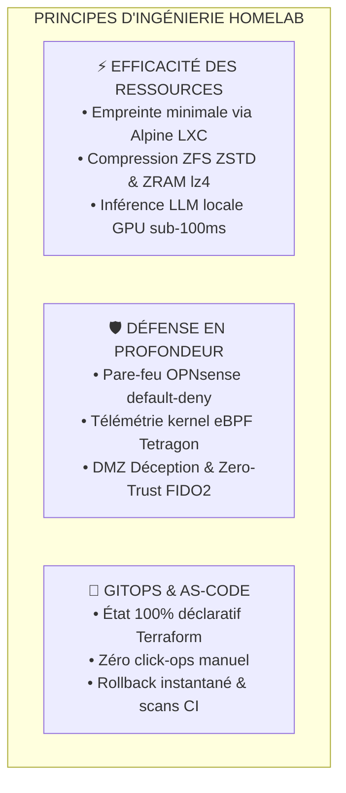
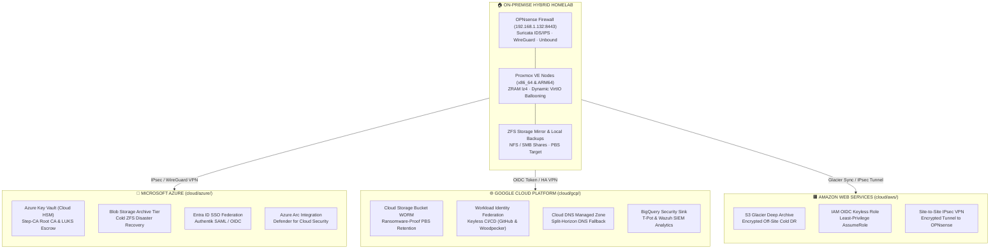

<div align="center">

# Plateforme d'Ingénierie & Cloud Hybride d'Entreprise (Homelab)

**[ 🇷🇴 Română ](README.ro.md) • [ 🇬🇧 English ](README.md) • [ 🇫🇷 Français ](README.fr.md) • [ 🇪🇸 Español ](README.es.md) • [ 🇩🇪 Deutsch ](README.de.md)**

[](https://github.com/stefanutc1/homelab/actions)
[](https://github.com/stefanutc1/homelab/actions/workflows/security-scan.yml)
[-emerald?style=flat&logo=terraform)](https://github.com/stefanutc1/homelab/tree/main/terraform)
[](https://status.homelab.local)
[](https://github.com/stefanutc1/homelab)
[](https://github.com/stefanutc1/homelab)
[](https://github.com/stefanutc1/homelab)
[](LICENSE)

<br/>

**Plateforme cloud hybride de niveau production, terrain d'expérimentation en cyberdéfense et infrastructure d'orchestration multi-agents autonomes.**
Construite sur du matériel bare-metal x86_64 et Apple Silicon ARM64, une segmentation réseau dynamique OPNsense, des baies de stockage ZFS, une automatisation déclarative Terraform/Ansible et une observabilité noyau eBPF en temps réel.

[Application Web Interactive](https://stefanutc1.github.io/homelab/) • [Schéma d'Architecture](ARCHITECTURE.md) • [Politique de Sécurité](SECURITY.md) • [Feuille de Route](ROADMAP.md)

</div>

---

## 📑 Table des Matières

1. [Mission & Principes de Conception](#1-mission--principes-de-conception)
2. [Architecture Globale & Topologie Réseau](#2-architecture-globale--topologie-réseau)
3. [Parc Matériel Physique & Alimentation](#3-parc-matériel-physique--alimentation)
4. [Matrice des Ressources LXC & Machines Virtuelles](#4-matrice-des-ressources-lxc--machines-virtuelles)
5. [Architecture de Stockage & Optimisation ZFS](#5-architecture-de-stockage--optimisation-zfs)
6. [Segmentation Réseau & Matrice Pare-feu Inter-VLAN](#6-segmentation-réseau--matrice-pare-feu-inter-vlan)
7. [Trafic Entrant, Authentification Zero-Trust & DNS Split-Horizon](#7-trafic-entrant-authentification-zero-trust--dns-split-horizon)
8. [Infrastructure as Code (Terraform & Ansible)](#8-infrastructure-as-code-terraform--ansible)
9. [Cycle de Déploiement Kubernetes & GitOps](#9-cycle-de-déploiement-kubernetes--gitops)
10. [Pile d'Observabilité LGTM & Pipeline de Télémétrie](#10-pile-dobservabilité-lgtm--pipeline-de-télémétrie)
11. [Stratégie de Sauvegarde 3-2-1 & Reprise Après Sinistre](#11-stratégie-de-sauvegarde-3-2-1--reprise-après-sinistre)
12. [Laboratoire de Cyberdéfense, SOC & Sécurité eBPF](#12-laboratoire-de-cyberdéfense-soc--sécurité-ebpf)
13. [Environnement IA LLM Local sur GPU (Ollama CT 110)](#13-environnement-ia-llm-local-sur-gpu-ollama-ct-110)
14. [Ingénierie du Chaos & Validation de Résilience](#14-ingénierie-du-chaos--validation-de-résilience)
15. [Télémétrie Environnementale & Régulation des Ventilateurs](#15-télémétrie-environnementale--régulation-des-ventilateurs)
16. [Durcissement de Sécurité & Intégrité Cryptographique](#16-durcissement-de-sécurité--intégrité-cryptographique)
17. [Annuaire des Adresses IP Statiques & Ports](#17-annuaire-des-adresses-ip-statiques--ports)
18. [Procédure de Démarrage à Froid & Commandes Utiles](#18-procédure-de-démarrage-à-froid--commandes-utiles)
19. [FAQ & Dépannage](#19-faq--dépannage)
20. [Structure du Monorepo & Portfolio d'Ingénierie](#20-structure-du-monorepo--contribution)

---

## 1. Mission & Principes de Conception



* **Efficacité des Ressources** : Virtualisation haute densité exploitant une empreinte processeur/mémoire minimale. Conteneurs légers Alpine Linux et Debian optimisés pour tirer parti des architectures ARM64 et x86_64.
* **Défense en Profondeur** : Segmentation L2/L3 stricte sur 5 VLANs, bouncers de réputation IP CrowdSec, détection d'intrusion Suricata et traçage noyau avec Cilium Tetragon.
* **GitOps Déclaratif** : Chaque conteneur, machine virtuelle, règle pare-feu et tableau de bord est géré sous contrôle de version via Terraform, Ansible et Docker Compose.
* **Tolérance aux Pannes & Haute Disponibilité** : Sauvegardes automatisées, basculement d'IP virtuelle, guides de démarrage à froid et arrêt séquencé contrôlé par onduleur (NUT).

---

## 2. Architecture Globale & Topologie Réseau


---

## 3. Architecture Multi-Cloud Hybride (Azure, GCP, AWS)

The on-premise cluster is extended into a true hybrid multi-cloud topology across **Microsoft Azure**, **Google Cloud Platform (GCP)**, and **Amazon Web Services (AWS)** using declarative, modular Infrastructure as Code (IaC) located in [`cloud/`](cloud/README.md) and [`terraform/`](terraform/):



### Cloud Integration & Zero-Cost Tiering Matrix

| Cloud Provider | IaC Directory | Core Declarative Resources | Cost Optimization Tier |
| :--- | :--- | :--- | :--- |
| **Microsoft Azure** | [`cloud/azure/`](cloud/azure/) | `azurerm_key_vault` (Cloud HSM Root CA & LUKS), `azurerm_storage_blob` (Archive Tier DR), `azuread_application` (SSO Authentik), `azurerm_arc_machine` (Defender for Cloud) | Archive Tier + Free Tier HSM |
| **Google Cloud (GCP)** | [`cloud/gcp/`](cloud/gcp/) | `google_storage_bucket` (WORM Object Lock PBS/Restic), `google_iam_workload_identity_pool` (Keyless OIDC), `google_dns_managed_zone` (DNSSEC fallback), `google_logging_project_sink` (BigQuery SIEM) | Coldline / Archive + BigQuery Free |
| **Amazon Web Services** | [`cloud/aws/`](cloud/aws/) | `aws_s3_bucket` (Glacier Deep Archive 365d), `aws_iam_openid_connect_provider` (Keyless CI/CD AssumeRole), `aws_vpn_connection` (Site-to-Site IPsec OPNsense) | Glacier Deep Archive + Free STS |

---

## 4. Matrice de Qualité CI/CD Enterprise (9 Flux Automatisés)

Infrastructure and application code are validated continuously across **9 GitHub Actions CI/CD workflows** running **36+ parallel automated quality gates**:

| # | Workflow File | Pipeline Name | Automated Quality Guarantees & Checks |
| :---: | :--- | :--- | :--- |
| 1 | [`.github/workflows/homelab-ci-cd-matrix.yml`](.github/workflows/homelab-ci-cd-matrix.yml) | **Enterprise Quality Matrix** | `terraform fmt` & `validate` (on-prem + multi-cloud), Checkov IaC Security, Trivy Misconfig, Docker Compose validation, ShellCheck, Secret Leakage, ELO Matrix (Python 3.9-3.13) |
| 2 | [`.github/workflows/ci.yml`](.github/workflows/ci.yml) | **Core CI Pipeline** | Gitleaks & TruffleHog (Secrets Scan), Ruff Lint, MyPy Static Types, Bandit SAST, Semgrep, Ansible Syntax Check on all playbooks, Kubeconform Kubernetes validation |
| 3 | [`.github/workflows/cd.yml`](.github/workflows/cd.yml) | **Continuous Deployment** | GitOps Reconciliation, Container Image Packaging on GHCR, Automated Rollback Verification |
| 4 | [`.github/workflows/container-scan.yml`](.github/workflows/container-scan.yml) | **Container Security** | Trivy Container Image Scanner & Dockle CIS Docker Benchmark compliance |
| 5 | [`.github/workflows/security-scan.yml`](.github/workflows/security-scan.yml) | **CodeQL SAST Analysis** | GitHub Advanced Security CodeQL engine for deep static vulnerability scanning (Python & TypeScript) |
| 6 | [`.github/workflows/security-scheduled.yml`](.github/workflows/security-scheduled.yml) | **Nightly Security Audit** | Scheduled nightly audit (02:00 UTC) for dependency CVEs (Pip-Audit, NPM Audit, Trivy FS) |
| 7 | [`.github/workflows/deploy-pages.yml`](.github/workflows/deploy-pages.yml) | **Deploy GitHub Pages** | Angular 19 production build & zero-downtime deployment to GitHub Pages |
| 8 | [`.github/workflows/desktop-macos-release.yml`](.github/workflows/desktop-macos-release.yml) | **macOS Native Release** | C# .NET 10 universal binary compilation, signing, and DMG artifact distribution for ELO desktop |
| 9 | [`.github/workflows/readme-sync.yml`](.github/workflows/readme-sync.yml) | **Documentation Sync** | Automated documentation sync and badge validation across all 5 supported languages |

---

## 9. Parc Matériel Physique & Alimentation

### Spécifications du Matériel

| Identifiant Nœud | Format / Châssis | Architecture Processeur | Accélérateur / GPU | Mémoire RAM | Configuration Stockage | Rôle Principal |
| :--- | :--- | :--- | :--- | :--- | :--- | :--- |
| **`pve` (Nœud 1)** | Tour ATX Sur-Mesure | Intel Core i3-10100F (4C/8T @ 4.30 GHz) | NVIDIA GeForce GTX 1050 Ti (4 Go VRAM) | 8 Go DDR4-2666 | 512 Go NVMe SSD (`local-lvm`) | Hyperviseur Principal : Windows Server 2025 AD, OPNsense, Ollama GPU (CT 110), Immich AI |
| **`openmediavault` (Nœud 2)** | PC Portable ASUS X451MA | Intel Celeron N2830 (2C/2T @ 2.16 GHz) | Intel HD Graphics | 2 Go DDR3L | 500 Go SATA HDD (Miroir ZFS) | NAS Centralisé : Partages NFS/SMB, cible de sauvegarde vzdump, Wikipédia hors ligne Kiwix |
| **`pve` (Nœud 3)** | Apple MacBook Air (2020) | Apple M1 (4P + 4E Cores @ 3.20 GHz) | 16-Core Neural Engine / Metal | 8 Go Unifiée (4 Go VM dédiée) | 256 Go Apple APFS NVMe | Hyperviseur Secondaire ARM64 (UTM) : Télémétrie Grafana/Prometheus/Tempo, Gitea, Woodpecker CI |
| **`kubernetes` (Nœud 4)** | Châssis ATX Sur-Mesure | AMD Athlon II X2 220 (2C/2T @ 2.80 GHz) | NVIDIA GeForce GTS 250 (1 Go) | 4 Go DDR3-1333 | 80 Go HDD (Root NFS) | Worker Talos Linux / k3s immuable, tâches cron de traitement par lot, sonde eBPF |

---

## 10. Matrice des Ressources LXC & Machines Virtuelles

### Catalogue Détaillé des Conteneurs LXC (Nœud 1 — x86_64 Principal)

| VMID | Nom d'Hôte | OS Base | vCPU | RAM Allouée | Pool Stockage | IP Statique | Catégorie | Rôle Applicatif |
| :--- | :--- | :--- | :--- | :--- | :--- | :--- | :--- | :--- |
| **100** | `nginx` | Debian 13 | 2 | 112 Mo | `local-lvm:4G` | `192.168.1.3` | Ingress | Nginx Proxy Manager + Bouncer CrowdSec |
| **101** | `pihole` | Debian 13 | 1 | 96 Mo | `local-lvm:4G` | `192.168.1.4` | DNS | Résolveur DNS Interne & Bloqueur Publicitaire |
| **102** | `tailscale` | Debian 13 | 1 | 96 Mo | `local-lvm:4G` | `192.168.1.5` | VPN | Routeur de Sous-Réseau Mesh WireGuard Principal |
| **103** | `immich` | Debian 13 | 4 | 896 Mo | `local-lvm:32G` | `192.168.1.15` | Stockage / IA | Galerie Photos & Reconnaissance Faciale ML |
| **104** | `nextcloud` | Debian 13 | 2 | 512 Mo | `local-lvm:20G` | `192.168.1.8` | Stockage | Cloud de Fichiers & Synchronisation WebDAV |
| **105** | `crowdsec` | Debian 13 | 1 | 128 Mo | `local-lvm:4G` | `192.168.1.9` | Sécurité | Moteur d'Analyse de Menaces & Décision IPS |
| **106** | `homeassistant` | Debian 13 | 2 | 384 Mo | `local-lvm:16G` | `192.168.1.10` | Domotique | Passerelle Smart Home, Zigbee & ESP32 |
| **107** | `n8n` | Debian 13 | 2 | 384 Mo | `local-lvm:8G` | `192.168.1.13` | Automatisation | Orchestration de Flux & Playbooks SOAR |
| **110** | `ollama` | Debian 13 | 4 | 2 048 Mo | `local-lvm:16G` | `192.168.1.110` | IA Locale | Moteur LLM sur GPU (Qwen2.5-Coder & DeepSeek-R1) |
| **111** | `openwebui` | Debian 13 | 2 | 384 Mo | `local-lvm:8G` | `192.168.1.111` | IA Locale | Interface Web IA connectée à Ollama |
| **112** | `paperless` | Debian 13 | 2 | 768 Mo | `local-lvm:20G` | `192.168.1.16` | Stockage / GED| Gestion Électronique de Documents & OCR Tesseract |
| **113** | `minio` | Alpine 3.24 | 2 | 384 Mo | `local-lvm:8G` | `192.168.1.17` | Stockage | Serveur de Stockage Objet S3 Compatible AWS |
| **114** | `transmission` | Alpine 3.24 | 1 | 256 Mo | `local-lvm:8G` | `192.168.1.19` | Multimédia | Client BitTorrent Isolé |
| **115** | `kavita` | Alpine 3.24 | 2 | 384 Mo | `local-lvm:8G` | `192.168.1.20` | Multimédia | Lecteur de Livres Numériques, Mangas & Comics |
| **116** | `stirling` | Alpine 3.24 | 2 | 384 Mo | `local-lvm:8G` | `192.168.1.21` | Outils | Suite de Manipulation et Traitement PDF Hors-Ligne |
| **117** | `meilisearch` | Alpine 3.24 | 2 | 384 Mo | `local-lvm:8G` | `192.168.1.22` | Recherche | Moteur de Recherche Plein Texte Ultra-Rapide |
| **118** | `vector` | Alpine 3.24 | 1 | 128 Mo | `local-lvm:4G` | `192.168.1.23` | Monitoring | Routage et Agrégation de Journaux en Rust |
| **119** | `whisper` | Debian 13 | 2 | 1 024 Mo | `local-lvm:8G` | `192.168.1.24` | IA Locale | API de Transcription Vocale Speech-to-Text CUDA |
| **130** | `searxng` | Alpine 3.24 | 2 | 256 Mo | `local-lvm:4G` | `192.168.1.25` | Confidentialité| Métamoteur de Recherche sans Pistage |
| **131** | `flowise` | Alpine 3.24 | 2 | 512 Mo | `local-lvm:4G` | `192.168.1.26` | IA Locale | Constructeur Visuel d'Agents et Flux LLM |
| **132** | `netalertx` | Alpine 3.24 | 1 | 128 Mo | `local-lvm:4G` | `192.168.1.27` | Sécurité | Détecteur d'Intrusions Wi-Fi / LAN |
| **133** | `rustdesk` | Alpine 3.24 | 1 | 128 Mo | `local-lvm:2G` | `192.168.1.28` | À Distance | Relais Bureau à Distance Auto-Hébergé en Rust |
| **134** | `audiobookshelf` | Alpine 3.24 | 2 | 256 Mo | `local-lvm:4G` | `192.168.1.29` | Multimédia | Serveur de Livres Audio et Podcasts |
| **135** | `tubearchivist` | Alpine 3.24 | 2 | 512 Mo | `local-lvm:8G` | `192.168.1.30` | Multimédia | Archivage et Diffusion Hors-Ligne de Chaînes YouTube |
| **136** | `kopia` | Alpine 3.24 | 1 | 128 Mo | `local-lvm:4G` | `192.168.1.31` | Sauvegarde | Sauvegarde Chiffrée avec Déduplication et Snapshots |
| **137** | `wgeasy` | Alpine 3.24 | 1 | 128 Mo | `local-lvm:2G` | `192.168.1.32` | VPN | Portail Simplifié WireGuard |
| **138** | `calibreweb` | Alpine 3.24 | 1 | 128 Mo | `local-lvm:4G` | `192.168.1.33` | Multimédia | Bibliothèque Numérique Calibre en Ligne |
| **140** | `codeserver` | Alpine 3.24 | 2 | 384 Mo | `local-lvm:8G` | `192.168.1.40` | Développement | Environnement VS Code Complet dans le Navigateur |
| **141** | `pgadmin` | Alpine 3.24 | 1 | 192 Mo | `local-lvm:4G` | `192.168.1.41` | Base Données | Administration Graphique PostgreSQL |
| **142** | `cyberchef` | Alpine 3.24 | 1 | 64 Mo | `local-lvm:2G` | `192.168.1.42` | DFIR / Crypto | Couteau Suisse de Cryptanalyse et Décodage |
| **143** | `drawio` | Alpine 3.24 | 1 | 96 Mo | `local-lvm:2G` | `192.168.1.43` | Architecture | Éditeur de Diagrammes Techniques et Schémas Réseau |
| **144** | `dozzle` | Alpine 3.24 | 1 | 48 Mo | `local-lvm:2G` | `192.168.1.44` | Monitoring | Visualiseur Temps Réel des Logs de Conteneurs |
| **145** | `kiwix` | Alpine 3.24 | 1 | 96 Mo | `local-lvm:4G` | `192.168.1.45` | Connaissance | Serveur Hors-Ligne Wikipédia, ArchWiki & Docs |
| **146** | `romm` | Alpine 3.24 | 2 | 192 Mo | `local-lvm:8G` | `192.168.1.46` | Rétrogaming | Gestionnaire de Collections de Jeux Rétro & ROMs |
| **147** | `emulatorjs` | Alpine 3.24 | 1 | 96 Mo | `local-lvm:4G` | `192.168.1.47` | Rétrogaming | Émulation de Jeux Rétro via WebAssembly |
| **149** | `pbs` | Alpine 3.24 | 2 | 512 Mo | `local-lvm:2G` | `192.168.1.149` | Stockage / Sauvegarde | Proxmox Backup Server (Déduplication & Vérification Instantanés) |
| **150** | `pdm` | Alpine 3.24 | 2 | 512 Mo | `local-lvm:2G` | `192.168.1.150` | Gestion | Proxmox Datacenter Manager (Supervision Multi-Cluster) |
| **151** | `pmg` | Alpine 3.24 | 2 | 512 Mo | `local-lvm:2G` | `192.168.1.151` | Sécurité / Mail | Proxmox Mail Gateway (Protection Anti-Spam & ClamAV) |

### Catalogue Détaillé des Conteneurs LXC (Nœud 3 — Apple M1 ARM64 UTM)

| VMID | Nom d'Hôte | OS Base | vCPU | RAM Allouée | Pool Stockage | IP Statique | Catégorie | Rôle Applicatif |
| :--- | :--- | :--- | :--- | :--- | :--- | :--- | :--- | :--- |
| **100** | `it-tools` | Alpine 3.24 | 1 | 64 Mo | `local:2G` | `192.168.64.100` | Utilitaires | IT-Tools Boîte à Outils Web pour Développeurs |
| **101** | `actualbudget` | Alpine 3.24 | 1 | 64 Mo | `local:2G` | `192.168.64.101` | Finance | Actual Budget Gestion Financière Personnelle Locale |
| **102** | `trilium` | Alpine 3.24 | 1 | 96 Mo | `local:2G` | `192.168.64.102` | Notes | Base de Connaissances et Prise de Notes Hiérarchiques |
| **103** | `changedetection` | Alpine 3.24 | 1 | 96 Mo | `local:2G` | `192.168.64.103` | Automatisation | Surveillance de Changements de Pages Web & Alertes |
| **104** | `scrutiny` | Debian 13 | 1 | 128 Mo | `local:2G` | `192.168.64.104` | Monitoring | Télémétrie S.M.A.R.T. d'État des Disques Durs |
| **105** | `uptimekuma` | Debian 13 | 1 | 128 Mo | `local:2G` | `192.168.64.105` | Monitoring | Surveillance de Disponibilité des Services & SLA |
| **106** | `vaultwarden` | Alpine 3.24 | 1 | 64 Mo | `local:2G` | `192.168.64.106` | Sécurité | Gestionnaire de Mots de Passe Chiffré Bitwarden |
| **107** | `monitoring` | Debian 13 | 2 | 384 Mo | `local:2G` | `192.168.64.107` | Monitoring | Prometheus TSDB & Tableaux de Bord Grafana |
| **108** | `authelia` | Alpine 3.24 | 1 | 96 Mo | `local:2G` | `192.168.64.108` | Sécurité | Portail d'Authentification 2FA & SSO (FIDO2) |
| **109** | `gitea` | Debian 13 | 2 | 160 Mo | `local:2G` | `192.168.64.109` | Développement | Forge Git Auto-Hébergée & Revue de Code |
| **110** | `woodpecker` | Alpine 3.24 | 2 | 192 Mo | `local:2G` | `192.168.64.110` | CI/CD | Moteur d'Intégration Continue Woodpecker CI |
| **111** | `gatus` | Alpine 3.24 | 1 | 64 Mo | `local:2G` | `192.168.64.111` | Monitoring | Tableau de Bord de Santé Automatisé en Go |
| **112** | `ntfy` | Alpine 3.24 | 1 | 64 Mo | `local:2G` | `192.168.64.112` | Alertes | Hub de Notifications Push Privées sur Téléphone |
| **113** | `linkding` | Alpine 3.24 | 1 | 96 Mo | `local:2G` | `192.168.64.122` | Automatisation | Gestionnaire de Favoris & Recherche Technique |
| **114** | `stepca` | Alpine 3.24 | 1 | 96 Mo | `local:2G` | `192.168.64.114` | Sécurité | Autorité PKI Interne & Automatisation TLS ACME |
| **115** | `tailscale-arm` | Alpine 3.24 | 1 | 96 Mo | `local:2G` | `192.168.64.115` | VPN | Routeur de Sous-Réseau Tailscale (Segment ARM64) |
| **116** | `beszel` | Alpine 3.24 | 1 | 64 Mo | `local:2G` | `192.168.64.116` | Monitoring | Télémétrie Système Haute Résolution (1s) |
| **117** | `pocketbase` | Alpine 3.24 | 1 | 64 Mo | `local:2G` | `192.168.64.117` | Backend | Backend Complet en 1 Seul Fichier (SQLite) |
| **118** | `homepage` | Alpine 3.24 | 1 | 64 Mo | `local:2G` | `192.168.64.118` | Dashboard | Tableau de Bord Unifié Homelab |
| **119** | `speedtest` | Alpine 3.24 | 1 | 96 Mo | `local:2G` | `192.168.64.119` | Monitoring | Télémétrie de Bande Passante, Jitter et Latence |
| **120** | `memos` | Alpine 3.24 | 1 | 32 Mo | `local:2G` | `192.168.64.120` | Notes | Prise de Notes Rapides Markdown |
| **121** | `wallos` | Alpine 3.24 | 1 | 48 Mo | `local:2G` | `192.168.64.121` | Finance | Suivi des Dépenses et Abonnements Récurrents |
| **122** | `syncthing` | Alpine 3.24 | 1 | 64 Mo | `local:2G` | `192.168.64.122` | Stockage | Synchronisation Continue de Fichiers P2P |
| **123** | `microbin` | Alpine 3.24 | 1 | 16 Mo | `local:2G` | `192.168.64.123` | Sécurité | Pastebin Chiffré avec Auto-Destruction en Rust |
| **124** | `vikunja` | Alpine 3.24 | 1 | 64 Mo | `local:2G` | `192.168.64.124` | Tâches | Gestionnaire de Projets et Tâches Kanban |
| **125** | `blackbox` | Alpine 3.24 | 1 | 32 Mo | `local:2G` | `192.168.64.125` | Monitoring | Sondes Prometheus (ICMP / Ports / Expiration SSL) |
| **126** | `yourspotify` | Alpine 3.24 | 1 | 64 Mo | `local:2G` | `192.168.64.126` | Statistiques | Historique d'Écoute Privé & Données Spotify |
| **127** | `webcheck` | Alpine 3.24 | 1 | 64 Mo | `local:2G` | `192.168.64.127` | OSINT | Scanner OSINT de Sécurité et Analyse de Domaines |
| **128** | `opengist` | Alpine 3.24 | 1 | 48 Mo | `local:2G` | `192.168.64.128` | Développement | Partage et Sauvegarde Privée de Snippets de Code |
| **129** | `flatnotes` | Alpine 3.24 | 1 | 32 Mo | `local:2G` | `192.168.64.129` | Notes | Éditeur Minimaliste de Fichiers Markdown Plats |
| **130** | `bark` | Alpine 3.24 | 1 | 32 Mo | `local:2G` | `192.168.64.130` | Alertes | Relais de Notifications Natives Apple iOS |
| **131** | `shiori` | Alpine 3.24 | 1 | 32 Mo | `local:2G` | `192.168.64.131` | Stockage | Archivage Épuré de Pages Web en Texte Brut |
| **132** | `whoogle` | Alpine 3.24 | 1 | 64 Mo | `local:2G` | `192.168.64.132` | Confidentialité| Proxy Privé Google sans Publicités ni Traçage |
| **133** | `flame` | Alpine 3.24 | 1 | 32 Mo | `local:2G` | `192.168.64.133` | Dashboard | Page de Démarrage Épurée et Rapide |
| **134** | `dashy` | Alpine 3.24 | 1 | 64 Mo | `local:2G` | `192.168.64.134` | Dashboard | Tableau de Bord Complètement Personnalisable |
| **135** | `shlink` | Alpine 3.24 | 1 | 64 Mo | `local:2G` | `192.168.64.135` | Productivité | Raccourcisseur d'URL avec Métriques Géographiques |
| **136** | `pastefy` | Alpine 3.24 | 1 | 48 Mo | `local:2G` | `192.168.64.136` | Productivité | Pastebin Sécurisé et Élégant avec Markdown |
| **137** | `pingvin` | Alpine 3.24 | 1 | 64 Mo | `local:2G` | `192.168.64.137` | Stockage | Plateforme Privée de Partage de Fichiers |
| **138** | `rssbridge` | Alpine 3.24 | 1 | 48 Mo | `local:2G` | `192.168.64.138` | Flux | Générateur de Flux RSS pour Sites sans Flux |
| **139** | `playwright` | Alpine 3.24 | 2 | 192 Mo | `local:2G` | `192.168.64.139` | Sonde | Worker de Navigation Headless pour Rendu Web |
| **140** | `uptimechk` | Alpine 3.24 | 1 | 64 Mo | `local:2G` | `192.168.64.140` | Monitoring | Sonde Secondaire de Vérification de Disponibilité |
| **141** | `dnsbench` | Alpine 3.24 | 1 | 48 Mo | `local:2G` | `192.168.64.141` | Réseau | Benchmarking DNS et Mesures de Latență |
| **142** | `excalidraw` | Alpine 3.24 | 1 | 64 Mo | `local:2G` | `192.168.64.142` | Productivité | Tableau Blanc Virtuel Collaboratif Excalidraw |
| **143** | `snagim` | Alpine 3.24 | 1 | 48 Mo | `local:2G` | `192.168.64.143` | Médias | Serveur Rapide d'Hébergement de Captures d'Écran |
| **144** | `whoogletor` | Alpine 3.24 | 1 | 96 Mo | `local:2G` | `192.168.64.144` | Confidentialité| Recherche Whoogle Routée via le Réseau Tor |
| **145** | `heimdall` | Alpine 3.24 | 1 | 64 Mo | `local:2G` | `192.168.64.145` | Dashboard | Tableau d'Applications avec Indicateurs Live |
| **146** | `pbs` | Alpine 3.24 | 2 | 512 Mo | `local:2G` | `192.168.64.146` | Stockage / Sauvegarde | Proxmox Backup Server (Déduplication & Vérification) |
| **147** | `pdm` | Alpine 3.24 | 2 | 512 Mo | `local:2G` | `192.168.64.147` | Gestion | Proxmox Datacenter Manager (Orchestrateur Multi-Cluster) |
| **148** | `pmg` | Alpine 3.24 | 2 | 512 Mo | `local:2G` | `192.168.64.148` | Sécurité / Mail | Proxmox Mail Gateway (Protection Antispam & ClamAV) |

### Machines Virtuelles QEMU / KVM & VirtIO Memory Ballooning

| VMID | Nom VM | Système d'Exploitation | vCPU | RAM Max | Balloon Min | Passthrough / Matériel | Rôle Principal |
| :--- | :--- | :--- | :--- | :--- | :--- | :--- | :--- |
| **200** | `opnsense` | Hardened FreeBSD 14 | 2 Coeurs | 2.048 Mo | **1.024 Mo** | VirtIO Net Multi-VLAN | Pare-feu Périmétrique, Suricata IDS/IPS, Rotation Clés WireGuard |
| **201** | `windows` | Windows Server 2025 | 2 Coeurs | 4.096 Mo | **2.048 Mo** | **GTX 1050 Ti PCIe Passthrough** | Active Directory (AD DS), GPO, DNS, Télémetrie Sysmon |
| **202** | `rhel` | RHEL 9.8 Enterprise | 2 Coeurs | 2.048 Mo | **1.024 Mo** | VirtIO SCSI Single IOThread | SELinux Enforcing, Podman Rootless, Services Entreprise |
| **203** | `freebsd` | FreeBSD 15.1-RELEASE | 2 Coeurs | 1.536 Mo | **768 Mo** | VirtIO SCSI Single | Stockage Natif OpenZFS, FreeBSD Jails & Laboratoire Réseau |
| **204** | `openbsd` | OpenBSD 7.9 Bastion | 2 Coeurs | 1.536 Mo | **768 Mo** | VirtIO SCSI Single | Bastion Sécurisé Jump Host, Filtre PF, pledge/unveil |
| **205** | `talos` | Talos Linux 1.7 | 2 Coeurs | 2.048 Mo | **1.024 Mo** | VirtIO Single + Cilium CNI | OS Immuable Minimaliste, API Déclarative gRPC, Kubernetes |
| **206** | `capev2` | Sandbox Win10 / Linux | 4 Coeurs | 4.096 Mo | **2.048 Mo** | Isolation Complète (Air-Gap) | Sandbox d'Analyse Malware Dynamique, Volatility & Cuckoo |

### Optimisation Mémoire Hôte: ZRAM / ZSWAP Fast RAM Compression

* **Algorithme**: `lz4` ultra-rapide avec overhead CPU < 1%.
* **Nœud 1 (x86_64) ZRAM**: `/dev/zram0` (3.8 Go RAM compressé swap, priorité 100, `vm.swappiness = 60`, `vm.vfs_cache_pressure = 50`).
* **Nœud 3 (ARM64) ZRAM**: `/dev/zram0` (1.9 Go RAM compressé swap, priorité 100, `vm.swappiness = 20`, `vm.vfs_cache_pressure = 50`).
* **Protection NVMe**: Les pages de mémoire swap sont compressées directement en RAM, éliminant l'usure des disques SSD NVMe.

### Sécurité Zero-Trust & Proving Ground Entreprise

1. **HashiCorp Vault / OpenBao**: Gestion centralisée des secrets sans fichiers `.env` locaux exposés.
2. **Module Kernel WireGuard sur OPNsense avec Rotation Automatique des Clés**: Rotation périodique des clés Curve25519 et PSK via Ansible/cron.
3. **mTLS (Mutual TLS) Inter-Services**: Authentification mutuelle par certificats clients entre proxies et backends critiques du VLAN 20.
4. **Canary Honeytokens & Fichiers Pièges**: Fichiers leurres (`passwords.csv`, `aws_keys.env`) en DMZ déclenchant des alertes Telegram/ntfy.
5. **RenovateBot GitOps On-Premise**: Mises à jour automatisées des conteneurs et modules Terraform via Pull Requests Gitea.

---

## 9. Infrastructure as Code (Terraform & Ansible)

L'ensemble de l'infrastructure est géré de manière déclarative à l'aide de Terraform (`bpg/proxmox`) et configuré via Ansible :

```bash
# 1. Cloner le projet
git clone https://github.com/stefanutc1/homelab.git
cd homelab/terraform

# 2. Configurer les variables et déployer
cp terraform.tfvars.example terraform.tfvars
terraform init
terraform plan -out=tfplan.binary
terraform apply tfplan.binary

# 3. Appliquer la configuration système avec Ansible
cd ../ansible
ansible-playbook playbooks/site.yml
```

---

## 10. Surveillance & Opérations

* **Télémétrie & Logs** : Pipeline complet Grafana + Prometheus + Loki + Tempo (OTLP `:4317`/`:4318`).
* **Auto-Guérison (Self-Healing)** : Moteur autonome sous `operations/recovery/self_healing_engine.py` avec disjoncteur (circuit breaker) et mode simulation `--dry-run`.
* **Vérification de Santé** : `python3 operations/health/fleet_healthcheck.py` pour un diagnostic instantané des hôtes et services.

---

<div align="center">

**Auteur** : [@stefanutc1](https://github.com/stefanutc1)  
Publié sous la **Licence MIT**.

</div>
