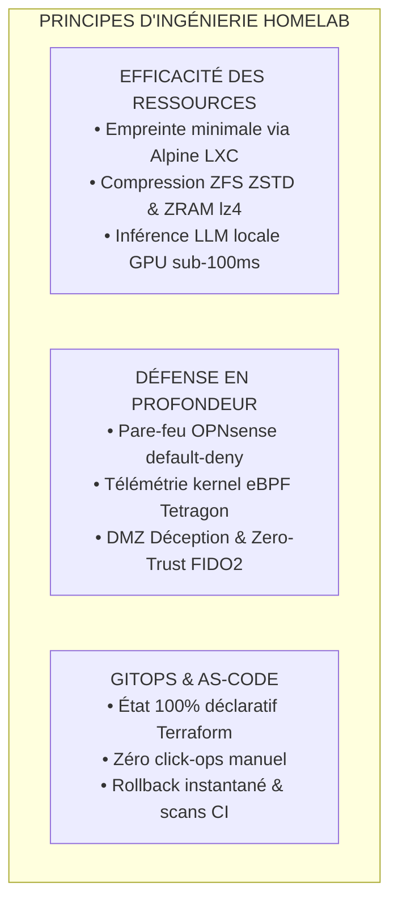
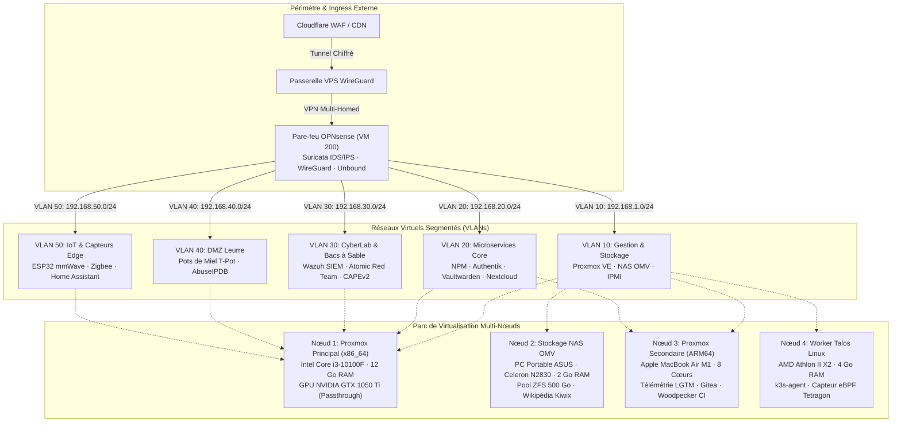
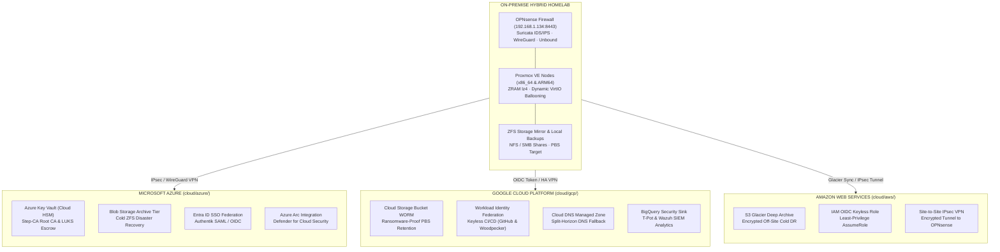

   
  &nbsp;&nbsp;&nbsp;&nbsp;&nbsp;&nbsp;&nbsp;&nbsp;

**[ Română ](README.ro.md) • [ English ](README.md) • [ Français ](README.fr.md) • [ Español ](README.es.md) • [ Deutsch ](README.de.md)**

[-emerald?style=flat&logo=terraform)](https://github.com/stefanutc1/homelab/tree/main/terraform)

 

**Plateforme cloud hybride de niveau production, terrain d'expérimentation en cyberdéfense et infrastructure d'orchestration multi-agents autonomes.**
Construite sur du matériel bare-metal x86_64 et Apple Silicon ARM64, une segmentation réseau dynamique OPNsense, des baies de stockage ZFS, une automatisation déclarative Terraform/Ansible et une observabilité noyau eBPF en temps réel.

[Application Web Interactive](https://stefanutc1.github.io/homelab/) • [Schéma d'Architecture](ARCHITECTURE.md) • [Politique de Sécurité](SECURITY.md) • [Feuille de Route](ROADMAP.md)

---

## Table des Matières

1. [Mission & Principes de Conception](#1-mission--principes-de-conception)
2. [Architecture Globale & Topologie Réseau](#2-architecture-globale--topologie-réseau)
3. [Parc Matériel Physique & Alimentation](#3-parc-matériel-physique--alimentation)
4. [Matrice des Ressources LXC & Machines Virtuelles](#4-matrice-des-ressources-lxc--machines-virtuelles)
5. [Architecture de Stockage & Optimisation ZFS](#5-architecture-de-stockage--optimisation-zfs)
6. [Segmentation Réseau & Matrice Pare-feu Inter-VLAN](#6-segmentation-réseau--matrice-pare-feu-inter-vlan)
7. [Trafic Entrant, Authentification Zero-Trust & DNS Split-Horizon](#7-trafic-entrant-authentification-zero-trust--dns-split-horizon)
8. [Infrastructure as Code (Terraform & Ansible)](#8-infrastructure-as-code-terraform--ansible)
9. [Cycle de Déploiement Kubernetes & GitOps](#9-cycle-de-déploiement-kubernetes--gitops)
10. [Pile d'Observabilité LGTM & Pipeline de Télémétrie](#10-pile-dobservabilité-lgtm--pipeline-de-télémétrie)
11. [Stratégie de Sauvegarde 3-2-1 & Reprise Après Sinistre](#11-stratégie-de-sauvegarde-3-2-1--reprise-après-sinistre)
12. [Laboratoire de Cyberdéfense, SOC & Sécurité eBPF](#12-laboratoire-de-cyberdéfense-soc--sécurité-ebpf)
13. [Environnement IA LLM Local sur GPU (Ollama CT 110)](#13-environnement-ia-llm-local-sur-gpu-ollama-ct-110)
14. [Ingénierie du Chaos & Validation de Résilience](#14-ingénierie-du-chaos--validation-de-résilience)
15. [Télémétrie Environnementale & Régulation des Ventilateurs](#15-télémétrie-environnementale--régulation-des-ventilateurs)
16. [Durcissement de Sécurité & Intégrité Cryptographique](#16-durcissement-de-sécurité--intégrité-cryptographique)
17. [Annuaire des Adresses IP Statiques & Ports](#17-annuaire-des-adresses-ip-statiques--ports)
18. [Procédure de Démarrage à Froid & Commandes Utiles](#18-procédure-de-démarrage-à-froid--commandes-utiles)
19. [FAQ & Dépannage](#19-faq--dépannage)
20. [Structure du Monorepo & Portfolio d'Ingénierie](#20-structure-du-monorepo--contribution)

---

## 1. Mission & Principes de Conception

* **Efficacité des Ressources** : Virtualisation haute densité exploitant une empreinte processeur/mémoire minimale. Conteneurs légers Alpine Linux et Debian optimisés pour tirer parti des architectures ARM64 et x86_64.
* **Défense en Profondeur** : Segmentation L2/L3 stricte sur 5 VLANs, bouncers de réputation IP CrowdSec, détection d'intrusion Suricata et traçage noyau avec Cilium Tetragon.
* **GitOps Déclaratif** : Chaque conteneur, machine virtuelle, règle pare-feu et tableau de bord est géré sous contrôle de version via Terraform, Ansible et Docker Compose.
* **Tolérance aux Pannes & Haute Disponibilité** : Sauvegardes automatisées, basculement d'IP virtuelle, guides de démarrage à froid et arrêt séquencé contrôlé par onduleur (NUT).

---

## 2. Architecture Globale & Topologie Réseau

---

### 2.4 Micro-Segmentation 802.1Q VLAN & Politiques Pare-feu (OPNsense)

Le pare-feu périmétrique OPNsense (VM 200 · 192.168.1.134) applique une micro-segmentation 802.1Q sur 5 VLANs isolés avec des règles strictes de Packet Filter (`pf`):

| VLAN ID | Segment Réseau | Subnet CIDR | Passerelle | Charges de Travail Associées | Politique de Sécurité |
| :--- | :--- | :--- | :--- | :--- | :--- |
| **VLAN 10** | Management & Storage Subnet | `192.168.1.0/24` | `192.168.1.1` | Proxmox Core (x86_64), OMV NAS, Commutateurs | Isolé des sous-réseaux IoT et Invités |
| **VLAN 20** | Core Microservices & Applications | `192.168.1.0/24` & `192.168.64.0/24` | `192.168.1.134` (OPNsense) | NPM Ingress, Vaultwarden, Immich, Nextcloud, Home Assistant, Gitea, Ollama (CT 110) | Authentification stricte via Authentik (CT 108) |
| **VLAN 30** | Cyber Security & Sandboxes (CyberLab) | `192.168.30.0/24` | `192.168.1.134:8443` | Wazuh XDR SIEM (1514), Suricata IDS, Atomic Red Team, CAPEv2 / Cuckoo Sandbox | Port miroir SPAN, aucun accès WAN sortant pour les bacs à sable |
| **VLAN 40** | DMZ Deception & Honeypots | `192.168.40.0/24` | `192.168.1.134` (OPNsense) | Cluster T-Pot (Cowrie SSH, Dionaea, RDP honeypot, Honeytrap) | DMZ totalement isolé; blocage automatique via AbuseIPDB |
| **VLAN 50** | IoT & Dispositifs Physiques Edge | `192.168.50.0/24` | `192.168.1.134 (OPNsense)` | Radar mmWave ESP32, Relais ESP32, Passerelle Zigbee | Communications MQTT strictement limitées à Home Assistant (CT 106) |

---

## 3. Architecture Multi-Cloud Hybride (Azure, GCP, AWS)

The on-premise cluster is extended into a true hybrid multi-cloud topology across **Microsoft Azure**, **Google Cloud Platform (GCP)**, and **Amazon Web Services (AWS)** using declarative, modular Infrastructure as Code (IaC) located in [`cloud/`](cloud/README.md) and [`terraform/`](terraform/):

### Cloud Integration & Zero-Cost Tiering Matrix

| Cloud Provider | IaC Directory | Core Declarative Resources | Cost Optimization Tier |
| :--- | :--- | :--- | :--- |
| **Microsoft Azure** | [`cloud/azure/`](cloud/azure/) | `azurerm_key_vault` (Cloud HSM Root CA & LUKS), `azurerm_storage_blob` (Archive Tier DR), `azuread_application` (SSO Authentik), `azurerm_arc_machine` (Defender for Cloud) | Archive Tier + Free Tier HSM |
| **Google Cloud (GCP)** | [`cloud/gcp/`](cloud/gcp/) | `google_storage_bucket` (WORM Object Lock PBS/Restic), `google_iam_workload_identity_pool` (Keyless OIDC), `google_dns_managed_zone` (DNSSEC fallback), `google_logging_project_sink` (BigQuery SIEM) | Coldline / Archive + BigQuery Free |
| **Amazon Web Services** | [`cloud/aws/`](cloud/aws/) | `aws_s3_bucket` (Glacier Deep Archive 365d), `aws_iam_openid_connect_provider` (Keyless CI/CD AssumeRole), `aws_vpn_connection` (Site-to-Site IPsec OPNsense) | Glacier Deep Archive + Free STS |

---

## 4. Matrice de Qualité CI/CD Enterprise (9 Flux Automatisés)

Infrastructure and application code are validated continuously across **9 GitHub Actions CI/CD workflows** running **36+ parallel automated quality gates**:

| # | Workflow File | Pipeline Name | Automated Quality Guarantees & Checks |
| :---: | :--- | :--- | :--- |
| 1 | [`.github/workflows/homelab-ci-cd-matrix.yml`](.github/workflows/homelab-ci-cd-matrix.yml) | **Enterprise Quality Matrix** | `terraform fmt` & `validate` (on-prem + multi-cloud), Checkov IaC Security, Trivy Misconfig, Docker Compose validation, ShellCheck, Secret Leakage, ELO Matrix (Python 3.9-3.13) |
| 2 | [`.github/workflows/ci.yml`](.github/workflows/ci.yml) | **Core CI Pipeline** | Gitleaks & TruffleHog (Secrets Scan), Ruff Lint, MyPy Static Types, Bandit SAST, Semgrep, Ansible Syntax Check on all playbooks, Kubeconform Kubernetes validation |
| 3 | [`.github/workflows/cd.yml`](.github/workflows/cd.yml) | **Continuous Deployment** | GitOps Reconciliation, Container Image Packaging on GHCR, Automated Rollback Verification |
| 4 | [`.github/workflows/container-scan.yml`](.github/workflows/container-scan.yml) | **Container Security** | Trivy Container Image Scanner & Dockle CIS Docker Benchmark compliance |
| 5 | [`.github/workflows/security-scan.yml`](.github/workflows/security-scan.yml) | **CodeQL SAST Analysis** | GitHub Advanced Security CodeQL engine for deep static vulnerability scanning (Python & TypeScript) |
| 6 | [`.github/workflows/security-scheduled.yml`](.github/workflows/security-scheduled.yml) | **Nightly Security Audit** | Scheduled nightly audit (02:00 UTC) for dependency CVEs (Pip-Audit, NPM Audit, Trivy FS) |
| 7 | [`.github/workflows/deploy-pages.yml`](.github/workflows/deploy-pages.yml) | **Deploy GitHub Pages** | Angular 19 production build & zero-downtime deployment to GitHub Pages |
| 8 | [`.github/workflows/desktop-macos-release.yml`](.github/workflows/desktop-macos-release.yml) | **macOS Native Release** | C# .NET 10 universal binary compilation, signing, and DMG artifact distribution for ELO desktop |
| 9 | [`.github/workflows/readme-sync.yml`](.github/workflows/readme-sync.yml) | **Documentation Sync** | Automated documentation sync and badge validation across all 5 supported languages |

---

## 9. Parc Matériel Physique & Alimentation

### Spécifications du Matériel

| Identifiant Nœud | Format / Châssis | Architecture Processeur | Accélérateur / GPU | Mémoire RAM | Configuration Stockage | Rôle Principal |
| :--- | :--- | :--- | :--- | :--- | :--- | :--- |
| **`pve` (Nœud 1)** | Tour ATX Sur-Mesure | Intel Core i3-10100F (4C/8T @ 4.30 GHz) | NVIDIA GeForce GTX 1050 Ti (4 Go VRAM) | 12 Go DDR4-2133 (12 288 Mo) | 512 Go NVMe SSD (`local-lvm`) | Hyperviseur Principal : Windows Server 2025 Datacenter AD, OPNsense, Ollama GPU (CT 110), Immich AI |
| **`openmediavault` (Nœud 2)** | PC Portable ASUS X451MA | Intel Celeron N2830 (2C/2T @ 2.16 GHz) | Intel HD Graphics | 2 Go DDR3L | 500 Go SATA HDD (Miroir ZFS) | NAS Centralisé : Partages NFS/SMB, cible de sauvegarde vzdump, Wikipédia hors ligne Kiwix |
| **`pve` (Nœud 3)** | Apple MacBook Air (2020) | Apple M1 (4P + 4E Cores @ 3.20 GHz) | 16-Core Neural Engine / Metal | 8 Go Unifiée (4 Go VM dédiée) | 256 Go Apple APFS NVMe | Hyperviseur Secondaire ARM64 (UTM) : Télémétrie Grafana/Prometheus/Tempo, Gitea, Woodpecker CI, 58+ Microservices |
| **`kubernetes` (Nœud 4)** | Châssis ATX Sur-Mesure | AMD Athlon II X2 220 (2C/2T @ 2.80 GHz) | NVIDIA GeForce GTS 250 (1 Go) | 4 Go DDR3-1333 | 80 Go HDD (Root NFS) | Worker Talos Linux / k3s immuable, tâches cron de traitement par lot, sonde eBPF |

### Plateforme Cloud-Native Kubernetes & Cloud Privé OpenStack

| Composant de la Plateforme | Technologie & Distribution | Nœud / Hôte Cible | Port / Accès | Fonctionnalité Principale |
| :--- | :--- | :--- | :--- | :--- |
| **ArgoCD GitOps** | Opérateur ArgoCD v2.12.3 | Cluster Hybride (Nœud 1 & Nœud 3) | `:8080` (HTTPS) | Déploiement continu déclaratif, auto-synchronisation et autoréparation directement depuis Git |
| **CoreDNS** | DaemonSet CoreDNS v1.11.3 | Dans le Cluster (`kube-system`) | `:53` (UDP/TCP) | Résolution DNS interne, découverte de services et redirection amont vers Pi-hole |
| **Cilium eBPF CNI** | Moteur Cilium v1.16.1 eBPF | Dans le noyau (`kube-system`) | `:9962` / `:12000` (Hubble) | CNI haute performance remplaçant kube-proxy, chiffrement WireGuard et politiques de sécurité L3-L7 |
| **Rook Ceph** | Orchestrateur Rook Ceph v1.15.2 | Pool de Stockage (Nœud 1 & 3) | `:8443` (Tableau de bord Ceph) | Stockage distribué cloud-native Ceph en blocs (RBD), système de fichiers CephFS et passerelles S3 |
| **Twingate ZTNA** | Connecteur Twingate v1 | Accès Distant (`twingate`) | Maillage P2P Interne | Accès sécurisé Zero-Trust (ZTNA) pour opérations distantes sans ouverture de ports pare-feu |
| **Woodpecker CI (k0s)** | Woodpecker v2.7.2 + k0s | Nœud 1 (CT 118 · Alpine 3.24) | `:8000` / `:9000` (gRPC) | Moteur CI/CD conteneurisé exécuté dans un micro-cluster Kubernetes k0s sur Alpine Linux |
| **OpenStack Cloud** | OpenStack 2024.1 Caracal (Kolla) | Nœud 1 (VM 211 · QEMU KVM) | `:80` / `:5000` (Keystone) | Cloud privé IaaS d'entreprise avec virtualisation Nova, réseaux Neutron et tableau de bord Horizon |

### Machines Virtuelles QEMU / KVM & VirtIO Dynamic Memory Ballooning

| VMID | Nom VM | Système d'Exploitation | vCPU | RAM Max | Balloon Min | Matériel / Passthrough | Rôle Principal |
| :--- | :--- | :--- | :--- | :--- | :--- | :--- | :--- |
| **200** | `opnsense` | Hardened FreeBSD 14 | 2 Cœurs | 2 048 Mo | **1 024 Mo** | VirtIO Net Multi-VLAN | Pare-feu Périmétrique, Suricata IDS/IPS, Rotation Clés WireGuard |
| **201** | `windows` | Windows Server 2025 Datacenter | 2 Cœurs | 7 168 Mo (7 Go) | **4 096 Mo (4 Go)** | **GTX 1050 Ti PCIe Passthrough** | Active Directory DS, GPO, DNS, Forwarder Sysmon (Ballooning : 4-7 Go) |
| **202** | `rhel` | RHEL 9.8 Enterprise | 2 Cœurs | 2 048 Mo (2 Go) | **1 024 Mo (1 Go)** | VirtIO SCSI Single IOThread | SELinux Enforcing, Podman Rootless, Charges Enterprise (1-2 Go) |
| **203** | `freebsd` | FreeBSD 15.1-RELEASE | 2 Cœurs | 1 024 Mo (1 Go) | **512 Mo** | VirtIO SCSI Single | Pool Natif OpenZFS, BSD Jails & Lab Réseau (512 Mo-1 Go) |
| **204** | `openbsd` | OpenBSD 7.9 Bastion | 2 Cœurs | 1 024 Mo (1 Go) | **512 Mo** | VirtIO SCSI Single | Jump Host Bastion Durci, Packet Filter PF, pledge/unveil (512 Mo-1 Go) |
| **205** | `talos` | Talos Linux 1.7 | 2 Cœurs | 2 048 Mo (2 Go) | **1 024 Mo (1 Go)** | VirtIO Single + Cilium CNI | OS Immuable Minimaliste, API gRPC, Nœud Worker K8s (1-2 Go) |
| **206** | `macOS` | macOS Monterey 12.7 | 4 Cœurs | 7 168 Mo (7 Go) | **2 048 Mo (2 Go)** | [OpenCore EFI](mac/EFI) + AppleSMC | OpenCore KVM Hackintosh, Runner Build CI/CD Xcode, Tests Apple |
| **211** | `openstack` | Ubuntu 24.04 LTS / Kolla | 2 Cœurs | 4 096 Mo (4 Go) | **2 048 Mo (2 Go)** | VirtIO SCSI Single + OVN SDN | Contrôleur Cloud Privé OpenStack Enterprise (Nova, Neutron, Keystone, Glance, Tableau de bord Horizon) |
| **207** | `openindiana` | OpenIndiana Hipster | 2 Cœurs | 3 072 Mo (3 Go) | **1 536 Mo (1,5 Go)** | VirtIO SCSI Single (50 Go) + Solaris | ZFS Enterprise de Référence, Zones Solaris, VNICs Crossbow, DTrace |
| **208** | `netbsd` | NetBSD 10.0 | 2 Cœurs | 512 Mo (512 Mo) | **256 Mo** | VirtIO SCSI Single (12 Go) | Référence Unix Portable et Propre, Rump Anykernel, pkgsrc |
| **209** | `nixos` | NixOS 24.11 Minimal | 2 Cœurs | 1 024 Mo (1 Go) | **512 Mo** | VirtIO SCSI Single (22 Go) | Linux Déclaratif Immuable, Flakes Reproductibles, Rollbacks Atomiques |
| **210** | `dragonflybsd` | DragonFly BSD 6.4 | 2 Cœurs | 1 024 Mo (1 Go) | **512 Mo** | VirtIO SCSI Single (15 Go) | Système de Fichiers Journalisé HAMMER2, Micro-noyau Hybride, SMP Sans Verrou |

> **Rééquilibrage d'Architecture : Migration Complète Non-IA vers ARM64** : Toutes les charges de conteneurs non-IA à partir du CT 112 (incluant Paperless-ngx, MinIO S3, Meilisearch, Vector, SearXNG, NetAlertX, RustDesk, Kopia, WG-Easy, Code-Server, pgAdmin4, Dozzle, Kiwix, Transmission, Kavita, Stirling-PDF, Audiobookshelf, TubeArchivist, Calibre-Web, CyberChef, Draw.io, RomM, EmulatorJS et VS Code Server ARM64) ont été relocalisées sur le Nœud 3 (Apple Silicon M1 ARM64 via UTM), soutenues par la compression de mémoire ZRAM lz4. Le Nœud 1 (x86_64) est strictement dédié au cluster IA accéléré par GPU CUDA (Ollama LLM, Open-WebUI, Faster-Whisper, Flowise, Paperless-AI) et aux machines virtuelles d'entreprise KVM (Windows Server 2025 Datacenter, macOS Monterey, OpenIndiana Hipster, NetBSD, NixOS, DragonFly BSD, RHEL, BSD).

---

## 10. Matrice des Ressources LXC & Machines Virtuelles

### Catalogue Détaillé des Conteneurs LXC (Nœud 1 — x86_64 Principal)

| VMID | Nom d'Hôte | OS Base | vCPU | RAM Allouée | Pool Stockage | IP Statique | Catégorie | Rôle Applicatif |
| :--- | :--- | :--- | :--- | :--- | :--- | :--- | :--- | : |

---

## Galerie Photo: Panneaux de Gestion, Services et Télémétrie Loki

Tous les nœuds matériels, machines virtuelles et conteneurs s'exécutent sur l'infrastructure physique. Voici les captures directes des interfaces de gestion, des services actifs et des flux de journaux centralisés via Grafana Loki.

### Panneaux Principaux de Gestion
| Grafana: Nœuds Homelab (12GB x64 & ARM64) | Grafana: Défense Périmétrique OPNsense |
| :---: | :---: |
|  |  |

| Proxmox VE 9.2 x86_64 (12GB RAM · 192.168.1.132:8006) | Proxmox VE 9.2 ARM64 Apple M1 (192.168.64.14:8006) |
| :---: | :---: |
|  |  |

| Pi-hole DNS Sinkhole & FTL (192.168.1.4:8080) | Home Assistant Automation Hub (192.168.1.10:8123) |
| :---: | :---: |
|  |  |

| OPNsense Suricata 8 NIDS/IPS (192.168.1.134:8443) | OPNsense: Politiques de Filtrage VLAN (règles pf) |
| :---: | :---: |
|  |  |

| OPNsense: Mesh VPN Noyau WireGuard | OPNsense: Unbound DNS-over-TLS (DoT) |
| :---: | :---: |
|  |  |

---

### Core & Réseau
| Nginx Proxy Manager | Pi-hole DNS Sinkhole |
| :---: | :---: |
|  |  |

| Tailscale Mesh | WireGuard Easy |
| :---: | :---: |
|  |  |

| OPNsense Core Gateway | OPNsense Unbound DoT |
| :---: | :---: |
|  |  |

| OPNsense FRR Routage Dynamique | Caddy Ingress mTLS |
| :---: | :---: |
|  |  |

---

### Stockage & Sauvegarde
| Nextcloud Hub | Paperless-ngx OCR de Documents |
| :---: | :---: |
|  |  |

| MinIO S3 Stockage Objet | Kopia Sauvegarde par Instantanés |
| :---: | :---: |
|  |  |

| Syncthing Synchronisation Fichiers | Proxmox Backup Server (PBS) |
| :---: | :---: |
|  |  |

---

### Automatisation & IA
| Ollama Exécuteur LLM | Open-WebUI Interface IA |
| :---: | :---: |
|  |  |

| Faster-Whisper Transcription Vocale | Flowise Orchestrateur LLM |
| :---: | :---: |
|  |  |

| Home Assistant Hub Domotique | RenovateBot Moteur GitOps |
| :---: | :---: |
|  |  |

---

### Observabilité & Monitoring
| Grafana Enterprise Tableau de Bord | Prometheus Moteur de Métriques |
| :---: | :---: |
|  |  |

| Loki Agrégateur de Journaux | Uptime Kuma Moniteur SLA |
| :---: | :---: |
|  |  |

| Gatus Vérificateur d'État | Beszel Métriques Légères |
| :---: | :---: |
|  |  |

| Blackbox Exportateur Réseau | Vector Agrégateur Haut Débit |
| :---: | :---: |
|  |  |

| Dozzle Visionneur de Journaux en Direct |  |
| :---: | :---: |
|  |  |

---

### Sécurité & Cyber Lab
| OPNsense Suricata 8 NIDS/IPS | OPNsense CrowdSec LAPI Bouncer |
| :---: | :---: |
|  |  |

| Wazuh SIEM / XDR Gestionnaire | T-Pot Capteurs Multi-Honeypots |
| :---: | :---: |
|  |  |

| CyberChef Utilitaire Cryptographique | DFIR Bac à Sable Malware |
| :---: | :---: |
|  |  |

| HashiCorp Vault Gestion des Secrets | Leurres Canary Tokens & Fichiers Pièges |
| :---: | :---: |
|  |  |

---

### Médias & Utilitaires
| Stirling-PDF Suite de Manipulation | Kavita Bibliothèque Numérique |
| :---: | :---: |
|  |  |

| Audiobookshelf Serveur de Livres Audio | TubeArchivist Archiveur YouTube |
| :---: | :---: |
|  |  |

| Transmission Client BitTorrent | Calibre-Web Gestionnaire E-Book |
| :---: | :---: |
|  |  |

| RomM Gestionnaire ROM Rétro | EmulatorJS Émulateur Navigateur |
| :---: | :---: |
|  |  |

| Code-Server VS Code IDE Cloud | Draw.io Concepteur d'Architecture |
| :---: | :---: |
|  |  |

| IT-Tools Boîte à Outils Développeur | Actual Budget Comptabilité Locale |
| :---: | :---: |
|  |  |

| Trillium Base de Connaissances | ChangeDetection Surveillance Web |
| :---: | :---: |
|  |  |

| MicroBin Pastebin Chiffré | Vikunja Gestion de Tâches |
| :---: | :---: |
|  |  |

| Memos Prise de Notes Rapide | Wallos Suivi des Abonnements |
| :---: | :---: |
|  |  |

| Speedtest Tracker Test de Débit Continu | Homepage Tableau de Bord |
| :---: | :---: |
|  |  |

| Flame Lanceur d'Applications |  |
| :---: | :---: |
|  |  |

---

### Systèmes d'Exploitation Spécialisés & Télémétrie (Loki Telemetry & Runtime Logs)
| Windows Server 2025 Datacenter (VM 201 · Loki Telemetry) | Red Hat Enterprise Linux 9.8 (VM 202 · Loki Telemetry) |
| :---: | :---: |
|  |  |

| FreeBSD 15.1-RELEASE (VM 203 · Loki Telemetry) | OpenBSD 7.9 Bastion (VM 204 · Loki Telemetry) |
| :---: | :---: |
|  |  |

| Talos Linux 1.7 (VM 205 · Loki Telemetry) | Proxmox Datacenter Manager (CT 147 · Loki Telemetry) |
| :---: | :---: |
|  |  |

---

## À propos de l'auteur

Conçu, déployé et administré par **[@stefanutc1](https://github.com/stefanutc1)**.
* **Spécialité**: Ingénierie des infrastructures, virtualisation hybride (Proxmox VE x86_64 12GB DDR4-2133 et Apple Silicon ARM64), sécurité réseau Zero-Trust (OPNsense, Suricata, CrowdSec, WireGuard), domotique (Home Assistant), filtrage DNS (Pi-hole), GitOps & IaC (Terraform, Ansible, CI/CD).
* **Objectif**: Portfolio technique illustrant l'architecture de systèmes modernes sur site et hybrides.
