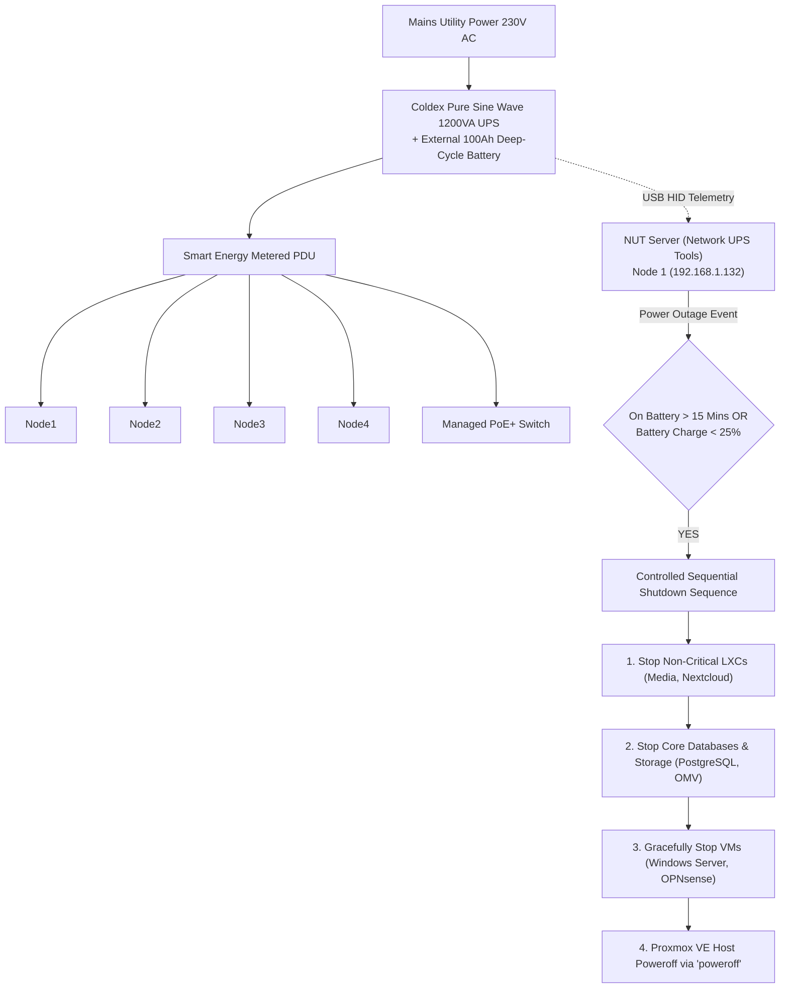
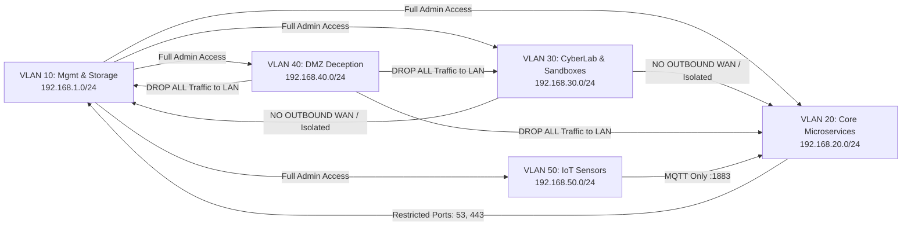
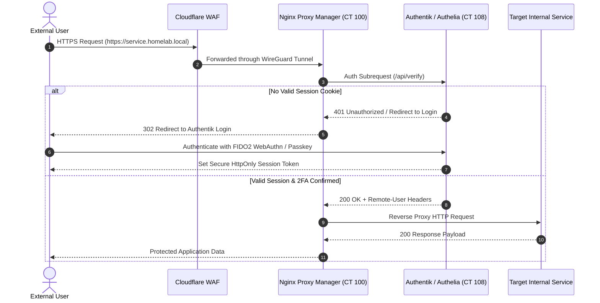
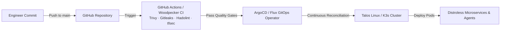
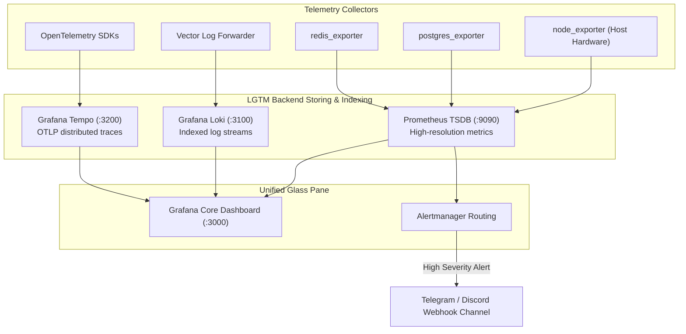
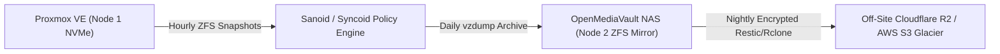
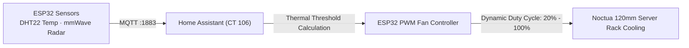

<div align="center">

# Enterprise Hybrid Cloud & Platform Engineering Lab

**[ 🇷🇴 Română ](README.ro.md) • [ 🇬🇧 English ](README.md) • [ 🇫🇷 Français ](README.fr.md) • [ 🇪🇸 Español ](README.es.md) • [ 🇩🇪 Deutsch ](README.de.md)**

[](https://github.com/stefanutc1/homelab/actions)
[](https://github.com/stefanutc1/homelab/actions/workflows/security-scan.yml)
[-emerald?style=flat&logo=terraform)](https://github.com/stefanutc1/homelab/tree/main/terraform)
[](https://status.homelab.local)
[](https://github.com/stefanutc1/homelab)
[](https://github.com/stefanutc1/homelab)
[](https://github.com/stefanutc1/homelab)
[](LICENSE)

<br/>

**Production-grade hybrid cloud platform, cyber defense proving ground, and autonomous multi-agent orchestration infrastructure.**
Built on bare-metal x86_64 and Apple Silicon ARM64 compute, stateful OPNsense network segmentation, ZFS storage arrays, declarative Terraform/Ansible automation, and real-time eBPF runtime observability.

[Live Interactive Digital Twin](https://stefanutc1.github.io/homelab/) • [Architecture Blueprint](ARCHITECTURE.md) • [Security Policy](SECURITY.md) • [Roadmap](ROADMAP.md)


<!-- AUTO-METRICS-START -->
[](https://github.com/stefanutc1/homelab#workload-catalog--pinned-favorites)
[-brightgreen?style=flat&logo=pytest)](https://github.com/stefanutc1/homelab/actions/workflows/ci.yml)
[](https://github.com/stefanutc1/homelab/tree/main/elo)
[](https://github.com/stefanutc1/homelab/actions)
<!-- AUTO-METRICS-END -->
</div>

---

## 📑 Table of Contents

1. [Mission & Design Principles](#1-mission--design-principles)
2. [End-to-End Architecture & Network Topology](#2-end-to-end-architecture--network-topology)
3. [Physical Hardware Fleet & Power Delivery](#3-physical-hardware-fleet--power-delivery)
4. [LXC Containers & VM Workloads Resource Matrix](#4-lxc-containers--vm-workloads-resource-matrix)
5. [Storage Architecture & ZFS Pool Optimization](#5-storage-architecture--zfs-pool-optimization)
6. [Network Segmentation & Inter-VLAN Firewall Matrix](#6-network-segmentation--inter-vlan-firewall-matrix)
7. [Ingress Traffic, Zero-Trust Authentication & Split-Horizon DNS](#7-ingress-traffic-zero-trust-authentication--split-horizon-dns)
8. [Infrastructure as Code (Terraform & Ansible)](#8-infrastructure-as-code-terraform--ansible)
9. [Kubernetes & GitOps Deployment Lifecycle](#9-kubernetes--gitops-deployment-lifecycle)
10. [LGTM Observability Stack & Telemetry Pipeline](#10-lgtm-observability-stack--telemetry-pipeline)
11. [3-2-1 Backup Strategy, Sanoid & Disaster Recovery](#11-3-2-1-backup-strategy-sanoid--disaster-recovery)
12. [Cyber Defense Proving Ground, SOC & eBPF Security](#12-cyber-defense-proving-ground-soc--ebpf-security)
13. [Local GPU AI LLM Runtime (Ollama CT 110)](#13-local-gpu-ai-llm-runtime-ollama-ct-110)
14. [Chaos Engineering & Resiliency Validation](#14-chaos-engineering--resiliency-validation)
15. [Environmental Telemetry & Closed-Loop Fan Control](#15-environmental-telemetry--closed-loop-fan-control)
16. [Security Hardening & Cryptographic Integrity](#16-security-hardening--cryptographic-integrity)
17. [Static IP & Ports Directory](#17-static-ip--ports-directory)
18. [Cold-Start Runbook & Operational Cheat Sheet](#18-cold-start-runbook--operational-cheat-sheet)
19. [Troubleshooting FAQ](#19-troubleshooting-faq)
20. [Monorepo Layout & Contributing](#20-monorepo-layout--contributing)

---

## 1. Mission & Design Principles

```
┌───────────────────────────────────────────────────────────────────────────────┐
│                        CORE ENGINEERING TENETS                                │
├────────────────────────┬──────────────────────────┬───────────────────────────┤
│  RESOURCE EFFICIENCY   │    DEFENSE-IN-DEPTH      │     GITOPS & AS-CODE      │
│  Minimal overhead via  │  Default-deny firewalls, │  100% declarative state;  │
│  Alpine LXC containers,│  eBPF syscall telemetry, │  no manual click-ops;     │
│  ZFS ZSTD compression, │  quarantine DMZ & honeys,│  instant snapshot rollback│
│  and sub-100ms LLMs.   │  and FIDO2 Zero-Trust.   │  and automated CI lint.   │
└────────────────────────┴──────────────────────────┴───────────────────────────┘
```

* **Resource Efficiency**: High-density virtualization utilizing minimal CPU/RAM footprints. Alpine Linux and Debian slim containers maximize performance on constrained silicon.
* **Defense-in-Depth**: Strict L2/L3 segmentation across 5 VLANs, CrowdSec real-time IP reputation bouncers, Suricata intrusion detection, and kernel-level Cilium Tetragon tracing.
* **Declarative GitOps**: Every container, VM, firewall rule, dashboard, and secret is managed declaratively through version-controlled Terraform, Ansible, and Docker manifests.
* **High Availability & Fault Tolerance**: Automated disaster recovery snapshots, virtual IP failover, cold-start runbooks, and UPS battery backup with controlled sequential shutdown.

---

## 2. End-to-End Architecture & Network Topology


---

## 3. Physical Hardware Fleet & Power Delivery

### Hardware Specifications Matrix

| Node Identifier | Form Factor / Chassis | CPU Architecture | Accelerator / GPU | RAM Allocation | Storage Configuration | Primary Purpose |
| :--- | :--- | :--- | :--- | :--- | :--- | :--- |
| **`proxmox` (Node 1)** | Custom ATX Tower | Intel Core i3-10100F (4C/8T @ 4.30 GHz) | NVIDIA GeForce GTX 1050 Ti (4GB VRAM) | 8 GB DDR4-2666 | 512 GB NVMe SSD (`local-lvm`) | Primary Hypervisor: Windows Server 2025 AD, OPNsense, Ollama GPU (CT 110), Immich AI |
| **`openmediavault` (Node 2)** | ASUS X451MA Laptop | Intel Celeron N2830 (2C/2T @ 2.16 GHz) | Intel HD Graphics | 2 GB DDR3L | 500 GB SATA HDD (ZFS Mirror) | Centralized NAS: NFS/SMB storage pool, Proxmox vzdump backup target, Kiwix offline Wikipedia |
| **`proxmox2` (Node 3)** | Apple MacBook Air (2020) | Apple M1 (4P + 4E Cores @ 3.20 GHz) | 16-Core Apple Neural Engine / Metal | 8 GB Unified (4GB dedicated VM) | 256 GB Apple APFS NVMe | Secondary ARM64 Hypervisor (UTM): Grafana/Prometheus/Tempo telemetry, Gitea, Woodpecker CI |
| **`k8s-node-04` (Node 4)** | Custom ATX Chassis | AMD Athlon II X2 220 (2C/2T @ 2.80 GHz) | NVIDIA GeForce GTS 250 (1GB) | 4 GB DDR3-1333 | 80 GB HDD (NFS Root) | Immutable Talos Linux / k3s worker, batch cron workloads, eBPF security probing |

### Power Delivery & NUT Controlled Shutdown Sequence



---

## 4. LXC Containers & VM Workloads Resource Matrix

### Granular LXC Container Roster (Node 1 — x86_64 Primary)

| VMID | Hostname | Base OS | vCPU | RAM Allocation | Storage Pool | Static IP | Subsystem Category | Primary Workload |
| :--- | :--- | :--- | :--- | :--- | :--- | :--- | :--- | :--- |
| **100** | `nginx` | Debian 13 | 2 | 112 MB | `local-lvm:4G` | `192.168.1.3` | Ingress | Nginx Proxy Manager + CrowdSec Bouncer |
| **101** | `pihole` | Debian 13 | 1 | 96 MB | `local-lvm:4G` | `192.168.1.4` | DNS | Primary Internal DNS Sinkhole & Resolver |
| **102** | `tailscale` | Debian 13 | 1 | 96 MB | `local-lvm:4G` | `192.168.1.5` | VPN | Mesh WireGuard Subnet Router |
| **103** | `immich` | Debian 13 | 4 | 896 MB | `local-lvm:32G` | `192.168.1.15` | Storage / AI | Photo Library + Machine Learning Face Recognition |
| **104** | `nextcloud` | Debian 13 | 2 | 512 MB | `local-lvm:20G` | `192.168.1.8` | Storage | Enterprise File Cloud & WebDAV Sync |
| **105** | `crowdsec` | Debian 13 | 1 | 128 MB | `local-lvm:4G` | `192.168.1.9` | Security | Cyber Threat Defense Agent & IPS |
| **106** | `homeassistant` | Debian 13 | 2 | 384 MB | `local-lvm:16G` | `192.168.1.10` | Automation | Smart Home Hub, Zigbee & ESP32 Telemetry |
| **107** | `n8n` | Debian 13 | 2 | 384 MB | `local-lvm:8G` | `192.168.1.13` | Automation | Workflow Orchestration & Incident Playbooks |
| **110** | `ollama` | Debian 13 | 4 | 2,048 MB | `local-lvm:16G` | `192.168.1.110` | Local AI | Ollama GPU LLM Runtime (Qwen2.5-Coder & DeepSeek-R1) |
| **111** | `openwebui` | Debian 13 | 2 | 384 MB | `local-lvm:8G` | `192.168.1.111` | Local AI | Self-Hosted ChatGPT / Claude Interface |
| **112** | `paperless` | Debian 13 | 2 | 768 MB | `local-lvm:20G` | `192.168.1.16` | Storage / DMS | Document Management & Tesseract OCR |
| **113** | `minio` | Alpine 3.24 | 2 | 384 MB | `local-lvm:8G` | `192.168.1.17` | Storage | AWS S3 Compatible Object Storage Server |
| **114** | `transmission` | Alpine 3.24 | 1 | 256 MB | `local-lvm:8G` | `192.168.1.19` | Media | Isolated BitTorrent Download Gateway |
| **115** | `kavita` | Alpine 3.24 | 2 | 384 MB | `local-lvm:8G` | `192.168.1.20` | Media | E-book, Manga & Comic Web Reader |
| **116** | `stirling` | Alpine 3.24 | 2 | 384 MB | `local-lvm:8G` | `192.168.1.21` | Productivity | Stirling-PDF Offline PDF Toolset |
| **117** | `meilisearch` | Alpine 3.24 | 2 | 384 MB | `local-lvm:8G` | `192.168.1.22` | Search | Typo-Tolerant Full-Text Search Engine |
| **118** | `vector` | Alpine 3.24 | 1 | 128 MB | `local-lvm:4G` | `192.168.1.23` | Monitoring | Rust Telemetry & Log Aggregator |
| **119** | `whisper` | Debian 13 | 2 | 1,024 MB | `local-lvm:8G` | `192.168.1.24` | Local AI | Faster-Whisper Speech-to-Text CUDA API |
| **130** | `searxng` | Alpine 3.24 | 2 | 256 MB | `local-lvm:4G` | `192.168.1.25` | Privacy | Aggregated Metasearch Engine |
| **131** | `flowise` | Alpine 3.24 | 2 | 512 MB | `local-lvm:4G` | `192.168.1.26` | Local AI | Flowise Multi-Agent LLM Orchestrator |
| **132** | `netalertx` | Alpine 3.24 | 1 | 128 MB | `local-lvm:4G` | `192.168.1.27` | Security | Wi-Fi / LAN Network Intruder Detector |
| **133** | `rustdesk` | Alpine 3.24 | 1 | 128 MB | `local-lvm:2G` | `192.168.1.28` | Remote | RustDesk Self-Hosted Remote Desktop Relay |
| **134** | `audiobookshelf` | Alpine 3.24 | 2 | 256 MB | `local-lvm:4G` | `192.168.1.29` | Media | Audiobook & Podcast Streaming Server |
| **135** | `tubearchivist` | Alpine 3.24 | 2 | 512 MB | `local-lvm:8G` | `192.168.1.30` | Media | Private YouTube Channel Archiver |
| **136** | `kopia` | Alpine 3.24 | 1 | 128 MB | `local-lvm:4G` | `192.168.1.31` | Backup | Fast Encrypted Snapshot Backup Server |
| **137** | `wgeasy` | Alpine 3.24 | 1 | 128 MB | `local-lvm:2G` | `192.168.1.32` | VPN | WireGuard-Easy Management Portal |
| **138** | `calibreweb` | Alpine 3.24 | 1 | 128 MB | `local-lvm:4G` | `192.168.1.33` | Media | Calibre-Web Digital Book Manager |
| **140** | `codeserver` | Alpine 3.24 | 2 | 384 MB | `local-lvm:8G` | `192.168.1.40` | Dev | Full Visual Studio Code Web IDE |
| **141** | `pgadmin` | Alpine 3.24 | 1 | 192 MB | `local-lvm:4G` | `192.168.1.41` | Database | pgAdmin 4 PostgreSQL Web Administration |
| **142** | `cyberchef` | Alpine 3.24 | 1 | 64 MB | `local-lvm:2G` | `192.168.1.42` | DFIR / Crypto | CyberChef Swiss Army Knife |
| **143** | `drawio` | Alpine 3.24 | 1 | 96 MB | `local-lvm:2G` | `192.168.1.43` | Architecture | Draw.io Offline Diagramming Suite |
| **144** | `dozzle` | Alpine 3.24 | 1 | 48 MB | `local-lvm:2G` | `192.168.1.44` | Monitoring | Dozzle Live Container Log Viewer |
| **145** | `kiwix` | Alpine 3.24 | 1 | 96 MB | `local-lvm:4G` | `192.168.1.45` | Knowledge | Kiwix Offline Wikipedia & Docs Server |
| **146** | `romm` | Alpine 3.24 | 2 | 192 MB | `local-lvm:8G` | `192.168.1.46` | Media / Retro | RomM Retro Games Collection Manager |
| **147** | `emulatorjs` | Alpine 3.24 | 1 | 96 MB | `local-lvm:4G` | `192.168.1.47` | Media / Retro | EmulatorJS WebAssembly Retro Gaming |

### Granular LXC Container Roster (Node 3 — Apple M1 ARM64 UTM)

| VMID | Hostname | Base OS | vCPU | RAM Allocation | Storage Pool | Static IP | Subsystem Category | Primary Workload |
| :--- | :--- | :--- | :--- | :--- | :--- | :--- | :--- | :--- |
| **104** | `scrutiny` | Debian 13 | 1 | 128 MB | `local:4G` | `192.168.64.104` | Monitoring | Scrutiny Hard Drive S.M.A.R.T. Health Telemetry |
| **105** | `uptimekuma` | Debian 13 | 1 | 128 MB | `local:4G` | `192.168.64.105` | Monitoring | Uptime Kuma Service Availability & SLA Monitoring |
| **107** | `monitoring` | Debian 13 | 2 | 384 MB | `local:8G` | `192.168.64.107` | Monitoring | Prometheus TSDB & Grafana Central Dashboards |
| **109** | `gitea` | Debian 13 | 2 | 160 MB | `local:16G` | `192.168.64.109` | Dev | Gitea Git Forge & Code Review Platform |
| **111** | `woodpecker` | Debian 13 | 2 | 192 MB | `local:8G` | `192.168.64.111` | CI/CD | Woodpecker CI Build Engine |
| **118** | `tempo` | Debian 13 | 2 | 256 MB | `local:8G` | `192.168.64.118` | Monitoring | Grafana Tempo Distributed Tracing Backend |
| **120** | `gatus` | Alpine 3.24 | 1 | 64 MB | `local:2G` | `192.168.64.120` | Monitoring | Gatus Automated Health Dashboard in Go |
| **121** | `ntfy` | Alpine 3.24 | 1 | 64 MB | `local:2G` | `192.168.64.121` | Alerts | Ntfy.sh Private Push Notifications Hub |
| **122** | `linkding` | Alpine 3.24 | 1 | 96 MB | `local:2G` | `192.168.64.122` | Automation | Linkding Bookmark & Technical Search Manager |
| **123** | `stepca` | Alpine 3.24 | 1 | 96 MB | `local:2G` | `192.168.64.123` | Security | Step-CA Private Automated TLS PKI Authority |
| **124** | `tailscale-arm` | Alpine 3.24 | 1 | 96 MB | `local:2G` | `192.168.64.124` | VPN | Tailscale Subnet Router (ARM64 Subnet) |
| **125** | `beszel` | Alpine 3.24 | 1 | 64 MB | `local:2G` | `192.168.64.125` | Monitoring | Beszel High-Resolution System Telemetry (1s) |
| **134** | `homepage` | Alpine 3.24 | 1 | 64 MB | `local:1G` | `192.168.64.134` | Dashboard | Homepage Unified Homelab Command Dashboard |
| **135** | `speedtest` | Alpine 3.24 | 1 | 96 MB | `local:1G` | `192.168.64.135` | Monitoring | Speedtest-Tracker Automated Bandwidth Telemetry |
| **136** | `memos` | Alpine 3.24 | 1 | 32 MB | `local:1G` | `192.168.64.136` | Notes | Memos Privacy-First Fast Knowledge Capture |
| **137** | `wallos` | Alpine 3.24 | 1 | 48 MB | `local:1G` | `192.168.64.137` | Finance | Wallos Recurring Expense & Subscription Tracker |
| **138** | `syncthing` | Alpine 3.24 | 1 | 64 MB | `local:1G` | `192.168.64.138` | Storage | SyncThing P2P Bidirectional File Synchronization |
| **139** | `microbin` | Alpine 3.24 | 1 | 16 MB | `local:1G` | `192.168.64.139` | Security | Microbin Encrypted Self-Destructing Rust Pastebin |
| **140** | `vikunja` | Alpine 3.24 | 1 | 64 MB | `local:1G` | `192.168.64.140` | Tasks | Vikunja Project & Task Management Platform |
| **141** | `blackbox` | Alpine 3.24 | 1 | 32 MB | `local:1G` | `192.168.64.141` | Monitoring | Prometheus Blackbox Exporter (ICMP / TLS Expiry) |
| **142** | `yourspotify` | Alpine 3.24 | 1 | 64 MB | `local:1G` | `192.168.64.142` | Analytics | YourSpotify Private Listening History & Insights |
| **143** | `webcheck` | Alpine 3.24 | 1 | 64 MB | `local:1G` | `192.168.64.143` | OSINT | Web-Check OSINT Security & Domain Scanner |
| **144** | `opengist` | Alpine 3.24 | 1 | 48 MB | `local:1G` | `192.168.64.144` | Dev | Opengist Self-Hosted Code Paste & Snippets |
| **145** | `flatnotes` | Alpine 3.24 | 1 | 32 MB | `local:1G` | `192.168.64.145` | Notes | Flatnotes Flat-File Markdown Note Storage |
| **146** | `bark` | Alpine 3.24 | 1 | 32 MB | `local:1G` | `192.168.64.146` | Alerts | Bark Apple Push Notification Relay Hub |
| **147** | `shiori` | Alpine 3.24 | 1 | 32 MB | `local:1G` | `192.168.64.147` | Storage | Shiori Simple Clean Web Page Archiver |
| **148** | `whoogle` | Alpine 3.24 | 1 | 64 MB | `local:1G` | `192.168.64.148` | Privacy | Whoogle Private Anonymized Google Proxy |
| **149** | `flame` | Alpine 3.24 | 1 | 32 MB | `local:1G` | `192.168.64.149` | Dashboard | Flame Minimalist Fast Startpage |

### QEMU / KVM Virtual Machines

| VMID | Name | Cores / Sockets | RAM | Disk Size | Network Interface | Primary Operating Role |
| :--- | :--- | :--- | :--- | :--- | :--- | :--- |
| **200** | `opnsense-firewall` | 2C / 1S | 1,024 MB | 32 GB SSD | Multi-VLAN Trunk | Perimeter Stateful Firewall, Suricata IDS/IPS, WireGuard Gateway |
| **201** | `win-server-2025` | 4C / 1S | 4,096 MB | 64 GB SSD | VLAN 20 (`192.168.20.201`) | Active Directory (AD DS), DNS, Group Policy (GPO), Sysmon Forwarder |
| **204** | `talos-k8s-node01` | 2C / 1S | 2,048 MB | 30 GB SSD | VLAN 20 (`192.168.20.204`) | Immutable Talos Linux Kubernetes Control-Plane / Worker |
| **205** | `tpot-honeypot-dmz` | 4C / 1S | 3,072 MB | 40 GB SSD | VLAN 40 (`192.168.40.205`) | Multi-Honeypot Platform (Cowrie, Dionaea, RDP Honeypot, Honeytrap) |
| **206** | `capev2-malware-sandbox` | 4C / 1S | 4,096 MB | 100 GB SSD | VLAN 30 (`192.168.30.206`) | Air-Gapped Malware Analysis Sandbox (Win10 + INetSim + Volatility) |

---

## 5. Storage Architecture & ZFS Pool Optimization

```
                               ┌─────────────────────────────┐
                               │   ZFS STORAGE POOL TOPOLOGY │
                               └──────────────┬──────────────┘
                                              │
                      ┌───────────────────────┴───────────────────────┐
                      ▼                                               ▼
         ┌─────────────────────────┐                     ┌─────────────────────────┐
         │     rpool (NVMe SSD)    │                     │   datapool (ZFS Mirror) │
         │   Proxmox Root & OS     │                     │     OpenMediaVault      │
         ├─────────────────────────┤                     ├─────────────────────────┤
         │ • recordsize: 128k      │                     │ • recordsize: 1M (Media)│
         │ • compression: zstd-3   │                     │ • recordsize: 16k (DBs) │
         │ • atime: off            │                     │ • compression: zstd     │
         │ • autotrim: on          │                     │ • ashift: 12 (4Kn Disks)│
         └─────────────────────────┘                     └─────────────────────────┘
```

### Granular ZFS Filesystem Tuning Rules

* **PostgreSQL / MySQL / SQLite Data**: `recordsize=16k` matching DB page sizes to eliminate write amplification.
* **Large Media Streams (Jellyfin / Kiwix)**: `recordsize=1M` for sequential streaming throughput.
* **Compressratio**: `compression=zstd` delivering ~1.85x space efficiency with zero noticeable CPU latency.
* **ZFS ARC Ceiling**: Capped dynamically via `/etc/modprobe.d/zfs.conf` (`zfs_arc_max=2147483648` — 2GB) to protect VM allocations.

---

## 6. Network Segmentation & Inter-VLAN Firewall Matrix



### Inter-VLAN Firewall Policy Table (Default-Deny)

| Source VLAN | Destination VLAN | Allowed Destination Ports | Protocol | Firewall Action |
| :--- | :--- | :--- | :--- | :--- |
| **VLAN 10 (Management)** | ALL VLANs | ANY | ANY | **PASS (Stateful)** |
| **VLAN 20 (Core Services)** | VLAN 10 (Storage) | `2049` (NFS), `445` (SMB), `53` (DNS) | TCP/UDP | **PASS** |
| **VLAN 20 (Core Services)** | VLAN 50 (IoT) | `1883` (MQTT Broker) | TCP | **PASS** |
| **VLAN 30 (CyberLab)** | ANY Internal VLAN | NONE | ANY | **DROP & LOG** |
| **VLAN 30 (CyberLab)** | WAN | HTTP `:8080` via INetSim Fake Gateway | TCP | **PASS (Simulated)** |
| **VLAN 40 (DMZ Honeypots)**| ALL Internal VLANs | NONE | ANY | **DROP & ALARM** |
| **VLAN 50 (IoT)** | ANY Internal VLAN | `1883` (Home Assistant MQTT Only) | TCP | **PASS** |
| **VLAN 50 (IoT)** | WAN | NTP `:123` | UDP | **PASS** |

---

## 7. Ingress Traffic, Zero-Trust Authentication & Split-Horizon DNS

### Ingress Forward-Authentication Sequence



### Split-Horizon DNS Schema

* **External Resolution**: Public domain records hosted on Cloudflare DNS point exclusively to protected VPS reverse proxy endpoints.
* **Internal Resolution**: OPNsense Unbound DNS and AdGuard Home sinkholes resolve `*.homelab.local` directly to internal RFC1918 IPs (`192.168.1.3`), bypassing external bandwidth entirely.

---

## 8. Infrastructure as Code (Terraform & Ansible)

All infrastructure is provisioned declaratively using Terraform with the `bpg/proxmox` provider.

```
terraform/
├── main.tf                    # Root composition
├── providers.tf               # Proxmox VE provider configuration
├── variables.tf               # Cluster endpoints & credentials
├── terraform.tfvars.example   # Template variables
├── lxc_services.tf            # Declarative LXC container definitions
├── vm_workloads.tf            # Declarative VM definitions
└── modules/
    ├── proxmox_lxc/           # Reusable LXC container module
    └── proxmox_vm/            # Reusable QEMU VM module
```

### Quick Bootstrap Runbook

```bash
# 1. Clone repository
git clone https://github.com/stefanutc1/homelab.git
cd homelab/terraform/proxmox

# 2. Configure variables
cp terraform.tfvars.example terraform.tfvars
nano terraform.tfvars

# 3. Initialize & Deploy Cluster
terraform init
terraform plan -out=tfplan.binary
terraform apply tfplan.binary
```

---

## 9. Kubernetes & GitOps Deployment Lifecycle



* **Talos Linux OS (`kubernetes/talos/cluster.yaml`)**: Immutable, zero-SSH operating system managed strictly via gRPC APIs.
* **Lightweight K3s**: Flannel CNI replaced with Cilium eBPF for lightning-fast container routing and kernel-level network policies.

---

## 10. LGTM Observability Stack & Telemetry Pipeline



---

## 11. 3-2-1 Backup Strategy, Sanoid & Disaster Recovery



* **3 Copies**: Primary NVMe SSD, Secondary OMV NAS ZFS Mirror, Remote Cloudflare R2 Bucket.
* **2 Formats**: Live ZFS Snapshots + compressed zstd `.vma.zst` archives.
* **1 Off-Site**: Encrypted, immutable cloud backup with 90-day object lock.
* **Automated DR Verification (`scripts/disaster-recovery/dr_vzdump_restore.sh`)**: Weekly CI script restores the newest snapshot into an isolated test VLAN 99, tests DB consistency and HTTP 200 endpoints, and reports results to Telegram.

---

## 12. Cyber Defense Proving Ground, SOC & eBPF Security

```mermaid
flowchart TD
    Attacker["Threat Actor / Internet Scanners"] -->|Probing Port 2222, 445, 3389| TPot["T-Pot DMZ Cluster (VLAN 40)<br/>Cowrie · Dionaea · Honeytrap"]
    TPot -->|Log Stream| Wazuh["Wazuh SIEM / XDR Manager (CT 105)"]
    
    Subsys["Cluster Containers & VMs"] -->|Syscalls (execve, openat)| Tetra["Cilium Tetragon eBPF Sensor"]
    Tetra -->|Kernel Anomaly Trigger| Wazuh
    
    Wazuh -->|High-Severity Correlated Event| SOAR["SOAR Playbook (Shuffle / n8n)"]
    SOAR -->|1. Push Firewall Drop Rule| OPNsense["OPNsense Firewall API"]
    SOAR -->|2. Report Malicious IP| Abuse["AbuseIPDB Threat Intelligence API"]
```

* **Adversary Simulation**: Automated Atomic Red Team runner (`cyber/adversary-simulation/atomic-red-team/run_art_tests.sh`) testing MITRE ATT&CK techniques (T1059, T1003, T1078, T1053, T1021).
* **Malware Triage**: CAPEv2 Sandbox running Windows 10 with INetSim network simulation and memory dump triage via Volatility 3.

---

## 13. Local GPU AI LLM Runtime (Ollama CT 110)

Ollama is running inside container **`CT 110`** on Proxmox Node 1 (`192.168.1.110:11434`), utilizing direct NVIDIA GeForce GTX 1050 Ti GPU acceleration:

```bash
# Verify active models inside CT 110
pct exec 110 -- ollama list

# Output:
# NAME                  ID              SIZE      MODIFIED      
# llama3.2:1b           baf6a787fdff    1.3 GB    Active    
# qwen2.5-coder:1.5b    d7372fd82851    986 MB    Active    

# Execute instant test query via REST API:
curl -s http://192.168.1.110:11434/api/generate -d '{
  "model": "qwen2.5-coder:1.5b",
  "prompt": "Write a Python script to check Proxmox container status",
  "stream": false
}'
```

---

## 14. Chaos Engineering & Resiliency Validation

The automated Chaos Runner (`scripts/chaos/chaos_runner.sh`) validates system alerting and self-healing under extreme conditions:

```bash
# Inject 100% CPU stress across all cores for 60 seconds
./scripts/chaos/chaos_runner.sh cpu-stress 60

# Inject 150ms network latency to test distributed tracing
./scripts/chaos/chaos_runner.sh network-latency 30 eth0 150ms

# Inject 15% artificial packet loss to verify TCP retry logic
./scripts/chaos/chaos_runner.sh packet-loss 30 eth0 15%
```

---

## 15. Environmental Telemetry & Closed-Loop Fan Control



* **Rack Tamper Monitoring**: Optical microswitch on server chassis logs physical cabinet door state; triggers snapshot on security cameras if opened unexpectedly.

---

## 16. Security Hardening & Cryptographic Integrity

* **Linux Kernel Hardening (`/etc/sysctl.d/99-proxmox-hardening.conf`)**:
  * Complete ASLR randomization (`kernel.randomize_va_space=2`).
  * Strict memory restriction (`kernel.kptr_restrict=2`, `kernel.dmesg_restrict=1`).
  * SYN flood cookies enabled (`net.ipv4.tcp_syncookies=1`).
  * Source routing and ICMP redirects disabled.
* **SSH Hardening**: Password authentication disabled across all nodes; SSH restricted to Ed25519 cryptographic keys only (`ssh-audit` rated 100/100).
* **Storage Encryption**: LUKS encrypted data volumes unlocked automatically via Clevis/Tang Network-Bound Disk Encryption (NBDE).

---

## 17. Static IP & Ports Directory

| IP Address | Hostname / Resource | Exposed Ports | Subsystem Role |
| :--- | :--- | :--- | :--- |
| `192.168.1.1` | Gateway Router | `80`, `443` | Default LAN Gateway |
| `192.168.1.3` | `nginx` (CT 100) | `80`, `443`, `81` | Nginx Proxy Manager & Ingress |
| `192.168.1.4` | `pihole` (CT 101) | `53` (TCP/UDP), `80` | Internal DNS Resolver |
| `192.168.1.9` | `homeassistant` (CT 106) | `8123`, `1883` | Home Automation & MQTT Broker |
| `192.168.1.110`| `ollama` (CT 110) | `11434` | Local GPU LLM Runtime |
| `192.168.1.132`| `proxmox` (Node 1 Host) | `8006`, `22` | Proxmox VE Web Management |
| `192.168.20.201`| `win-server-2025` (VM 201)| `53`, `88`, `389`, `445`, `3389` | Active Directory Domain Services |
| `192.168.64.14`| `proxmox2` (Node 3 Host) | `8006`, `22` | ARM64 Hypervisor Management |
| `192.168.64.118`| `tempo` (CT 118) | `3200`, `4317`, `4318` | Distributed Tracing Backend |

---

## 18. Cold-Start Runbook & Operational Cheat Sheet

### Cold-Start Sequential Boot Sequence

1. **Phase 1 (Power & Networking)**: Turn on Coldex UPS $\to$ Power on Managed Switch $\to$ Verify OPNsense Firewall (VM 200) WAN connectivity.
2. **Phase 2 (Storage & DNS)**: Power on OMV NAS (Node 2) $\to$ Wait for NFS mounts $\to$ Start Pi-hole / DNS (CT 101).
3. **Phase 3 (Core Hypervisors)**: Power on Node 1 (x86_64) & Node 3 (ARM64) $\to$ Verify ZFS pool status (`zpool status`).
4. **Phase 4 (Security & Authentication)**: Start Authentik (CT 108) $\to$ Start Wazuh SIEM (CT 105) $\to$ Start Nginx Proxy Manager (CT 100).
5. **Phase 5 (Workloads & AI)**: Start Ollama (CT 110), Home Assistant (CT 106), and user microservices.

### Proxmox Daily CLI Commands

```bash
# List all active containers and VMs
pct list && qm list

# Check ZFS storage pools health
zpool status -v

# Inspect Ollama LLM logs inside CT 110
pct exec 110 -- journalctl -u ollama -f -n 50

# Perform immediate vzdump backup of critical container
vzdump 110 --storage local-lvm --mode snapshot --compress zstd
```

---

## 19. Troubleshooting FAQ

<details>
<summary><b>Q: How do I resolve temporary DNS resolution errors inside LXC containers?</b></summary>
Ensure the container nameserver is set to the local DNS resolver (`192.168.1.1` or `192.168.1.4`) via <code>pct set &lt;VMID&gt; -nameserver 192.168.1.1</code> and verify <code>/etc/resolv.conf</code> contains valid nameservers.
</details>

<details>
<summary><b>Q: How do I verify GPU Passthrough for Ollama inside CT 110?</b></summary>
Run <code>pct exec 110 -- /usr/local/bin/ollama run qwen2.5-coder:1.5b "test"</code> and check <code>nvidia-smi</code> on the Proxmox host to observe GPU compute utilization.
</details>

<details>
<summary><b>Q: How do I trigger an emergency snapshot restore in an isolated VLAN?</b></summary>
Execute the automated Disaster Recovery script: <code>./scripts/disaster-recovery/dr_vzdump_restore.sh proxmox /mnt/pve/backup-nfs/dump</code>.
</details>

---

## 20. Monorepo Layout & Contributing

```
.
├── .github/workflows/          # CI/CD pipelines (Trivy, Gitleaks, Shellcheck, CD)
├── cyber/                      # SOC, SIEM, Honeypots (T-Pot), eBPF & Sandbox
├── elo/                        # Autonomous AI Agent Control Plane & Tools
├── hypervisors/                # Proxmox sysctl hardening & kernel profiles
├── kubernetes/                 # Talos Linux & K3s manifests
├── scripts/                    # Disaster Recovery & Chaos Engineering runners
├── services/                   # Docker Compose & container configurations
├── terraform/                  # Declarative Proxmox LXC & VM IaC modules
├── vms/                        # NixOS & Windows Server configurations
└── web/                        # Angular 20 Standalone Interactive Web App
```

Contributions are welcome! Please review [CONTRIBUTING.md](CONTRIBUTING.md) and adhere to [Conventional Commits 1.0.0](https://www.conventionalcommits.org/).

---

<div align="center">

**Author**: [@stefanutc1](https://github.com/stefanutc1)  
Released under the **MIT License**.

</div>
