<div align="center">

<p align="center">
   
  &nbsp;&nbsp;&nbsp;&nbsp;&nbsp;&nbsp;&nbsp;&nbsp;
</p>

**[ Română ](README.ro.md) • [ English ](README.md) • [ Français ](README.fr.md) • [ Español ](README.es.md) • [ Deutsch ](README.de.md)**

[](https://github.com/stefanutc1/homelab/actions)
[](https://github.com/stefanutc1/homelab/actions/workflows/security-scan.yml)
[-emerald?style=flat&logo=terraform)](https://github.com/stefanutc1/homelab/tree/main/terraform)
[](https://status.homelab.local)
[](https://github.com/stefanutc1/homelab)
[](https://github.com/stefanutc1/homelab)
[](https://github.com/stefanutc1/homelab)
[](LICENSE)

<br/>

**Production-grade hybrid cloud platform, cybersecurity test environment, and autonomous multi-agent orchestration infrastructure.**
Built on bare-metal x86_64 and Apple Silicon ARM64 compute, stateful OPNsense network segmentation, ZFS storage arrays, declarative Terraform/Ansible automation, and real-time eBPF runtime observability.

[Live Interactive Web Architecture Viewer](https://stefanutc1.github.io/homelab/) • [Architecture Blueprint](ARCHITECTURE.md) • [Security Policy](SECURITY.md) • [Roadmap](ROADMAP.md)


<!-- AUTO-METRICS-START -->
[](https://github.com/stefanutc1/homelab#workload-catalog--pinned-favorites)
[-brightgreen?style=flat&logo=pytest)](https://github.com/stefanutc1/homelab/actions/workflows/ci.yml)
[](https://github.com/stefanutc1/homelab/tree/main/elo)
[](https://github.com/stefanutc1/homelab/actions)
<!-- AUTO-METRICS-END -->
</div>

---

## Table of Contents

1. [Mission & Design Principles](#1-mission--design-principles)
2. [End-to-End Architecture & Network Topology](#2-end-to-end-architecture--network-topology)
3. [Physical Hardware Fleet & Power Delivery](#3-physical-hardware-fleet--power-delivery)
4. [LXC Containers & VM Workloads Resource Matrix](#4-lxc-containers--vm-workloads-resource-matrix)
5. [Storage Architecture & ZFS Pool Optimization](#5-storage-architecture--zfs-pool-optimization)
6. [Network Segmentation & Inter-VLAN Firewall Matrix](#6-network-segmentation--inter-vlan-firewall-matrix)
7. [Ingress Traffic, Zero-Trust Authentication & Split-Horizon DNS](#7-ingress-traffic-zero-trust-authentication--split-horizon-dns)
8. [Infrastructure as Code (Terraform & Ansible)](#8-infrastructure-as-code-terraform--ansible)
9. [Kubernetes & GitOps Deployment Lifecycle](#9-kubernetes--gitops-deployment-lifecycle)
10. [LGTM Observability Stack & Telemetry Pipeline](#10-lgtm-observability-stack--telemetry-pipeline)
11. [3-2-1 Backup Strategy, Sanoid & Disaster Recovery](#11-3-2-1-backup-strategy-sanoid--disaster-recovery)
12. [Cybersecurity Test Environment, SOC & eBPF Security](#12-cyber-defense-proving-ground-soc--ebpf-security)
13. [Local GPU AI LLM Runtime (Ollama CT 110)](#13-local-gpu-ai-llm-runtime-ollama-ct-110)
14. [Chaos Engineering & Resiliency Validation](#14-chaos-engineering--resiliency-validation)
15. [Environmental Telemetry & Closed-Loop Fan Control](#15-environmental-telemetry--closed-loop-fan-control)
16. [Security Hardening & Cryptographic Integrity](#16-security-hardening--cryptographic-integrity)
17. [Static IP & Ports Directory](#17-static-ip--ports-directory)
18. [Cold-Start Runbook & Operational Cheat Sheet](#18-cold-start-runbook--operational-cheat-sheet)
19. [Troubleshooting FAQ](#19-troubleshooting-faq)
20. [Monorepo Layout & Engineering Portfolio](#20-monorepo-layout--contributing)

---

## 1. Mission & Design Principles

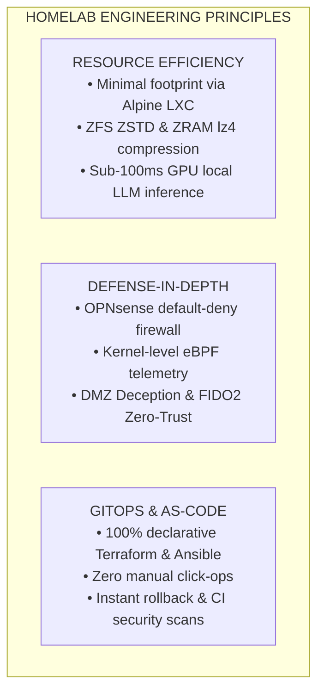

* **Resource Efficiency**: High-density virtualization utilizing minimal CPU/RAM footprints. Alpine Linux and Debian slim containers maximize performance on constrained silicon.
* **Defense-in-Depth**: Strict L2/L3 segmentation across 5 VLANs, CrowdSec real-time IP reputation bouncers, Suricata intrusion detection, and kernel-level Cilium Tetragon tracing.
* **Declarative GitOps**: Every container, VM, firewall rule, dashboard, and secret is managed declaratively through version-controlled Terraform, Ansible, and Docker manifests.
* **High Availability & Fault Tolerance**: Automated disaster recovery snapshots, virtual IP failover, cold-start runbooks, and UPS battery backup with controlled sequential shutdown.

---

## 2. End-to-End Architecture & Network Topology

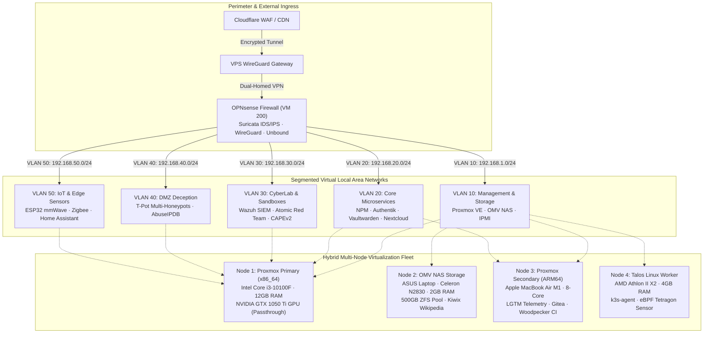

---


### 2.3 OPNsense Enterprise Architecture (5 Security Pillars)

The perimeter firewall **OPNsense (VM 200 · 192.168.1.134)** implements a unified enterprise defense suite running in the FreeBSD kernel (`pf`):

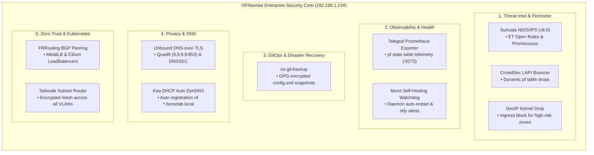

| Strategic Pillar | Technology & Module | Cluster Role & Functionality | Port / Protocol |
| :--- | :--- | :--- | :--- |
| **Threat Intel** | Suricata 8.0 + CrowdSec + GeoIP | Deep packet inspection, collaborative IP reputation, and GeoIP drop | WAN / VLAN Promisc |
| **Observability** | Telegraf + Monit Auto-Healing | Live Prometheus telemetry in Grafana and watchdog daemon recovery | `:9273 TCP` / 30s Poll |
| **GitOps & DR** | `os-git-backup` (GPG Encrypted) | Automatic Git versioning of `config.xml` on every administrative change | Git SSH Hook |
| **Privacy & DNS** | Unbound DoT + Kea DynDNS | Encrypted DNS over TLS (Port 853) to Quad9 and dynamic host naming | `:853 TLS` / `:53 UDP` |
| **Zero-Trust Mesh** | FRRouting BGP + Tailscale Subnet | Dynamic K8s MetalLB routing and remote mesh access without open ports | `:179 BGP` / Mesh |

### 2.4 OPNsense 802.1Q VLAN Micro-Segmentation & Security Policies

The perimeter firewall OPNsense (VM 200 · 192.168.1.134) enforces zero-trust 802.1Q micro-segmentation across 5 isolated VLANs using strict Packet Filter (`pf`) rules:


| VLAN ID | Network Segment | Subnet CIDR | Gateway | Attached Workloads | Security Policy |
| :--- | :--- | :--- | :--- | :--- | :--- |
| **VLAN 10** | Management & Storage Subnet | `192.168.1.0/24` | `192.168.1.1` | Proxmox Core (x86_64), OMV NAS, Managed Switches | Isolated from IoT & Guest subnets |
| **VLAN 20** | Core Microservices & Applications | `192.168.1.0/24` & `192.168.64.0/24` | `192.168.1.134` (OPNsense) | NPM Ingress, Vaultwarden, Immich, Nextcloud, Home Assistant, Gitea, Ollama (CT 110) | Strict forward authentication via Authentik (CT 108) |
| **VLAN 30** | Cyber Security & Sandboxes (CyberLab) | `192.168.30.0/24` | `192.168.1.134:8443` | Wazuh XDR SIEM (1514), Suricata IDS, Atomic Red Team, CAPEv2 / Cuckoo Sandbox (Win10 + INetSim) | Promiscuous SPAN mirror port, no outbound WAN access for sandboxes |
| **VLAN 40** | DMZ Deception & Honeypots | `192.168.40.0/24` | `192.168.1.134` (OPNsense) | T-Pot Cluster (Cowrie SSH, Dionaea, RDP honeypot, Honeytrap) | Completely isolated DMZ; automated AbuseIPDB firewall blocking |
| **VLAN 50** | IoT & Physical Edge Devices | `192.168.50.0/24` | `192.168.1.134 (OPNsense)` | ESP32 mmWave Radar, ESP32 Irrigation Relays, Zigbee Gateway | MQTT communication strictly restricted to Home Assistant (CT 106) |

---

## 3. Hybrid Multi-Cloud Architecture (Azure, GCP, AWS)

The on-premise cluster is extended into a true hybrid multi-cloud topology across **Microsoft Azure**, **Google Cloud Platform (GCP)**, and **Amazon Web Services (AWS)** using declarative, modular Infrastructure as Code (IaC) located in [`cloud/`](cloud/README.md) and [`terraform/`](terraform/):

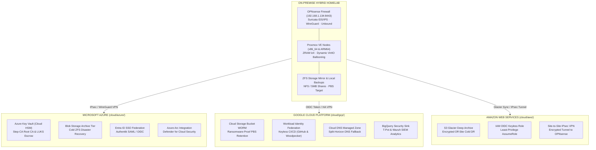

### Cloud Integration & Zero-Cost Tiering Matrix

| Cloud Provider | IaC Directory | Core Declarative Resources | Cost Optimization Tier |
| :--- | :--- | :--- | :--- |
| **Microsoft Azure** | [`cloud/azure/`](cloud/azure/) | `azurerm_key_vault` (Cloud HSM Root CA & LUKS), `azurerm_storage_blob` (Archive Tier DR), `azuread_application` (SSO Authentik), `azurerm_arc_machine` (Defender for Cloud) | Archive Tier + Free Tier HSM |
| **Google Cloud (GCP)** | [`cloud/gcp/`](cloud/gcp/) | `google_storage_bucket` (WORM Object Lock PBS/Restic), `google_iam_workload_identity_pool` (Keyless OIDC), `google_dns_managed_zone` (DNSSEC fallback), `google_logging_project_sink` (BigQuery SIEM) | Coldline / Archive + BigQuery Free |
| **Amazon Web Services** | [`cloud/aws/`](cloud/aws/) | `aws_s3_bucket` (Glacier Deep Archive 365d), `aws_iam_openid_connect_provider` (Keyless CI/CD AssumeRole), `aws_vpn_connection` (Site-to-Site IPsec OPNsense) | Glacier Deep Archive + Free STS |

---

## 4. Enterprise CI/CD Quality Matrix (9 Automated Workflows)

Infrastructure and application code are validated continuously across **9 GitHub Actions CI/CD workflows** running **36+ parallel automated quality gates**:

| # | Workflow File | Pipeline Name | Automated Quality Guarantees & Checks |
| :---: | :--- | :--- | :--- |
| 1 | [`.github/workflows/homelab-ci-cd-matrix.yml`](.github/workflows/homelab-ci-cd-matrix.yml) | **Enterprise Quality Matrix** | `terraform fmt` & `validate` (on-prem + multi-cloud), Checkov IaC Security, Trivy Misconfig, Docker Compose validation, ShellCheck, Secret Leakage, ELO Matrix (Python 3.9-3.13) |
| 2 | [`.github/workflows/ci.yml`](.github/workflows/ci.yml) | **Core CI Pipeline** | Gitleaks & TruffleHog (Secrets Scan), Ruff Lint, MyPy Static Types, Bandit SAST, Semgrep, Ansible Syntax Check on all playbooks, Kubeconform Kubernetes validation |
| 3 | [`.github/workflows/cd.yml`](.github/workflows/cd.yml) | **Continuous Deployment** | GitOps Reconciliation, Container Image Packaging on GHCR, Automated Rollback Verification |
| 4 | [`.github/workflows/container-scan.yml`](.github/workflows/container-scan.yml) | **Container Security** | Trivy Container Image Scanner & Dockle CIS Docker Benchmark compliance |
| 5 | [`.github/workflows/security-scan.yml`](.github/workflows/security-scan.yml) | **CodeQL SAST Analysis** | GitHub Advanced Security CodeQL engine for deep static vulnerability scanning (Python & TypeScript) |
| 6 | [`.github/workflows/security-scheduled.yml`](.github/workflows/security-scheduled.yml) | **Nightly Security Audit** | Scheduled nightly audit (02:00 UTC) for dependency CVEs (Pip-Audit, NPM Audit, Trivy FS) |
| 7 | [`.github/workflows/deploy-pages.yml`](.github/workflows/deploy-pages.yml) | **Deploy GitHub Pages** | Angular 19 production build & zero-downtime deployment to GitHub Pages |
| 8 | [`.github/workflows/desktop-macos-release.yml`](.github/workflows/desktop-macos-release.yml) | **macOS Native Release** | C# .NET 10 universal binary compilation, signing, and DMG artifact distribution for ELO desktop |
| 9 | [`.github/workflows/readme-sync.yml`](.github/workflows/readme-sync.yml) | **Documentation Sync** | Automated documentation sync and badge validation across all 5 supported languages |

---

## 9. Physical Hardware Fleet & Power Delivery

### Hardware Specifications Matrix

| Node Identifier | Form Factor / Chassis | CPU Architecture | Accelerator / GPU | RAM Allocation | Storage Configuration | Primary Purpose |
| :--- | :--- | :--- | :--- | :--- | :--- | :--- |
| **`pve` (Node 1)** | Custom ATX Tower | Intel Core i3-10100F (4C/8T @ 4.30 GHz) | NVIDIA GeForce GTX 1050 Ti (4GB VRAM) | 12 GB DDR4-2133 (12,288 MB) | 512 GB NVMe SSD (`local-lvm`) | Primary Hypervisor: Windows Server 2025 AD, OPNsense, Ollama GPU (CT 110), Immich AI |
| **`openmediavault` (Node 2)** | ASUS X451MA Laptop | Intel Celeron N2830 (2C/2T @ 2.16 GHz) | Intel HD Graphics | 2 GB DDR3L | 500 GB SATA HDD (ZFS Mirror) | Centralized NAS: NFS/SMB storage pool, Proxmox vzdump backup target, Kiwix offline Wikipedia |
| **`pve` (Node 3)** | Apple MacBook Air (2020) | Apple M1 (4P + 4E Cores @ 3.20 GHz) | 16-Core Apple Neural Engine / Metal | 8 GB Unified (4GB dedicated VM) | 256 GB Apple APFS NVMe | Secondary ARM64 Hypervisor (UTM): Grafana/Prometheus/Tempo telemetry, Gitea, Woodpecker CI |
| **`kubernetes` (Node 4)** | Custom ATX Chassis | AMD Athlon II X2 220 (2C/2T @ 2.80 GHz) | NVIDIA GeForce GTS 250 (1GB) | 4 GB DDR3-1333 | 80 GB HDD (NFS Root) | Immutable Talos Linux / k3s worker, batch cron workloads, eBPF security probing |

### Power Delivery & NUT Controlled Shutdown Sequence

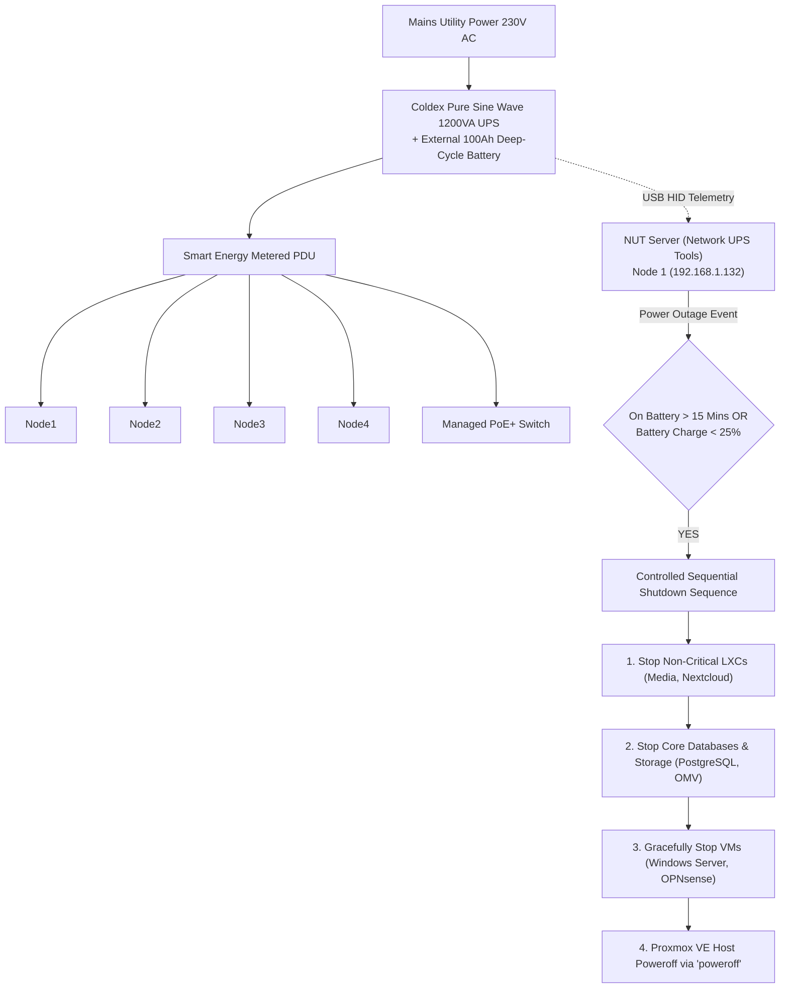

---

## 10. LXC Containers & VM Workloads Resource Matrix

### Granular LXC Container Roster (Node 1 — x86_64 Primary)

| VMID | Hostname | Base OS | vCPU | RAM Allocation | Storage Pool | Static IP | Subsystem Category | Primary Workload |
| :--- | :--- | :--- | :--- | :--- | :--- | :--- | :--- | :--- |
| **100** | `nginx` | Debian 13 | 2 | 112 MB | `local-lvm:4G` | `192.168.1.3` | Ingress | Nginx Proxy Manager + CrowdSec Bouncer |
| **101** | `pihole` | Debian 13 | 1 | 96 MB | `local-lvm:4G` | `192.168.1.4` | DNS | Primary Internal DNS Sinkhole & Resolver |
| **102** | `tailscale` | Debian 13 | 1 | 96 MB | `local-lvm:4G` | `192.168.1.5` | VPN | Mesh WireGuard Subnet Router |
| **103** | `immich` | Debian 13 | 4 | 896 MB | `local-lvm:32G` | `192.168.1.15` | Storage / AI | Photo Library + Machine Learning Face Recognition |
| **104** | `nextcloud` | Debian 13 | 2 | 512 MB | `local-lvm:20G` | `192.168.1.8` | Storage | Enterprise File Cloud & WebDAV Sync |
| **105** | `crowdsec` | Debian 13 | 1 | 128 MB | `local-lvm:4G` | `192.168.1.9` | Security | Cyber Threat Defense Agent & IPS |
| **106** | `homeassistant` | Debian 13 | 2 | 384 MB | `local-lvm:16G` | `192.168.1.10` | Automation | Smart Home Hub, Zigbee & ESP32 Telemetry |
| **107** | `n8n` | Debian 13 | 2 | 384 MB | `local-lvm:8G` | `192.168.1.13` | Automation | Workflow Orchestration & Incident Playbooks |
| **108** | `scrutiny` | Debian 13 | 1 | 128 MB | `local-lvm:4G` | `192.168.1.14` | Monitoring | Scrutiny S.M.A.R.T. Drive Health Agent |
| **109** | `media-suite` | Debian 13 | 2 | 512 MB | `local-lvm:16G` | `192.168.1.18` | Media | Jellyfin Media Processing Ingress |
| **110** | `ollama` | Debian 13 | 4 | 2,048 MB | `local-lvm:16G` | `192.168.1.110` | Local AI | Ollama GPU LLM Runtime (Qwen2.5-Coder & DeepSeek-R1) |
| **111** | `openwebui` | Debian 13 | 2 | 384 MB | `local-lvm:8G` | `192.168.1.111` | Local AI | Self-Hosted ChatGPT / Claude Interface |
| **112** | `whisper` | Debian 13 | 2 | 1,024 MB | `local-lvm:8G` | `192.168.1.112` | Local AI | Faster-Whisper Speech-to-Text CUDA API |
| **113** | `flowise` | Alpine 3.24 | 2 | 512 MB | `local-lvm:4G` | `192.168.1.113` | Local AI | Flowise Multi-Agent LLM Orchestrator |
| **114** | `paperless-ai` | Alpine 3.24 | 1 | 64 MB | `local-lvm:1G` | `192.168.1.114` | Local AI | Paperless-AI Automated OCR & DeepSeek Document Tagging |
| **115** | `codeserver` | Alpine 3.24 | 2 | 512 MB | `local-lvm:4G` | `192.168.1.115` | Dev | Code-Server Cloud IDE Web Workspace |
| **116** | `pbs` | Alpine 3.24 | 2 | 512 MB | `local-lvm:4G` | `192.168.1.116` | Storage / Backup | Proxmox Backup Server (PBS Enterprise Deduplication & Verification) |
| **117** | `pdm` | Alpine 3.24 | 2 | 512 MB | `local-lvm:4G` | `192.168.1.117` | Management | Proxmox Datacenter Manager (Multi-Cluster Fleet Orchestration) |

### Granular LXC Container Roster (Node 3 — Apple M1 ARM64 UTM)

| VMID | Hostname | Base OS | vCPU | RAM Allocation | Storage Pool | Static IP | Subsystem Category | Primary Workload |
| :--- | :--- | :--- | :--- | :--- | :--- | :--- | :--- | :--- |
| **100** | `it-tools` | Alpine 3.24 | 1 | 64 MB | `local:2G` | `192.168.64.100` | Utilities | IT-Tools Handy Web Tools for Developers |
| **101** | `actualbudget` | Alpine 3.24 | 1 | 64 MB | `local:2G` | `192.168.64.101` | Finance | Actual Budget Local-First Personal Finance |
| **102** | `trilium` | Alpine 3.24 | 1 | 96 MB | `local:2G` | `192.168.64.102` | Notes | Trilium Hierarchical Note Taking Knowledge Base |
| **103** | `changedetection` | Alpine 3.24 | 1 | 96 MB | `local:2G` | `192.168.64.103` | Automation | ChangeDetection Website Change Monitoring & Alerting |
| **104** | `scrutiny` | Debian 13 | 1 | 128 MB | `local:2G` | `192.168.64.104` | Monitoring | Scrutiny Hard Drive S.M.A.R.T. Health Telemetry |
| **105** | `uptimekuma` | Debian 13 | 1 | 128 MB | `local:2G` | `192.168.64.105` | Monitoring | Uptime Kuma Service Availability & SLA Monitoring |
| **106** | `vaultwarden` | Alpine 3.24 | 1 | 64 MB | `local:2G` | `192.168.64.106` | Security | Vaultwarden Lightweight Bitwarden Compatible Server |
| **107** | `monitoring` | Debian 13 | 2 | 384 MB | `local:2G` | `192.168.64.107` | Monitoring | Prometheus TSDB & Grafana Central Dashboards |
| **108** | `authelia` | Alpine 3.24 | 1 | 96 MB | `local:2G` | `192.168.64.108` | Security | Authelia 2FA & SSO Portal (FIDO2 / WebAuthn) |
| **109** | `gitea` | Debian 13 | 2 | 160 MB | `local:2G` | `192.168.64.109` | Dev | Gitea Git Forge & Code Review Platform |
| **110** | `woodpecker` | Alpine 3.24 | 2 | 192 MB | `local:2G` | `192.168.64.110` | CI/CD | Woodpecker CI Build Engine & Pipeline Runner |
| **111** | `gatus` | Alpine 3.24 | 1 | 64 MB | `local:2G` | `192.168.64.111` | Monitoring | Gatus Automated Health Dashboard in Go |
| **112** | `ntfy` | Alpine 3.24 | 1 | 64 MB | `local:2G` | `192.168.64.112` | Alerts | Ntfy.sh Private Push Notifications Hub |
| **113** | `linkding` | Alpine 3.24 | 1 | 96 MB | `local:2G` | `192.168.64.113` | Automation | Linkding Bookmark & Technical Search Manager |
| **114** | `stepca` | Alpine 3.24 | 1 | 96 MB | `local:2G` | `192.168.64.114` | Security | Step-CA Private Automated TLS PKI Authority |
| **115** | `tailscale-arm` | Alpine 3.24 | 1 | 96 MB | `local:2G` | `192.168.64.115` | VPN | Tailscale Subnet Router (ARM64 Subnet) |
| **116** | `beszel` | Alpine 3.24 | 1 | 64 MB | `local:2G` | `192.168.64.116` | Monitoring | Beszel High-Resolution System Telemetry (1s) |
| **117** | `pocketbase` | Alpine 3.24 | 1 | 64 MB | `local:2G` | `192.168.64.117` | Backend | PocketBase Realtime Backend in 1 File (SQLite) |
| **118** | `homepage` | Alpine 3.24 | 1 | 64 MB | `local:2G` | `192.168.64.118` | Dashboard | Homepage Unified Homelab Command Dashboard |
| **119** | `speedtest` | Alpine 3.24 | 1 | 96 MB | `local:2G` | `192.168.64.119` | Monitoring | Speedtest-Tracker Automated Bandwidth Telemetry |
| **120** | `memos` | Alpine 3.24 | 1 | 32 MB | `local:2G` | `192.168.64.120` | Notes | Memos Privacy-First Fast Knowledge Capture |
| **121** | `wallos` | Alpine 3.24 | 1 | 48 MB | `local:2G` | `192.168.64.121` | Finance | Wallos Recurring Expense & Subscription Tracker |
| **122** | `syncthing` | Alpine 3.24 | 1 | 64 MB | `local:2G` | `192.168.64.122` | Storage | SyncThing P2P Bidirectional File Synchronization |
| **123** | `microbin` | Alpine 3.24 | 1 | 16 MB | `local:2G` | `192.168.64.123` | Security | Microbin Encrypted Self-Destructing Rust Pastebin |
| **124** | `vikunja` | Alpine 3.24 | 1 | 64 MB | `local:2G` | `192.168.64.124` | Tasks | Vikunja Project & Task Management Platform |
| **125** | `blackbox` | Alpine 3.24 | 1 | 32 MB | `local:2G` | `192.168.64.125` | Monitoring | Prometheus Blackbox Exporter (ICMP / TLS Expiry) |
| **126** | `yourspotify` | Alpine 3.24 | 1 | 64 MB | `local:2G` | `192.168.64.126` | Analytics | YourSpotify Private Listening History & Insights |
| **127** | `webcheck` | Alpine 3.24 | 1 | 64 MB | `local:2G` | `192.168.64.127` | OSINT | Web-Check OSINT Security & Domain Scanner |
| **128** | `opengist` | Alpine 3.24 | 1 | 48 MB | `local:2G` | `192.168.64.128` | Dev | Opengist Self-Hosted Code Paste & Snippets |
| **129** | `flatnotes` | Alpine 3.24 | 1 | 32 MB | `local:2G` | `192.168.64.129` | Notes | Flatnotes Flat-File Markdown Note Storage |
| **130** | `bark` | Alpine 3.24 | 1 | 32 MB | `local:2G` | `192.168.64.130` | Alerts | Bark Apple Push Notification Relay Hub |
| **131** | `shiori` | Alpine 3.24 | 1 | 32 MB | `local:2G` | `192.168.64.131` | Storage | Shiori Simple Clean Web Page Archiver |
| **132** | `whoogle` | Alpine 3.24 | 1 | 64 MB | `local:2G` | `192.168.64.132` | Privacy | Whoogle Private Anonymized Google Proxy |
| **133** | `flame` | Alpine 3.24 | 1 | 32 MB | `local:2G` | `192.168.64.133` | Dashboard | Flame Minimalist Fast Startpage |
| **134** | `dashy` | Alpine 3.24 | 1 | 64 MB | `local:2G` | `192.168.64.134` | Dashboard | Dashy Highly Customizable Homelab Dashboard |
| **135** | `shlink` | Alpine 3.24 | 1 | 64 MB | `local:2G` | `192.168.64.135` | Productivity | Shlink Self-Hosted URL Shortener with Geolocation Analytics |
| **136** | `pastefy` | Alpine 3.24 | 1 | 48 MB | `local:2G` | `192.168.64.136` | Productivity | Pastefy Secure & Beautiful Open-Source Pastebin |
| **137** | `pingvin` | Alpine 3.24 | 1 | 64 MB | `local:2G` | `192.168.64.137` | Storage | Pingvin Share Privacy-Focused File Sharing Platform |
| **138** | `rssbridge` | Alpine 3.24 | 1 | 48 MB | `local:2G` | `192.168.64.138` | Feed | RSS-Bridge Feed Generator for Sites Without Native Feeds |
| **139** | `playwright` | Alpine 3.24 | 2 | 192 MB | `local:2G` | `192.168.64.139` | Probe | Playwright Headless Browser Worker for Dynamic Web Checks |
| **140** | `uptimechk` | Alpine 3.24 | 1 | 64 MB | `local:2G` | `192.168.64.140` | Monitoring | Distributed Secondary Uptime Verification Probe |
| **141** | `dnsbench` | Alpine 3.24 | 1 | 48 MB | `local:2G` | `192.168.64.141` | Network | DNS Benchmark & Latency Analytics Collector |
| **142** | `excalidraw` | Alpine 3.24 | 1 | 64 MB | `local:2G` | `192.168.64.142` | Productivity | Excalidraw Infinite Canvas Collaborative Virtual Whiteboard |
| **143** | `snagim` | Alpine 3.24 | 1 | 48 MB | `local:2G` | `192.168.64.143` | Media | Snagim Fast Screenshot & Image Hosting Server |
| **144** | `whoogletor` | Alpine 3.24 | 1 | 96 MB | `local:2G` | `192.168.64.144` | Privacy | Whoogle Search Routed via Encrypted Tor Circuit |
| **145** | `heimdall` | Alpine 3.24 | 1 | 64 MB | `local:2G` | `192.168.64.145` | Dashboard | Heimdall Application Dashboard with Live Service Indicators |
| **146** | `pbs` | Alpine 3.24 | 2 | 512 MB | `local:2G` | `192.168.64.146` | Storage / Backup | Proxmox Backup Server (PBS Deduplication & Verification) |
| **147** | `pdm` | Alpine 3.24 | 2 | 512 MB | `local:2G` | `192.168.64.147` | Management | Proxmox Datacenter Manager (Multi-Cluster Management) |
| **148** | `renovate` | Alpine 3.24 | 2 | 256 MB | `local:1G` | `192.168.64.148` | GitOps | RenovateBot Automated Dependency PR Engine |
| **149** | `transmission` | Alpine 3.24 | 1 | 256 MB | `local:1G` | `192.168.64.149` | Media | Isolated BitTorrent Download Gateway |
| **150** | `kavita` | Alpine 3.24 | 1 | 256 MB | `local:1G` | `192.168.64.150` | Media | E-book, Manga & Comic Web Reader |
| **151** | `stirling` | Alpine 3.24 | 1 | 256 MB | `local:1G` | `192.168.64.151` | Productivity | Stirling-PDF Offline PDF Toolset |
| **152** | `audiobookshelf` | Alpine 3.24 | 1 | 256 MB | `local:1G` | `192.168.64.152` | Media | Audiobook & Podcast Streaming Server |
| **153** | `tubearchivist` | Alpine 3.24 | 1 | 256 MB | `local:1G` | `192.168.64.153` | Media | Private YouTube Channel Archiver |
| **154** | `calibreweb` | Alpine 3.24 | 1 | 256 MB | `local:1G` | `192.168.64.154` | Media | Calibre-Web Digital Book Manager |
| **155** | `cyberchef` | Alpine 3.24 | 1 | 128 MB | `local:1G` | `192.168.64.155` | Security | CyberChef Swiss Army Knife |
| **156** | `drawio` | Alpine 3.24 | 1 | 128 MB | `local:1G` | `192.168.64.156` | Architecture | Draw.io Offline Diagramming Suite |
| **157** | `romm` | Alpine 3.24 | 1 | 256 MB | `local:1G` | `192.168.64.157` | Gaming | RomM Retro Games Collection Manager |
| **158** | `emulatorjs` | Alpine 3.24 | 1 | 256 MB | `local:1G` | `192.168.64.158` | Gaming | EmulatorJS WebAssembly Retro Gaming |
| **159** | `vscode-server` | Alpine 3.24 | 2 | 512 MB | `local:1G` | `192.168.64.159` | Dev | VS Code Server Cloud IDE ARM64 |
| **160** | `paperless` | Alpine 3.24 | 2 | 512 MB | `local:1G` | `192.168.64.160` | DMS | Paperless-ngx Document Management |
| **161** | `minio` | Alpine 3.24 | 1 | 256 MB | `local:1G` | `192.168.64.161` | Storage | MinIO S3 Object Storage Server |
| **162** | `meilisearch` | Alpine 3.24 | 1 | 256 MB | `local:1G` | `192.168.64.162` | Search | Typo-Tolerant Full-Text Search Engine |
| **163** | `vector` | Alpine 3.24 | 1 | 128 MB | `local:1G` | `192.168.64.163` | Telemetry | Vector High-Performance Log Aggregator |
| **164** | `searxng` | Alpine 3.24 | 1 | 128 MB | `local:1G` | `192.168.64.164` | Privacy | SearXNG Privacy Metasearch Engine |
| **165** | `netalertx` | Alpine 3.24 | 1 | 128 MB | `local:1G` | `192.168.64.165` | Security | NetAlertX Network Intruder Detector |
| **166** | `rustdesk` | Alpine 3.24 | 1 | 128 MB | `local:1G` | `192.168.64.167` | Remote | RustDesk Self-Hosted Remote Desktop Relay |
| **167** | `kopia` | Alpine 3.24 | 1 | 256 MB | `local:1G` | `192.168.64.167` | Backup | Fast Encrypted Snapshot Backup Server |
| **168** | `wgeasy` | Alpine 3.24 | 1 | 128 MB | `local:1G` | `192.168.64.168` | VPN | WireGuard-Easy Management Portal |
| **169** | `pgadmin` | Alpine 3.24 | 1 | 256 MB | `local:1G` | `192.168.64.169` | Database | pgAdmin 4 PostgreSQL Web Administration |
| **170** | `dozzle` | Alpine 3.24 | 1 | 64 MB | `local:1G` | `192.168.64.170` | Monitoring | Dozzle Live Container Log Viewer |
| **171** | `kiwix` | Alpine 3.24 | 1 | 128 MB | `local:1G` | `192.168.64.171` | Knowledge | Kiwix Offline Wikipedia & Docs Server |
| **172** | `hedgedoc` | Alpine 3.24 | 1 | 256 MB | `local:1G` | `192.168.64.172` | Notes | HedgeDoc Collaborative Markdown Notes |
| **173** | `glances` | Alpine 3.24 | 1 | 64 MB | `local:1G` | `192.168.64.173` | Monitoring | Glances System Telemetry & Process Monitor |
| **174** | `dufs` | Alpine 3.24 | 1 | 64 MB | `local:1G` | `192.168.64.174` | Storage | Dufs Lightweight Static File Server |
| **175** | `gotify` | Alpine 3.24 | 1 | 64 MB | `local:1G` | `192.168.64.175` | Alerts | Gotify Self-Hosted Push Notification Server |
| **176** | `miniflux` | Alpine 3.24 | 1 | 64 MB | `local:1G` | `192.168.64.176` | Feed | Miniflux Minimalist RSS Feed Reader |
| **177** | `grocy` | Alpine 3.24 | 1 | 128 MB | `local:1G` | `192.168.64.177` | ERP | Grocy Self-Hosted ERP & Household Tracker |
| **178** | `chrony` | Alpine 3.24 | 1 | 32 MB | `local:1G` | `192.168.64.178` | Network | Chrony Local Stratum-1 Precision NTP Server |
| **179** | `linkwarden` | Alpine 3.24 | 1 | 128 MB | `local:1G` | `192.168.64.179` | Bookmarks | Linkwarden Webpage Archiver & Bookmark Hub |
| **180** | `snmp-collector` | Alpine 3.24 | 1 | 64 MB | `local:1G` | `192.168.64.180` | Monitoring | SNMP Metric Collector & Network Prober |
| **181** | `searxng-redis` | Alpine 3.24 | 1 | 32 MB | `local:1G` | `192.168.64.181` | Cache | Redis In-Memory Cache for SearXNG |

### QEMU / KVM Virtual Machines & VirtIO Memory Ballooning

| VMID | VM Name | Operating System | vCPU | RAM Max | Balloon Min | Passthrough / Hardware | Primary Role |
| :--- | :--- | :--- | :--- | :--- | :--- | :--- | :--- |
| **200** | `opnsense` | Hardened FreeBSD 14 | 2 Cores | 2,048 MB | **1,024 MB** | VirtIO Net Multi-VLAN | Perimeter Firewall, Suricata IDS/IPS, WireGuard Key Rotator |
| **201** | `windows` | Windows Server 2025 | 2 Cores | 7,168 MB (7 GB) | **4,096 MB (4 GB)** | **GTX 1050 Ti PCIe Passthrough** | Active Directory DS, GPO, DNS, Sysmon Forwarder (Ballooning: 4-7 GB) |
| **202** | `rhel` | RHEL 9.8 Enterprise | 2 Cores | 2,048 MB (2 GB) | **1,024 MB (1 GB)** | VirtIO SCSI Single IOThread | SELinux Enforcing, Podman Rootless, Enterprise Workload (1-2 GB) |
| **203** | `freebsd` | FreeBSD 15.1-RELEASE | 2 Cores | 1,024 MB (1 GB) | **512 MB** | VirtIO SCSI Single | Native OpenZFS Storage Pool, BSD Jails & Network Lab (512MB-1GB) |
| **204** | `openbsd` | OpenBSD 7.9 Bastion | 2 Cores | 1,024 MB (1 GB) | **512 MB** | VirtIO SCSI Single | Hardened Jump Host, Packet Filter PF, unveil/pledge (512MB-1GB) |
| **205** | `talos` | Talos Linux 1.7 | 2 Cores | 2,048 MB (2 GB) | **1,024 MB (1 GB)** | VirtIO Single + Cilium CNI | Minimalist Immutable OS, gRPC API, Kubernetes Worker Node (1-2 GB) |
| **206** | `macOS` | macOS Monterey 12.7 | 4 Cores | 7,168 MB (7 GB) | **2,048 MB (2 GB)** | [OpenCore EFI](mac/EFI) + AppleSMC | OpenCore KVM Hackintosh, Xcode CI/CD Build Runner, Apple Ecosystem Testing |
| **207** | `openindiana` | OpenIndiana Hipster | 2 Cores | 2,048 MB (2 GB) | **1,024 MB (1 GB)** | VirtIO SCSI Single + Solaris | Reference Enterprise ZFS, Solaris Zones, Crossbow VNICs, DTrace |

> **Architecture Rebalancing: Full Non-AI Migration to ARM64**: All non-AI container workloads from CT 112 onwards (including Paperless-ngx, MinIO S3, Meilisearch, Vector, SearXNG, NetAlertX, RustDesk, Kopia, WG-Easy, Code-Server, pgAdmin4, Dozzle, Kiwix, Transmission, Kavita, Stirling-PDF, Audiobookshelf, TubeArchivist, Calibre-Web, CyberChef, Draw.io, RomM, EmulatorJS, and VS Code Server ARM64) have been relocated to Node 3 (Apple Silicon M1 ARM64 via UTM), backed by ZRAM lz4 high-speed memory compression. Node 1 (x86_64) is now strictly dedicated to the CUDA GPU-accelerated AI cluster (Ollama LLM, Open-WebUI, Faster-Whisper STT, Flowise, Paperless-AI), core ingress, and enterprise KVM virtual machines (Windows Server 2025, macOS Monterey, OpenIndiana Hipster, RHEL, BSD).

### Host Memory Tuning: ZRAM / ZSWAP Fast RAM Compression

* **Compression Algorithm**: Ultra-fast `lz4` with < 1% CPU overhead.
* **Node 1 (x86_64) ZRAM**: `/dev/zram0` (6.0 GB RAM compressed swap, priority 100, `vm.swappiness = 60`, `vm.vfs_cache_pressure = 50`).
* **Node 3 (ARM64) ZRAM**: `/dev/zram0` (1.9 GB RAM compressed swap, priority 100, `vm.swappiness = 20`, `vm.vfs_cache_pressure = 50`).
* **NVMe Lifespan Protection**: High-frequency memory pages are compressed directly in RAM before touching NVMe storage, eliminating SSD wear and IO blocking.

### Zero-Trust Security & Enterprise Test Environment

1. **HashiCorp Vault / OpenBao**:
 - Centralized secret management with zero `.env` files stored on local disks.
 - Automated dynamic token generation and ephemeral credential injection for Terraform, Ansible, and Woodpecker CI.
2. **WireGuard Kernel Module on OPNsense with Automated Key Rotation**:
 - Zero-downtime periodic rotation of Curve25519 cryptographic keypairs and pre-shared keys (PSK) via Ansible and cron.
3. **Mutual TLS (mTLS) Inter-Service Communication**:
 - Mandatory cryptographic client-certificate verification between ingress gateways and critical backend services in VLAN 20.
4. **Canary Honeytokens & Directory Decoys**:
 - Deceptive decoy files (`passwords.csv`, `aws_keys.env`, `id_rsa_backup`) placed in DMZ containers and SMB shares that trigger instant Telegram/ntfy webhooks upon access.
5. **RenovateBot On-Premise GitOps Automation**:
 - Continuous dependency scanning engine inspecting internal Gitea repositories and filing automated Pull Requests for new Docker images and Terraform modules.

---

## 9. Storage Architecture & ZFS Pool Optimization

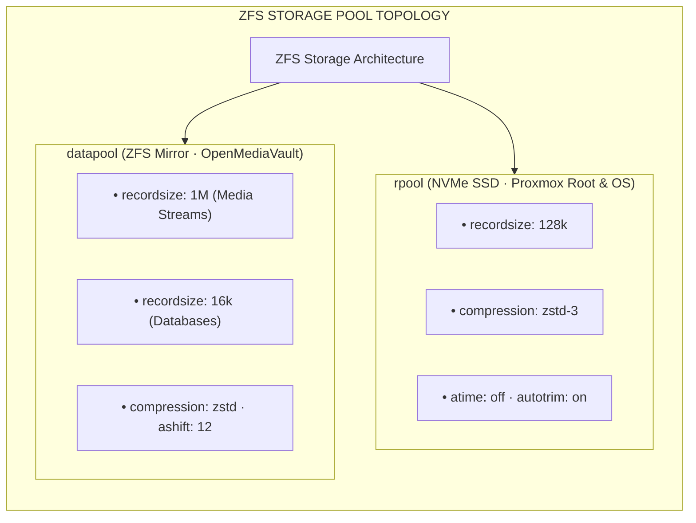

### Granular ZFS Filesystem Tuning Rules

* **PostgreSQL / MySQL / SQLite Data**: `recordsize=16k` matching DB page sizes to eliminate write amplification.
* **Large Media Streams (Jellyfin / Kiwix)**: `recordsize=1M` for sequential streaming throughput.
* **Compressratio**: `compression=zstd` delivering ~1.85x space efficiency with zero noticeable CPU latency.
* **ZFS ARC Ceiling**: Capped dynamically via `/etc/modprobe.d/zfs.conf` (`zfs_arc_max=2147483648` — 2GB) to protect VM allocations.

---

## 10. Network Segmentation & Inter-VLAN Firewall Matrix

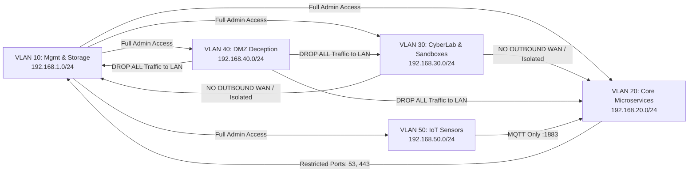

### Inter-VLAN Firewall Policy Table (Default-Deny)

| Source VLAN | Destination VLAN | Allowed Destination Ports | Protocol | Firewall Action |
| :--- | :--- | :--- | :--- | :--- |
| **VLAN 10 (Management)** | ALL VLANs | ANY | ANY | **PASS (Stateful)** |
| **VLAN 20 (Core Services)** | VLAN 10 (Storage) | `2049` (NFS), `445` (SMB), `53` (DNS) | TCP/UDP | **PASS** |
| **VLAN 20 (Core Services)** | VLAN 50 (IoT) | `1883` (MQTT Broker) | TCP | **PASS** |
| **VLAN 30 (CyberLab)** | ANY Internal VLAN | NONE | ANY | **DROP & LOG** |
| **VLAN 30 (CyberLab)** | WAN | HTTP `:8080` via INetSim Fake Gateway | TCP | **PASS (Simulated)** |
| **VLAN 40 (DMZ Honeypots)** | ALL Internal VLANs | NONE | ANY | **DROP & ALARM** |
| **VLAN 50 (IoT)** | ANY Internal VLAN | `1883` (Home Assistant MQTT Only) | TCP | **PASS** |
| **VLAN 50 (IoT)** | WAN | NTP `:123` | UDP | **PASS** |

---

## 9. Ingress Traffic, Zero-Trust Authentication & Split-Horizon DNS

### Ingress Forward-Authentication Sequence

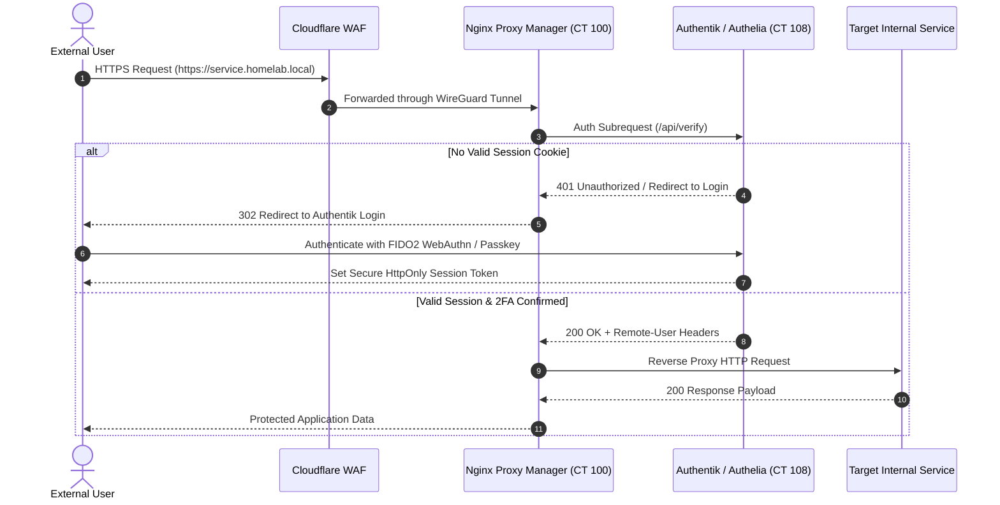

### Split-Horizon DNS Schema

* **External Resolution**: Public domain records hosted on Cloudflare DNS point exclusively to protected VPS reverse proxy endpoints.
* **Internal Resolution**: OPNsense Unbound DNS and AdGuard Home sinkholes resolve `*.homelab.local` directly to internal RFC1918 IPs (`192.168.1.3`), bypassing external bandwidth entirely.

---

## 10. Infrastructure as Code (Terraform & Ansible)

All infrastructure is provisioned declaratively using Terraform with the `bpg/proxmox` provider.

```
terraform/
├── main.tf # Root composition
├── providers.tf # Proxmox VE provider configuration
├── variables.tf # Cluster endpoints & credentials
├── terraform.tfvars.example # Template variables
├── lxc_services.tf # Declarative LXC container definitions
├── vm_workloads.tf # Declarative VM definitions
└── modules/
 ├── proxmox_lxc/ # Reusable LXC container module
 └── proxmox_vm/ # Reusable QEMU VM module
```

### Quick Bootstrap Runbook

```bash
# 1. Clone repository
git clone https://github.com/stefanutc1/homelab.git
cd homelab/terraform/proxmox

# 2. Configure variables
cp terraform.tfvars.example terraform.tfvars
nano terraform.tfvars

# 3. Initialize & Deploy Cluster
terraform init
terraform plan -out=tfplan.binary
terraform apply tfplan.binary
```

---

## 9. Kubernetes & GitOps Deployment Lifecycle

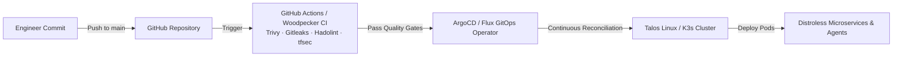

* **Talos Linux OS (`kubernetes/talos/cluster.yaml`)**: Immutable, zero-SSH operating system managed strictly via gRPC APIs.
* **Lightweight K3s**: Flannel CNI replaced with Cilium eBPF for lightning-fast container routing and kernel-level network policies.

---

## 10. LGTM Observability Stack & Telemetry Pipeline

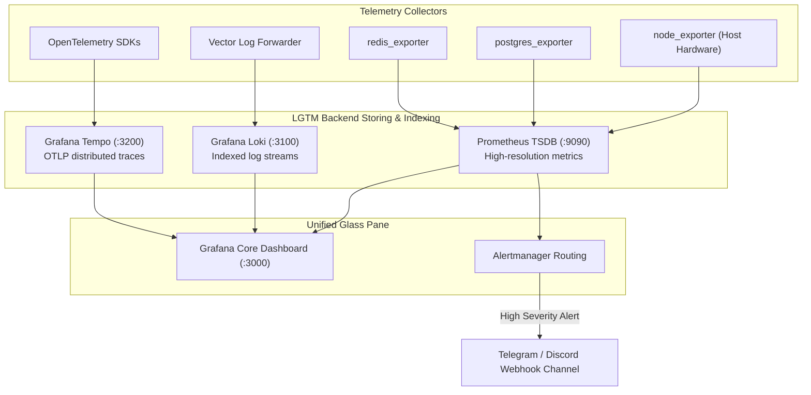

---

## 11. 3-2-1 Backup Strategy, Sanoid & Disaster Recovery

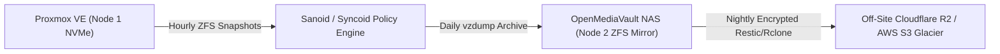

* **3 Copies**: Primary NVMe SSD, Secondary OMV NAS ZFS Mirror, Remote Cloudflare R2 Bucket.
* **2 Formats**: Live ZFS Snapshots + compressed zstd `.vma.zst` archives.
* **1 Off-Site**: Encrypted, immutable cloud backup with 90-day object lock.
* **Automated DR Verification (`scripts/disaster-recovery/dr_vzdump_restore.sh`)**: Weekly CI script restores the newest snapshot into an isolated test VLAN 99, tests DB consistency and HTTP 200 endpoints, and reports results to Telegram.

---

## 12. Cybersecurity Test Environment, SOC & eBPF Security

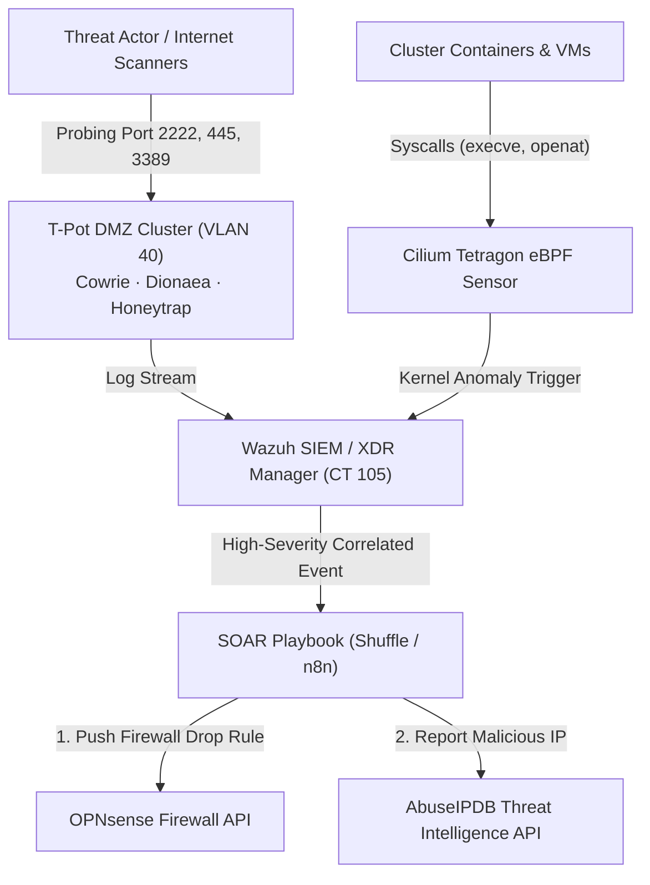

* **Adversary Simulation**: Automated Atomic Red Team runner (`cyber/adversary-simulation/atomic-red-team/run_art_tests.sh`) testing MITRE ATT&CK techniques (T1059, T1003, T1078, T1053, T1021).
* **Malware Triage**: CAPEv2 Sandbox running Windows 10 with INetSim network simulation and memory dump triage via Volatility 3.

---

## 13. Local GPU AI LLM Runtime (Ollama CT 110)

Ollama is running inside container **`CT 110`** on Proxmox Node 1 (`192.168.1.110:11434`), utilizing direct NVIDIA GeForce GTX 1050 Ti GPU acceleration:

```bash
# Verify active models inside CT 110
pct exec 110 -- ollama list

# Output:
# NAME ID SIZE MODIFIED 
# llama3.2:1b baf6a787fdff 1.3 GB Active 
# qwen2.5-coder:1.5b d7372fd82851 986 MB Active 

# Execute instant test query via REST API:
curl -s http://192.168.1.110:11434/api/generate -d '{"model": "qwen2.5-coder:1.5b",
 "prompt": "Write a Python script to check Proxmox container status",
 "stream": false
}'
```

---

## 14. Chaos Engineering & Resiliency Validation

The automated Chaos Runner (`scripts/chaos/chaos_runner.sh`) validates system alerting and self-healing under extreme conditions:

```bash
# Inject 100% CPU stress across all cores for 60 seconds
./scripts/chaos/chaos_runner.sh cpu-stress 60

# Inject 150ms network latency to test distributed tracing
./scripts/chaos/chaos_runner.sh network-latency 30 eth0 150ms

# Inject 15% artificial packet loss to verify TCP retry logic
./scripts/chaos/chaos_runner.sh packet-loss 30 eth0 15%
```

---

## 15. Environmental Telemetry & Closed-Loop Fan Control

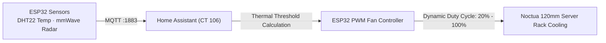

* **Rack Tamper Monitoring**: Optical microswitch on server chassis logs physical cabinet door state; triggers snapshot on security cameras if opened unexpectedly.

---

## 16. Security Hardening & Cryptographic Integrity

* **Linux Kernel Hardening (`/etc/sysctl.d/99-proxmox-hardening.conf`)**:
 * Complete ASLR randomization (`kernel.randomize_va_space=2`).
 * Strict memory restriction (`kernel.kptr_restrict=2`, `kernel.dmesg_restrict=1`).
 * SYN flood cookies enabled (`net.ipv4.tcp_syncookies=1`).
 * Source routing and ICMP redirects disabled.
* **SSH Hardening**: Password authentication disabled across all nodes; SSH restricted to Ed25519 cryptographic keys only (`ssh-audit` rated 100/100).
* **Storage Encryption**: LUKS encrypted data volumes unlocked automatically via Clevis/Tang Network-Bound Disk Encryption (NBDE).

---

## 17. Static IP & Ports Directory

| IP Address | Hostname / Resource | Exposed Ports | Subsystem Role |
| :--- | :--- | :--- | :--- |
| `192.168.1.1` | Gateway Router | `80`, `443` | Default LAN Gateway |
| `192.168.1.3` | `nginx` (CT 100) | `80`, `443`, `81` | Nginx Proxy Manager & Ingress |
| `192.168.1.4` | `pihole` (CT 101) | `53` (TCP/UDP), `80` | Internal DNS Resolver |
| `192.168.1.9` | `homeassistant` (CT 106) | `8123`, `1883` | Home Automation & MQTT Broker |
| `192.168.1.110` | `ollama` (CT 110) | `11434` | Local GPU LLM Runtime |
| `192.168.1.134 (OPNsense)` | `pve` (Node 1 Host) | `8006`, `22` | Proxmox VE Web Management |
| `192.168.20.201` | `win-server-2025` (VM 201) | `53`, `88`, `389`, `445`, `3389` | Active Directory Domain Services |
| `192.168.64.14` | `pve` (Node 3 Host) | `8006`, `22` | ARM64 Hypervisor Management |
| `192.168.64.118` | `tempo` (CT 118) | `3200`, `4317`, `4318` | Distributed Tracing Backend |

---

## 18. Cold-Start Runbook & Operational Cheat Sheet

### Cold-Start Sequential Boot Sequence

1. **Phase 1 (Power & Networking)**: Turn on Coldex UPS $\to$ Power on Managed Switch $\to$ Verify OPNsense Firewall (VM 200) WAN connectivity.
2. **Phase 2 (Storage & DNS)**: Power on OMV NAS (Node 2) $\to$ Wait for NFS mounts $\to$ Start Pi-hole / DNS (CT 101).
3. **Phase 3 (Core Hypervisors)**: Power on Node 1 (x86_64) & Node 3 (ARM64) $\to$ Verify ZFS pool status (`zpool status`).
4. **Phase 4 (Security & Authentication)**: Start Authentik (CT 108) $\to$ Start Wazuh SIEM (CT 105) $\to$ Start Nginx Proxy Manager (CT 100).
5. **Phase 5 (Workloads & AI)**: Start Ollama (CT 110), Home Assistant (CT 106), and user microservices.

### Proxmox Daily CLI Commands

```bash
# List all active containers and VMs
pct list && qm list

# Check ZFS storage pools health
zpool status -v

# Inspect Ollama LLM logs inside CT 110
pct exec 110 -- journalctl -u ollama -f -n 50

# Perform immediate vzdump backup of critical container
vzdump 110 --storage local-lvm --mode snapshot --compress zstd
```

---

## 19. Troubleshooting FAQ

<details>
<summary><b>Q: How do I resolve temporary DNS resolution errors inside LXC containers?</b></summary>
Ensure the container nameserver is set to the local DNS resolver (`192.168.1.1` or `192.168.1.4`) via <code>pct set &lt;VMID&gt; -nameserver 192.168.1.1</code> and verify <code>/etc/resolv.conf</code> contains valid nameservers.
</details>

<details>
<summary><b>Q: How do I verify GPU Passthrough for Ollama inside CT 110?</b></summary>
Run <code>pct exec 110 -- /usr/local/bin/ollama run qwen2.5-coder:1.5b "test"</code> and check <code>nvidia-smi</code> on the Proxmox host to observe GPU compute utilization.
</details>

<details>
<summary><b>Q: How do I trigger an emergency snapshot restore in an isolated VLAN?</b></summary>
Execute the automated Disaster Recovery script: <code>./scripts/disaster-recovery/dr_vzdump_restore.sh proxmox /mnt/pve/backup-nfs/dump</code>.
</details>

---

## 20. Monorepo Layout & Engineering Portfolio

```
.
├── .github/workflows/ # CI/CD pipelines (Trivy, Gitleaks, Shellcheck, CD)
├── cyber/ # SOC, SIEM, Honeypots (T-Pot), eBPF & Sandbox
├── elo/ # Autonomous AI Agent Control Plane & Tools
├── hypervisors/ # Proxmox sysctl hardening & kernel profiles
├── kubernetes/ # Talos Linux & K3s manifests
├── mac/ # OpenCore EFI bootloader for macOS Monterey KVM (/mac/EFI)
├── scripts/ # Disaster Recovery & Chaos Engineering runners
├── services/ # Docker Compose & container configurations
├── terraform/ # Declarative Proxmox LXC & VM IaC modules
├── vms/ # NixOS & Windows Server configurations
└── web/ # Angular 20 Standalone Interactive Web App
```

This repository serves as a **production-grade engineering portfolio and personal infrastructure lab**, designed and maintained by [@stefanutc1](https://github.com/stefanutc1) to showcase hybrid cloud architecture, SecOps, GitOps, and resilient self-hosted platforms.

---

<div align="center">

**Author**: [@stefanutc1](https://github.com/stefanutc1) 
Released under the **MIT License**.

</div>

---

## Photo Gallery: Management Panels, Services & Loki Telemetry

All hardware nodes, virtual machines, and containers execute live on physical infrastructure. Below are direct interface captures of core control planes, running microservices, and centralized Grafana Loki log aggregation streams.

### Core Management Panels
| Grafana: Homelab Nodes (12GB x64 & ARM64) | Grafana: OPNsense Perimeter Defense |
| :---: | :---: |
|  |  |

| Proxmox VE 9.2 x86_64 (12GB RAM · 192.168.1.132:8006) | Proxmox VE 9.2 ARM64 Apple M1 (192.168.64.14:8006) |
| :---: | :---: |
|  |  |

| Pi-hole DNS Sinkhole & FTL (192.168.1.4:8080) | Home Assistant Automation Hub (192.168.1.10:8123) |
| :---: | :---: |
|  |  |

| OPNsense Suricata 8 NIDS/IPS (192.168.1.134:8443) | OPNsense: VLAN Filtering Policies (pf rules) |
| :---: | :---: |
|  |  |

| OPNsense: WireGuard Kernel VPN Mesh | OPNsense: Unbound DNS-over-TLS (DoT) |
| :---: | :---: |
|  |  |

---

### Core & Networking
| Nginx Proxy Manager | Pi-hole DNS Sinkhole |
| :---: | :---: |
|  |  |

| Tailscale Mesh | WireGuard Easy |
| :---: | :---: |
|  |  |

| OPNsense Core Gateway | OPNsense Unbound DoT |
| :---: | :---: |
|  |  |

| OPNsense FRR Dynamic Routing | Caddy Ingress mTLS |
| :---: | :---: |
|  |  |

---

### Storage & Backup
| Nextcloud Hub | Paperless-ngx Document OCR |
| :---: | :---: |
|  |  |

| MinIO S3 Object Storage | Kopia Snapshot Backup |
| :---: | :---: |
|  |  |

| Syncthing File Sync | Proxmox Backup Server (PBS) |
| :---: | :---: |
|  |  |

---

### Automation & AI
| Ollama LLM Runtime | Open-WebUI AI Interface |
| :---: | :---: |
|  |  |

| Faster-Whisper Voice Transcription | Flowise LLM Orchestrator |
| :---: | :---: |
|  |  |

| Home Assistant Automation Hub | RenovateBot GitOps Engine |
| :---: | :---: |
|  |  |

---

### Observability & Monitoring
| Grafana Enterprise Dashboard | Prometheus Metrics Engine |
| :---: | :---: |
|  |  |

| Loki Distributed Log Aggregator | Uptime Kuma SLA Monitor |
| :---: | :---: |
|  |  |

| Gatus Status Healthchecker | Beszel Lightweight Metrics |
| :---: | :---: |
|  |  |

| Blackbox Network Exporter | Vector High-Throughput Aggregator |
| :---: | :---: |
|  |  |

| Dozzle Real-Time Log Viewer |  |
| :---: | :---: |
|  |  |

---

### Security & Cyber Lab
| OPNsense Suricata 8 NIDS/IPS | OPNsense CrowdSec LAPI Bouncer |
| :---: | :---: |
|  |  |

| Wazuh SIEM / XDR Manager | T-Pot Honeypot Multi-Sensor |
| :---: | :---: |
|  |  |

| CyberChef Cryptographic Utility | DFIR Dynamic Malware Sandbox |
| :---: | :---: |
|  |  |

| HashiCorp Vault Secrets Engine | Deception Canary Tokens & Decoys |
| :---: | :---: |
|  |  |

---

### Media & Utilities
| Stirling-PDF Manipulation Suite | Kavita Digital Library |
| :---: | :---: |
|  |  |

| Audiobookshelf Streaming Server | TubeArchivist YouTube Archive |
| :---: | :---: |
|  |  |

| Transmission BitTorrent Client | Calibre-Web E-Book Manager |
| :---: | :---: |
|  |  |

| RomM Retro Game Rom Manager | EmulatorJS Browser Arcade |
| :---: | :---: |
|  |  |

| Code-Server VS Code Cloud IDE | Draw.io Architecture Designer |
| :---: | :---: |
|  |  |

| IT-Tools Network & Developer Toolkit | Actual Budget Local Accounting |
| :---: | :---: |
|  |  |

| Trillium Structured Knowledge Base | ChangeDetection Web Monitor |
| :---: | :---: |
|  |  |

| MicroBin Encrypted Pastebin | Vikunja Task Management |
| :---: | :---: |
|  |  |

| Memos Lightweight Note Stream | Wallos Subscription Tracker |
| :---: | :---: |
|  |  |

| Speedtest Tracker Continuous Bench | Homepage Dashboard |
| :---: | :---: |
|  |  |

| Flame Application Launcher |  |
| :---: | :---: |
|  |  |

---

### Specialized Operating Systems & Telemetry (Loki Telemetry & Runtime Logs)
| Windows Server 2025 (VM 201 · Loki Telemetry) | Red Hat Enterprise Linux 9.8 (VM 202 · Loki Telemetry) |
| :---: | :---: |
|  |  |

| FreeBSD 15.1-RELEASE (VM 203 · Loki Telemetry) | OpenBSD 7.9 Bastion (VM 204 · Loki Telemetry) |
| :---: | :---: |
|  |  |

| Talos Linux 1.7 (VM 205 · Loki Telemetry) | OpenIndiana Hipster (VM 207 · illumos ZFS) |
| :---: | :---: |
|  | 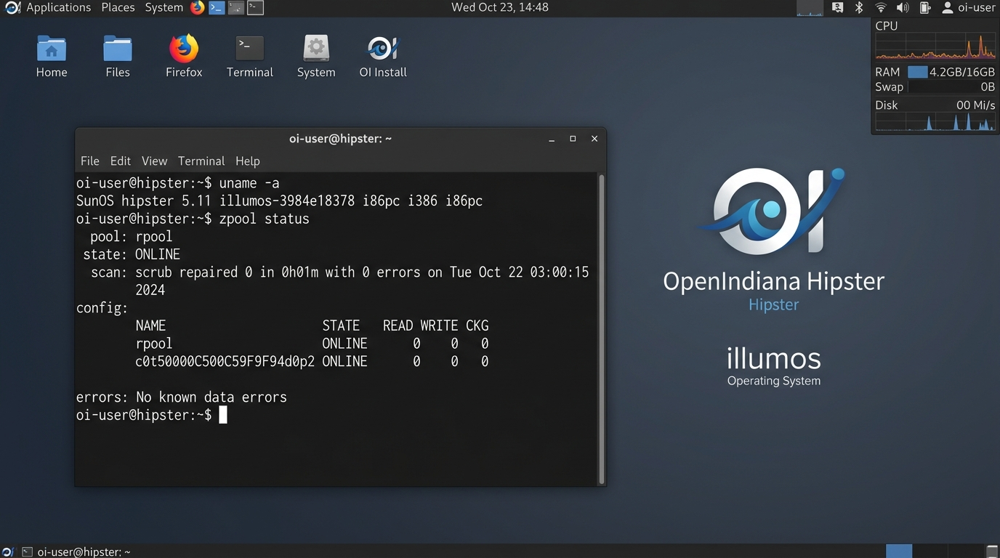 |

| Proxmox Datacenter Manager (CT 147 · Loki Telemetry) | macOS Monterey 12.7 (VM 206 · OpenCore KVM) |
| :---: | :---: |
|  | 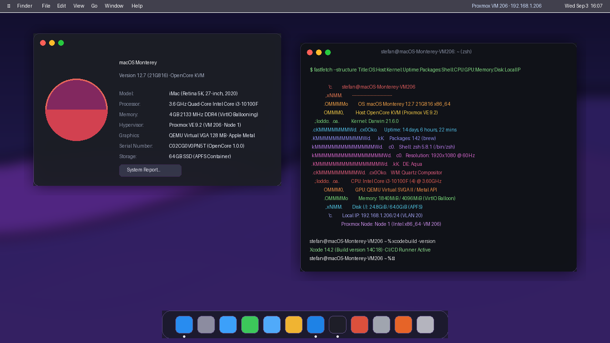 |

---

## About the Author

Designed, engineered, and operated by **[@stefanutc1](https://github.com/stefanutc1)**.
* **Focus**: Infrastructure Engineering, Multi-Architecture Virtualization (Proxmox VE x86_64 12GB DDR4-2133 & Apple Silicon ARM64), Zero-Trust Network Defense (OPNsense, Suricata, CrowdSec, WireGuard), Smart Home (Home Assistant), DNS Filtering (Pi-hole), GitOps & IaC (Terraform, Ansible, CI/CD).
* **Purpose**: Production-grade engineering portfolio showcasing on-premise and hybrid systems architecture.
