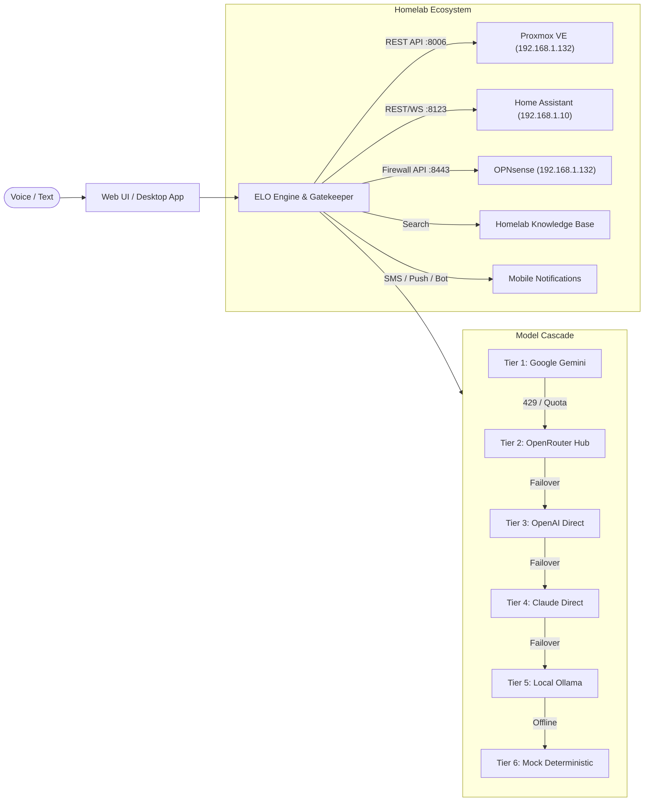
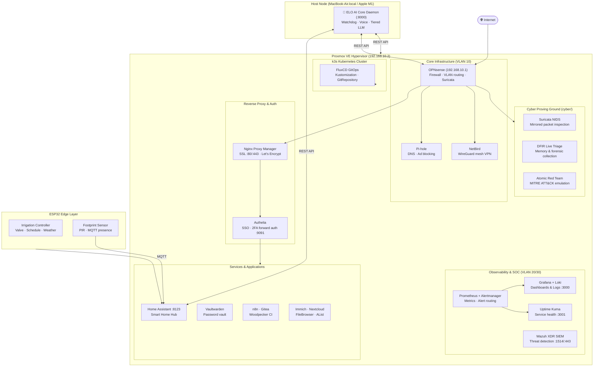

<div align="center">

# Homelab

**Self-Hosted Infrastructure · Autonomous AI Operating Layer (ELO) · IaC · GitOps · SOC Operations · DFIR · Edge Computing**

A comprehensive infrastructure, autonomous AI operating layer, and cybersecurity proving ground built on Proxmox VE, declarative Ansible automation, Terraform IaC, k3s Kubernetes, Wazuh XDR SIEM, Home Assistant domotics, and ESP32 embedded edge devices.

[](https://github.com/stefanutc1/homelab/actions)


[](https://stefanutc1.github.io/homelab/)


</div>

---

## ⚡ Highlights

- **ELO Control Plane & Orchestrator (`elo/`)** — Centralized infrastructure manager with Multi-Provider failover cascade (Gemini, OpenRouter, Claude, GPT-4, Local Ollama), voice wake word, real-time Proxmox VE REST API integration, Home Assistant domotics, OPNsense gateway controls, knowledge base, and automated watchdog with mobile notifications.
- **30+ self-hosted services** deployed via `docker-compose` with persistent volume management and Nginx Proxy Manager / Authelia SSO.
- **Cyber Proving Ground (`cyber/`)** — SOC/SIEM operations (Wazuh 4.8, Suricata NIDS, Grafana Loki), DFIR triage, Red Team emulation (Atomic Red Team, BloodHound), and automated SAST.
- **Automated system hardening** via Ansible roles enforcing CIS Level 1 sysctl baselines and restrictive access policies.
- **Terraform-provisioned Proxmox VMs** using a reusable cloud-init Ubuntu module and multi-hypervisor support (Proxmox, Xen, ESXi, Hyper-V, bhyve).
- **k3s Kubernetes cluster** with FluxCD GitOps synchronization against this repository.
- **ESP32 embedded projects** — automated irrigation control and physical presence sensing via MQTT.

---

## ELO — Infrastructure Control Plane (`elo/`)

[`elo/`](elo/) is the orchestrator running on the local node (`MacBook-Air.local`) that monitors, controls, and interacts with homelab infrastructure:



### Key Capabilities:
1. **Multi-Provider Failover Cascade**: Automatic failover if any model runs out of credits or encounters errors (`429`), with 5-minute quota cooldown.
2. **Proxmox VE REST API**: Live node status and VM/LXC lifecycle management (`start`, `stop`, `reboot`, `snapshot`) gated by security approvals.
3. **Home Assistant Domotics**: Query and control smart devices, lights, and sensor states.
4. **OPNsense Gateway**: Inspect gateway health and block malicious IP addresses.
5. **Watchdog Daemon**: Background loop that detects node/container outages and sends alerts.
6. **Voice Wake Word**: Browser-based wake word detection with speech synthesis.

---

## 🏗️ Stack

| Domain | Tools |
|:---|:---|
| **AI Operating Layer** | **ELO Core, FastAPI, ReAct Loop, Multi-Provider Cascade (Gemini, OpenRouter, Claude, GPT-4, Ollama), Web Speech** |
| Virtualization | Proxmox VE 8/9, macOS UTM / QEMU, Xen, ESXi, Hyper-V, bhyve |
| Configuration Management | Ansible (role-based, idempotent) |
| Infrastructure as Code | Terraform — Proxmox, Xen, ESXi, Hyper-V, bhyve providers |
| Container Orchestration | k3s (lightweight Kubernetes) |
| GitOps | FluxCD — Kustomization + GitRepository CRDs |
| SIEM / XDR | Wazuh Manager 4.8 + Wazuh Dashboard |
| Log Aggregation | Grafana Loki + Promtail |
| Network IDS | Suricata (EVE JSON) |
| Monitoring | Prometheus + Alertmanager + Grafana |
| Reverse Proxy / SSL | Nginx Proxy Manager (Let's Encrypt auto-cert) |
| Auth / SSO | Authelia (MFA, forward auth), Authentik |
| Home Automation | Home Assistant with automations and MQTT |
| Password Manager | Vaultwarden (self-hosted Bitwarden) |
| Media & Storage | Immich, AList, FileBrowser, arr-suite (Sonarr, Bazarr), OpenMediaVault ZFS |
| Network / VPN | NetBird (WireGuard mesh), Pi-hole, OPNsense |
| CI/CD | GitHub Actions (`ci.yml`, `cd.yml`) + Woodpecker CI |
| DFIR & Forensics | `triage_collector.sh`, `memory_dump.sh`, Chainsaw |
| Offensive Security | Atomic Red Team, BloodHound, LinPEAS |
| Static Analysis | Semgrep SAST, TruffleHog, Trivy, yamllint, ansible-lint |
| Embedded / Edge | ESP32 (Arduino C++) — irrigation, footprint sensor |

---

## 🌐 Network Architecture



---

## 📁 Repository Layout

```
homelab/
├── .github/                         # GitHub Actions CI/CD (yamllint, ansible-lint, terraform, elo-test)
│
├── elo/                             # 🧠 ELO Autonomous AI Operating Layer
│   ├── apps/elo-core/               # FastAPI Daemon, ReAct Engine, Watchdog, Web UI
│   ├── packages/
│   │   ├── elo-ai-client/           # Tiered Cascade Router (Gemini, OpenRouter, Claude, GPT, Ollama)
│   │   ├── elo-contracts/           # SecurityLevel (L0-L3), Tools & Event Contracts
│   │   └── elo-security/            # HMAC Tokens, Gatekeeper, Approval Queues
│   ├── docker-compose.yml           # PostgreSQL pgvector + Redis stack
│   └── README.md                    # Detailed ELO documentation
│
├── cyber/                           # Cyber Security & SOC Proving Ground
│   ├── ai/                          # MITRE ATT&CK correlation & IOC extraction
│   ├── ansible/                     # Hardening, FIM, SIEM agents & emergency quarantine
│   ├── audit/                       # CIS auditd rules, Nuclei, Semgrep, Trivy, TruffleHog
│   ├── ctf/                         # Atomic Red Team, BloodHound, LinPEAS, Web security
│   ├── forensics/                   # Chainsaw, memory dump, volatile triage collector
│   └── services/                    # Wazuh Manager, Loki-Grafana, Suricata, CyberChef
│
├── ansible/
│   ├── roles/
│   │   ├── home_assistant/          # Home Assistant configuration role
│   │   └── system_hardening/        # Sysctl CIS parameters, restrictive umask (027)
│   ├── group_vars/                  # Host group variable files
│   └── playbook.yml                 # Master Ansible playbook
│
├── kubernetes/
│   ├── gitops/
│   │   ├── flux-system/             # FluxCD GitRepository CRD and source definitions
│   │   └── clusters/homelab/        # Kustomization manifests for cluster workloads
│   ├── ansible/                     # k3s cluster provisioning via Ansible
│   ├── services/                    # Kubernetes service manifests
│   └── hardware/                    # Cluster hardware reference docs
│
├── terraform/
│   ├── modules/
│   │   └── proxmox_vm/              # Reusable Proxmox VM module (cloud-init, virtio)
│   └── main.tf                      # Root topology provisioner
│
├── hypervisors/
│   ├── proxmox/                     # Proxmox VE LXC & VM Terraform configs
│   ├── xen/                         # Xen hypervisor Terraform module
│   ├── esxi/                        # VMware ESXi Terraform module
│   ├── hyperv/                      # Hyper-V Terraform module
│   └── bhyve/                       # FreeBSD bhyve Terraform module
│
├── vms/
│   ├── alpine-server/               # Alpine Linux v3.21 Virt KVM (VM 201) microservices setup
│   └── opnsense/                    # OPNsense Core Firewall (VM 200) gateway configuration
│
├── services/                        # 28+ Docker Compose self-hosted application stacks
├── custom-apps/                     # Standalone custom SaaS replacements (PulseGuard, DevForge, etc.)
├── web/                             # Unified Homelab & CyberLab Interactive Wiki Web Portal
│
├── esp32/
│   ├── irrigation/                  # Automated irrigation controller (Arduino C++)
│   └── footprint/                   # Physical footprint / presence sensor (MQTT)
│
├── scripts/                         # Lab bootstrap and maintenance scripts
└── Makefile                         # Unified task runner
```

---

## 🧪 CI/CD Validation

GitHub Actions runs automated checks on every push and PR:

- `elo-test` — Comprehensive automated testing of ELO (`pytest -v`)
- `lint-yaml` — YAML syntax and Ansible linting (`yamllint`, `ansible-lint`)
- `build-frontend` — Build and artifact validation for web dashboards
- `terraform-validate` — Syntax and configuration validation (`terraform validate`)

```bash
# Run tests locally:
cd elo && pytest -v
yamllint -c .yamllint .
cd terraform && terraform init -backend=false && terraform validate
```

---

## 📜 License

MIT — Copyright (c) 2026 stefanutc1 (`@stefanutc1`).
