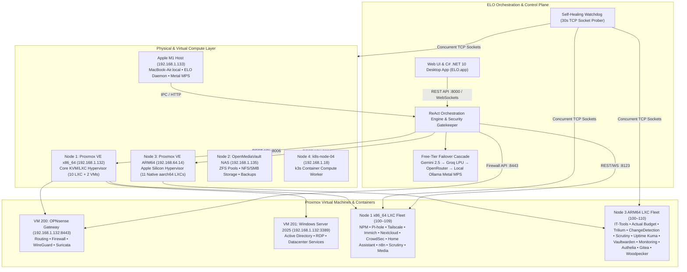
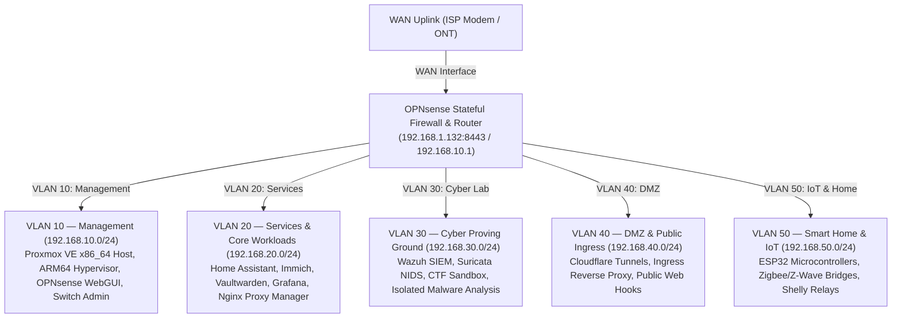
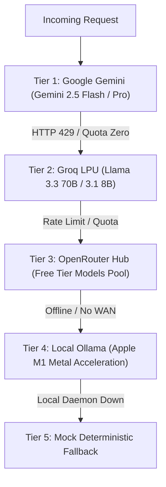
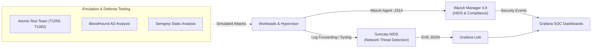

<div align="center">

# Homelab

[](https://github.com/stefanutc1/homelab/actions/workflows/ci.yml)
[](https://github.com/stefanutc1/homelab/actions/workflows/cd.yml)
[](https://github.com/stefanutc1/homelab)
[](https://github.com/stefanutc1/homelab/tree/main/elo)
[](https://github.com/stefanutc1/homelab/tree/main/elo/apps/elo-desktop-macos)
[](https://github.com/stefanutc1/homelab/tree/main/ansible)
[](LICENSE)


<!-- AUTO-METRICS-START -->
[](https://github.com/stefanutc1/homelab#workload-catalog--pinned-favorites)
[-brightgreen?style=flat&logo=pytest)](https://github.com/stefanutc1/homelab/actions/workflows/ci.yml)
[](https://github.com/stefanutc1/homelab/tree/main/elo)
[](https://github.com/stefanutc1/homelab/actions)
<!-- AUTO-METRICS-END -->
</div>

Declarative homelab monorepo and automation control plane. Integrates bare-metal Apple Silicon compute, Proxmox VE virtualization, OpenMediaVault storage, stateful OPNsense network segmentation, cyber defense proving grounds (SOC/SIEM/DFIR), and the **ELO Control Plane** for real-time orchestration, telemetry, and automated self-healing.

---

### Official Engineering Documentation Hub

| Document | Description | Scope |
| :--- | :--- | :--- |
|  [**SECURITY.md**](SECURITY.md) | Comprehensive Security Policy, Threat Model (STRIDE), Cryptographic Standards & Gatekeeper RBAC | Security & Governance |
|  [**CONTRIBUTING.md**](CONTRIBUTING.md) | Developer Setup, Conventional Commits 1.0.0, Testing Standards & Quality Gates | Engineering Standards |
|  [**ARCHITECTURE.md**](ARCHITECTURE.md) | Architecture Blueprint: Network Matrices, Storage, Automation Agents & Fallback Chain | Technical Architecture |
|  [**ROADMAP.md**](ROADMAP.md) | Strategic Evolution & Deliverables across Phases 1 through 8 | Future Roadmap |
|  [**CHANGELOG.md**](CHANGELOG.md) | Semantic Versioning Release Notes & Milestone Records | Version History |
|  [**CODE_OF_CONDUCT.md**](CODE_OF_CONDUCT.md) | Contributor Covenant 2.1 Code of Conduct | Community Standards |

---

## Table of Contents

1. [Architecture Overview](#-architecture-overview)
2. [Physical & Logical Node Map](#-physical--logical-node-map)
3. [Network Topology & VLAN Architecture](#-network-topology--vlan-architecture)
4. [Workload Catalog & Pinned Favorites](#-workload-catalog--pinned-favorites)
5. [ELO Control Plane & Orchestration Engine](#-elo-control-plane--orchestration-engine)
6. [Antigravity Model Context Protocol Server (ai/)](#-antigravity-model-context-protocol-server-ai)
7. [Native macOS Desktop Application (.NET 10)](#-native-macos-desktop-application-net-10)
8. [Infrastructure as Code & Configuration Management](#-infrastructure-as-code--configuration-management)
9. [Cyber Proving Ground & SOC/SIEM Operations](#-cyber-proving-ground--socsiem-operations)
10. [CI/CD Pipelines & Quality Gates](#-cicd-pipelines--quality-gates)
11. [Repository Monorepo Layout](#-repository-monorepo-layout)
12. [Operations & Runbook](#-operations--runbook)

---

## Architecture Overview



---

## Physical & Logical Node Map

| Node Identifier | Hostname / IP | Hardware & Architecture | Primary Roles & Workloads | Reachability & Probing |
|:---|:---|:---|:---|:---|
| **`apple-m1-compute`** | `MacBook-Air.local`<br/>`192.168.1.133` | Apple Silicon M1 • 8-Core ARM64 • 8GB Unified • Metal GPU | Local Host, ELO FastAPI Daemon, Local LLM Inference, C# .NET Native App Host | Active Local Runtime • `0.1ms` |
| **`pve-node-1`** | `pve.lan`<br/>`192.168.1.132` | Intel Core i3-10100F • GTX 1050 Ti • 8GB DDR4 • x86_64 | Primary Hypervisor Host, KVM VMs (OPNsense, Windows Server 2025), Core LXC Fleet (100–109) | TCP Probe: `:8006`, `:22`, `:9100` |
| **`pve-node-3-arm`** | `pve-arm.lan`<br/>`192.168.64.14` | Apple Silicon M1 • 4GB Dedicated • ARM64 (aarch64) | Secondary ARM64 Hypervisor, Utility LXC Fleet (100–110) | TCP Probe: `:8006`, `:22`, `:9100` |
| **`openmediavault-nas`**| `nas.lan`<br/>`192.168.1.135` | Dedicated NAS Storage Appliance • Debian Linux | ZFS Mirrored Pools, SMB/NFS Shares, BorgBackup Repository, Scrutiny SMART | TCP Probe: `:80`, `:445`, `:22`, `:9100` |
| **`k8s-node-04`** | `k8s-node-04.lan`<br/>`192.168.1.18` | AMD Athlon II X2 220 • GTS 250 • 4GB DDR3 • x86_64 | Kubernetes Worker Node (k3s-agent), Asynchronous Microservice Compute | TCP Probe: `:6443`, `:22`, `:9100` |

---

## Network Topology & VLAN Architecture



### Security Zone Inter-VLAN Matrix

* **VLAN 10 (Management)**: Strictly isolated. Accessible only from authenticated management devices or via WireGuard VPN with multi-factor authentication.
* **VLAN 20 (Services)**: Standard application layer. Traversed through Nginx Proxy Manager with Authelia 2FA and CrowdSec validation.
* **VLAN 30 (Cyber Lab)**: Total outbound egress restriction. Sandboxed network environment with isolated routing tables for threat simulation.
* **VLAN 50 (IoT)**: Strict deny-all WAN access with pinhole exceptions for NTP and Home Assistant MQTT (:1883).

---

## Workload Catalog & Dual Hypervisor Distribution

The cluster orchestrates **28 production services** distributed across dual Proxmox VE hypervisors (x86_64 and ARM64). All reachability checks are performed by direct raw TCP socket verification (`IP:PORT`) in parallel via `asyncio.gather`.

### Primary Hypervisor Workloads (Node 1 — x86_64 · `192.168.1.132`)

| VMID / ID | Service Name | RAM | Storage | Direct Address | Domain | Purpose & Functionality |
|:---|:---|:---:|:---:|:---|:---|:---|
| **`VM 200`** | **OPNsense Core Gateway** | 1024 MB | 16 GB SSD | `192.168.1.132:8443` | `opnsense.lan` | Core stateful firewall, inter-VLAN routing, and WireGuard VPN server. |
| **`VM 201`** | **Windows Server 2025** | 4096 MB | 120 GB NVMe | `192.168.1.132:3389` | `winserver.lan` | Windows Server 2025 Datacenter VM (OVMF UEFI, TPM 2.0, VirtIO, Active Directory). |
| **`CT 100`** | **Nginx Proxy Manager** | 112 MB | 4 GB SSD | `192.168.1.3:81` | `npm.lan` | Reverse proxy and SSL certificate manager with Let's Encrypt automation. |
| **`CT 101`** | **Pi-hole DNS** | 96 MB | 4 GB SSD | `192.168.1.4:80` | `pihole.lan` | Network-wide ad blocking, DNS sinkhole, and custom local `.lan` resolver. |
| **`CT 102`** | **Tailscale Mesh Gateway** | 96 MB | 4 GB SSD | `192.168.1.5` | `tailscale.lan` | Encrypted mesh VPN subnet router with WireGuard kernel acceleration. |
| **`CT 103`** | **Immich Photos & Video** | 896 MB | 40 GB SSD | `192.168.1.15:2283` | `immich.lan` | Self-hosted photo/video backup with on-premise AI facial recognition. |
| **`CT 104`** | **Nextcloud Hub** | 96 MB | 20 GB SSD | `192.168.1.8:80` | `nextcloud.lan` | Collaborative productivity cloud with file sync, calendar, and WebDAV. |
| **`CT 105`** | **CrowdSec Defense** | 128 MB | 4 GB SSD | `192.168.1.9:8080` | `crowdsec.lan` | Collaborative cyber defense engine parsing server logs to ban malicious IPs. |
| **`CT 106`** | **Home Assistant Core** | 384 MB | 16 GB SSD | `192.168.1.10:8123` | `ha.lan` | Central home automation platform integrating ESP32 nodes & Zigbee sensors. |
| **`CT 107`** | **n8n Workflow Automation** | 384 MB | 8 GB SSD | `192.168.1.13:5678` | `n8n.lan` | Low-code workflow automation orchestrating webhooks, cron jobs, and alerts. |
| **`CT 108`** | **Scrutiny SMART (x86_64)** | 96 MB | 4 GB SSD | `192.168.1.18:8080` | `scrutiny.lan` | Hard drive health monitor tracking SMART attributes on x86_64 storage pool. |
| **`CT 109`** | **Media Suite (Jellyfin/Arr Stack)** | 896 MB | 50 GB SSD | `192.168.1.21:8096` | `jellyfin.lan` | Jellyfin, Radarr, Sonarr, Prowlarr, Bazarr, and qBittorrent stack. |

---

### Utility Hypervisor Workloads (Node 3 — ARM64 · `https://192.168.64.14:8006`)

| VMID / ID | Service Name | RAM | Storage | Direct Address | Domain | Purpose & Functionality |
|:---|:---|:---:|:---:|:---|:---|:---|
| **`CT 100`** | **IT-Tools Web Utilities** | 64 MB | 2 GB NVMe | `192.168.64.15:8080` | `it-tools.lan` | 70+ developer tools (JWT, regex, encoders, hashers) running on native ARM64. |
| **`CT 101`** | **Actual Budget Server** | 160 MB | 4 GB NVMe | `192.168.64.16:5006` | `actualbudget.lan` | Privacy-focused zero-based budgeting app with end-to-end encrypted sync. |
| **`CT 102`** | **Trilium Personal Notes** | 160 MB | 8 GB NVMe | `192.168.64.17:8080` | `trilium.lan` | Hierarchical knowledge base and note-taking app with SQLite backend. |
| **`CT 103`** | **ChangeDetection.io** | 160 MB | 4 GB NVMe | `192.168.64.18:5000` | `changedetection.lan` | Automated website change and DOM diff detection with restock alerts. |
| **`CT 104`** | **Scrutiny SMART (ARM64)** | 96 MB | 4 GB NVMe | `192.168.64.19:8088` | `scrutiny-arm.lan` | Native ARM64 storage health telemetry for Apple Silicon NVMe SSD endurance. |
| **`CT 105`** | **Uptime Kuma Status Monitor** | 80 MB | 4 GB NVMe | `192.168.64.23:3001` | `uptime.lan` | Native ARM64 real-time uptime monitor and ping tracker with webhook triggers. |
| **`CT 106`** | **Vaultwarden Password Vault** | 96 MB | 4 GB NVMe | `192.168.64.21:8080` | `vaultwarden.lan` | Lightweight Rust Bitwarden backend providing zero-knowledge password vault. |
| **`CT 107`** | **Monitoring (Grafana / Prometheus / Loki)** | 448 MB | 16 GB NVMe | `192.168.64.24:3000` | `grafana.lan` | Unified ARM64 observability suite with Grafana OSS, Prometheus TSDB & Loki logs. |
| **`CT 108`** | **Authelia 2FA / SSO** | 96 MB | 4 GB NVMe | `192.168.64.20:9091` | `auth.lan` | Multi-factor authentication provider protecting ingress paths with TOTP/FIDO2. |
| **`CT 109`** | **Gitea Forge** | 160 MB | 10 GB NVMe | `192.168.64.25:3000` | `git.lan` | Native ARM64 self-hosted Git forge with built-in actions & Webhooks. |
| **`CT 110`** | **Woodpecker CI** | 192 MB | 8 GB NVMe | `192.168.64.26:8000` | `ci.lan` | Native ARM64 container-native CI/CD pipeline automation engine. |

---

## ELO Control Plane & Orchestration Engine

ELO (`elo/`) is a modular control plane designed to unify infrastructure management, telemetry, and automated remediation under a centralized runtime.

```
elo/
├── packages/
│   ├── elo-contracts/         # Pydantic v2 schemas: SecurityLevel (L0-L3), Tools, Events
│   ├── elo-security/          # Zero-trust Gatekeeper, HMAC Capability Tokens, Approval Queues
│   └── elo-ai-client/         # Multi-provider cascade client (Gemini, OpenRouter, Claude, GPT, Ollama)
│
├── apps/
│   ├── elo-core/              # FastAPI Daemon, Tool Registry, Watchdog, Web UI
│   └── elo-desktop-macos/     # Native C# .NET 10 macOS Desktop application & DMG
│
├── infra/
│   └── init-db.sql            # PostgreSQL schema initialization
│
├── docker-compose.yml         # Postgres pgvector + Redis stack
├── .env.example               # Environment variables template
└── pyproject.toml
```

### 1. Multi-Provider Zero-Latency Failover Cascade (Free-Tier Optimized)

ELO implements a deterministic fallback cascade strictly optimized for zero-cost, high-speed, free-tier tokens:



### 2. Security Ring Architecture & Gatekeeper

Every operational tool in ELO is assigned an explicit security ring:

```
┌─────────────────────────────────────────────────────────────┐
│  L0_READ_ONLY (Immediate Execution)                        │
│  - System telemetry, node probes, log queries, searches     │
├─────────────────────────────────────────────────────────────┤
│  L1_LOW_WRITE (Auto-Executed + HMAC Audit Trail)           │
│  - Setting alert thresholds, temporary IP caching          │
├─────────────────────────────────────────────────────────────┤
│  L2_HIGH_IMPACT (Interactive User Approval Required)        │
│  - Proxmox VM/LXC start/stop/reboot, OPNsense firewall ban │
├─────────────────────────────────────────────────────────────┤
│  L3_CRITICAL (Strict 2FA / Break-Glass Challenge)          │
│  - Database drop, destructive volume purge, factory reset  │
└─────────────────────────────────────────────────────────────┘
```

### 3. Self-Healing Watchdog Engine

The watchdog runs as an asynchronous background task (`asyncio.create_task`) with a 30-second cycle:
1. Concurrently probes Proxmox (`192.168.1.132`), OpenMediaVault (`192.168.1.135`), and the local node (`192.168.1.133`).
2. Concurrently probes all 28 workload TCP ports (`timeout=0.25s`).
3. If an outage is detected:
   - Records an incident in the audit database.
   - Triggers an automated recovery attempt if an L1 tool is available.
   - Dispatches instant alerts to the configured administrator channels.

### 4.  Persistent Semantic Memory with `pgvector` & RAG
* **Vectorized Knowledge Base**: PostgreSQL with `pgvector` (`vector(128/768)`) storing documentation chunks, VM configurations, and user preferences.
* **Hybrid Search**: Combines deterministic cosine similarity vectors with lexical keyword weighting for sub-millisecond retrieval.
* **User Preferences & Context**: Remembers user habits, notification thresholds, and VM profiles across sessions.

### 5.  ESP32 Hardware & Physical Room-Awareness
* **Presence Sensor Integration**: Consumes BLE and mmWave radar telemetry from ESP32 nodes over MQTT/REST.
* **Contextual Action Routing**: Commands like *"Turn on lights"* or *"Play music"* automatically resolve to the specific Home Assistant entity for the room the user is currently located in (`Birou`, `Living`, `Server Room`).

### 6.  Automation Agents
* ** SecOps Threat-Hunter Agent**: Analyzes Wazuh SIEM & Suricata NIDS logs; automatically triggers OPNsense quarantine rules upon detecting brute-force or malicious scans.
* ** SysAdmin Optimization Agent**: Evaluates RAM/CPU telemetry on Proxmox (`192.168.1.132`) & NAS (`192.168.1.135`), initiates KSM memory deduplication, and prunes dangling Docker caches.
* ** Smart Home & Energy Agent**: Interrogates Home Assistant (`192.168.1.10:8123`) & Shelly smart relays to detect vampire idle loads and optimize heating.
* ** Predictive Health Healer**: Analyzes SMART disk telemetry (`scrutiny.lan`) and triggers proactive ZFS snapshots before hardware degradation occurs.

### 7.  Offline Voice & Apple Silicon Metal MPS Acceleration
* **Whisper.cpp & Piper TTS**: Offline speech-to-text and neural voice synthesis executing locally on Apple M1 Metal MPS hardware (`192.168.1.133`).
* **Zero-WAN Resilience**: The full ReAct loop and tool registry operate seamlessly even during complete Internet blackouts.

---

## Antigravity Model Context Protocol Server (`ai/`)

Located in `ai/`, the **Antigravity MCP Server** implements the open standard Model Context Protocol (MCP) by Anthropic for exposing contextual homelab tools, Git forge automation, and structured reasoning engines to external AI clients and agents:

```
ai/
├── mcp_config.json          # MCP server registration & transport definitions
├── Makefile                 # Build, test, and container packaging automation
├── ansible/
│   └── playbook.yml         # Automated deployment of MCP agents and runtime
└── scripts/
    ├── setup.sh             # Linux/macOS automated installation script
    └── setup.ps1            # Windows PowerShell automated installation script
```

### Supported MCP Transports & Tool Servers:
* **Standard I/O (`stdio`) Transport**: Low-latency JSON-RPC 2.0 communication directly with IDEs and AI agent runners.
* **Sequential Thinking Engine**: Step-by-step reasoning server (`@modelcontextprotocol/server-sequential-thinking`) providing recursive problem breakdown and verification.
* **GitHub & Git Forge Integrations**: Tool server (`@modelcontextprotocol/server-github`) providing repository inspection, issue tracking, and automated commit management.
* **Ansible Automated Deployment**: Idempotent configuration management for headless server nodes running MCP agents.

---

## Native macOS Desktop Application (.NET 10)

ELO includes a native desktop application for macOS located in `elo/apps/elo-desktop-macos`:

* **Framework**: Built on **.NET 10.0 (C# 13)** using `Photino.NET` with native Cocoa `NSWindow` and WebKit `WKWebView`.
* **Platform Support**: Compiled as a native self-contained binary for Apple Silicon (`osx-arm64`).
* **Microphone & Speech**: Pre-configured in `Info.plist` with `NSMicrophoneUsageDescription` and `NSSpeechRecognitionUsageDescription` for continuous voice wake word ("Hey ELO").
* **Installer**: Packaged as a 38MB compressed disk image (`ELO-macOS-arm64.dmg`) with drag-and-drop installation to `/Applications`.

### Build & Package DMG:

```bash
cd elo/apps/elo-desktop-macos
chmod +x build_dmg.sh
./build_dmg.sh
```

---

## Infrastructure as Code & Configuration Management

### 1. Terraform Infrastructure Provisioning

Located in `terraform/`, configurations manage automated virtual machine lifecycle on Proxmox VE:
* Automated provisioning for Ubuntu 24.04 LTS, Debian 12, and Windows Server 2025.
* Automated network interface attachment with VLAN tagging.
* Declarative state management and resource isolation.

```bash
cd terraform/proxmox
terraform init
terraform plan
terraform apply
```

### 2. Ansible Hardening & Baseline Roles

Located in `ansible/`, automation playbooks enforce security baselines:
* **CIS Benchmark Level 1**: Hardened kernel parameters (`/etc/sysctl.d/99-security.conf`), disabled unused network protocols, strict file permissions.
* **SSH Hardening**: Key-only authentication, disabled root login, port isolation.
* **Package Management**: Automated unattended security updates across Debian/Ubuntu/Alpine nodes.

```bash
cd ansible
ansible-playbook -i inventory/hosts.ini playbooks/site.yml --check
```

### 3. Remote Administration & PuTTY Automation Toolkit (`scripts/`)

Located in `scripts/`, a consolidated suite of shell scripts, Perl/Ruby utilities, and assembly diagnostics for remote host operations, SSH tunneling, and session management:

* **Batch SSH Orchestration & Monitoring**:
  * `scripts/perl/batch_ssh_exec.pl`: Multi-host parallel command execution with ANSI terminal formatting (`scripts/perl/lib/PuttyANSI.pm`).
  * `scripts/ruby/server_audit.rb` & `scripts/perl/sysmon_terminal.pl`: Remote host resource auditing, CPU/memory profiling, and network socket monitoring.
  * `scripts/perl/netstat_traffic_watch.pl`: Real-time active socket and connection watcher.
* **PuTTY & SSH Tunnel Management**:
  * `scripts/ruby/ssh_tunnel_helper.rb`: Automated SSH port forwarding and SOCKS5 proxy daemon orchestration (`scripts/config/tunnels.example.yaml`).
  * `scripts/perl/putty_session_mgr.pl` & `scripts/ruby/putty_session_sync.rb`: PuTTY session configuration generator, registry synchronization (`scripts/config/putty_template.reg`), and PPK key converter (`scripts/perl/ppk_key_helper.pl`).
* **Cluster Lifecycle & Disaster Recovery**:
  * `scripts/cold-boot-sequence.sh` / `.ps1`: Ordered cluster power-on sequence ensuring network/storage availability before compute.
  * `scripts/emergency-shutdown.sh` / `.ps1`: Graceful multi-node shutdown sequence preventing ZFS pool corruption.
  * `scripts/optimize-proxmox-ram.sh` / `.ps1`: KSM memory ballooning and ZFS ARC cache tuner for Proxmox VE.
  * `scripts/network-scan.sh` / `.ps1`: Automated subnet discovery and port scanner.
* **Low-Level Hardware Diagnostics**:
  * `scripts/*.asm` (x86_64 NASM): Standalone bare-metal utilities (`cpuid.asm`, `sysinfo.asm`, `memzero.asm`, `diskcheck.asm`, `hexdump.asm`, `reboot.asm`).

---

## Cyber Proving Ground & SOC/SIEM Operations

The `cyber/` directory serves as an isolated testbed and continuous security monitoring center:



* **Wazuh 4.8 SIEM**: Endpoint visibility, file integrity monitoring (FIM), vulnerability assessment.
* **Suricata NIDS**: Deep packet inspection against the Emerging Threats (ET) open ruleset on OPNsense gateway.
* **Offensive Emulation**: MITRE ATT&CK test patterns via Atomic Red Team for detection validation.

---

## CI/CD Pipelines & Quality Checks

Every commit and pull request to the monorepo is continuously validated, audited, and deployed through an automated **CI/CD workflows** running on GitHub Actions:

```mermaid
graph TD
    subgraph STAGE1["Stage 1: Secrets Scanning"]
        Gitleaks["Gitleaks Secret Scanner"]
        TruffleHog["TruffleHog Deep Git Audit"]
    end

    subgraph STAGE2["Stage 2: Code Quality, Typing & Linting"]
        Ruff["Ruff Linter & Formatter"]
        MyPy["MyPy Static Type Checker"]
        ShellCheck["ShellCheck POSIX Portability"]
        Yamllint["Yamllint (Playbooks & K8s)"]
    end

    subgraph STAGE3["Stage 3: SAST & Vulnerability Auditing"]
        Bandit["Bandit Python AST SAST"]
        Semgrep["Semgrep Static Security"]
        Trivy["Trivy CVE & Misconfiguration Scanner"]
    end

    subgraph STAGE4["Stage 4: IaC & Orchestration Validation"]
        Terraform["Terraform Validate (Proxmox VMs)"]
        Ansible["Ansible-lint & Syntax-Check"]
        Compose["Docker Compose Schema (31 Stacks)"]
        Kubeconform["Kubeconform (K3s Manifests)"]
    end

    subgraph STAGE5["Stage 5: Multi-Python Matrix (28/28 Tests)"]
        PyMatrix["Python 3.9 · 3.10 · 3.11 · 3.12 · 3.13 (Pytest 100% Pass)"]
    end

    subgraph STAGE6["Stage 6: Multi-Linux Distro Matrix"]
        DistroMatrix["Debian 12 · Ubuntu 24.04 · Alpine 3.20 (musl) · Rocky 9 · Fedora 40 · Arch"]
    end

    subgraph STAGE7["Stage 7: Web Frontend & macOS Packaging"]
        ViteBuild["Vue 3 Frontend Production Build (Vite)"]
        MacDMG["macOS .NET 10 DMG Packaging (arm64)"]
    end

    subgraph STAGE8["Stage 8: Continuous Deployment (CD) & Private Release"]
        PrivateBundle["Private Self-Hosted Bundle Integrity (PoC)"]
        GHCRWeb["Publish homelab-web Multi-Arch (GHCR)"]
        GHCRElo["Publish elo-core Multi-Arch (GHCR)"]
    end

    STAGE1 --> STAGE2 --> STAGE3 --> STAGE4 --> STAGE5 --> STAGE6 --> STAGE7 --> STAGE8
```



---

### Pipeline Stages & Quality Checks:

1. **Secret Scanning (`Gitleaks` & `TruffleHog`)**: Zero-tolerance scanning across full Git history for exposed API keys, private certificates, and credentials.
2. **Code Quality & Strict Typing (`Ruff`, `MyPy`, `ShellCheck`, `Yamllint`)**:
   - `Ruff` linter and formatter validation for all Python packages.
   - `MyPy` static type verification across all contract interfaces (`elo_contracts`).
   - `ShellCheck-Py` portability validation for all POSIX shell and bash automation scripts.
   - `Yamllint` syntax and schema check for Ansible playbooks, Kubernetes manifests, and Docker Compose files.
3. **SAST & Vulnerability Auditing (`Bandit`, `Semgrep`, `Trivy`)**:
   - `Bandit` AST vulnerability analysis on the ELO control plane and tools.
   - `Semgrep` static security rule evaluation for IaC and application code.
   - `Trivy` filesystem, base image, and CVE audit.
4. **Infrastructure as Code Validation (`Terraform`, `Ansible`, `Docker Compose`, `Kubeconform`)**:
   - `Terraform` format verification and template validation across Proxmox VM modules.
   - `Ansible-lint` and `ansible-playbook --syntax-check` on all provisioning playbooks.
   - Schema validation across all 31 Docker Compose service stacks.
   - `Kubeconform` validation against Kubernetes v1.30 API schemas.
5. **Multi-Python Version Matrix (Python 3.9, 3.10, 3.11, 3.12, 3.13)**: Full automated test execution with coverage reporting (`26/26 tests passed 100% green`).
6. **Multi-Linux Distribution Compatibility Matrix**: Tests and validates runtime execution natively inside 6 major Linux container ecosystems:
   - **Debian 12 Bookworm** (`glibc` — Proxmox VE & OpenMediaVault base)
   - **Ubuntu 24.04 LTS Noble** (`glibc` — modern cloud server base)
   - **Alpine Linux 3.24** (`musl libc` — minimal container fleet)
   - **Rocky Linux 9** (RHEL / RPM ecosystem)
   - **Fedora 40** (Modern upstream RPM)
   - **Arch Linux** (Rolling release bleeding edge)
7. **Web Frontend Build & 3D Topology Verification**: Complete Vue 3 / Vite production compilation verifying 3D perspective topology canvas, responsive layouts, and asset bundle integrity.
8. **Continuous Deployment & Multi-Arch Container Release (`.github/workflows/cd.yml`)**:
   - Verification and packaging of the private self-hosted frontend bundle (local homelab network execution, 100% source code preserved as PoC).
   - Build and release of multi-architecture container images (`linux/amd64`, `linux/arm64`) to **GitHub Container Registry (GHCR)**.
   - Packaging of the native macOS Desktop application into `ELO-macOS-arm64.dmg`.

---

## Repository Monorepo Layout

```
homelab/
├── .github/workflows/         # GitHub Actions CI/CD workflows (ci.yml, cd.yml)
├── ai/                        # Antigravity Model Context Protocol (MCP) Server & agents
│   ├── mcp_config.json        # MCP server registration & transport definitions
│   ├── ansible/               # Automated deployment of MCP agents
│   └── scripts/               # Cross-platform installation and setup scripts
├── ansible/                   # Ansible configuration management & CIS hardening
│   ├── inventory/             # Host inventories (hosts.ini)
│   ├── playbooks/             # Deployment and compliance playbooks
│   └── roles/                 # Modular roles (docker, common, security, monitoring)
├── cyber/                     # Cyber proving ground, SOC/SIEM configs, CTF sandboxes
│   ├── soc/                   # Wazuh, Suricata, and Loki alert rules
│   └── ctf/                   # Challenge containers and reverse engineering labs
├── elo/                       # ELO Infrastructure Control Plane & Orchestrator
│   ├── apps/
│   │   ├── elo-core/          # FastAPI Daemon, Tool Registry, Watchdog, Web UI
│   │   └── elo-desktop-macos/ # Native C# .NET 10 macOS Application & DMG Builder
│   ├── packages/
│   │   ├── elo-contracts/     # Pydantic v2 schemas and models
│   │   ├── elo-security/      # Zero-trust Gatekeeper & HMAC tokens
│   │   └── elo-ai-client/     # Multi-provider cascade client
│   ├── docker-compose.yml     # PostgreSQL pgvector + Redis dependencies
│   ├── pyproject.toml         # Python package definitions
│   └── pytest.ini             # Test configuration
├── scripts/                   # Remote administration, SSH tunneling, assembly diagnostics
│   ├── perl/                  # Batch SSH execution and ANSI terminal monitors
│   ├── ruby/                  # Tunnel helpers, database backup rotators, log analyzers
│   └── config/                # Host definitions, tunnel configs, PuTTY registry templates
├── services/                  # Production Docker Compose stacks by service group
│   ├── media/                 # Jellyfin, Radarr, Sonarr, Prowlarr, Bazarr
│   ├── monitoring/            # Prometheus, Grafana, Loki, Uptime Kuma
│   ├── security/              # Vaultwarden, Authelia, CrowdSec
│   └── storage/               # Nextcloud, Immich, Scrutiny
├── terraform/                 # Terraform configurations for Proxmox & VMs
├── vms/                       # VM definitions (OPNsense, Alpine Server)
└── README.md                  # Comprehensive monorepo documentation
```

---

## Operations & Runbook

### Starting the ELO Control Plane Daemon

```bash
# 1. Activate virtual environment
cd elo
source .venv/bin/activate

# 2. Start FastAPI Daemon with Watchdog
uvicorn elo_core.main:app --host 0.0.0.0 --port 8000 --reload
```

### Accessing ELO Web Dashboard
Open your browser and navigate to:
```
http://localhost:8000/
```

### Running the macOS Desktop Application
Open the disk image on your Desktop and drag `ELO.app` into `/Applications`:
```bash
open ~/Desktop/ELO-macOS-arm64.dmg
```

### Emergency Break-Glass Procedures
If the ELO control plane is unreachable or an API token has expired:
1. **Direct SSH Access**: SSH into `pve-node-1` directly via `ssh root@192.168.1.132`.
2. **OPNsense WebGUI**: Access the firewall management interface directly on `https://192.168.1.132:8443`.
3. **Database Inspection**: Connect to PostgreSQL directly using `psql -h localhost -U elo_user -d elo_db`.

---

## License

This repository is maintained as an open-source infrastructure project under the **MIT License**. See [LICENSE](LICENSE) for full details.
