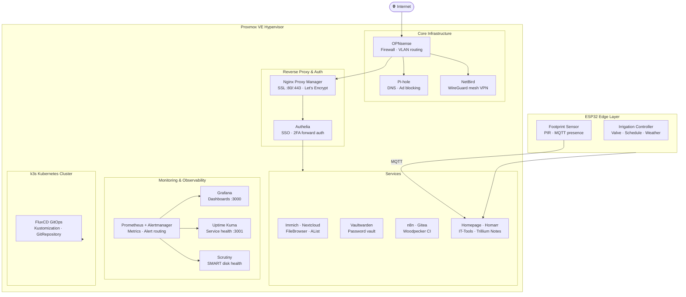

<div align="center">

# Homelab

**Self-Hosted Infrastructure · IaC · GitOps · Edge Computing**

A personal infrastructure lab built on Proxmox VE, declarative Ansible automation, Terraform IaC, and a full self-hosted services stack — covering everything from reverse proxies and monitoring to home automation and ESP32 embedded projects.

[](https://github.com/stefannut/homelab/actions)


[](https://stefannut.github.io/homelab/)
[](https://github.com/stefannut/homelab/pkgs/container/homelab-web)


</div>

---

## What this is

A fully reproducible homelab environment managed as code. Everything that runs here is declared in a file — no manual clicks, no snowflake configurations. Key areas:

- **30+ self-hosted services** deployed via `docker-compose` with persistent config under version control
- **Automated system hardening** via Ansible roles enforcing CIS sysctl baselines and restrictive access policies
- **Terraform-provisioned Proxmox VMs** using a reusable module for cloud-init Ubuntu nodes
- **k3s Kubernetes cluster** with FluxCD GitOps synchronization against this repo
- **ESP32 embedded projects** — automated irrigation control and physical footprint sensors
- **Prometheus alerting** with Alertmanager routing and node-level alert rules
- **Multi-hypervisor IaC** — Terraform configs for Proxmox, Xen, ESXi, Hyper-V, and bhyve

---

## Stack

| Domain | Tools |
|:---|:---|
| Virtualization | Proxmox VE 8/9, Xen, ESXi, Hyper-V, bhyve |
| Configuration Management | Ansible (role-based, idempotent) |
| Infrastructure as Code | Terraform — Proxmox, Xen, ESXi, Hyper-V, bhyve providers |
| Container Orchestration | k3s (lightweight Kubernetes) |
| GitOps | FluxCD — Kustomization + GitRepository CRDs |
| Monitoring | Prometheus + Alertmanager + Grafana |
| Log Aggregation | Loki + Promtail (via Grafana stack) |
| Reverse Proxy / SSL | Nginx Proxy Manager (Let's Encrypt auto-cert) |
| Auth / SSO | Authelia (MFA, forward auth), Authentik |
| Home Automation | Home Assistant with automations and MQTT |
| Password Manager | Vaultwarden (self-hosted Bitwarden) |
| Intrusion Prevention | CrowdSec |
| Media & Storage | Immich, AList, FileBrowser, arr-suite (Sonarr, Bazarr) |
| Network / VPN | NetBird (WireGuard mesh), Pi-hole, OPNsense |
| CI/CD | Woodpecker CI + Gitea, GitHub Actions |
| Embedded / Edge | ESP32 (Arduino C++) — irrigation, footprint sensor |
| AI Ops | Python automation agent (`ai/agent.py`) |
| Cloud (AWS) | Terraform module stubs for multi-cloud baseline |

---

## Network Architecture



---

## Repository Layout

```
homelab/
├── .github/                         # GitHub Actions CI (ansible-lint, yamllint, terraform validate)
│
├── ansible/
│   ├── roles/
│   │   ├── home_assistant/          # Home Assistant configuration role
│   │   └── system_hardening/        # Sysctl CIS parameters, restrictive umask (027)
│   ├── group_vars/                  # Host group variable files
│   ├── playbook.yml                 # Master Ansible playbook
│   └── main.yml
│
├── kubernetes/
│   ├── gitops/
│   │   ├── flux-system/             # FluxCD GitRepository CRD and source definitions
│   │   └── clusters/homelab/        # Kustomization manifests for cluster workloads
│   ├── ansible/                     # k3s cluster provisioning via Ansible
│   ├── services/                    # Kubernetes service manifests
│   └── hardware/                    # Cluster hardware reference docs
│
├── terraform/
│   ├── modules/
│   │   └── proxmox_vm/              # Reusable Proxmox VM module (cloud-init, virtio)
│   │       ├── main.tf
│   │       ├── variables.tf
│   │       └── outputs.tf
│   ├── main.tf                      # Root topology provisioner
│   └── providers.tf
│
├── hypervisors/
│   ├── proxmox/                     # Proxmox VE LXC & VM Terraform configs
│   ├── xen/                         # Xen hypervisor Terraform module
│   ├── esxi/                        # VMware ESXi Terraform module
│   ├── hyperv/                      # Hyper-V Terraform module
│   └── bhyve/                       # FreeBSD bhyve Terraform module
│
├── services/
│   ├── homepage/                    # Dashboard — YAML service widgets, layout config
│   ├── authelia/                    # SSO + 2FA (configuration.yml + docker-compose)
│   ├── authentik/                   # Identity provider alternative
│   ├── nginx-proxy-manager/         # SSL reverse proxy
│   ├── netbird/                     # WireGuard mesh VPN client
│   ├── prometheus/                  # Metrics scrape config + Alertmanager routing + alert rules
│   ├── grafana/                     # Dashboard definitions
│   ├── uptime-kuma/                 # Service health monitoring
│   ├── scrutiny/                    # SMART disk health monitoring
│   ├── crowdsec/                    # Collaborative IPS engine
│   ├── vaultwarden/                 # Self-hosted Bitwarden password vault
│   ├── immich/                      # Photo/video backup (Google Photos alternative)
│   ├── nextcloud/                   # File sync and collaboration
│   ├── alist/                       # Unified cloud + local file storage manager
│   ├── filebrowser/                 # Lightweight web file manager
│   ├── homeassistant/               # Home automation (automations, scenes, scripts, MQTT)
│   ├── frigate/                     # NVR with ML object detection
│   ├── n8n/                         # Workflow automation engine
│   ├── gitea/                       # Private Git SCM
│   ├── woodpecker-ci/               # CI/CD pipeline engine
│   ├── arr-suite/                   # Sonarr + Bazarr media management
│   ├── pi-hole/                     # Network-wide DNS ad blocking
│   ├── opnsense/                    # Firewall — aliases, HAProxy, Telegraf, topology
│   ├── homarr/                      # Service dashboard
│   ├── trillium-notes/              # Hierarchical note-taking
│   ├── actualbudget/                # Personal finance tracker
│   ├── changedetection.io/          # Website change monitoring
│   └── it-tools/                    # Dev utility toolkit
│
├── esp32/
│   ├── irrigation/                  # Automated irrigation controller
│   │   ├── main.cpp                 # Entry point — sensor loop, valve control
│   │   ├── control.cpp              # Valve actuation logic
│   │   ├── ore.cpp                  # Scheduling and timing engine
│   │   ├── vreme.cpp                # Weather/moisture sensor integration
│   │   ├── logger.cpp / logger.h    # Serial log abstraction
│   │   ├── sector_1.yaml            # Irrigation zone config
│   │   ├── timpi.yaml               # Schedule definitions
│   │   └── config.yaml              # Hardware pin mapping
│   └── footprint/                   # Physical footprint / presence sensor
│       ├── main.cpp
│       ├── sensor.cpp               # PIR/ultrasonic input handler
│       ├── gate.cpp                 # Output actuation (relay / servo)
│       └── config.h                 # Pin definitions and calibration constants
│
├── scripts/
│   ├── bootstrap.sh                 # Lab initialization (Linux)
│   ├── bootstrap.ps1                # Lab initialization (Windows / Hyper-V)
│   ├── diskcheck.asm                # Low-level ASM disk sector health checker
│   └── log.asm                      # ASM event logging utility
│
├── aws/                             # AWS Terraform module stubs (multi-cloud baseline)
├── ai/
│   └── agent.py                     # Automation and AI ops agent
├── inventory/                       # Ansible host inventory
├── hardware/                        # Physical hardware reference docs
└── Dockerfile                       # Containerized lint/test harness
```

---

## Services Reference

| Service | Port(s) | Purpose |
|:---|:---|:---|
| **Homepage** | 3000 | Dashboard — YAML-configured service launcher |
| **Nginx Proxy Manager** | 80, 443, 81 | SSL termination and reverse proxy (Let's Encrypt) |
| **Authelia** | 9091 | SSO and 2FA forward auth |
| **Authentik** | — | Identity provider and user management |
| **Vaultwarden** | — | Self-hosted Bitwarden password vault |
| **NetBird** | — | WireGuard mesh VPN |
| **Pi-hole** | — | Local DNS + network ad blocking |
| **Prometheus + Alertmanager** | 9090, 9093 | Metrics collection and alert routing (Discord webhook) |
| **Grafana** | 3000 | Metric dashboards and telemetry visualization |
| **Uptime Kuma** | 3001 | Service health and uptime monitoring |
| **Scrutiny** | — | SMART disk health dashboard |
| **CrowdSec** | — | Collaborative intrusion prevention |
| **Immich** | — | Self-hosted photo backup |
| **Nextcloud** | — | File sync and collaboration platform |
| **AList** | 5244 | Unified local + cloud file manager |
| **FileBrowser** | 8082 | Lightweight web file manager |
| **Home Assistant** | — | Home automation hub with MQTT |
| **Frigate** | — | NVR with ML object detection |
| **n8n** | — | Workflow automation |
| **Gitea** | 3001 | Private Git source control |
| **Woodpecker CI** | 8000 | CI/CD pipeline engine |
| **Homarr** | — | Alternative service dashboard |
| **Trillium Notes** | — | Hierarchical notes and knowledge base |
| **Actual Budget** | — | Personal finance tracking |
| **IT-Tools** | — | Developer utility collection |

---

## Ansible Roles

| Role | What it does |
|:---|:---|
| `system_hardening` | CIS sysctl parameters (`net.ipv4.tcp_syncookies=1`, `fs.protected_hardlinks=1`, `fs.protected_symlinks=1`, `net.ipv4.conf.all.accept_redirects=0`), restrictive umask `027` via `login.defs` |
| `home_assistant` | Home Assistant configuration, MQTT bridge, automation deployment |

Full playbook execution runs all roles against all inventory groups:

```bash
ansible-playbook -i inventory/ ansible/playbook.yml
```

---

## Terraform

### Proxmox VM Module

Reusable module at `terraform/modules/proxmox_vm/` — provisions cloud-init Ubuntu VMs on Proxmox VE:

```hcl
module "worker_node" {
  source       = "./modules/proxmox_vm"
  vm_name      = "worker-01"
  target_node  = "pve"
  vm_cores     = 4
  vm_memory    = 8192
  vm_disk_size = "64G"
}
```

Outputs: `vm_id`, `vm_name`.

### Multi-Hypervisor IaC

Terraform configs for all major hypervisors under `hypervisors/`:

```bash
cd hypervisors/proxmox && terraform init && terraform apply
cd hypervisors/xen     && terraform init && terraform apply
cd hypervisors/esxi    && terraform init && terraform apply
```

---

## Kubernetes / GitOps

k3s cluster with FluxCD for continuous reconciliation against this repo.

### Bootstrap FluxCD

```bash
# Provision the k3s cluster
cd kubernetes/ansible
ansible-playbook -i inventory.ini playbook.yml

# FluxCD will auto-sync from:
# kubernetes/gitops/flux-system/gotk-components.yaml
# kubernetes/gitops/clusters/homelab/kustomization.yaml
```

FluxCD polls `stefannut/homelab` on `main` every 5 minutes and applies all manifests under `kubernetes/manifests/` with pruning enabled.

---

## Monitoring & Alerting

Prometheus alert rules in `services/prometheus/rules/homelab-alerts.yml`:

| Alert | Condition | Severity |
|:---|:---|:---|
| `HostHighCpuLoad` | CPU idle < 15% for 5m | Warning |
| `HostOutOfMemory` | Available memory < 10% for 3m | Critical |

Alertmanager routes all alerts to a Discord webhook via `alertmanager-discord` sidecar.

```bash
# Bring up the full monitoring stack
docker compose -f services/prometheus/docker-compose.yml up -d
docker compose -f services/grafana/docker-compose.yml up -d
```

---

## ESP32 Embedded Projects

### Irrigation Controller (`esp32/irrigation/`)

Automated garden irrigation with weather-aware scheduling:
- `ore.cpp` — time-of-day schedule engine with configurable zones
- `vreme.cpp` — moisture and temperature sensor integration, skips watering on rain
- `control.cpp` — solenoid valve actuation per zone
- `sector_1.yaml` — zone definitions, runtime durations
- `timpi.yaml` — weekly schedule declarations

### Footprint Sensor (`esp32/footprint/`)

Presence detection node for room occupancy-driven automation:
- PIR / ultrasonic input in `sensor.cpp`
- Relay / servo gate actuation in `gate.cpp`
- Publishes MQTT presence events to Home Assistant

---

## CI/CD

GitHub Actions on every push and PR:

- `ansible-lint` + `yamllint` — playbook and config quality
- `terraform validate` — module syntax validation (no cloud needed, `init -backend=false`)

```bash
# Local equivalent
ansible-lint ansible/
yamllint .
cd terraform && terraform init -backend=false && terraform validate
```

---

## Scripts

| Script | Description |
|:---|:---|
| `scripts/bootstrap.sh` | Full lab initialization for Linux nodes |
| `scripts/bootstrap.ps1` | Lab initialization for Windows / Hyper-V environments |
| `scripts/diskcheck.asm` | x86 ASM low-level disk sector health checker |
| `scripts/log.asm` | x86 ASM event logging utility |

---

## License

MIT — Copyright (c) 2026 stefannut (`@stefannut`).
