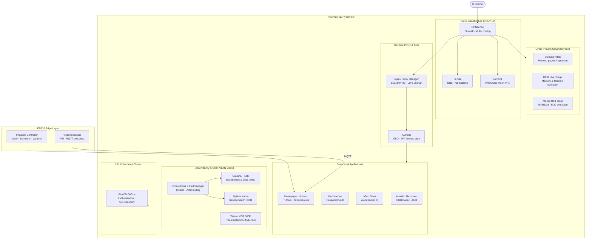

<div align="center">

# Homelab & CyberLab

**Self-Hosted Infrastructure · IaC · GitOps · SOC Operations · DFIR · Edge Computing**

A comprehensive infrastructure and cybersecurity proving ground built on Proxmox VE, declarative Ansible automation, Terraform IaC, k3s Kubernetes, Wazuh XDR SIEM, and ESP32 embedded edge devices.

[](https://github.com/stefanutc1/homelab/actions)


[](https://stefanutc1.github.io/homelab/)


</div>

---

## What this is

A fully reproducible infrastructure & cybersecurity operations platform managed strictly as code. Everything is declared in version-controlled configurations:

- **30+ self-hosted services** deployed via `docker-compose` with persistent volume management
- **Cyber Proving Ground (`cyber/`)** — SOC/SIEM operations (Wazuh 4.8, Suricata NIDS, Grafana Loki), DFIR triage, Red Team emulation (Atomic Red Team, BloodHound), and automated SAST
- **Automated system hardening** via Ansible roles enforcing CIS Level 1 sysctl baselines and restrictive access policies
- **Terraform-provisioned Proxmox VMs** using a reusable cloud-init Ubuntu module
- **k3s Kubernetes cluster** with FluxCD GitOps synchronization against this repository
- **ESP32 embedded projects** — automated irrigation control and physical presence sensing
- **Prometheus alerting** with Alertmanager routing to Discord
- **Multi-hypervisor IaC** — Terraform configs for Proxmox, Xen, ESXi, Hyper-V, and bhyve

---

## Stack

| Domain | Tools |
|:---|:---|
| Virtualization | Proxmox VE 8/9, macOS UTM / QEMU, Xen, ESXi, Hyper-V, bhyve |
| Configuration Management | Ansible (role-based, idempotent) |
| Infrastructure as Code | Terraform — Proxmox, Xen, ESXi, Hyper-V, bhyve providers |
| Container Orchestration | k3s (lightweight Kubernetes) |
| GitOps | FluxCD — Kustomization + GitRepository CRDs |
| SIEM / XDR | Wazuh Manager 4.8 + Wazuh Dashboard |
| Log Aggregation | Grafana Loki + Promtail |
| Network IDS | Suricata (EVE JSON) |
| Monitoring | Prometheus + Alertmanager + Grafana |
| Reverse Proxy / SSL | Nginx Proxy Manager (Let's Encrypt auto-cert) |
| Auth / SSO | Authelia (MFA, forward auth), Authentik |
| Home Automation | Home Assistant with automations and MQTT |
| Password Manager | Vaultwarden (self-hosted Bitwarden) |
| Media & Storage | Immich, AList, FileBrowser, arr-suite (Sonarr, Bazarr) |
| Network / VPN | NetBird (WireGuard mesh), Pi-hole, OPNsense |
| CI/CD | Woodpecker CI + Gitea, GitHub Actions |
| DFIR & Forensics | `triage_collector.sh`, `memory_dump.sh`, Chainsaw |
| Offensive Security | Atomic Red Team, BloodHound, LinPEAS |
| Static Analysis | Semgrep SAST, TruffleHog, Trivy |
| Embedded / Edge | ESP32 (Arduino C++) — irrigation, footprint sensor |
| AI Threat Intel | Python agents for IOC extraction and MITRE ATT&CK classification |

---

## Network Architecture



---

## Repository Layout

```
homelab/
├── .github/                         # GitHub Actions CI (ansible-lint, yamllint, terraform validate)
│
├── cyber/                           # Cyber Security & SOC Proving Ground
│   ├── ai/                          # MITRE ATT&CK correlation & IOC extraction
│   ├── ansible/                     # Hardening, FIM, SIEM agents & emergency quarantine
│   ├── audit/                       # CIS auditd rules, Nuclei, Semgrep, Trivy, TruffleHog
│   ├── ctf/                         # Atomic Red Team, BloodHound, LinPEAS, Web security
│   ├── forensics/                   # Chainsaw, memory dump, volatile triage collector
│   └── services/                    # Wazuh Manager, Loki-Grafana, Suricata, CyberChef
│
├── ansible/
│   ├── roles/
│   │   ├── home_assistant/          # Home Assistant configuration role
│   │   └── system_hardening/        # Sysctl CIS parameters, restrictive umask (027)
│   ├── group_vars/                  # Host group variable files
│   └── playbook.yml                 # Master Ansible playbook
│
├── kubernetes/
│   ├── gitops/
│   │   ├── flux-system/             # FluxCD GitRepository CRD and source definitions
│   │   └── clusters/homelab/        # Kustomization manifests for cluster workloads
│   ├── ansible/                     # k3s cluster provisioning via Ansible
│   ├── services/                    # Kubernetes service manifests
│   └── hardware/                    # Cluster hardware reference docs
│
├── terraform/
│   ├── modules/
│   │   └── proxmox_vm/              # Reusable Proxmox VM module (cloud-init, virtio)
│   └── main.tf                      # Root topology provisioner
│
├── hypervisors/
│   ├── proxmox/                     # Proxmox VE LXC & VM Terraform configs
│   ├── xen/                         # Xen hypervisor Terraform module
│   ├── esxi/                        # VMware ESXi Terraform module
│   ├── hyperv/                      # Hyper-V Terraform module
│   └── bhyve/                       # FreeBSD bhyve Terraform module
│
├── vms/
│   ├── alpine-server/               # Alpine Linux v3.21 Virt KVM (VM 201) microservices setup
│   └── opnsense/                    # OPNsense Core Firewall (VM 200) gateway configuration
│
├── services/                        # 28+ Docker Compose self-hosted application stacks
├── custom-apps/                     # Standalone custom SaaS replacements (PulseGuard, DevForge, etc.)
├── web/                             # Unified Homelab & CyberLab Interactive Wiki Web Portal
│
├── esp32/
│   ├── irrigation/                  # Automated irrigation controller (Arduino C++)
│   └── footprint/                   # Physical footprint / presence sensor (MQTT)
│
├── scripts/                         # Lab bootstrap and maintenance scripts
├── aws/                             # Multi-cloud Terraform baseline stubs
├── inventory/                       # Ansible host inventory
└── Makefile                         # Unified task runner
```

---

## License

MIT — Copyright (c) 2026 stefanutc1 (`@stefanutc1`).
hes MQTT presence events to Home Assistant

---

## CI/CD

GitHub Actions on every push and PR:

- `ansible-lint` + `yamllint` — playbook and config quality
- `terraform validate` — module syntax validation (no cloud needed, `init -backend=false`)

```bash
# Local equivalent
ansible-lint ansible/
yamllint .
cd terraform && terraform init -backend=false && terraform validate
```

---

## Scripts

| Script | Description |
|:---|:---|
| `scripts/bootstrap.sh` | Full lab initialization for Linux nodes |
| `scripts/bootstrap.ps1` | Lab initialization for Windows / Hyper-V environments |
| `scripts/diskcheck.asm` | x86 ASM low-level disk sector health checker |
| `scripts/log.asm` | x86 ASM event logging utility |

---

## License

MIT — Copyright (c) 2026 stefannut (`@stefannut`).
