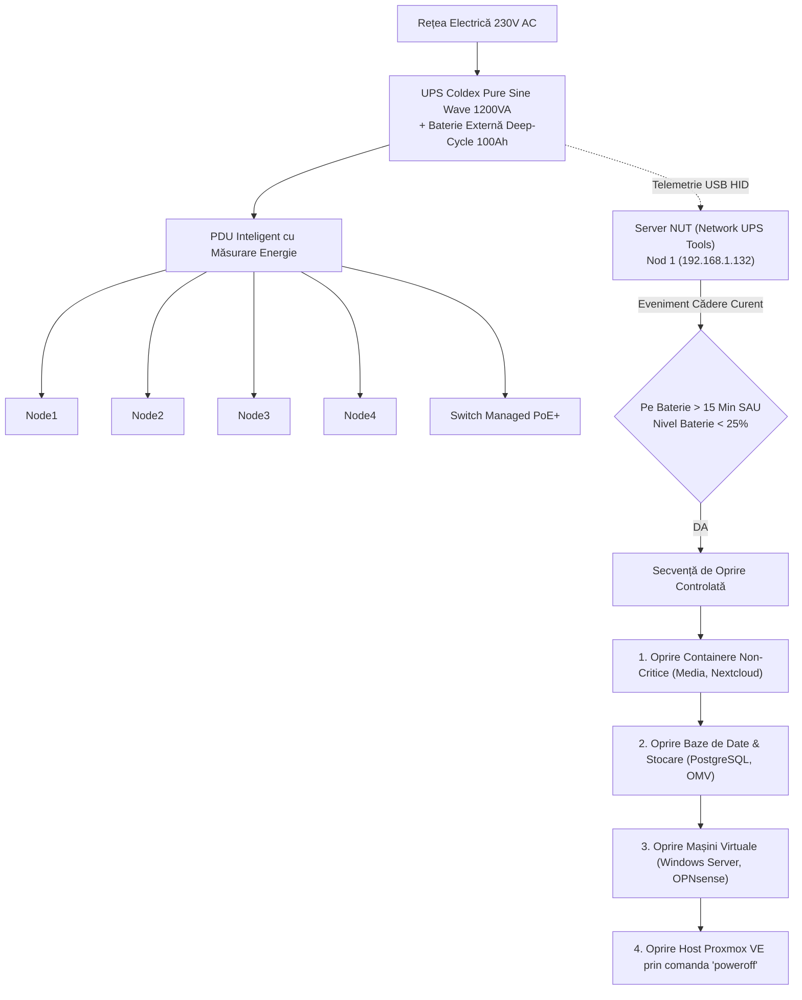

<div align="center">

# Laborator de Inginerie de Platformă & Cloud Hibrid Enterprise

**[ 🇷🇴 Română ](README.ro.md) • [ 🇬🇧 English ](README.md) • [ 🇫🇷 Français ](README.fr.md) • [ 🇪🇸 Español ](README.es.md) • [ 🇩🇪 Deutsch ](README.de.md)**

[](https://github.com/stefanutc1/homelab/actions)
[](https://github.com/stefanutc1/homelab/actions/workflows/security-scan.yml)
[-emerald?style=flat&logo=terraform)](https://github.com/stefanutc1/homelab/tree/main/terraform)
[](https://status.homelab.local)
[](https://github.com/stefanutc1/homelab)
[](https://github.com/stefanutc1/homelab)
[](https://github.com/stefanutc1/homelab)
[](LICENSE)

<br/>

**Platformă hibridă de nivel enterprise, poligon de securitate cibernetică și infrastructură autonomă de orchestrare cu agenți AI.**
Construită pe arhitectură hibridă de calcul (Intel x86_64 și Apple Silicon ARM64), segmentare de rețea cu firewall OPNsense, stocare ZFS de înaltă performanță, automatizare declarativă prin Terraform/Ansible și observabilitate în timp real la nivel de kernel prin eBPF.

[Digital Twin Interactiv Live](https://stefanutc1.github.io/homelab/) • [Blueprint Arhitectură](ARCHITECTURE.md) • [Politici Securitate](SECURITY.md) • [Roadmap](ROADMAP.md)

</div>

---

## 📑 Cuprins

1. [Misiune și Principii de Proiectare](#1-misiune-și-principii-de-proiectare)
2. [Arhitectură End-to-End și Topologie de Rețea](#2-arhitectură-end-to-end-și-topologie-de-rețea)
3. [Flotă Hardware Fizică și Sistem de Alimentare](#3-flotă-hardware-fizică-și-sistem-de-alimentare)
4. [Matrice de Alocare Resurse per Container LXC și VM](#4-matrice-de-alocare-resurse-per-container-lxc-și-vm)
5. [Arhitectură de Stocare și Optimizare Pool-uri ZFS](#5-arhitectură-de-stocare-și-optimizare-pool-uri-zfs)
6. [Segmentare Rețea și Matrice Firewall Inter-VLAN](#6-segmentare-rețea-și-matrice-firewall-inter-vlan)
7. [Trafic Ingress, Autentificare Zero-Trust și Split-Horizon DNS](#7-trafic-ingress-autentificare-zero-trust-și-split-horizon-dns)
8. [Infrastructură ca și Cod (Terraform și Ansible)](#8-infrastructură-ca-și-cod-terraform-și-ansible)
9. [Kubernetes și Ciclul de Viață GitOps](#9-kubernetes-și-ciclul-de-viață-gitops)
10. [Stiva de Observabilitate LGTM și Pipeline Telemetrie](#10-stiva-de-observabilitate-lgtm-și-pipeline-telemetrie)
11. [Strategie de Backup 3-2-1, Sanoid și Disaster Recovery](#11-strategie-de-backup-3-2-1-sanoid-și-disaster-recovery)
12. [Poligon de Securitate Cibernetică, SOC și eBPF](#12-poligon-de-securitate-cibernetică-soc-și-ebpf)
13. [Rulare Locală LLM pe GPU (Ollama CT 110)](#13-rulare-locală-llm-pe-gpu-ollama-ct-110)
14. [Ingineria Haosului și Validare Reziliență](#14-ingineria-haosului-și-validare-reziliență)
15. [Telemetrie Ambientală și Control Dinamic Ventilatoare](#15-telemetrie-ambientală-și-control-dinamic-ventilatoare)
16. [Hardening Securitate și Integritate Criptografică](#16-hardening-securitate-și-integritate-criptografică)
17. [Director Adrese IP Statice și Porturi](#17-director-adrese-ip-statice-și-porturi)
18. [Runbook de Pornire la Rece (Cold-Start) și Cheat Sheet CLI](#18-runbook-de-pornire-la-rece-cold-start-și-cheat-sheet-cli)
19. [Ghid de Depanare Rapidă (FAQ)](#19-ghid-de-depanare-rapidă-faq)
20. [Structură Monorepo și Ghid de Contribuție](#20-structură-monorepo-și-ghid-de-contribuție)

---

## 1. Misiune și Principii de Proiectare

```
┌───────────────────────────────────────────────────────────────────────────────┐
│                        PRINCIPII DE INGINERIE                                 │
├────────────────────────┬──────────────────────────┬───────────────────────────┤
│  EFICIENȚĂ RESURSE     │    APĂRARE ÎN ADÂNCIME   │     GITOPS & AS-CODE      │
│  Overhead minim via    │  Firewall default-deny,  │  Stare 100% declarativă;  │
│  containere Alpine LXC,│  telemetrie eBPF kernel, │  fără click-ops manual;   │
│  compresie ZFS ZSTD și │  DMZ de carantină & honeys│ rollback instant snapshot │
│  modele LLM sub-100ms. │  și Zero-Trust FIDO2.    │  și scanare CI automată.  │
└────────────────────────┴──────────────────────────┴───────────────────────────┘
```

* **Eficiență Maximă de Resurse**: Virtualizare de înaltă densitate cu consum minim de CPU/RAM. Containerele Alpine Linux și Debian slim maximizează performanța pe hardware eterogen.
* **Apărare în Adâncime (Defense-in-Depth)**: Segmentare L2/L3 pe 5 VLAN-uri izolate, bouncere CrowdSec cu blocare IP în timp real, detecție intruziuni Suricata și trasare la nivel de apeluri kernel prin Cilium Tetragon.
* **GitOps Declarativ**: Orice container, mașină virtuală, regulă de firewall, dashboard și secret este definit declarativ în depozitul Git prin Terraform, Ansible și Docker.
* **Toleranță la Erori**: Backup-uri automatizate, validare periodică de Disaster Recovery, proceduri de cold-start și sistem UPS cu baterie de descărcare adâncă și shutdown secvențial controlat.

---

## 2. Arhitectură End-to-End și Topologie de Rețea


---

## 3. Flotă Hardware Fizică și Sistem de Alimentare

### Matrice Specificații Hardware

| Identificator Nod | Șasiu / Form Factor | Arhitectură CPU | Accelerator / GPU | Alocare RAM | Configurație Stocare | Rol Principal |
| :--- | :--- | :--- | :--- | :--- | :--- | :--- |
| **`proxmox` (Nod 1)** | Turn ATX Custom | Intel Core i3-10100F (4C/8T @ 4.30 GHz) | NVIDIA GeForce GTX 1050 Ti (4GB VRAM) | 8 GB DDR4-2666 | 512 GB NVMe SSD (`local-lvm`) | Hypervisor Primar: Windows Server 2025 AD, OPNsense, Ollama GPU (CT 110), Immich AI |
| **`openmediavault` (Nod 2)** | Laptop ASUS X451MA | Intel Celeron N2830 (2C/2T @ 2.16 GHz) | Intel HD Graphics | 2 GB DDR3L | 500 GB SATA HDD (Oglindă ZFS) | NAS Centralizat: stocare NFS/SMB, destinație backup vzdump, arhivă offline Wikipedia (Kiwix) |
| **`proxmox2` (Nod 3)** | Apple MacBook Air (2020) | Apple M1 (4P + 4E Cores @ 3.20 GHz) | 16-Core Apple Neural Engine / Metal | 8 GB Unified (4GB dedicat VM) | 256 GB Apple APFS NVMe | Hypervisor Secundar ARM64 (UTM): Grafana/Prometheus/Tempo, Gitea, Woodpecker CI |
| **`k8s-node-04` (Nod 4)** | Șasiu ATX Custom | AMD Athlon II X2 220 (2C/2T @ 2.80 GHz) | NVIDIA GeForce GTS 250 (1GB) | 4 GB DDR3-1333 | 80 GB HDD (NFS Root) | Worker imutabil Talos Linux / k3s, joburi batch, senzor securitate eBPF |

### Alimentare Neîntreruptibilă și Secvență de Oprire Controlată NUT



---

## 4. Matrice de Alocare Resurse per Container LXC și VM

### Catalog Containere LXC

### Catalog Detaliat Containere LXC (Nodul 1 — x86_64 Primar)

| VMID | Nume Gazdă | SO Bază | vCPU | RAM Alocat | Pool Stocare | IP Static | Categorie Subsistem | Serviciu Principal |
| :--- | :--- | :--- | :--- | :--- | :--- | :--- | :--- | :--- |
| **100** | `nginx` | Debian 13 | 2 | 112 MB | `local-lvm:4G` | `192.168.1.3` | Ingress | Nginx Proxy Manager + CrowdSec Bouncer |
| **101** | `pihole` | Debian 13 | 1 | 96 MB | `local-lvm:4G` | `192.168.1.4` | DNS | DNS Sinkhole Intern Primar & Resolver Local |
| **102** | `tailscale` | Debian 13 | 1 | 96 MB | `local-lvm:4G` | `192.168.1.5` | VPN | Ruter Mesh WireGuard Subnet Principal |
| **103** | `immich` | Debian 13 | 4 | 896 MB | `local-lvm:32G` | `192.168.1.15` | Stocare / AI | Galerie Foto + Recunoaștere Facială ML |
| **104** | `nextcloud` | Debian 13 | 2 | 512 MB | `local-lvm:20G` | `192.168.1.8` | Stocare | Cloud de Fișiere Enterprise & Sincronizare WebDAV |
| **105** | `crowdsec` | Debian 13 | 1 | 128 MB | `local-lvm:4G` | `192.168.1.9` | Securitate | Agent Securitate Cibernetică & Motor Decizii |
| **106** | `homeassistant` | Debian 13 | 2 | 384 MB | `local-lvm:16G` | `192.168.1.10` | Automatizare | Hub Smart Home, Telemetrie Zigbee & ESP32 |
| **107** | `n8n` | Debian 13 | 2 | 384 MB | `local-lvm:8G` | `192.168.1.13` | Automatizare | Orchestrare Fluxuri de Lucru & Playbook-uri SOAR |
| **110** | `ollama` | Debian 13 | 4 | 2.048 MB | `local-lvm:16G` | `192.168.1.110` | AI Local | Rulare Modele LLM pe GPU (Qwen2.5-Coder & DeepSeek-R1) |
| **111** | `openwebui` | Debian 13 | 2 | 384 MB | `local-lvm:8G` | `192.168.1.111` | AI Local | Interfață Web AI conectată la Ollama |
| **112** | `paperless` | Debian 13 | 2 | 768 MB | `local-lvm:20G` | `192.168.1.16` | Stocare / DMS | Management Documente & Recunoaștere Text Tesseract OCR |
| **113** | `minio` | Alpine 3.24 | 2 | 384 MB | `local-lvm:8G` | `192.168.1.17` | Stocare | Server Obiecte S3 Compatibil AWS |
| **114** | `transmission` | Alpine 3.24 | 1 | 256 MB | `local-lvm:8G` | `192.168.1.19` | Media | Client BitTorrent Izolat |
| **115** | `kavita` | Alpine 3.24 | 2 | 384 MB | `local-lvm:8G` | `192.168.1.20` | Media | Reader Cărți Digitale, Benzi Desenate & Manga |
| **116** | `stirling` | Alpine 3.24 | 2 | 384 MB | `local-lvm:8G` | `192.168.1.21` | Utilitare | Suită Manipulare și Prelucrare PDF Offline |
| **117** | `meilisearch` | Alpine 3.24 | 2 | 384 MB | `local-lvm:8G` | `192.168.1.22` | Căutare | Motor Rapid de Căutare Full-Text Intern |
| **118** | `vector` | Alpine 3.24 | 1 | 128 MB | `local-lvm:4G` | `192.168.1.23` | Monitorizare | Rutare și Agregare Loguri în Rust |
| **119** | `whisper` | Debian 13 | 2 | 1.024 MB | `local-lvm:8G` | `192.168.1.24` | AI Local | API Transcriere Vocală Speech-to-Text CUDA |
| **130** | `searxng` | Alpine 3.24 | 2 | 256 MB | `local-lvm:4G` | `192.168.1.25` | Intimitate | Motor Agregator de Căutare fără Tracking |
| **131** | `flowise` | Alpine 3.24 | 2 | 512 MB | `local-lvm:4G` | `192.168.1.26` | AI Local | Constructor Vizual de Agenți și Fluxuri LLM |
| **132** | `netalertx` | Alpine 3.24 | 1 | 128 MB | `local-lvm:4G` | `192.168.1.27` | Securitate | Scaner Intruși Wi-Fi & Dispozitive Noi în Rețea |
| **133** | `rustdesk` | Alpine 3.24 | 1 | 128 MB | `local-lvm:2G` | `192.168.1.28` | Remote | Server Releu Remote Desktop în Rust |
| **134** | `audiobookshelf` | Alpine 3.24 | 2 | 256 MB | `local-lvm:4G` | `192.168.1.29` | Media | Server Audiobooks & Podcasturi cu Sincronizare |
| **135** | `tubearchivist` | Alpine 3.24 | 2 | 512 MB | `local-lvm:8G` | `192.168.1.30` | Media | Arhivare Canale YouTube & Redare Offline |
| **136** | `kopia` | Alpine 3.24 | 1 | 128 MB | `local-lvm:4G` | `192.168.1.31` | Backup | Backup Criptat cu Deduplicare și Snapshot-uri |
| **137** | `wgeasy` | Alpine 3.24 | 1 | 128 MB | `local-lvm:2G` | `192.168.1.32` | VPN | Portal de Gestiune Rapidă Conexiuni WireGuard |
| **138** | `calibreweb` | Alpine 3.24 | 1 | 128 MB | `local-lvm:4G` | `192.168.1.33` | Media | Interfață Web Bibliotecă Cărți Calibre |
| **140** | `codeserver` | Alpine 3.24 | 2 | 384 MB | `local-lvm:8G` | `192.168.1.40` | Dezvoltare | Mediu Complet Visual Studio Code în Browser |
| **141** | `pgadmin` | Alpine 3.24 | 1 | 192 MB | `local-lvm:4G` | `192.168.1.41` | Baze Date | Interfață Vizuală Administrare PostgreSQL |
| **142** | `cyberchef` | Alpine 3.24 | 1 | 64 MB | `local-lvm:2G` | `192.168.1.42` | DFIR / Crypto | Criptanaliză, Decodare & Deobfuscare |
| **143** | `drawio` | Alpine 3.24 | 1 | 96 MB | `local-lvm:2G` | `192.168.1.43` | Arhitectură | Editor Diagrame Tehnice și Scheme de Rețea Offline |
| **144** | `dozzle` | Alpine 3.24 | 1 | 48 MB | `local-lvm:2G` | `192.168.1.44` | Monitorizare | Vizualizator Live Loguri Containere |
| **145** | `kiwix` | Alpine 3.24 | 1 | 96 MB | `local-lvm:4G` | `192.168.1.45` | Cunoștințe | Server Offline Wikipedia, ArchWiki & StackOverflow |
| **146** | `romm` | Alpine 3.24 | 2 | 192 MB | `local-lvm:8G` | `192.168.1.46` | Media / Jocuri | Manager Colecții Jocuri Retro & ROM-uri |
| **147** | `emulatorjs` | Alpine 3.24 | 1 | 96 MB | `local-lvm:4G` | `192.168.1.47` | Media / Jocuri | Rulare Jocuri Retro în Browser prin WebAssembly |
| **149** | `pbs` | Alpine 3.24 | 2 | 512 MB | `local-lvm:2G` | `192.168.1.149` | Stocare / Backup | Proxmox Backup Server (Deduplicare & Verificare Snapshot-uri) |
| **150** | `pdm` | Alpine 3.24 | 2 | 512 MB | `local-lvm:2G` | `192.168.1.150` | Management | Proxmox Datacenter Manager (Consolă Centralizată Flotă) |
| **151** | `pmg` | Alpine 3.24 | 2 | 512 MB | `local-lvm:2G` | `192.168.1.151` | Securitate / Mail | Proxmox Mail Gateway (Protecție Anti-Spam & ClamAV) |

### Catalog Detaliat Containere LXC (Nodul 3 — Apple M1 ARM64 UTM)

| VMID | Nume Gazdă | SO Bază | vCPU | RAM Alocat | Pool Stocare | IP Static | Categorie Subsistem | Serviciu Principal |
| :--- | :--- | :--- | :--- | :--- | :--- | :--- | :--- | :--- |
| **100** | `it-tools` | Alpine 3.24 | 1 | 64 MB | `local:2G` | `192.168.64.100` | Utilitare | IT-Tools Colecție Instrumente Web pentru Dezvoltatori |
| **101** | `actualbudget` | Alpine 3.24 | 1 | 64 MB | `local:2G` | `192.168.64.101` | Finanțe | Actual Budget Management Financiar Local-First |
| **102** | `trilium` | Alpine 3.24 | 1 | 96 MB | `local:2G` | `192.168.64.102` | Note | Bază Cunoștințe & Notițe Ierarhice Markdown |
| **103** | `changedetection` | Alpine 3.24 | 1 | 96 MB | `local:2G` | `192.168.64.103` | Automatizare | Monitorizare Modificări Pagini Web & Alerte |
| **104** | `scrutiny` | Debian 13 | 1 | 128 MB | `local:2G` | `192.168.64.104` | Monitorizare | Telemetrie S.M.A.R.T. Sănătate Discuri Stocare |
| **105** | `uptimekuma` | Debian 13 | 1 | 128 MB | `local:2G` | `192.168.64.105` | Monitorizare | Monitorizare Disponibilitate Servicii & SLA |
| **106** | `vaultwarden` | Alpine 3.24 | 1 | 64 MB | `local:2G` | `192.168.64.106` | Securitate | Manager Parole Criptat Compatibil Bitwarden |
| **107** | `monitoring` | Debian 13 | 2 | 384 MB | `local:2G` | `192.168.64.107` | Monitorizare | Prometheus TSDB & Tablouri Grafana Centrale |
| **108** | `authelia` | Alpine 3.24 | 1 | 96 MB | `local:2G` | `192.168.64.108` | Securitate | Portal Autentificare 2FA & SSO (FIDO2 / WebAuthn) |
| **109** | `gitea` | Debian 13 | 2 | 160 MB | `local:2G` | `192.168.64.109` | Dezvoltare | Forge Git Self-Hosted & Revizuire Cod |
| **110** | `woodpecker` | Alpine 3.24 | 2 | 192 MB | `local:2G` | `192.168.64.110` | CI/CD | Motor Build-uri Automate Woodpecker CI |
| **111** | `gatus` | Alpine 3.24 | 1 | 64 MB | `local:2G` | `192.168.64.111` | Monitorizare | Tablou Automat Sănătate Servicii în Go |
| **112** | `ntfy` | Alpine 3.24 | 1 | 64 MB | `local:2G` | `192.168.64.112` | Alerte | Hub Notificări Push Private pe Telefon |
| **113** | `linkding` | Alpine 3.24 | 1 | 96 MB | `local:2G` | `192.168.64.122` | Automatizare | Manager Marcaje Web & Căutare Tehnică |
| **114** | `stepca` | Alpine 3.24 | 1 | 96 MB | `local:2G` | `192.168.64.114` | Securitate | Autoritate PKI Internă & Automatizare ACME TLS |
| **115** | `tailscale-arm` | Alpine 3.24 | 1 | 96 MB | `local:2G` | `192.168.64.115` | VPN | Ruter Subnet Tailscale (Segment ARM64) |
| **116** | `beszel` | Alpine 3.24 | 1 | 64 MB | `local:2G` | `192.168.64.116` | Monitorizare | Telemetrie Sistem de Înaltă Rezoluție (1s) |
| **117** | `pocketbase` | Alpine 3.24 | 1 | 64 MB | `local:2G` | `192.168.64.117` | Backend | Backend Complet în 1 Singur Fișier (SQLite Realtime) |
| **118** | `homepage` | Alpine 3.24 | 1 | 64 MB | `local:2G` | `192.168.64.118` | Dashboard | Tablou de Bord Unificat Homelab |
| **119** | `speedtest` | Alpine 3.24 | 1 | 96 MB | `local:2G` | `192.168.64.119` | Monitorizare | Telemetrie Viteză, Jitter și Latență Internet |
| **120** | `memos` | Alpine 3.24 | 1 | 32 MB | `local:2G` | `192.168.64.120` | Note | Notițe Rapide Markdown & Micro-Jurnal |
| **121** | `wallos` | Alpine 3.24 | 1 | 48 MB | `local:2G` | `192.168.64.121` | Finanțe | Monitorizare Cheltuieli și Abonamente Lunare |
| **122** | `syncthing` | Alpine 3.24 | 1 | 64 MB | `local:2G` | `192.168.64.122` | Stocare | Sincronizare Continuă Fișiere P2P |
| **123** | `microbin` | Alpine 3.24 | 1 | 16 MB | `local:2G` | `192.168.64.123` | Securitate | Pastebin Criptat cu Autodistrugere în Rust |
| **124** | `vikunja` | Alpine 3.24 | 1 | 64 MB | `local:2G` | `192.168.64.124` | Sarcini | Management Sarcini & Proiecte Kanban |
| **125** | `blackbox` | Alpine 3.24 | 1 | 32 MB | `local:2G` | `192.168.64.125` | Monitorizare | Sonde Prometheus (ICMP / Porturi / Expirare SSL) |
| **126** | `yourspotify` | Alpine 3.24 | 1 | 64 MB | `local:2G` | `192.168.64.126` | Analitice | Istoric Muzical Privat & Statistici Spotify |
| **127** | `webcheck` | Alpine 3.24 | 1 | 64 MB | `local:2G` | `192.168.64.127` | OSINT | Scaner Securitate OSINT & Verificare Domenii |
| **128** | `opengist` | Alpine 3.24 | 1 | 48 MB | `local:2G` | `192.168.64.128` | Dezvoltare | Stocare și Partajare Privată Fragmente de Cod |
| **129** | `flatnotes` | Alpine 3.24 | 1 | 32 MB | `local:2G` | `192.168.64.129` | Note | Editor Minimalist Note Markdown Fără Baze de Date |
| **130** | `bark` | Alpine 3.24 | 1 | 32 MB | `local:2G` | `192.168.64.130` | Alerte | Releu Notificări Native Apple iOS |
| **131** | `shiori` | Alpine 3.24 | 1 | 32 MB | `local:2G` | `192.168.64.131` | Stocare | Arhivare Pagini Web în Text Curat |
| **132** | `whoogle` | Alpine 3.24 | 1 | 64 MB | `local:2G` | `192.168.64.132` | Intimitate | Căutare Google Privată Fără Reclame și Fără Tracking |
| **133** | `flame` | Alpine 3.24 | 1 | 32 MB | `local:2G` | `192.168.64.133` | Dashboard | Startpage Minimalist Rapid pentru Browser |
| **134** | `dashy` | Alpine 3.24 | 1 | 64 MB | `local:2G` | `192.168.64.134` | Dashboard | Tablou de Bord Complet Personalizabil |
| **135** | `shlink` | Alpine 3.24 | 1 | 64 MB | `local:2G` | `192.168.64.135` | Productivitate | Scurtător URL-uri cu Analitice Geografice |
| **136** | `pastefy` | Alpine 3.24 | 1 | 48 MB | `local:2G` | `192.168.64.136` | Productivitate | Pastebin Securizat cu Suport Markdown |
| **137** | `pingvin` | Alpine 3.24 | 1 | 64 MB | `local:2G` | `192.168.64.137` | Stocare | Partajare Fișiere Privată & Securizată |
| **138** | `rssbridge` | Alpine 3.24 | 1 | 48 MB | `local:2G` | `192.168.64.138` | Feed | Generator Fluxuri RSS pentru Site-uri Fără Feed |
| **139** | `playwright` | Alpine 3.24 | 2 | 192 MB | `local:2G` | `192.168.64.139` | Sonda | Worker Headless Browser pentru Randare Web |
| **140** | `uptimechk` | Alpine 3.24 | 1 | 64 MB | `local:2G` | `192.168.64.140` | Monitorizare | Sondă Secundară Verificare Uptime |
| **141** | `dnsbench` | Alpine 3.24 | 1 | 48 MB | `local:2G` | `192.168.64.141` | Rețea | Testare & Benchmarking DNS |
| **142** | `excalidraw` | Alpine 3.24 | 1 | 64 MB | `local:2G` | `192.168.64.142` | Productivitate | Tablă Virtuală Colaborativă Excalidraw |
| **143** | `snagim` | Alpine 3.24 | 1 | 48 MB | `local:2G` | `192.168.64.143` | Media | Server Rapid Găzduire Capturi de Ecran |
| **144** | `whoogletor` | Alpine 3.24 | 1 | 96 MB | `local:2G` | `192.168.64.144` | Intimitate | Căutare Whoogle Rutată prin Rețeaua Criptată Tor |
| **145** | `heimdall` | Alpine 3.24 | 1 | 64 MB | `local:2G` | `192.168.64.145` | Dashboard | Tablou de Aplicații cu Indicatori de Stare Live |
| **146** | `pbs` | Alpine 3.24 | 2 | 512 MB | `local:2G` | `192.168.64.146` | Stocare / Backup | Proxmox Backup Server (Deduplicare & Verificare) |
| **147** | `pdm` | Alpine 3.24 | 2 | 512 MB | `local:2G` | `192.168.64.147` | Management | Proxmox Datacenter Manager (Orchestrare Multi-Cluster) |
| **148** | `pmg` | Alpine 3.24 | 2 | 512 MB | `local:2G` | `192.168.64.148` | Securitate / Mail | Proxmox Mail Gateway (Filtrare Spam & ClamAV) |

### Mașini Virtuale QEMU / KVM & VirtIO Memory Ballooning

| VMID | Nume VM | Sistem de Operare | vCPU | RAM Max | Balloon Min | Passthrough / Tehnologie | Rol Principal |
| :--- | :--- | :--- | :--- | :--- | :--- | :--- | :--- |
| **200** | `opnsense` | Hardened FreeBSD 14 | 2 Cores | 2.048 MB | **1.024 MB** | VirtIO Net Multi-VLAN | Firewall Perimetral, Suricata IDS/IPS, Rotație Chei WireGuard |
| **201** | `windows` | Windows Server 2025 | 2 Cores | 4.096 MB | **2.048 MB** | **GTX 1050 Ti PCIe Passthrough** | Active Directory DS, GPO, DNS, Forwarder Telemetrie Sysmon |
| **202** | `rhel` | RHEL 9.8 Enterprise | 2 Cores | 2.048 MB | **1.024 MB** | VirtIO SCSI Single IOThread | SELinux Enforcing, Podman Rootless, Suită Enterprise |
| **203** | `freebsd` | FreeBSD 15.1-RELEASE | 2 Cores | 1.536 MB | **768 MB** | VirtIO SCSI Single | Stocare Nativă OpenZFS, BSD Jails & Laborator Rețea |
| **204** | `openbsd` | OpenBSD 7.9 Bastion | 2 Cores | 1.536 MB | **768 MB** | VirtIO SCSI Single | Bastion Securizat Jump Host, Filtru Pachete PF, pledge/unveil |
| **205** | `talos` | Talos Linux 1.7 | 2 Cores | 2.048 MB | **1.024 MB** | VirtIO Single + Cilium CNI | OS Imutabil Minimalist, API Declarativ gRPC, Nod Kubernetes |
| **206** | `capev2` | Win10 / Linux Sandbox | 4 Cores | 4.096 MB | **2.048 MB** | Izolare Aeriană (Air-Gap) | Sandbox Analiză Dinamică Malware, Volatility & Cuckoo |

### Optimizare Memorie Gazdă: ZRAM / ZSWAP Fast RAM Compression

* **Algoritm Compresie**: `lz4` ultra-rapid cu overhead CPU sub 1%.
* **Alocare ZRAM Nod 1 (x86_64)**: `/dev/zram0` (3.8 GB RAM comprimat, prioritate 100, `vm.swappiness = 60`, `vm.vfs_cache_pressure = 50`).
* **Alocare ZRAM Nod 3 (ARM64)**: `/dev/zram0` (1.9 GB RAM comprimat, prioritate 100, `vm.swappiness = 20`, `vm.vfs_cache_pressure = 50`).
* **Protecție NVMe**: Paginile de memorie swap sunt comprimate direct în RAM, eliminând complet ciclurile de scriere uzuală pe drive-urile SSD NVMe.

### Securitate Zero-Trust & Proving Ground Enterprise

1. **HashiCorp Vault / OpenBao**:
   - Management centralizat al secretelor fără fișiere `.env` expuse local pe disc.
   - Generare dinamică de token-uri și injectare automată în Terraform, Ansible și Woodpecker CI.
2. **Modul Kernel WireGuard pe OPNsense cu Rotație Automată de Chei**:
   - Generare periodică automată a perechilor de chei criptografice Curve25519 și pre-shared keys (PSK) via Ansible/cron cu zero-downtime.
3. **mTLS (Mutual TLS) Inter-Service**:
   - Autentificare criptografică mutuală pe bază de certificate client între proxy-urile de ingress și backend-urile critice din VLAN 20 (Vault, PostgreSQL, API-uri).
4. **Canary Tokens & Fisiere Capcană (Deception Decoys)**:
   - Fisiere capcană (`passwords.csv`, `aws_keys.env`, `id_rsa_backup`) plasate în DMZ și partajări SMB care declanșează alerte instant pe Telegram/ntfy la orice acces neautorizat.
5. **RenovateBot GitOps On-Premise**:
   - Scaner continuu de dependențe care inspectează depozitul intern Gitea și deschide automat Pull Requests când apar versiuni noi de imagini Docker sau module Terraform.

---

## 5. Arhitectură de Stocare și Optimizare Pool-uri ZFS

* **Baze de Date (PostgreSQL / MySQL / SQLite)**: `recordsize=16k` pentru a elimina fenomenul de write amplification.
* **Fișiere Media Mari (Jellyfin / Kiwix)**: `recordsize=1M` pentru citire secvențială optimizată.
* **Compresie**: `compression=zstd` cu un factor mediu de compresie de ~1.85x fără latență CPU.
* **Plafon Cache ZFS ARC**: Limitat la 2GB prin `/etc/modprobe.d/zfs.conf` (`zfs_arc_max=2147483648`) pentru a garanta memoria RAM necesară mașinilor virtuale.

---

## 6. Segmentare Rețea și Matrice Firewall Inter-VLAN

* **VLAN 10 (Management & Stocare)**: `192.168.1.0/24` — Acces administrativ complet către toate segmentele.
* **VLAN 20 (Microservicii Producție)**: `192.168.20.0/24` — Acces restricționat către storage (`2049` NFS, `445` SMB).
* **VLAN 30 (CyberLab & Sandboxes)**: `192.168.30.0/24` — **DROP ALL** către rețeaua internă; acces WAN simulat prin INetSim.
* **VLAN 40 (DMZ Honeypots)**: `192.168.40.0/24` — Izolat complet de rețeaua LAN; export automat de loguri către AbuseIPDB și Wazuh.
* **VLAN 50 (IoT & Senzori)**: `192.168.50.0/24` — Comunicație MQTT restricționată exclusiv către Home Assistant (`1883`).

---

## 7. Trafic Ingress, Autentificare Zero-Trust și Split-Horizon DNS

* **Autentificare Ingress**: Toate cererile HTTPS externe sunt rutate prin Cloudflare WAF și tunel WireGuard către Nginx Proxy Manager (CT 100). Cererile sunt validate prin Forward-Auth în Authentik (CT 108) utilizând chei de acces Passkeys / FIDO2 WebAuthn.
* **Split-Horizon DNS**: Cererile interne `*.homelab.local` sunt rezolvate instantaneu la nivel local prin OPNsense Unbound DNS (`192.168.1.3`), fără a consuma lățime de bandă WAN.

---

## 8. Infrastructură ca și Cod (Terraform și Ansible)

Toate resursele de calcul sunt declarate în depozitul `terraform/`:

```bash
cd terraform/proxmox
cp terraform.tfvars.example terraform.tfvars
terraform init
terraform plan
terraform apply
```

Module incluse:
* `modules/proxmox_lxc`: Alocare declarativă CPU/RAM/Swap, discuri ZFS/LVM, tagging VLAN și passthrough PCIe GPU NVIDIA.
* `modules/proxmox_vm`: Provizionare VM-uri cu QEMU agent, Cloud-Init, discuri VirtIO SCSI și interfețe multi-VLAN.

---

## 9. Kubernetes și Ciclul de Viață GitOps

* **Talos Linux OS (`kubernetes/talos/cluster.yaml`)**: Sistem de operare imutabil, fără acces SSH, operat exclusiv prin API gRPC securizat.
* **GitOps**: Sincronizare automată între manifestele din repository-ul Git și starea clusterului K3s/Talos prin operatorul GitOps ArgoCD.

---

## 10. Stiva de Observabilitate LGTM și Pipeline Telemetrie

* **Metrici**: Prometheus TSDB (`:9090`) colectează telemetrie hardware și aplicații.
* **Jurnale (Logs)**: Grafana Loki (`:3100`) indexează fluxurile de loguri transmise de agenții Vector.
* **Urme Distribuite (Traces)**: Grafana Tempo (`:3200`) recepționează span-uri OpenTelemetry (OTLP gRPC `:4317` / HTTP `:4318`).
* **Alertare**: Alertmanager rutează incidentele critice direct pe canalele de Telegram și Discord.

---

## 11. Strategie de Backup 3-2-1, Sanoid și Disaster Recovery

* **3 Copii**: NVMe primar, NAS secundar OMV (ZFS Mirror), bucket securizat Cloudflare R2 / S3 Glacier.
* **2 Formate**: Snapshot-uri ZFS live + arhive comprimate zstd (`.vma.zst`).
* **1 Off-Site**: Backup criptat în cloud cu blocare la ștergere (Object Lock 90 de zile).
* **Testare DR Automată (`scripts/disaster-recovery/dr_vzdump_restore.sh`)**: Script săptămânal de CI ce restaurează cel mai recent backup într-un VLAN izolat 99, verifică integritatea bazei de date și răspunsurile HTTP 200.

---

## 12. Poligon de Securitate Cibernetică, SOC și eBPF

* **Cluster Honeypots T-Pot (`cyber/honeypots/tpot/`)**: Capcane automate Cowrie, Dionaea și RDP în VLAN 40 DMZ.
* **Emulare Adversar Atomic Red Team (`cyber/adversary-simulation/atomic-red-team/run_art_tests.sh`)**: Testare automată MITRE ATT&CK (T1059, T1003, T1078, T1053, T1021).
* **Securitate Kernel eBPF (`cyber/ebpf/tetragon/tracingpolicy.yaml`)**: Monitorizare în timp real a apelurilor de sistem (`sys_execve`, acces neautorizat la `/etc/shadow`).

---

## 13. Rulare Locală LLM pe GPU (Ollama CT 110)

Ollama rulează pe containerul dedicat **`CT 110`** pe Nodul 1 (`192.168.1.110:11434`), având acces direct la placa video NVIDIA GeForce GTX 1050 Ti:

```bash
# Verificare modele active în containerul CT 110
pct exec 110 -- ollama list

# Testare inferență prin API-ul REST:
curl -s http://192.168.1.110:11434/api/generate -d '{
  "model": "qwen2.5-coder:1.5b",
  "prompt": "Scrie un script Python scurt pentru verificarea stării containerelor Proxmox",
  "stream": false
}'
```

---

## 14. Ingineria Haosului și Validare Reziliență

Scriptul `scripts/chaos/chaos_runner.sh` simulează căderi și sarcini extreme pentru a testa mecanismele de auto-remediere:

```bash
# Simulare consum 100% CPU pe toate nucleele timp de 60 de secunde
./scripts/chaos/chaos_runner.sh cpu-stress 60

# Injectare latență de rețea de 150ms
./scripts/chaos/chaos_runner.sh network-latency 30 eth0 150ms

# Simulare pierdere de pachete de 15%
./scripts/chaos/chaos_runner.sh packet-loss 30 eth0 15%
```

---

## 15. Telemetrie Ambientală și Control Dinamic Ventilatoare

Senzorii ESP32 (DHT22 pentru temperatură/umiditate și radare de prezență mmWave) transmit date prin MQTT (`1883`) către Home Assistant (CT 106), ajustând dinamic turația ventilatoarelor Noctua de 120mm între 20% și 100% în funcție de sarcină.

---

## 16. Hardening Securitate și Integritate Criptografică

* **Hardening Kernel Linux (`/etc/sysctl.d/99-proxmox-hardening.conf`)**: Randomizare ASLR completă, protecție SYN flood, restricționare ptrace și dmesg.
* **Auditare SSH**: Autentificarea prin parolă este dezactivată complet pe toate nodurile; acces permis exclusiv prin chei criptografice Ed25519 (`ssh-audit` 100/100).
* **Criptare Volumelor**: Deblocare automată la boot prin Clevis/Tang Network-Bound Disk Encryption (NBDE).

---

## 17. Director Adrese IP Statice și Porturi

| Adresă IP | Gazdă / Resursă | Porturi Expuse | Rol în Infrastructură |
| :--- | :--- | :--- | :--- |
| `192.168.1.1` | Ruter Gateway | `80`, `443` | Gateway Implicit LAN |
| `192.168.1.3` | `nginx` (CT 100) | `80`, `443`, `81` | Nginx Proxy Manager & Ingress |
| `192.168.1.4` | `pihole` (CT 101) | `53` (TCP/UDP), `80` | Rezoluție DNS Internă & Filtrare |
| `192.168.1.9` | `homeassistant` (CT 106) | `8123`, `1883` | Hub Smart Home & Broker MQTT |
| `192.168.1.110`| `ollama` (CT 110) | `11434` | Rulare Modele LLM pe GPU Local |
| `192.168.1.132`| `proxmox` (Nod 1 Host) | `8006`, `22` | Consola Web Proxmox VE |
| `192.168.20.201`| `win-server-2025` (VM 201)| `53`, `88`, `389`, `445`, `3389` | Active Directory Domain Services |
| `192.168.64.14`| `proxmox2` (Nod 3 Host) | `8006`, `22` | Management Hypervisor ARM64 |
| `192.168.64.118`| `tempo` (CT 118) | `3200`, `4317`, `4318` | Backend Tracing Distribuit |

---

## 18. Runbook de Pornire la Rece (Cold-Start) și Cheat Sheet CLI

### Secvență Deterministică de Pornire la Rece

1. **Etapa 1 (Energie & Rețea)**: Pornire UPS Coldex $\to$ Pornire Switch Managed $\to$ Verificare conexiune WAN firewall OPNsense (VM 200).
2. **Etapa 2 (Stocare & DNS)**: Pornire NAS OMV (Nod 2) $\to$ Așteptare monturi NFS $\to$ Pornire Pi-hole / DNS (CT 101).
3. **Etapa 3 (Hypervisori)**: Pornire Nod 1 (x86_64) și Nod 3 (ARM64) $\to$ Verificare stare ZFS (`zpool status`).
4. **Etapa 4 (Securitate & Autentificare)**: Pornire Authentik (CT 108) $\to$ Pornire Wazuh SIEM (CT 105) $\to$ Pornire Nginx Proxy Manager (CT 100).
5. **Etapa 5 (Servicii & AI)**: Pornire Ollama (CT 110), Home Assistant (CT 106) și restul microserviciilor.

### Comenzi Rapide CLI Proxmox

```bash
# Listare containere și mașini virtuale active
pct list && qm list

# Verificare integritate pool-uri de stocare ZFS
zpool status -v

# Urmărire jurnale serviciu Ollama în CT 110
pct exec 110 -- journalctl -u ollama -f -n 50

# Execuție backup manual snapshot cu compresie zstd
vzdump 110 --storage local-lvm --mode snapshot --compress zstd
```

---

## 19. Ghid de Depanare Rapidă (FAQ)

<details>
<summary><b>Î: Cum remediez erorile temporare de rezoluție DNS în containerele LXC?</b></summary>
Setați nameserver-ul containerului către resolverul local (`192.168.1.1` sau `192.168.1.4`) prin comanda <code>pct set &lt;VMID&gt; -nameserver 192.168.1.1</code> și verificați fișierul <code>/etc/resolv.conf</code>.
</details>

<details>
<summary><b>Î: Cum verific funcționarea GPU Passthrough pentru Ollama în CT 110?</b></summary>
Rulați <code>pct exec 110 -- /usr/local/bin/ollama run qwen2.5-coder:1.5b "test"</code> și inspectați <code>nvidia-smi</code> pe nodul gazdă Proxmox pentru a monitoriza gradul de încărcare al plăcii video.
</details>

---

## 20. Structură Monorepo și Ghid de Contribuție

```
.
├── .github/workflows/          # Pipeline-uri CI/CD (Trivy, Gitleaks, Shellcheck, CD)
├── cyber/                      # SOC, SIEM, Honeypots (T-Pot), eBPF & Sandbox
├── elo/                        # Plan de Control Autonom Agenți AI & Instrumente
├── hypervisors/                # Hardening sysctl Proxmox & profile kernel
├── kubernetes/                 # Manifeste Talos Linux & K3s
├── scripts/                    # Scripturi Disaster Recovery & Ingineria Haosului
├── services/                   # Configurații Docker Compose & microservicii
├── terraform/                  # Module declarative IaC Proxmox LXC & VM
├── vms/                        # Configurații declarative NixOS & Windows Server
└── web/                        # Aplicație Web Interactivă Angular 20 Standalone
```

Contribuțiile sunt binevenite! Vă rugăm să citiți [CONTRIBUTING.md](CONTRIBUTING.md) și să respectați standardul [Conventional Commits 1.0.0](https://www.conventionalcommits.org/).

---

<div align="center">

**Autor**: [@stefanutc1](https://github.com/stefanutc1)  
Licențiat sub termenii **Licenței MIT**.

</div>
