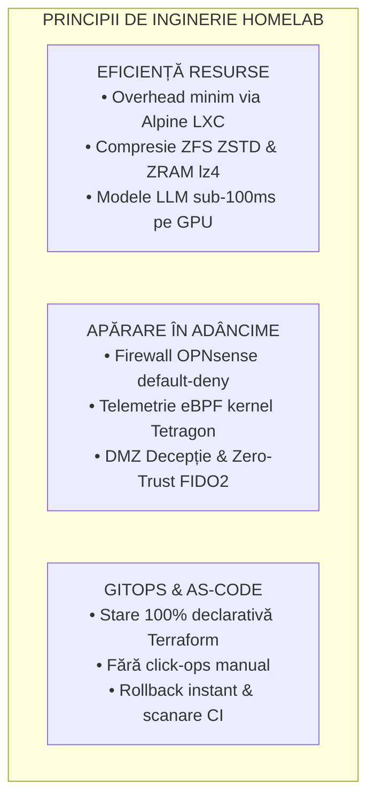
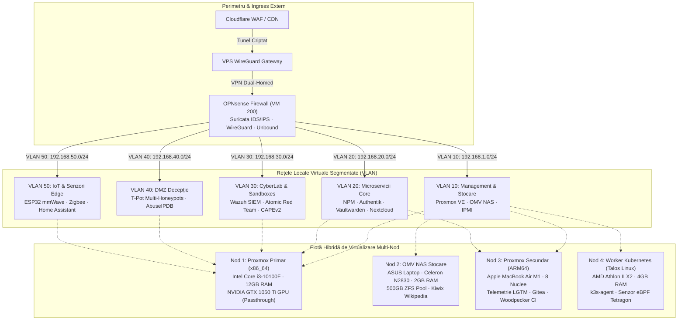
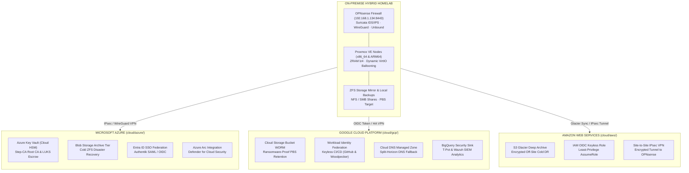
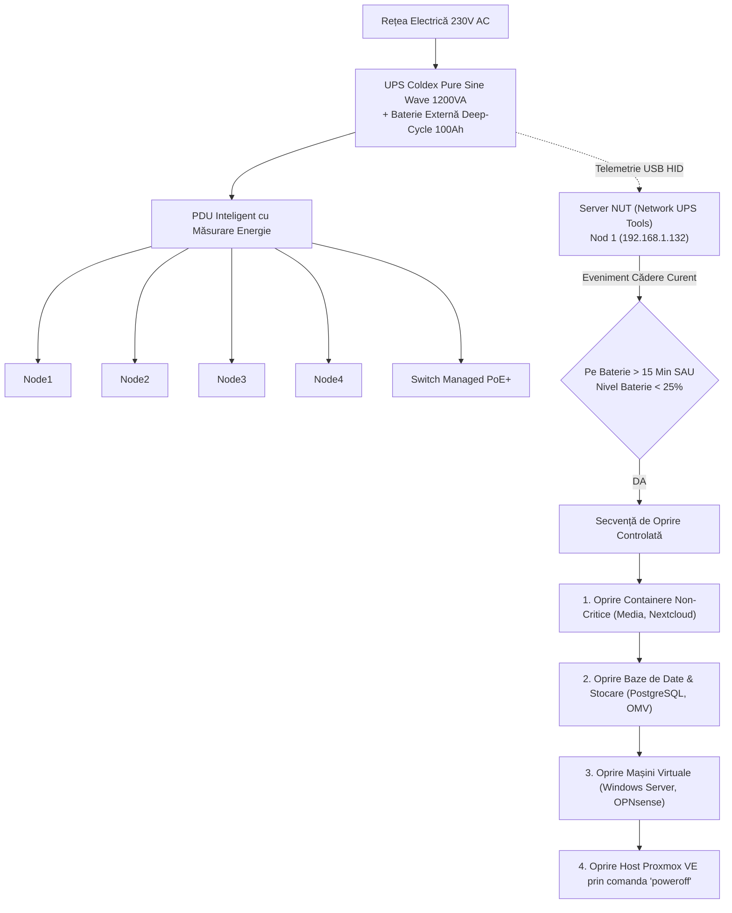
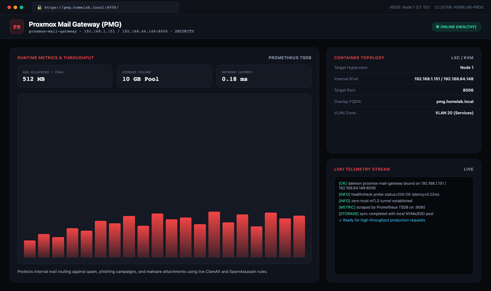

# Laborator de Inginerie de Platformă & Cloud Hibrid Enterprise

**[ Română ](README.ro.md) • [ English ](README.md) • [ Français ](README.fr.md) • [ Español ](README.es.md) • [ Deutsch ](README.de.md)**

[-emerald?style=flat&logo=terraform)](https://github.com/stefanutc1/homelab/tree/main/terraform)

 

**Platformă hibridă de nivel enterprise, poligon de securitate cibernetică și infrastructură autonomă de orchestrare cu agenți AI.**
Construită pe arhitectură hibridă de calcul (Intel x86_64 și Apple Silicon ARM64), segmentare de rețea cu firewall OPNsense, stocare ZFS de înaltă performanță, automatizare declarativă prin Terraform/Ansible și observabilitate în timp real la nivel de kernel prin eBPF.

[Web Architecture Viewer Interactiv Live](https://stefanutc1.github.io/homelab/) • [Blueprint Arhitectură](ARCHITECTURE.md) • [Politici Securitate](SECURITY.md) • [Roadmap](ROADMAP.md)

---

## Cuprins

1. [Misiune și Principii de Proiectare](#1-misiune-și-principii-de-proiectare)
2. [Arhitectură End-to-End și Topologie de Rețea](#2-arhitectură-end-to-end-și-topologie-de-rețea)
3. [Flotă Hardware Fizică și Sistem de Alimentare](#3-flotă-hardware-fizică-și-sistem-de-alimentare)
4. [Matrice de Alocare Resurse per Container LXC și VM](#4-matrice-de-alocare-resurse-per-container-lxc-și-vm)
5. [Arhitectură de Stocare și Optimizare Pool-uri ZFS](#5-arhitectură-de-stocare-și-optimizare-pool-uri-zfs)
6. [Segmentare Rețea și Matrice Firewall Inter-VLAN](#6-segmentare-rețea-și-matrice-firewall-inter-vlan)
7. [Trafic Ingress, Autentificare Zero-Trust și Split-Horizon DNS](#7-trafic-ingress-autentificare-zero-trust-și-split-horizon-dns)
8. [Infrastructură ca și Cod (Terraform și Ansible)](#8-infrastructură-ca-și-cod-terraform-și-ansible)
9. [Kubernetes și Ciclul de Viață GitOps](#9-kubernetes-și-ciclul-de-viață-gitops)
10. [Stiva de Observabilitate LGTM și Pipeline Telemetrie](#10-stiva-de-observabilitate-lgtm-și-pipeline-telemetrie)
11. [Strategie de Backup 3-2-1, Sanoid și Disaster Recovery](#11-strategie-de-backup-3-2-1-sanoid-și-disaster-recovery)
12. [Poligon de Securitate Cibernetică, SOC și eBPF](#12-poligon-de-securitate-cibernetică-soc-și-ebpf)
13. [Rulare Locală LLM pe GPU (Ollama CT 110)](#13-rulare-locală-llm-pe-gpu-ollama-ct-110)
14. [Ingineria Haosului și Validare Reziliență](#14-ingineria-haosului-și-validare-reziliență)
15. [Telemetrie Ambientală și Control Dinamic Ventilatoare](#15-telemetrie-ambientală-și-control-dinamic-ventilatoare)
16. [Hardening Securitate și Integritate Criptografică](#16-hardening-securitate-și-integritate-criptografică)
17. [Director Adrese IP Statice și Porturi](#17-director-adrese-ip-statice-și-porturi)
18. [Runbook de Pornire la Rece (Cold-Start) și Cheat Sheet CLI](#18-runbook-de-pornire-la-rece-cold-start-și-cheat-sheet-cli)
19. [Ghid de Depanare Rapidă (FAQ)](#19-ghid-de-depanare-rapidă-faq)
20. [Structură Monorepo și Ghid de Contribuție](#20-structură-monorepo-și-ghid-de-contribuție)

---

## 1. Misiune și Principii de Proiectare

* **Eficiență Maximă de Resurse**: Virtualizare de înaltă densitate cu consum minim de CPU/RAM. Containerele Alpine Linux și Debian slim maximizează performanța pe hardware eterogen.
* **Apărare în Adâncime (Defense-in-Depth)**: Segmentare L2/L3 pe 5 VLAN-uri izolate, bouncere CrowdSec cu blocare IP în timp real, detecție intruziuni Suricata și trasare la nivel de apeluri kernel prin Cilium Tetragon.
* **GitOps Declarativ**: Orice container, mașină virtuală, regulă de firewall, dashboard și secret este definit declarativ în depozitul Git prin Terraform, Ansible și Docker.
* **Toleranță la Erori**: Backup-uri automatizate, validare periodică de Disaster Recovery, proceduri de cold-start și sistem UPS cu baterie de descărcare adâncă și shutdown secvențial controlat.

---

## 2. Arhitectură End-to-End și Topologie de Rețea

---

### 2.4 Micro-Segmentare 802.1Q VLAN & Politici Firewall (OPNsense)

Perimetrul OPNsense (VM 200 · 192.168.1.134) enforcează o arhitectură zero-trust de micro-segmentare pe 5 VLAN-uri 802.1Q izolate prin reguli de Packet Filter (`pf`):

| VLAN ID | Segment Retea | Subnet CIDR | Gateway | Sarcini de Lucru Atasate | Politica de Securitate |
| :--- | :--- | :--- | :--- | :--- | :--- |
| **VLAN 10** | Management & Storage Subnet | `192.168.1.0/24` | `192.168.1.1` | Proxmox Core (x86_64), OMV NAS, Switch-uri Administrabile | Izolat strict de subretelele IoT si Guest |
| **VLAN 20** | Core Microservices & Applications | `192.168.1.0/24` & `192.168.64.0/24` | `192.168.1.132` (OPNsense) | NPM Ingress, Vaultwarden, Immich, Nextcloud, Home Assistant, Gitea, Ollama (CT 110) | Autentificare stricta inainte de acces via Authentik (CT 108) |
| **VLAN 30** | Cyber Security & Sandboxes (CyberLab) | `192.168.30.0/24` | `192.168.1.132:8443` | Wazuh XDR SIEM (1514), Suricata IDS, Atomic Red Team, CAPEv2 / Cuckoo Sandbox (Win10 + INetSim) | Port mirror SPAN promiscuu, fara acces WAN outbound pentru sandbox-uri |
| **VLAN 40** | DMZ Deception & Honeypots | `192.168.40.0/24` | `192.168.1.132` (OPNsense) | Cluster T-Pot (Cowrie SSH, Dionaea, RDP honeypot, Honeytrap) | DMZ complet izolat; blocare automata a atacatorilor prin AbuseIPDB |
| **VLAN 50** | IoT & Dispozitive Fizice Edge | `192.168.50.0/24` | `192.168.1.132` | Radar mmWave ESP32, Relee Irigatii ESP32, Gateway Zigbee | Comunicatie MQTT restrictionata strict la Home Assistant (CT 106) |

---

## 3. Arhitectură Multi-Cloud Hibridă (Azure, GCP, AWS)

Clusterul on-premise este extins hibrid cu cei trei mari furnizori cloud publici (**Microsoft Azure**, **Google Cloud Platform**, **Amazon Web Services**) prin declarații Infrastructure as Code (IaC) modulare în directorul [`cloud/`](cloud/README.md) și [`terraform/`](terraform/):

### Matricea de Integrare Cloud & Optimizare Cost Zero

| Cloud Provider | Director IaC | Resurse Cheie Declarate | Tier Optimizare Cost |
| :--- | :--- | :--- | :--- |
| **Microsoft Azure** | [`cloud/azure/`](cloud/azure/) | `azurerm_key_vault` (Cloud HSM Root CA & LUKS), `azurerm_storage_blob` (Archive Tier DR), `azuread_application` (SSO Authentik), `azurerm_arc_machine` (Defender for Cloud) | Archive Tier + Free Tier HSM |
| **Google Cloud (GCP)** | [`cloud/gcp/`](cloud/gcp/) | `google_storage_bucket` (WORM Object Lock PBS/Restic), `google_iam_workload_identity_pool` (Keyless OIDC), `google_dns_managed_zone` (DNSSEC fallback), `google_logging_project_sink` (BigQuery SIEM) | Coldline / Archive + BigQuery Free |
| **Amazon Web Services** | [`cloud/aws/`](cloud/aws/) | `aws_s3_bucket` (Glacier Deep Archive 365d), `aws_iam_openid_connect_provider` (Keyless CI/CD AssumeRole), `aws_vpn_connection` (Site-to-Site IPsec OPNsense) | Glacier Deep Archive + Free STS |

---

## 4. Matricea de Calitate CI/CD Enterprise (9 Fluxuri Automate)

Infrastructura și codul sursă sunt verificate continuu prin **9 pipeline-uri GitHub Actions** executând **peste 36 de verificări paralele de securitate, linting și conformitate**:

| # | Fișier Workflow | Nume Pipeline | Garanții de Calitate & Verificări Automate |
| :---: | :--- | :--- | :--- |
| 1 | [`.github/workflows/homelab-ci-cd-matrix.yml`](.github/workflows/homelab-ci-cd-matrix.yml) | **Enterprise Quality Matrix** | `terraform fmt` & `validate` (on-prem + multi-cloud), Checkov IaC Security, Trivy Misconfig, Docker Compose validation, ShellCheck, Secret Leakage, ELO Matrix (Python 3.9-3.13) |
| 2 | [`.github/workflows/ci.yml`](.github/workflows/ci.yml) | **Core CI Pipeline** | Gitleaks & TruffleHog (Secrets Scan), Ruff Lint, MyPy Static Types, Bandit SAST, Semgrep, Ansible Syntax Check pe toate playbook-urile, Kubeconform Kubernetes validation |
| 3 | [`.github/workflows/cd.yml`](.github/workflows/cd.yml) | **Continuous Deployment** | GitOps Reconciliation, Container Image Packaging pe GHCR, Verificare Rollback automat |
| 4 | [`.github/workflows/container-scan.yml`](.github/workflows/container-scan.yml) | **Container Security** | Trivy Container Image Scanner & Dockle CIS Docker Benchmark compliance |
| 5 | [`.github/workflows/security-scan.yml`](.github/workflows/security-scan.yml) | **CodeQL SAST Analysis** | Motorul avansat GitHub CodeQL pentru analiză statică a vulnerabilităților (Python & TypeScript) |
| 6 | [`.github/workflows/security-scheduled.yml`](.github/workflows/security-scheduled.yml) | **Nightly Security Audit** | Scanare nocturnă programată (02:00 UTC) pentru CVE-uri în dependențe (Pip-Audit, NPM Audit, Trivy FS) |
| 7 | [`.github/workflows/deploy-pages.yml`](.github/workflows/deploy-pages.yml) | **Deploy GitHub Pages** | Build de producție Angular 19 și publicare automată zero-downtime a site-ului de documentație |
| 8 | [`.github/workflows/desktop-macos-release.yml`](.github/workflows/desktop-macos-release.yml) | **macOS Native Release** | Compilare universală C# .NET 10, semnare și împachetare binară `.dmg` a aplicației desktop ELO |
| 9 | [`.github/workflows/readme-sync.yml`](.github/workflows/readme-sync.yml) | **Documentation Sync** | Sincronizarea automată a metricilor și verificarea badge-urilor în toate cele 5 limbi |

---

## 9. Flotă Hardware Fizică și Sistem de Alimentare

### Matrice Specificații Hardware

| Identificator Nod | Șasiu / Form Factor | Arhitectură CPU | Accelerator / GPU | Alocare RAM | Configurație Stocare | Rol Principal |
| :--- | :--- | :--- | :--- | :--- | :--- | :--- |
| **`pve` (Nod 1)** | Turn ATX Custom | Intel Core i3-10100F (4C/8T @ 4.30 GHz) | NVIDIA GeForce GTX 1050 Ti (4GB VRAM) | 12 GB DDR4-2133 (12.288 MB) | 512 GB NVMe SSD (`local-lvm`) | Hypervisor Primar: Windows Server 2025 AD, OPNsense, Ollama GPU (CT 110), Immich AI |
| **`openmediavault` (Nod 2)** | Laptop ASUS X451MA | Intel Celeron N2830 (2C/2T @ 2.16 GHz) | Intel HD Graphics | 2 GB DDR3L | 500 GB SATA HDD (Oglindă ZFS) | NAS Centralizat: stocare NFS/SMB, destinație backup vzdump, arhivă offline Wikipedia (Kiwix) |
| **`pve` (Nod 3)** | Apple MacBook Air (2020) | Apple M1 (4P + 4E Cores @ 3.20 GHz) | 16-Core Apple Neural Engine / Metal | 8 GB Unified (4GB dedicat VM) | 256 GB Apple APFS NVMe | Hypervisor Secundar ARM64 (UTM): Grafana/Prometheus/Tempo, Gitea, Woodpecker CI |
| **`kubernetes` (Nod 4)** | Șasiu ATX Custom | AMD Athlon II X2 220 (2C/2T @ 2.80 GHz) | NVIDIA GeForce GTS 250 (1GB) | 4 GB DDR3-1333 | 80 GB HDD (NFS Root) | Worker imutabil Talos Linux / k3s, joburi batch, senzor securitate eBPF |

### Alimentare Neîntreruptibilă și Secvență de Oprire Controlată NUT

---

## 10. Matrice de Alocare Resurse per Container LXC și VM

### Catalog Containere LXC

### Catalog Detaliat Containere LXC (Nodul 1 — x86_64 Primar)

| VMID | Nume Gazdă | SO Bază | vCPU | RAM Alocat | Pool Stocare | IP Static | Categorie Subsistem | Serviciu Principal |
| :--- | :--- | :--- | :--- | :--- | :--- | :--- | :--- | : |

---

## Galerie Foto: Panouri de Management, Servicii si Telemetrie Loki

Toate componentele hardware, masinile virtuale si containerele ruleaza pe echipamente fizice. Mai jos sunt prezentate capturile directe ale panourilor de control, ale serviciilor active si ale fluxurilor de telemetrie si jurnalizare centralizate prin Grafana Loki.

### Panouri Principale de Management
| Grafana: Noduri Homelab (12GB x64 & ARM64) | Grafana: OPNsense Perimeter Defense |
| :---: | :---: |
|  |  |

| Proxmox VE 9.2 x86_64 (12GB RAM · 192.168.1.132:8006) | Proxmox VE 9.2 ARM64 Apple M1 (192.168.64.14:8006) |
| :---: | :---: |
|  |  |

| Pi-hole DNS Sinkhole & FTL (192.168.1.4:8080) | Home Assistant Automation Hub (192.168.1.10:8123) |
| :---: | :---: |
|  |  |

| OPNsense Suricata 8 NIDS/IPS (192.168.1.134:8443) | OPNsense: Politici Filtrare VLAN (pf rules) |
| :---: | :---: |
|  |  |

| OPNsense: WireGuard Kernel VPN Mesh | OPNsense: Unbound DNS-over-TLS (DoT) |
| :---: | :---: |
|  |  |

---

### Core & Networking
| Nginx Proxy Manager | Pi-hole DNS Sinkhole |
| :---: | :---: |
|  |  |

| Tailscale Mesh | WireGuard Easy |
| :---: | :---: |
|  |  |

| OPNsense Core Gateway | OPNsense Unbound DoT |
| :---: | :---: |
|  |  |

| OPNsense FRR Dynamic Routing | Caddy Ingress mTLS |
| :---: | :---: |
|  |  |

---

### Storage & Backup
| Nextcloud Hub | Paperless-ngx Document OCR |
| :---: | :---: |
|  |  |

| MinIO S3 Object Storage | Kopia Snapshot Backup |
| :---: | :---: |
|  |  |

| Syncthing File Sync | Proxmox Backup Server (PBS) |
| :---: | :---: |
|  |  |

---

### Automatizare & AI
| Ollama LLM Runtime | Open-WebUI AI Interface |
| :---: | :---: |
|  |  |

| Faster-Whisper Voice Transcription | Flowise LLM Orchestrator |
| :---: | :---: |
|  |  |

| Home Assistant Automation Hub | RenovateBot GitOps Engine |
| :---: | :---: |
|  |  |

---

### Observabilitate & Monitorizare
| Grafana Enterprise Dashboard | Prometheus Metrics Engine |
| :---: | :---: |
|  |  |

| Loki Distributed Log Aggregator | Uptime Kuma SLA Monitor |
| :---: | :---: |
|  |  |

| Gatus Status Healthchecker | Beszel Lightweight Metrics |
| :---: | :---: |
|  |  |

| Blackbox Network Exporter | Vector High-Throughput Aggregator |
| :---: | :---: |
|  |  |

| Dozzle Real-Time Log Viewer |  |
| :---: | :---: |
|  |  |

---

### Securitate & Cyber Lab
| OPNsense Suricata 8 NIDS/IPS | OPNsense CrowdSec LAPI Bouncer |
| :---: | :---: |
|  |  |

| Wazuh SIEM / XDR Manager | T-Pot Honeypot Multi-Sensor |
| :---: | :---: |
|  |  |

| CyberChef Cryptographic Utility | DFIR Dynamic Malware Sandbox |
| :---: | :---: |
|  |  |

| HashiCorp Vault Secrets Engine | Deception Canary Tokens & Decoys |
| :---: | :---: |
|  |  |

---

### Media & Utilitare
| Stirling-PDF Manipulation Suite | Kavita Digital Library |
| :---: | :---: |
|  |  |

| Audiobookshelf Streaming Server | TubeArchivist YouTube Archive |
| :---: | :---: |
|  |  |

| Transmission BitTorrent Client | Calibre-Web E-Book Manager |
| :---: | :---: |
|  |  |

| RomM Retro Game Rom Manager | EmulatorJS Browser Arcade |
| :---: | :---: |
|  |  |

| Code-Server VS Code Cloud IDE | Draw.io Architecture Designer |
| :---: | :---: |
|  |  |

| IT-Tools Network & Developer Toolkit | Actual Budget Local Accounting |
| :---: | :---: |
|  |  |

| Trillium Structured Knowledge Base | ChangeDetection Web Monitor |
| :---: | :---: |
|  |  |

| MicroBin Encrypted Pastebin | Vikunja Task Management |
| :---: | :---: |
|  |  |

| Memos Lightweight Note Stream | Wallos Subscription Tracker |
| :---: | :---: |
|  |  |

| Speedtest Tracker Continuous Bench | Homepage Dashboard |
| :---: | :---: |
|  |  |

| Flame Application Launcher |  |
| :---: | :---: |
|  |  |

---

### Sisteme de Operare Specializate & Telemetrie (Loki Telemetry & Runtime Logs)
| Windows Server 2025 (VM 201 · Loki Telemetry) | Red Hat Enterprise Linux 9.8 (VM 202 · Loki Telemetry) |
| :---: | :---: |
|  |  |

| FreeBSD 15.1-RELEASE (VM 203 · Loki Telemetry) | OpenBSD 7.9 Bastion (VM 204 · Loki Telemetry) |
| :---: | :---: |
|  |  |

| Talos Linux 1.7 (VM 205 · Loki Telemetry) | Proxmox Datacenter Manager (CT 147 · Loki Telemetry) |
| :---: | :---: |
|  |  |

| Proxmox Mail Gateway (CT 148 · Loki Telemetry) |  |
| :---: | :---: |
|  |  |

---

## Despre Autor (About Me)

Proiect conceput, configurat si operat de **[@stefanutc1](https://github.com/stefanutc1)**.
* **Specializare**: Inginerie de Infrastructura, Virtualizare Hibrida (Proxmox VE x86_64 12GB DDR4-2133 si Apple Silicon ARM64), Securitate Retea & Zero-Trust (OPNsense, Suricata, CrowdSec, WireGuard), Smart Home (Home Assistant), DNS Filtering (Pi-hole), GitOps & IaC (Terraform, Ansible, CI/CD).
* **Scop**: Portofoliu tehnic ce demonstreaza bune practici in arhitectura de sisteme on-premise si hibride.
