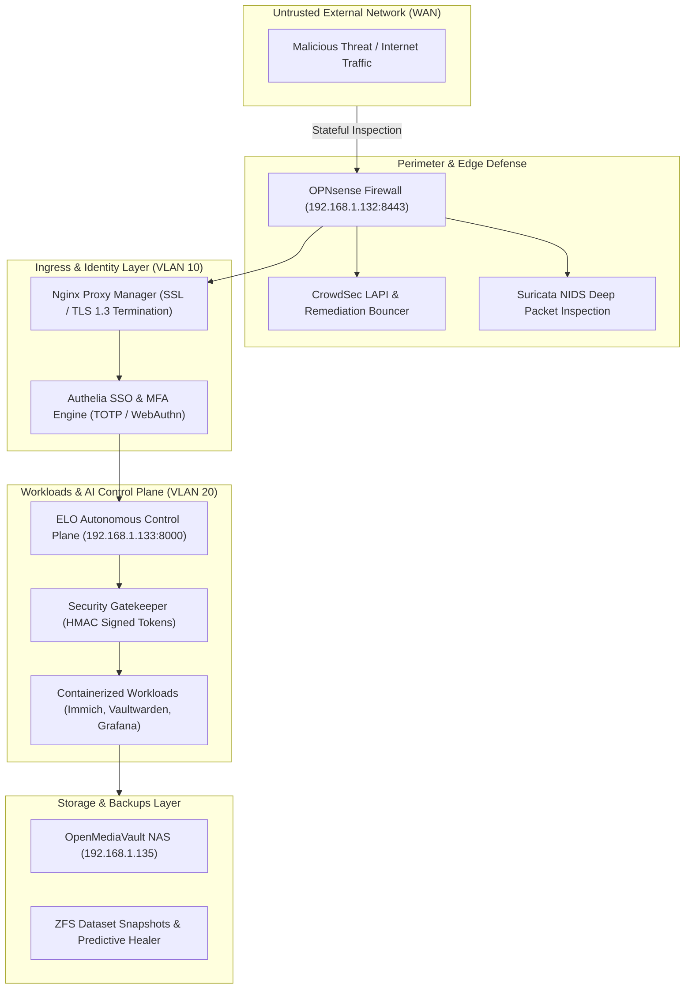
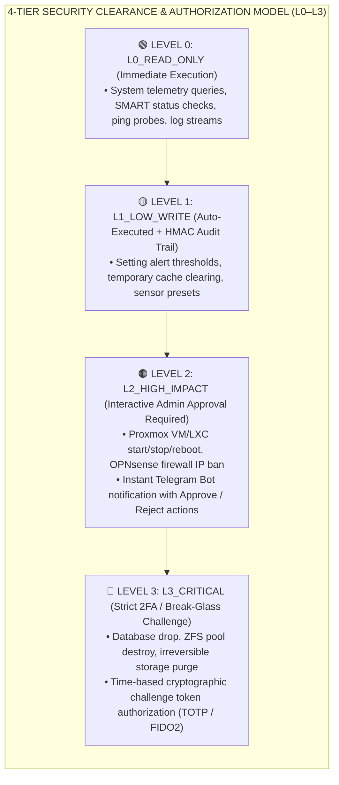
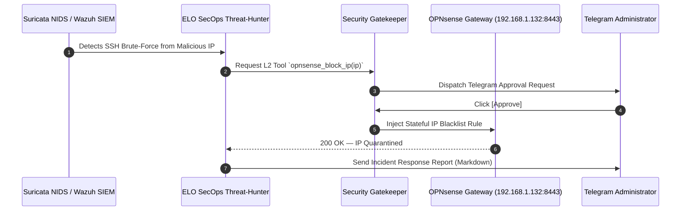

# Homelab & ELO Security Policy & Threat Model

Welcome to the **Homelab & ELO (Enhanced Local Orchestrator)** Security Policy. This document defines the security architecture, threat model, cryptographic baselines, security clearance rings, vulnerability disclosure protocols, and incident containment runbooks for the entire infrastructure monorepo.

---

## Table of Contents
1. [Security Architecture & Zero-Trust Posture](#1-security-architecture--zero-trust-posture)
2. [Security Ring Clearance Model (L0–L3)](#2-security-ring-clearance-model-l0l3)
3. [Cryptographic Standards & Token Architecture](#3-cryptographic-standards--token-architecture)
4. [Shift-Left DevSecOps & Automated Verification](#4-shift-left-devsecops--automated-verification)
5. [Threat Model & STRIDE Analysis](#5-threat-model--stride-analysis)
6. [Active Defense & Incident Response Playbook](#6-active-defense--incident-response-playbook)
7. [Vulnerability Disclosure & Reporting Policy](#7-vulnerability-disclosure--reporting-policy)

---

## 1. Security Architecture & Zero-Trust Posture

The platform enforces a strict **Zero-Trust Network Architecture (ZTNA)**. No workload, virtual machine, or local endpoint is trusted implicitly, regardless of network locality.



### Network Segmentation Matrix

| VLAN ID | Subnet | Security Zone | Ingress / Egress Rules |
| :---: | :--- | :--- | :--- |
| **VLAN 1** | `192.168.1.0/24` | **Management** | Hypervisors (`192.168.1.132`), IPMI, managed switches. Accessible strictly via physical console or Tailscale mesh admin. |
| **VLAN 10** | `192.168.10.0/24` | **Core & Ingress** | Reverse proxy, OPNsense, Authelia SSO, Pi-hole DNS sinkhole (`192.168.1.4`). No raw database access. |
| **VLAN 20** | `192.168.20.0/24` | **Applications** | Immich, Nextcloud, Vaultwarden, Grafana, ELO API. Inter-container traffic governed by Docker internal networks. |
| **VLAN 30** | `192.168.30.0/24` | **Kubernetes (K3s)** | Worker and control plane nodes. Pod CIDR: `10.42.0.0/16`. Network policies isolate namespaces. |
| **VLAN 40** | `192.168.40.0/24` | **IoT & ESP32** | Isolated edge sensors. Outbound WAN blocked; MQTT traffic allowed strictly to Home Assistant (`192.168.1.10:1883`). |

---

## 2. Security Ring Clearance Model (L0–L3)

Every tool and operational command exposed to ELO is bound to a strict **Security Level**:



---

## 3. Cryptographic Standards & Token Architecture

### 1. Capability Tokens
- **Algorithm**: `HMAC-SHA256` computed over `action_name:target_resource:timestamp:nonce`.
- **TTL**: Strict 300-second expiration window to prevent replay attacks.
- **Verification**: Zero external database dependency for cryptographic validation.

### 2. Transport & Key Standards
- **TLS**: Enforce strictly **TLS 1.3** and **TLS 1.2** with strong ciphers (`TLS_AES_256_GCM_SHA384`, `ECDHE-ECDSA-AES256-GCM-SHA384`).
- **SSH Keys**: Pure **Ed25519** (`256-bit`) or **RSA** ($\ge 4096\text{-bit}$). Password authentication is disabled across all nodes.
- **ZFS Encryption**: Storage pools use `AES-256-GCM` native dataset encryption with off-host key escrow.

---

## 4. Shift-Left DevSecOps & Automated Verification

Every commit pushed to the monorepo is audited across multiple automated security layers before merge:

1. **Gitleaks & TruffleHog**: Scans full git commit history for leaked API keys, tokens, or private certificates.
2. **Bandit AST Scanner**: Static Python Abstract Syntax Tree analysis checking for SQL injection, insecure deserialization, and unsafe shell subprocess executions.
3. **Semgrep SAST**: Semantic security checks across IaC templates, configuration playbooks, and Python sources.
4. **Trivy Vulnerability Scanner**: Automated CVE scanning across container images, OS base layers, and package dependencies.
5. **ShellCheck-Py**: Portability and dangerous parameter expansion analysis across all automation scripts.

---

## 5. Threat Model & STRIDE Analysis

| STRIDE Category | Potential Threat | Homelab Mitigation Control |
| :--- | :--- | :--- |
| **Spoofing** | Unauthorized entity attempting ELO command execution. | HMAC capability tokens with dynamic nonces + Telegram Bot biometric approval. |
| **Tampering** | Modification of infrastructure state or log tampering. | Write-once append-only SQLite/PostgreSQL audit logs + ZFS read-only snapshots. |
| **Repudiation** | Operator denying execution of destructive action. | Cryptographic audit trail logging IP, actor, timestamp, and token signature. |
| **Information Disclosure** | Leak of API keys or container credentials. | `.env` files strictly gitignored + Gitleaks/TruffleHog CI verification + Docker secrets. |
| **Denial of Service** | LLM API quota exhaustion or network brute-force. | Zero-latency failover cascade (Gemini $\to$ Groq $\to$ OpenRouter $\to$ Ollama) + CrowdSec bouncer. |
| **Elevation of Privilege** | Sub-agent attempting out-of-band L3 action. | Gatekeeper strictly intercepts tool execution; cannot be bypassed by prompt injection. |

---

## 6. Active Defense & Incident Response Playbook

### Automated Threat Containment Flow


### Emergency Host Isolation (Break-Glass)
In the event of an active compromise on any virtual machine:
```bash
# Instant network isolation via Ansible playbook
ansible-playbook -i ansible/inventory/hosts.ini ansible/playbooks/incident_response.yml -e target_host=<COMPROMISED_HOST>
```

---

## 7. Vulnerability Disclosure & Reporting Policy

We welcome responsible security research. If you discover a security vulnerability within this repository:

1. **Do NOT open a public GitHub issue.**
2. Report the vulnerability privately via **GitHub Private Vulnerability Reporting** or email the maintainer directly at `stefanutc1@users.noreply.github.com`.
3. Provide a detailed Proof of Concept (PoC) and remediation steps.
4. **Response SLAs**:
   - **Initial Acknowledgement**: Within 24 hours.
   - **Triage & Classification**: Within 48 hours.
   - **Fix Release & Advisory**: Within 7 days for High/Critical issues.
