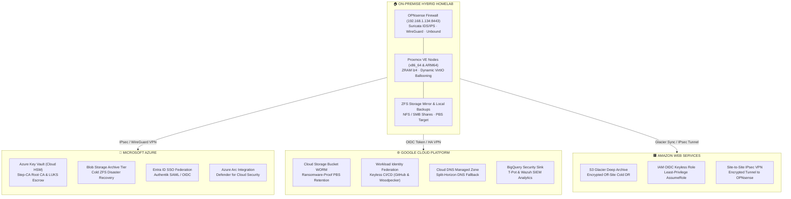

# Enterprise Multi-Cloud Hybrid Architecture (Terraform)

This directory contains production-ready Infrastructure as Code (IaC) declarations for **Microsoft Azure**, **Google Cloud Platform (GCP)**, and **Amazon Web Services (AWS)** integrated with the on-premise Homelab cluster.



---

## 1. Provider Breakdown & Zero-Cost Architecture

| Cloud Provider | Directory | Core Architectural Capabilities | Cost Optimization Tier |
| :--- | :--- | :--- | :--- |
| **Microsoft Azure** | [`azure/`](azure/) | • **Azure Key Vault**: HSM escrow for Step-CA Root CA & LUKS Tang/Clevis keys<br/>• **Blob Storage Archive Tier**: Low-cost ZFS snapshot cold backup<br/>• **Entra ID SAML/OIDC**: Enterprise Identity Federation with Authentik<br/>• **Azure Arc**: Proxmox node onboarded to Defender for Cloud | Archive Tier + Free Tier / Standard HSM |
| **Google Cloud (GCP)** | [`gcp/`](gcp/) | • **Cloud Storage WORM**: Ransomware-proof immutable PBS/Restic backup<br/>• **Workload Identity Federation**: Zero static `credentials.json` for CI/CD<br/>• **Cloud DNS Sync**: Fallback external DNS if on-prem Unbound fails<br/>• **BigQuery Sink**: T-Pot & Wazuh SIEM security telemetry export | Coldline/Archive Tier + BigQuery Free Tier |
| **Amazon Web Services** | [`aws/`](aws/) | • **S3 Glacier Deep Archive**: Encrypted off-site cold storage<br/>• **IAM OIDC Provider**: Keyless GitHub Actions & Woodpecker assume-role<br/>• **Site-to-Site IPsec VPN**: Direct interconnect to OPNsense | Glacier Deep Archive + Free Tier STS |

---

## 2. Directory Layout

```
cloud/
├── azure/
│   ├── providers.tf         # azurerm & azuread provider versions and state config
│   ├── main.tf              # Resource Group definition
│   ├── keyvault.tf          # Azure Key Vault HSM & Root CA backup keys
│   ├── storage.tf           # Blob Storage with Archive Tier lifecycle policies
│   ├── iam.tf               # Entra ID Authentik App & Azure Arc Service Principals
│   ├── arc.tf               # Azure Arc Hybrid Machine declaration
│   ├── networking.tf        # VNet, Subnets & Site-to-Site VPN Gateway
│   ├── variables.tf         # Region, names & CIDR configurations
│   ├── outputs.tf           # Key Vault URI, Container endpoints & Public IPs
│   └── README.md
├── gcp/
│   ├── providers.tf         # Google provider and state config
│   ├── main.tf              # Base orchestration locals
│   ├── storage.tf           # WORM Object Lock Bucket with Coldline/Archive rules
│   ├── iam.tf               # Workload Identity Pool & Provider for GitHub Actions
│   ├── dns.tf               # Cloud DNS Managed Zone with DNSSEC
│   ├── logging.tf           # BigQuery SIEM dataset & Cloud Logging sink
│   ├── networking.tf        # VPC, Subnet, Cloud Router & HA VPN Gateway
│   ├── variables.tf         # Project ID, Region & Repository variables
│   ├── outputs.tf           # Bucket names, OIDC Provider & Nameservers
│   └── README.md
├── aws/
│   ├── providers.tf         # AWS provider and state config
│   ├── main.tf              # Base orchestration
│   ├── storage.tf           # S3 Bucket with Glacier Deep Archive lifecycle & Object Lock
│   ├── iam.tf               # IAM OIDC Provider & Least-Privilege S3 policies
│   ├── networking.tf        # VPC, Subnet, Customer Gateway & VPN Connection
│   ├── variables.tf         # Region, Bucket & Repository variables
│   ├── outputs.tf           # S3 bucket name & OIDC Role ARN
│   └── README.md
└── README.md
```

---

## 3. Operational Runbook

```bash
# Validate Azure
cd cloud/azure && terraform init && terraform validate

# Validate GCP
cd ../gcp && terraform init && terraform validate

# Validate AWS
cd ../aws && terraform init && terraform validate
```
