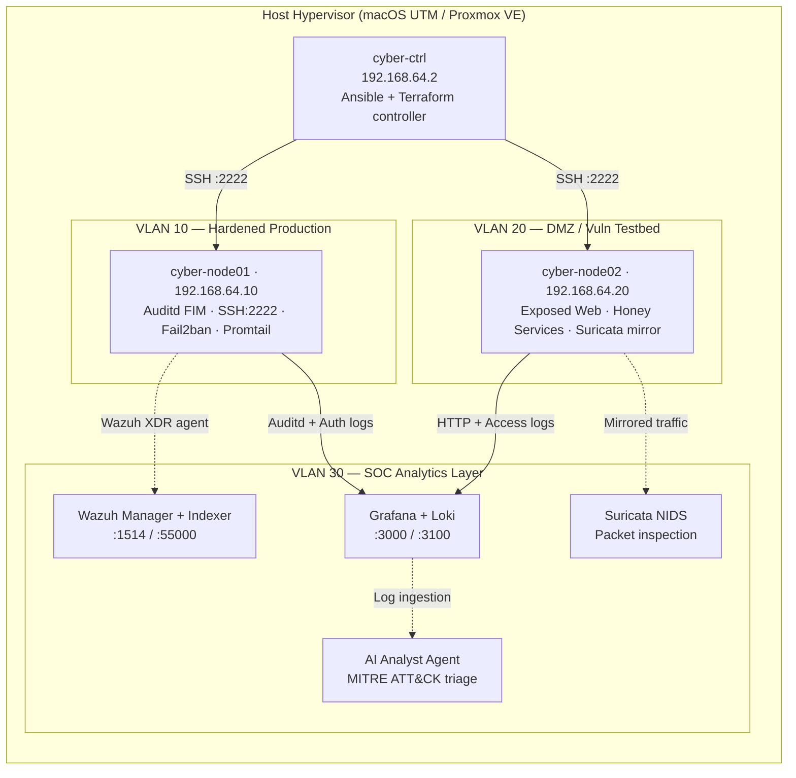

<div align="center">

# CyberLab

**Red Team · Blue Team · DFIR · OSINT · Infrastructure Hardening**

A personal security research lab built on declarative IaC, Ansible automation, and a full SOC/SIEM stack — designed for hands-on offensive research, rigorous defensive engineering, and disciplined incident response practice.

[](https://github.com/stefannut/cyberlab/actions)


[](https://stefannut.github.io/cyberlab/)
[](https://github.com/stefannut/cyberlab/pkgs/container/cyberlab-web)


</div>

---

## What this is

CyberLab is my personal proving ground for offensive security research and defensive automation. Every folder reflects a real workflow — not academic exercises, but the actual playbooks, scripts, and service configs I use to:

- Automate full-stack CIS hardening across virtualized Ubuntu nodes
- Operate a self-hosted SOC with Wazuh XDR, Grafana Loki, and Suricata
- Run structured CTF research, Atomic Red Team tests, and BloodHound AD path analysis
- Collect and triage forensic artifacts from live incidents
- Scan infrastructure continuously with Nuclei, Trivy, TruffleHog, and Semgrep

The stack runs on macOS UTM / QEMU or Proxmox VE — no cloud dependency.

---

## Stack

| Domain | Tools |
|:---|:---|
| Virtualization | Proxmox VE 8/9, Apple Silicon UTM / QEMU |
| Configuration Management | Ansible (role-based, idempotent) |
| Infrastructure as Code | Terraform — Local & Proxmox providers |
| SIEM / XDR | Wazuh Manager 4.8 + Wazuh Dashboard |
| Log Aggregation | Grafana Loki + Promtail |
| Network IDS | Suricata (EVE JSON) |
| Host Auditing | Auditd (FIM), Lynis, custom `seccheck.sh` |
| DFIR / Forensics | `triage_collector.sh`, `memory_dump.sh`, Chainsaw |
| Offensive Research | Atomic Red Team, BloodHound, LinPEAS, Nuclei |
| Static Analysis | Semgrep, TruffleHog, Trivy |
| DevSecOps | Gitea + Woodpecker CI, GitHub Actions |
| AI Threat Intel | Python agents for IOC extraction and MITRE ATT&CK classification |

---

## Network Architecture



---

## Repository Layout

```
cyberlab/
├── .github/                    # GitHub Actions CI (lint, ansible-lint)
├── ansible/
│   ├── roles/
│   │   ├── common/             # APT hardening, NTP, kernel sysctl baseline
│   │   ├── hardening/          # SSH port 2222, Ed25519, UFW, Fail2ban
│   │   ├── auditd_fim/         # CIS-compliant FIM — /etc/passwd, /bin, sudoers
│   │   ├── siem_agents/        # Promtail → Loki log shipping agents
│   │   ├── suricata_nids/      # Suricata NIDS agent deployment
│   │   └── incident_response/  # Emergency host network quarantine
│   ├── playbooks/
│   │   ├── hardening.yml
│   │   └── incident_response.yml
│   └── site.yml                # Master convergence playbook
│
├── audit/
│   ├── rules/                  # Modular CIS Auditd rule files
│   ├── nuclei/                 # Custom Nuclei vulnerability templates
│   ├── semgrep/                # SAST rules for IaC, Dockerfiles, Python
│   ├── trivy/                  # Trivy container and filesystem scan config
│   ├── trufflehog/             # Secret detection rules
│   ├── lynis_audit.sh          # Lynis CIS benchmark runner
│   └── seccheck.sh             # SUID/socket/permissions auditor
│
├── ctf/
│   ├── atomic_red_team/        # MITRE ATT&CK technique execution harness
│   ├── bloodhound/             # AD attack path Cypher queries + analyzer
│   ├── peass/                  # LinPEAS output parser and risk classifier
│   ├── pwn/                    # Binary exploitation research
│   └── web/                    # Web application security testing
│
├── forensics/
│   ├── chainsaw/               # Windows Event Log triage + Sigma rules
│   ├── memory_dump.sh          # Volatile RAM acquisition
│   └── triage_collector.sh     # Live artifact collector (process tree, sockets, auth logs)
│
├── services/
│   ├── wazuh/                  # Wazuh Manager + Dashboard (docker-compose)
│   ├── loki-grafana/           # Loki + Grafana log analytics stack
│   ├── suricata/               # Containerized Suricata NIDS
│   ├── cyberchef/              # Forensic data decoding utility
│   ├── gitea/                  # Private SCM
│   └── woodpecker-ci/          # CI/CD pipeline engine
│
├── scripts/
│   ├── bootstrap.sh            # Lab initialization script
│   ├── bootstrap.ps1           # Windows/Hyper-V bootstrap
│   ├── naabu_recon.sh          # High-speed port scanning
│   ├── trivy_security_scan.sh  # Filesystem vulnerability scan runner
│   ├── trufflehog_scan.sh      # Repository secrets scan
│   └── run_semgrep_sast.sh     # SAST analysis runner
│
├── terraform/                  # Proxmox + local VM topology provisioning
├── hypervisors/                # UTM and Proxmox provisioning guides
├── ai/                         # MITRE ATT&CK correlation + IOC extraction agents
├── docs/                       # Architecture, threat model, compliance matrix
├── inventory/                  # Ansible host inventory
├── Makefile                    # Task runner
└── vm/                         # VM lifecycle management scripts
```

---

## Node Inventory

| Host | Role | IP | Services |
|:---|:---|:---|:---|
| `cyber-ctrl` | Ansible / Terraform controller | `192.168.64.2` | SSH (22), Gitea (3001), Woodpecker (8000) |
| `cyber-node01` | Hardened target | `192.168.64.10` | SSH (2222), Auditd, Promtail |
| `cyber-node02` | DMZ / vuln testbed | `192.168.64.20` | SSH (2222), HTTP/HTTPS, Suricata mirror |
| `cyber-soc01` | SOC analytics node | `192.168.64.30` | Grafana (3000), Loki (3100), Wazuh (1514, 55000) |

---

## Usage

### Deploy the full hardening baseline

```bash
# Validate configs before touching production
make lint

# Apply CIS hardening to all inventory nodes
ansible-playbook -i inventory/hosts.yml ansible/site.yml
```

### Bring up the SOC stack

```bash
make siem-up
# Grafana:   http://localhost:3000  (admin / cyberlabadmin)
# Wazuh:     https://localhost:443
# CyberChef: http://localhost:8088
```

### Collect forensic artifacts from a live node

```bash
make triage
# or directly:
ssh -p 2222 cyberadmin@192.168.64.10 "sudo ./forensics/triage_collector.sh"
```

### Incident response — isolate a compromised host

```bash
# 1. Quarantine
ansible-playbook -i inventory/hosts.yml ansible/playbooks/incident_response.yml \
  -e target_host=cyber-node01

# 2. Triage artifacts
ssh -p 2222 cyberadmin@192.168.64.10 "sudo ./forensics/triage_collector.sh"

# 3. Classify events against MITRE ATT&CK
python3 ai/agent.py --input /tmp/triage_cyber-node01/auth.log
```

### Run security scans

```bash
# Trivy — containers and filesystem
./scripts/trivy_security_scan.sh .

# TruffleHog — secrets in repo history
./scripts/trufflehog_scan.sh

# Semgrep — SAST on IaC and scripts
./scripts/run_semgrep_sast.sh

# Nuclei — internal endpoint scanning
./audit/nuclei/run_nuclei.sh http://192.168.64.20
```

### Atomic Red Team / MITRE ATT&CK validation

```bash
python3 ctf/atomic_red_team/execution_harness.py
```

### BloodHound AD attack path analysis

```bash
python3 ctf/bloodhound/attack_path_analyzer.py
```

### LinPEAS output triage

```bash
python3 ctf/peass/analyze_linpeas.py
```

### Naabu port recon

```bash
./scripts/naabu_recon.sh 192.168.64.20
```

### AI threat correlation

```bash
# Extract IOCs and classify MITRE techniques
python3 ai/agent.py --json
python3 ai/ioc_extractor.py /var/log/syslog --json
```

---

## Ansible Roles Reference

| Role | What it does |
|:---|:---|
| `common` | APT baseline, NTP via Chrony, kernel sysctl (`fs.protected_hardlinks=1`, `kernel.randomize_va_space=2`) |
| `hardening` | SSH to port 2222, Ed25519-only keys, UFW default DROP, Fail2ban SSH jail |
| `auditd_fim` | FIM on `/bin`, `/sbin`, `/etc/passwd`, `/etc/sudoers`, syscall monitoring for privesc patterns |
| `siem_agents` | Promtail agent shipping `audit.log`, `auth.log`, `syslog` to Loki |
| `suricata_nids` | Suricata IDS in EVE JSON mode with rule management |
| `incident_response` | Emergency network lockdown — drops all traffic, preserves only management SSH |
| `system_hardening` | Restrictive umask (027), additional sysctl parameters, hardened login.defs |

---

## CI/CD

GitHub Actions runs on every push and PR:

- `ansible-lint` — role and playbook quality
- `yamllint` — strict YAML compliance
- `python3 -m py_compile` — AI agent syntax validation

Local equivalent:

```bash
make lint
```

---

## License

MIT — Copyright (c) 2026 stefannut (`@stefannut`).
