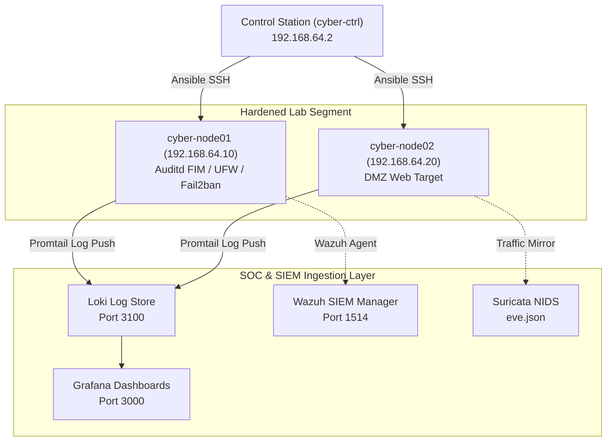

# CyberLab Enterprise Architecture & Network Segmentation

## Network Zoning & Subnets

The CyberLab topology implements strict zero-trust isolation between management controller, hardened target nodes, DMZ services, and SOC analysis platforms.

| Zone / VLAN | CIDR Block | Function | Firewall Policy |
| :--- | :--- | :--- | :--- |
| **MGMT (VLAN 1)** | `192.168.64.0/28` | Ansible & Terraform Controller (`cyber-ctrl`) | Outbound SSH only to targets. Inbound blocked. |
| **LAB-PROD (VLAN 10)** | `192.168.64.16/28` | Primary Hardened Target Nodes (`cyber-node01`) | SSH Port 2222 from MGMT only. |
| **DMZ (VLAN 20)** | `192.168.64.32/28` | Exposed Service Lab Nodes (`cyber-node02`) | Web 80/443 open; lateral movement blocked. |
| **SOC / SIEM (VLAN 30)** | `192.168.64.48/28` | Wazuh, Loki, Grafana, Suricata (`cyber-soc01`) | Ingest ports open (3100, 1514). |

## Data Flow Diagram

