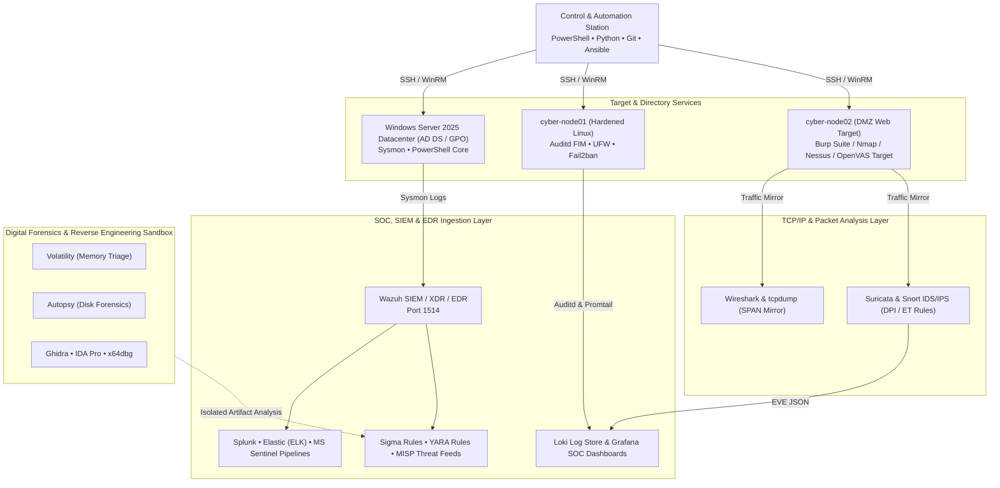

# CyberLab Architecture, SOC Operations & DFIR Toolchain

## Network Zoning & Subnets

The CyberLab topology implements strict zero-trust isolation between management controllers, Windows Server Domain Controllers, hardened Linux targets, DMZ services, SOC analysis platforms, and air-gapped forensic sandboxes.

| Zone / VLAN | CIDR Block | Function | Security & Tooling Policy |
| :--- | :--- | :--- | :--- |
| **MGMT (VLAN 1)** | `192.168.64.0/28` | Ansible, Terraform, PowerShell & Python Controller | Outbound SSH/WinRM only to targets. Inbound blocked. Version control via Git. |
| **LAB-PROD (VLAN 10)** | `192.168.64.16/28` | Windows Server 2025 Datacenter (Active Directory), Hardened Linux Nodes | Sysmon telemetry, Auditd FIM, GPO policies, EDR agent monitoring. |
| **DMZ (VLAN 20)** | `192.168.64.32/28` | Exposed Service Lab Nodes (Web/API testing targets) | Assessed via Nmap, Nessus, OpenVAS, Burp Suite. Lateral movement blocked. |
| **SOC / SIEM (VLAN 30)** | `192.168.64.48/28` | Wazuh Manager, Splunk/Elastic forwarders, Sentinel connectors, Suricata/Snort IDS/IPS | Ingest ports open (3100, 1514). Sigma rules, YARA signatures, MISP feeds. |
| **DFIR SANDBOX (VLAN 35)**| `192.168.64.64/28` | Air-Gapped Malware Analysis & Forensics Lab | Volatility (memory), Autopsy (disk), Ghidra, IDA Pro, x64dbg, Wireshark, tcpdump. |
| **HONEYNET / DECOY (VLAN 40)** | `192.168.64.80/28` | T-Pot 24.04 Multi-Honeypot Platform (VM 213) | Cowrie (SSH/Telnet), Dionaea, Honeytrap, Suricata IDS, Elastic/Kibana telemetry forwarder. |

## Data Flow & Threat Defense Diagram

## Technology Matrix & Tooling Inventory

- **Directory & OS**: Windows Server 2025 Datacenter, Active Directory (AD DS), Group Policy (GPO), Hardened Linux (Debian/Ubuntu/Alpine/Arch), Virtual Machines (KVM/Proxmox/UTM).
- **Networking**: TCP/IP protocol analysis, Wireshark, tcpdump packet capturing.
- **SIEM & Log Pipelines**: Wazuh Manager 4.8, Splunk, Elastic (ELK), Microsoft Sentinel, Grafana Loki.
- **Detection & Perimeter**: EDR Telemetry, Suricata IDS/IPS, Snort, Sysmon, Auditd, CrowdSec.
- **Deception & Honeynet**: T-Pot 24.04 Multi-Honeypot Decoy Platform (VM 213 - Cowrie, Dionaea, Honeytrap, Elastic, Kibana, Suricata IDS telemetry stream to Wazuh).
- **Offensive & Vulnerability Auditing**: Metasploitable 2 (VM 212), Metasploit Framework, Nmap, Nessus, OpenVAS, Burp Suite, BloodHound, Atomic Red Team.
- **Threat Intelligence**: Sigma rules, YARA rules, MISP threat sharing, CyberChef.
- **DFIR & Reverse Engineering**: Autopsy, Volatility 3, Ghidra, IDA Pro, x64dbg.
- **Automation & Scripting**: PowerShell Core, Python 3.12, Git.
