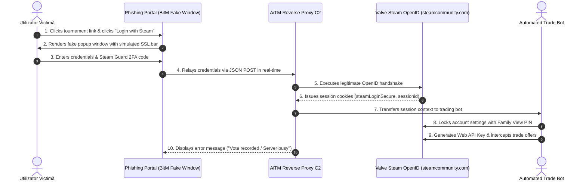

# OpenID MITM Phishing Forensics

**Steam OpenID Protocol · Adversary-in-the-Middle (AiTM) · Browser-in-the-Middle (BitM) · Threat Intelligence**

A comprehensive technical investigation and forensic teardown of an advanced Adversary-in-the-Middle (AiTM) phishing campaign targeting Steam OpenID authentication, Steam Guard session tokens, and digital inventory assets.

---

## Executive Summary

This repository documents the forensic analysis of a real-world **Adversary-in-the-Middle (AiTM)** phishing infrastructure targeting Steam platform users. The threat actor engineered a high-fidelity **Browser-in-the-Middle (BitM)** phishing portal pretending to be an esports tournament voting platform. 

The malicious infrastructure intercepted live OpenID 2.0 authentication exchanges, captured Steam Guard TOTP tokens, harvested session cookies (`steamLoginSecure`, `sessionid`), and abused Steam Web API Keys alongside Family View PIN locks to automate inventory theft.

---

## Attack Lifecycle & Architecture

---

## Repository Structure & Documentation

- ** [`studiu_de_caz.md`](studiu_de_caz.md)** — Exhaustive technical case study in Romanian covering threat actor mechanics, session relay, Family View lockout bypass, full IOC matrix, and MITRE ATT&CK mapping.
- ** [`technical-analysis.md`](technical-analysis.md)** — In-depth breakdown of frontend JavaScript obfuscation, reverse proxy relay mechanics, and credential harvesting payloads.
- ** [`steam-report.md`](steam-report.md)** — Security disclosure report and forensic findings submitted to Valve Security.
- ** [`executive-summary.md`](executive-summary.md)** — High-level threat intelligence summary for incident responders.

---

## Forensic Lab Environment

All analysis was performed inside an isolated, air-gapped testbed:
- **Hypervisor**: Oracle VirtualBox on isolated host OS.
- **Network**: NAT-only network isolation, routed through an intercepting Burp Suite Professional proxy.
- **Target Credentials**: Ephemeral test Steam accounts registered via disposable identities with zero attached personal assets.
- **Triage**: Full packet capture (PCAP), DOM snapshotting, and minified JS de-obfuscation.

---

## Key Mitigations

1. **Verify OpenID Authentication Behavior**: A legitimate Steam OpenID popup on a trusted browser will recognize your existing active session on `steamcommunity.com` and ask for a single-click confirmation ("Sign In") without prompting for your password or TOTP code again.
2. **Audit Web API Keys**: Periodically inspect `https://steamcommunity.com/dev/apikey` for unauthorized API keys.
3. **DNS Sinkholing**: Implement automated threat feed blocklists for newly registered domains (NRDs) matching gaming and tournament keywords.

---

## License & Attribution

Maintained by [`@stefannut`](https://github.com/stefannut). Distributed under the [MIT License](LICENSE).
