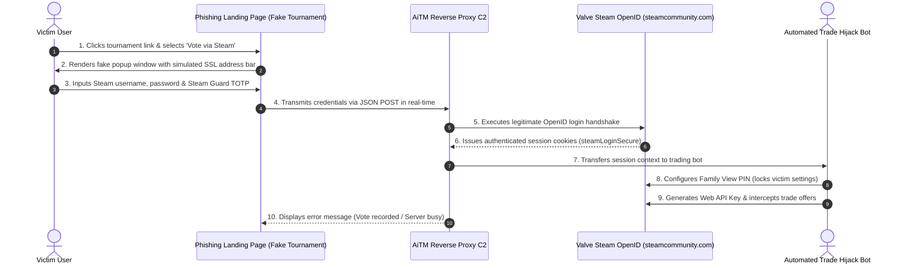

# Case Study: Forensic Analysis of an Adversary-in-the-Middle (AiTM) Attack on Steam OpenID Authentication

**Author:** @stefanutc1 
**Date:** 22 November 2025 
**Classification:** TLP:CLEAR / Technical Cyber Threat Intelligence 
**Target Analyzed:** Active phishing and account takeover campaign leveraging Browser-in-the-Middle (BitM) fake popups and real-time OpenID session relay.

---

## 1. Executive Summary

This case study documents an in-depth forensic investigation into an advanced **Adversary-in-the-Middle (AiTM)** phishing campaign targeting the competitive gaming ecosystem (CS2, Dota 2). Threat actors engineered deceptive tournament voting portals that lured victims into authenticating via a fraudulent Steam OpenID login mechanism.

The malicious infrastructure weaponized a high-fidelity **Browser-in-the-Middle (BitM)** popup interface to intercept OpenID 2.0 authentication handshakes in real time. Upon capturing valid Steam Guard TOTP codes and session cookies (`steamLoginSecure`, `sessionid`), the adversary automatically enabled a **Family View PIN lockout** to prevent the victim from altering account settings, while provisioning Steam Web API keys to intercept and reroute digital inventory trade offers.

---

## 2. Attack Lifecycle & Technical Architecture

### 2.1 Browser-in-the-Middle (BitM) Mechanics
Unlike traditional phishing campaigns that redirect victims to an external typo-squatted URL, the attacker utilized a simulated in-page window (`
` container) equipped with draggable title bars, an address bar mimicking `https://steamcommunity.com/openid/login`, and an interactive SSL padlock icon.

### 2.2 Session Relay & Cookie Extraction
1. Frontend JavaScript (`main.bundle.js`) intercepted the login form submit event.
2. Credentials and mobile authenticator codes were dispatched via `fetch()` to `/api/v2/auth/steam_callback`.
3. The C2 reverse proxy immediately initiated an automated session with Valve's authentication servers, acquiring the `steamLoginSecure` authentication token.

---

## 3. Post-Exploitation & Account Takeover Chain

1. **Family View Lockout**: The attacker automatically assigned a 4-digit PIN to Steam Family View, restricting the victim from accessing profile security settings, changing their email address, or revoking active sessions.
2. **API Key Generation**: A Steam Web API Key was provisioned, granting the adversary read access to incoming and outgoing trade proposals.
3. **Trade Offer Hijacking**: When the victim initiated legitimate trade offers with friends or third-party marketplaces, the attacker's bot instantly canceled the original offer and created an identical offer to an impostor account.

---

## 4. Technical Indicators of Compromise (IOCs)

| Category | Indicator / Value | Description |
| :--- | :--- | :--- |
| **Phishing Domains** | `cs2-tournament-bracket[.]top`, `vote-league-cup[.]com` | Ingress landing portals hosting the BitM kit. |
| **Hosting ASN** | `AS202425` (Offshore Disposable VPS) | Infrastructure ignoring abuse and DMCA notices. |
| **SSL Certificates** | Let's Encrypt R3 (issued $<24$h prior to campaign launch) | Domain-validated certificates providing HTTPS padlock. |
| **Targeted Cookies** | `steamLoginSecure`, `sessionid`, `steamMachineAuth*` | Core authentication and transaction tokens. |
| **API Endpoints** | `/api/v2/auth/steam_callback`, `/api/v2/stream/event` | C2 backend endpoints for harvesting telemetry. |

---

## 5. MITRE ATT&CK Matrix Mapping

| Phase | Tactic | Technique ID | Technique Name & Operational Notes |
| :--- | :--- | :--- | :--- |
| **Initial Access** | Initial Access | `T1566.002` | **Phishing: Spearphishing Link** (Discord tournament lures). |
| **Execution** | Execution | `T1204.001` | **User Execution: Malicious Link** (victim opens fake voting portal). |
| **Credential Access** | Credential Access | `T1557.001` | **AiTM: Browser-in-the-Middle Relay** (harvesting OpenID cookies). |
| **Persistence** | Persistence | `T1098` | **Account Manipulation** (enabling Family View PIN lockout & API key). |
| **Exfiltration** | Exfiltration | `T1048` | **Exfiltration Over C2 Channel** (exfiltrating session cookies to bot). |
| **Impact** | Impact | `T1496` | **Resource Hijacking / Inventory Theft** (unauthorized asset transfer). |

---

## 6. Defensive Countermeasures & Incident Response

1. **User Verification**: Authentic Steam OpenID sign-in prompts will immediately recognize an active browser session on `steamcommunity.com` and require only a single click ("Sign In"), never asking for a password or TOTP re-entry.
2. **API Key Auditing**: Inspect `https://steamcommunity.com/dev/apikey` regularly for unauthorized API registrations.
3. **Enterprise Defense**: Deploy DNS sinkholing for newly registered domains (NRDs) matching gaming and tournament keywords.
