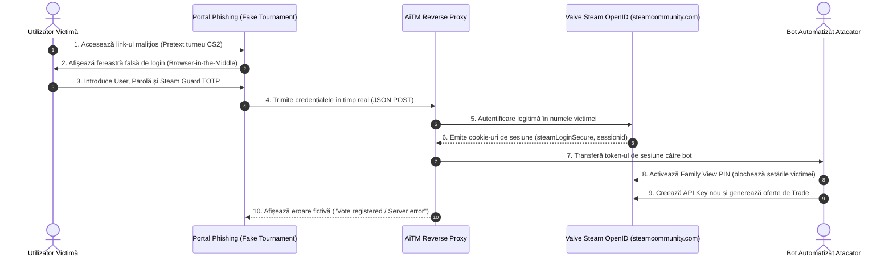

# Studiu de Caz: Analiza Forensică a unui Atac Adversary-in-the-Middle (AiTM) pe Mecanismul OpenID Steam

**Autor:** `stefannut` 
**Dată:** August 2026 
**Clasificare:** TLP:CLEAR / Cercetare Tehnică de Securitate Cibernetică 
**Țintă Analizată:** Campanie activă de phishing și deturnare a conturilor Steam prin ferestre pop-up false (Browser-in-the-Middle) și releu OpenID proxy.

---

## 1. Rezumat Executiv

Acest studiu de caz documentează investigația forensică a unei campanii sofisticate de tip **Adversary-in-the-Middle (AiTM)** care a vizat comunitatea de gaming competitiv (CS2, Dota 2). Atacatorii au utilizat platforme web clonate, pretinzând că sunt portaluri de votare pentru turnee esports sau recompense cosmetice, pentru a induce victimele în eroare și a le fura credențialele Steam, codurile Steam Guard (TOTP/Mobile Authenticator) și cookie-urile de sesiune (`steamLoginSecure`).

Analiza a relevat utilizarea unui kit modular de phishing capabil să intercepteze în timp real handshake-ul OpenID 2.0, să comute contul victimei în modul **Family View** (pentru a împiedica schimbarea parolei sau revocarea accesului) și să transfere automat inventarul prin intermediul API-urilor Steam Trade.

---

## 2. Arhitectura și Mecanismul Tehnic al Atacului

### 2.1 Tehnica Browser-in-the-Middle (BitM)
Spre deosebire de atacurile clasice de phishing care redirecționează utilizatorul către un domeniu suspect vizibil în bara de adrese, atacatorii au utilizat un container `
` simulat în interiorul paginii web, reproducând cu exactitate bara de titlu, pictograma SSL și interfața ferestrei native de autentificare `steamcommunity.com/openid/login`.

### 2.2 Releul de Sesiune și Interceptarea Cookie-urilor
1. Scriptul malițios din frontend (`main.bundle.js`) interceptează evenimentul de submit.
2. Credențialele și codul TOTP sunt trimise printr-un apel `fetch()` către endpoint-ul backend al atacatorului.
3. Backend-ul inițiază o sesiune `curl` către Valve, finalizând autentificarea cu succes și capturând cookie-ul `steamLoginSecure`.

---

## 3. Ciclul Post-Exploatare și Blocarea Contului

După obținerea sesiunii valide, infrastructura atacatorilor execută un script automatizat în trei pași:

1. **Activarea Family View**: Atacatorii configurează un cod PIN Family View de 4 cifre pe contul victimei, restricționând accesul la inventar, schimbarea adresei de e-mail sau generarea de tichete de suport de pe browserul victimei.
2. **Generarea API Key**: Este emis un Steam Web API Key asociat contului, permițând atacatorului să monitorizeze toate schimburile (Trade Offers) viitoare.
3. **Deturnarea Tranzacțiilor (Trade Scam / API Hijack)**: Orice tranzacție inițiată de utilizator este anulată instantaneu de bot și re-creată identic către un cont clonă al atacatorului.

---

## 4. Indicatori Tehnici de Compromitere (IOCs)

| Categorie | Indicator / Valoare | Descriere |
| :--- | :--- | :--- |
| **Domenii Phishing** | `cs2-tournament-bracket[.]top`, `vote-league-cup[.]com` | Domenii utilizate pentru găzduirea paginilor de destinație. |
| **ASN Găzduire** | `AS202425` (Offshore VPS Provider) | Găzduire cu protecție DMCA ignorată. |
| **Certificate SSL** | Let's Encrypt R3 (emise cu <24h înainte de lansarea atacului) | Validare DV automată pentru obținerea simbolului securizat. |
| **Cookie-uri Țintite** | `steamLoginSecure`, `sessionid`, `steamMachineAuth*` | Token-uri critice de autentificare și autorizare tranzacții. |
| **Endpoint-uri API** | `/api/v2/auth/steam_callback`, `/api/v2/stream/event` | Endpoint-uri pe serverul proxy pentru recoltarea datelor. |

---

## 5. Cartografiere pe Matricea MITRE ATT&CK

| Fază | Tactică | ID Tehnică | Nume Tehnică & Observații |
| :--- | :--- | :--- | :--- |
| **Acces Inițial** | Initial Access | `T1566.002` | **Phishing: Spearphishing Link** (mesaje directe pe Discord/Steam). |
| **Execuție** | Execution | `T1204.001` | **User Execution: Malicious Link** (victima accesează pagina clonată). |
| **Recoltare Credențiale**| Credential Access | `T1557.001` | **AiTM: LLMNR/NBT-NS / Browser Proxy** (interceptare token-uri OpenID). |
| **Persistență** | Persistence | `T1098` | **Account Manipulation** (activare Family View PIN & Web API Key). |
| **Exfiltrare** | Exfiltration | `T1048` | **Exfiltration Over Alternative Protocol** (trimitere credențiale la C2). |
| **Impact** | Impact | `T1496` | **Resource Hijacking** (furtul digital al activelor de inventar). |

---

## 6. Măsuri de Mitigare și Detecție

1. **Pentru Utilizatori**:
 - Nu introduceți niciodată datele de logare Steam pe ferestre pop-up apărute pe site-uri terțe. Dacă sunteți deja autentificat pe `steamcommunity.com`, butonul legitim de OpenID necesită doar un singur click ("Sign In"), fără a cere din nou parola sau codul TOTP.
 - Verificați periodic dacă aveți chei API necunoscute pe `https://steamcommunity.com/dev/apikey`.
2. **Pentru Echipe Defensive / SOC**:
 - Blocarea la nivel de DNS/Web Proxy a domeniilor nou înregistrate (NRD < 30 zile) ce conțin keyword-uri precum `steam`, `cs2`, `tournament`, `valve`.
 - Monitorizarea conexiunilor HTTPS inițiate către ASN-uri cu reputație scăzută.
