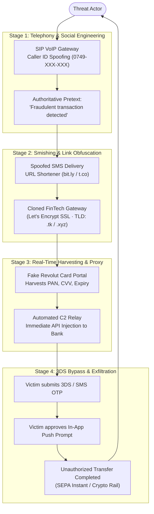

# Revolut Vishing Forensics

**Voice Phishing (Vishing) · Caller ID Spoofing · FinTech Fraud · Real-Time Credential Harvesting**

A forensic analysis, threat intelligence breakdown, and takedown case study of an advanced voice phishing (vishing) and SMS-spoofing campaign targeting Revolut digital banking users.

---

## Executive Summary

This repository contains the full forensic investigation of an organized multi-stage financial cybercrime campaign. Threat actors weaponized **SIP VoIP Caller ID Spoofing** to impersonate Revolut's anti-fraud department, establishing psychological authority and urgency before delivering SMS-based phishing links.

The backend infrastructure utilized dynamically cloned payment interfaces to harvest primary account numbers (PAN), CVVs, and real-time One-Time Passwords (OTP / 3D Secure), while simultaneously coercing victims into approving in-app biometric push notifications to finalize unauthorized fund exfiltration.

---

## Attack Lifecycle & Infrastructure

---

## Repository Structure & Documentation

- ** [`studiu_de_caz.md`](studiu_de_caz.md)** — Exhaustive technical case study in Romanian analyzing the telephony spoofing mechanics, real-time OTP proxy relay, full IOC matrix, and MITRE ATT&CK mapping.
- ** [`technical-analysis.md`](technical-analysis.md)** — Network protocol analysis, HTTP 302 redirection chains, and User-Agent fingerprinting mechanisms.
- ** [`revolut-report.md`](revolut-report.md)** — Incident report and forensic telemetry submitted to Revolut Financial Security.
- ** [`revolut-response.md`](revolut-response.md)** — Formal acknowledgment and technical responses from the banking security team.
- ** [`takedown.md`](takedown.md)** — Domain registrar and host abuse reporting records for infrastructure dismantling.

---

## Key Forensic Findings

1. **SIP Trunking Abuse**: Threat actors utilized unauthenticated foreign SIP providers permitting custom `P-Asserted-Identity` headers to impersonate Romanian national mobile prefixes (`0749-XXX-XXX`).
2. **Reverse Proxy Credential Forwarding**: Harvested card telemetry was forwarded to live banking sessions within $<5$ seconds to intercept short-lived SMS OTP codes.
3. **Evasion Techniques**: 302 redirect funnels specifically rejected desktop User-Agents to prevent indexing by automated threat intelligence crawlers.

---

## License & Attribution

Maintained by [`@stefannut`](https://github.com/stefannut). Distributed under the [MIT License](LICENSE).
