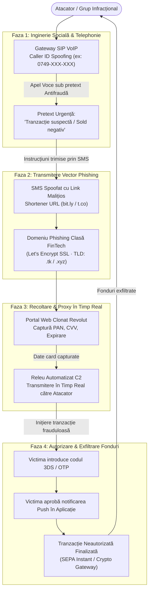

# Studiu de Caz: Inginerie Socială & Voice Phishing (Vishing) Avansat Țintit Asupra Utilizatorilor FinTech (Revolut)

**Autor:** `stefannut` 
**Dată:** August 2026 
**Clasificare:** TLP:CLEAR / Cercetare Tehnică de Securitate Cibernetică 
**Vector Analizat:** Campanie activă de inginerie socială, Voice Phishing (Vishing), Caller ID Spoofing și clonare dinamică a portalului bancar Revolut.

---

## 1. Rezumat Executiv

Acest studiu de caz prezintă investigația tehnică de detaliu a unei campanii active de **Voice Phishing (Vishing)** desfășurate împotriva clienților băncii digitale Revolut din România și Uniunea Europeană. Atacatorii au combinat apeluri vocale de înaltă presiune (utilizând tehnici de **Caller ID Spoofing** pentru a afișa numere oficiale de suport) cu mesaje SMS spoofate ce direcționau victimele către portaluri web malițioase de recoltare în timp real.

Campania a urmărit furtul datelor complete ale cardului bancar (PAN, CVV, Dată Expirare), interceptarea codurilor de autorizare One-Time Password (OTP / 3DS) și forțarea aprobărilor biometrice Push Notification din aplicația mobilă pentru efectuarea unor transferuri SEPA frauduloase neautorizate.

---

## 2. Diagrama de Flux a Atacului (Attack Lifecycle)

---

## 3. Analiza Tehnică a Componentelor de Atac

### 3.1 Tehnici de Spoofing Telefonic (Vishing)
- **Originea Apelului**: Atacatorii utilizează servicii de telefonie VoIP bazate pe protocol SIP (Session Initiation Protocol) cu opțiunea `P-Asserted-Identity` manipulată pentru a injecta numere din plaja națională românească (`0749-XXX-XXX`).
- **Abuzul de Autoritate**: Operatorul fals se prezintă drept membru al "Departamentului Antifraudă și Securitate Cibernetică", folosind termeni bancari legitimi pentru a instaura o stare de panică urgentă ("A fost detectată o retragere neautorizată de 4.800 RON de la un terminal din afara țării").

### 3.2 Segmentul Web și Interceptarea în Timp Real
1. Victima primește un SMS ce conține un link scurtat.
2. Link-ul redirecționează succesiv (HTTP 302) pentru a eluda crawler-ele automate ale companiilor de securitate.
3. Portalul de aterizare clonează pixel cu pixel interfața de autorizare a plăților Revolut, având certificat SSL valid eliberat prin Let's Encrypt.
4. Câmpurile introduse sunt transmise printr-un WebSocket sau endpoint REST direct către consola atacatorului, care introduce datele pe platforma bancară legitimă în mai puțin de 5 secunde.
5. Când banca solicită aprobarea 3D Secure / OTP, portalul fals solicită imediat introducerea codului primit pe SMS sau aprobarea notificării din aplicație.

---

## 4. Indicatori Tehnici de Compromitere (IOCs)

| Categorie | Valoare / Detaliu | Impact |
| :--- | :--- | :--- |
| **Plajă Numere Vishing** | `0749-XXX-XXX` (Prefix național mobil) | Numere utilizate pentru apelurile de inginerie socială. |
| **Domenii Phishing** | `revolut-security-verification[.]xyz`, `secure-revolut-app[.]top` | Portaluri clonate pentru recoltarea datelor bancare. |
| **Tehnologii Web** | Nginx Reverse Proxy, Let's Encrypt DV SSL | Găzduire pe VPS-uri nereglementate. |
| **Mecanisme Bypass** | Lanțuri HTTP 302, filtrare pe bază de User-Agent mobil | Blocarea accesului crawler-elor desktop de securitate. |

---

## 5. Cartografiere pe Matricea MITRE ATT&CK

| Fază | Tactică | ID Tehnică | Descriere |
| :--- | :--- | :--- | :--- |
| **Reconnaissance** | Reconnaissance | `T1598` | **Phishing for Information**: Adunarea de numere de telefon țintite. |
| **Resource Development** | Resource Dev | `T1583.001` | **Acquire Infrastructure: Domains**: Înregistrarea de domenii typosquatting. |
| **Initial Access** | Initial Access | `T1566.004` | **Phishing: Voice / Vishing**: Apel telefonic autoritar cu număr spoofat. |
| **Credential Access** | Credential Access| `T1556` | **Modify Authentication Process**: Recoltarea codurilor OTP și token-urilor 3DS. |
| **Impact** | Impact | `T1499` | **Financial Fraud / Account Takeover**: Exfiltrarea fondurilor bancare. |

---

## 6. Procedura de Takedown și Recomandări Defensive

1. **Răspunsul Echipei de Securitate**:
 - Raportarea infrastructurii malițioase către registratorii de domenii (Namecheap / Cloudflare / Netcraft).
 - Transmiterea logurilor și dovezilor tehnice către CERT-RO / Directoratul Național de Securitate Cibernetică (DNSC).
2. **Recomandări pentru Utilizatori**:
 - Nicio instituție bancară legitimă nu va apela niciodată un client pentru a-i cere codurile SMS de autorizare sau datele de pe spatele cardului (CVV).
 - Dacă primiți un astfel de apel, închideți imediat și contactați banca exclusiv prin chat-ul securizat din interiorul aplicației oficiale.
