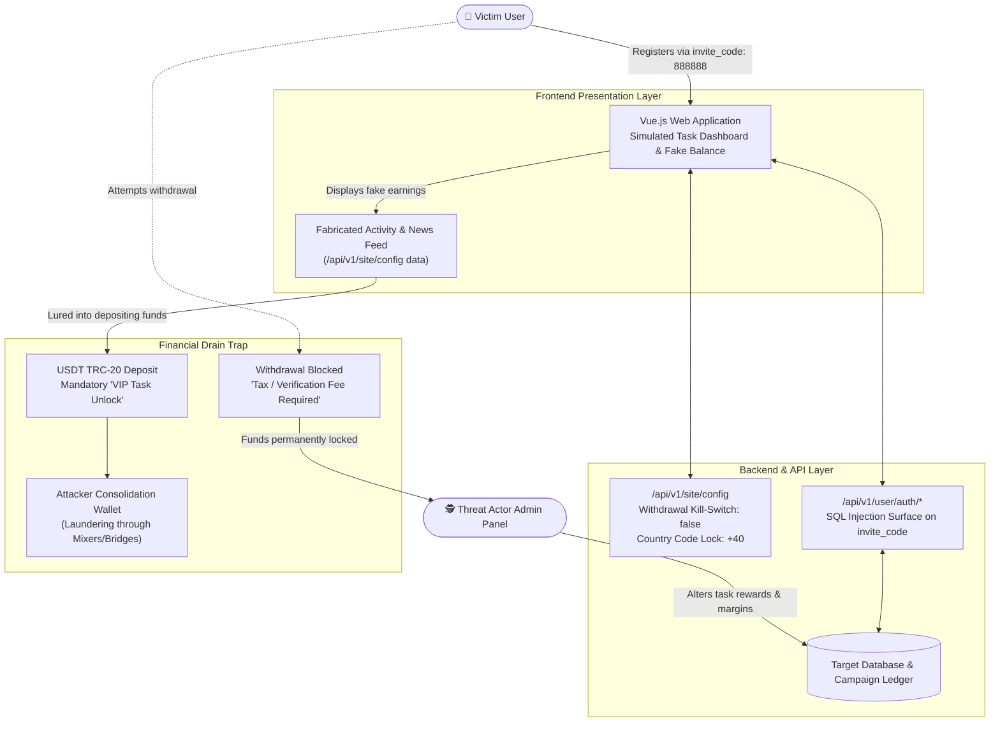

# Task Scam Infrastructure Analysis

**Pig Butchering · Fake Job Platform · API Reverse Engineering · Vulnerability Assessment · Crypto Drainage**

A comprehensive technical teardown, API disclosure analysis, and threat intelligence study of a fraudulent "Task Scam" / Pig Butchering web platform engineered to drain cryptocurrency deposits from victims.

---

## 🎯 Executive Summary

This repository documents the forensic analysis and security evaluation of an active **Task Scam** platform (a hybrid high-yield investment fraud / Pig Butchering scheme). Victims were recruited via WhatsApp/Telegram under the pretext of remote part-time jobs reviewing e-commerce items.

Through traffic interception (Burp Suite) and API endpoint interrogation, the investigation revealed definitive backend evidence of deliberate financial deception, including a **hardcoded withdrawal kill-switch**, simulated fake profits, geographic campaign locks, and systemic backend injection vulnerabilities.

---

## 🏗️ Architecture & Fraud Mechanism

---

## 📑 Repository Structure & Documentation

- **📄 [`studiu_de_caz.md`](studiu_de_caz.md)** — Exhaustive technical case study in Romanian analyzing the business model, API config kill-switches, SQL injection surface, crypto flows, and MITRE ATT&CK mapping.
- **📄 [`API_exposure.md`](API_exposure.md)** — In-depth breakdown of the `/api/v1/site/config` endpoint disclosure and hardcoded withdrawal restrictions.
- **📄 [`SQLI.md`](SQLI.md)** — Vulnerability audit of input sanitization across the `username` and `invite_code` fields.
- **📄 [`ui_manipulation.md`](ui_manipulation.md)** — Analysis of client-side cosmetic manipulation techniques and fake WebSocket transactions.
- **📄 [`fingerprinting.md`](fingerprinting.md)** — Tech stack profiling (PHP/Laravel backend, Vue.js SPA, Cloudflare configuration).
- **📄 [`investigation.md`](investigation.md)** — Lab setup and traffic capture methodology.

---

## 🔬 Key Technical Discoveries

1. **The "Withdrawal Kill-Switch"**: In `/api/v1/site/config`, `withdrawMethodBank` and `withdrawMethodRevolut` are hardcoded to `false`. While the UI displays bank and card withdrawal options, the backend silently rejects all fiat cashout requests.
2. **Geographic Campaign Targeting**: The platform enforced `defaultCountryCode: "+40"` to isolate and target Romanian mobile numbers.
3. **Insecure Backend Query Logic**: The registration endpoint lacked server-side input validation and prepared statements, creating exposure to blind SQL injection.

---

## ⚖️ License & Attribution

Maintained by [`@stefannut`](https://github.com/stefannut). Distributed under the [MIT License](LICENSE).
