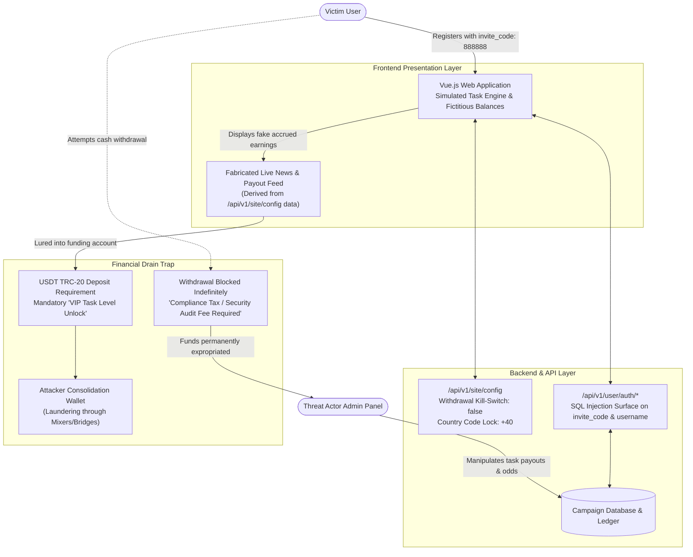

# Case Study: Forensic Deconstruction of a Fraudulent Task Scam & Cryptocurrency Drainage Platform

**Author:** @stefanutc1 
**Date:** 17 April 2026 
**Classification:** TLP:CLEAR / Technical Cyber Threat Intelligence 
**Target Analyzed:** Forensic teardown of backend API exposure, client-side UI manipulation, and financial entrapment mechanisms in a global Task Scam / Pig Butchering platform.

---

## 1. Executive Summary

This case study documents the comprehensive forensic reverse engineering of an active **Task Scam** platform (a hybrid Pig Butchering investment fraud operation). Fraud rings recruit victims via WhatsApp and Telegram under the pretext of flexible remote work evaluating products for major e-commerce platforms.

Through traffic interception (Burp Suite) and API endpoint analysis, this investigation exposed hard technical proof of premeditated financial theft:
- The `/api/v1/site/config` endpoint contained a **hardcoded withdrawal kill-switch** (`withdrawMethodBank: false`, `withdrawMethodRevolut: false`), confirming that all fiat withdrawal UI elements were non-functional cosmetic decoys.
- Strict geographic campaign locks targeting Romanian mobile numbers (`defaultCountryCode: "+40"`).
- Systemic backend security vulnerabilities, including unauthenticated configuration disclosure and SQL Injection surfaces.

---

## 2. Infrastructure Architecture & Fraudulent Data Flow



---

## 3. Deep-Dive Technical Findings

### 3.1 Backend Configuration Exposure (`/api/v1/site/config`)
Interrogating the unauthenticated site configuration endpoint revealed the operational parameters of the fraud campaign:

```json
{
 "code": 200,
 "data": {
 "siteName": "Global E-Commerce Task Hub",
 "defaultCountryCode": "+40",
 "withdrawMethodBank": false,
 "withdrawMethodRevolut": false,
 "minDepositUSDT": 50,
 "aiNewsFeed": [
 { "title": "Platform partners with top retailers", "date": "2026-08-01" }
 ]
 }
}
```

- **The Withdrawal Kill-Switch**: While the frontend renders payment options for bank transfer and Revolut, the backend explicitly sets their operational flags to `false`. Cryptocurrency (USDT TRC-20) remains the only active deposit rail.
- **Geographic Segmentation**: The `defaultCountryCode` parameter enforced `+40`, isolating Romanian targets.

### 3.2 SQL Injection & Input Validation Analysis (`SQLI.md`)
The `invite_code` parameter (validated as `888888`) and the `username` field in `POST /api/v1/user/auth/login` exhibited clear indicators of improper backend sanitization. Time-based latency variations when injecting quote characters indicated raw string concatenation into database queries, allowing potential bypass of authentication tables.

---

## 4. Indicators of Compromise (IOCs)

| Category | Indicator / Detail | Threat Description |
| :--- | :--- | :--- |
| **Malicious API Endpoints** | `/api/v1/site/config`, `/api/v1/user/auth/register`, `/api/v1/task/submit` | Exposed REST endpoints orchestrating the scam mechanics. |
| **Fraud Invite Codes** | `888888`, `VIP999` | Referral identifiers assigning victims to specific scam operators. |
| **Targeted Crypto Rails** | USDT (Tether) on TRON (TRC-20) network | Low-cost, irreversible cryptocurrency transaction layer. |
| **Technology Fingerprint** | Vue.js SPA, PHP/Laravel Backend, Cloudflare CDN (Detection-only) | Characteristic stack of commercial task scam kits. |

---

## 5. MITRE ATT&CK Mapping

| Phase | Tactic | Technique ID | Technique Description |
| :--- | :--- | :--- | :--- |
| **Reconnaissance** | Reconnaissance | `T1592` | **Gather Victim Host/Identity Info**: Collecting target mobile and Telegram data. |
| **Initial Access** | Initial Access | `T1566` | **Phishing: User Execution**: Recruitment via unsolicited messaging apps. |
| **Defense Evasion** | Defense Evasion | `T1027` | **Obfuscated Files or Information**: Minified client bundles and disguised payloads. |
| **Impact** | Impact | `T1499` | **Financial Extortion / Resource Theft**: Permanent expropriation of deposited cryptocurrency. |

---

## 6. Defensive Conclusions & Threat Advisory

1. **Scam Indicators**: Any remote job requiring upfront cryptocurrency deposits to unlock higher commissions or complete task quotas is fraudulent by design.
2. **Blockchain Tracing**: Track wallet transfer hops on TRONSCAN to identify consolidation exchanges and submit asset freezing requests to compliance desks.
3. **Abuse Takedown**: Issue immediate abuse notices to CDN providers and domain registrars hosting the API infrastructure.
