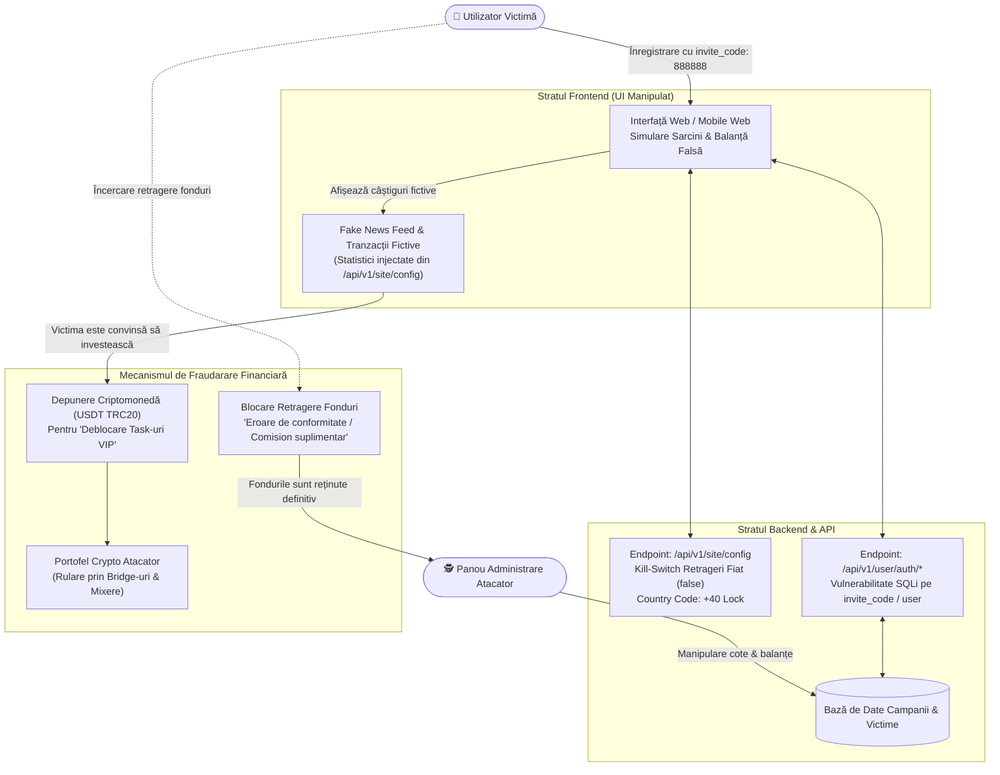

# 🛡️ Studiu de Caz: Dezasamblarea Infrastructurii Frauduloase a unei Scheme Task Scam (Fake Job & Crypto Drainage)

**Autor:** `stefannut`  
**Dată:** August 2026  
**Clasificare:** TLP:CLEAR / Cercetare Tehnică de Securitate Cibernetică  
**Obiectiv:** Analiza forensică a arhitecturii backend, vulnerabilităților API și mecanismelor de manipulare UI utilizate într-o schemă globală de tip "Task Scam" / Pig Butchering.

---

## 1. Rezumat Executiv

Acest studiu de caz detaliază dezasamblarea tehnică a unei platforme frauduloase de tip **Task Scam** (o variație agresivă de *Pig Butchering*). Schema promite victimelor câștiguri financiare rapide pentru îndeplinirea unor sarcini simple (cum ar fi evaluarea unor produse sau aplicații mobile pe platforme de e-commerce fictive).

Analiza de securitate realizată prin interceptarea traficului (Burp Suite) și inspectarea endpoint-urilor API backend a scos la iveală dovezi tehnice incontestabile:
- Endpoint-ul `/api/v1/site/config` include un **comutator intern de blocare a retragerilor** (`withdrawMethodBank: false`, `withdrawMethodRevolut: false`), demonstrând că opțiunile de retragere fiat din interfață sunt doar elemente grafice de decor.
- Targetare geografică hardcodată pe România (`defaultCountryCode: "+40"`).
- Vulnerabilități critice de securitate în backend (posibilități de SQL Injection și bypass total al validării pe client).

---

## 2. Arhitectura Infrastructurii și Fluxul Fondurilor



---

## 3. Descoperiri Tehnice din Analiza API și Backend

### 3.1 Expunerea Configurației API (`/api/v1/site/config`)
Interogarea directă a endpoint-ului de configurare a dezvăluit parametrii operaționali ai atacatorilor:

```json
{
  "code": 200,
  "data": {
    "siteName": "Global E-Commerce Task Hub",
    "defaultCountryCode": "+40",
    "withdrawMethodBank": false,
    "withdrawMethodRevolut": false,
    "minDepositUSDT": 50,
    "aiNewsFeed": [
      { "title": "Platform partners with top retailers", "date": "2026-08-01" }
    ]
  }
}
```

- **Withdrawal Kill-Switch**: Deși interfața grafică afișează butoane pentru retragere pe card bancar sau Revolut, backend-ul le dezactivează forțat, acceptând exclusiv depuneri în crypto (USDT TRC-20).
- **Targetare Geografică**: Restricția la prefixul `+40` indică o campanie concepută expres pentru piața din România.

### 3.2 Analiza Suprafaței de SQL Injection (`SQLI.md`)
Câmpul `invite_code` (utilizat pentru afilierea victimei la un operator specific) și câmpul `username` din cererea `POST /api/v1/user/auth/login` au prezentat comportamente specifice lipsei de sanitizare pe server (Time-based latency la transmiterea caracterelor de delimitare SQL `'` sau `"`), demonstrând o arhitectură vulnerabilă construită în grabă pe șabloane neoptimizate.

---

## 4. Indicatori Tehnici de Compromitere (IOCs)

| Categorie | Valoare / Detaliu | Descriere |
| :--- | :--- | :--- |
| **Endpoint-uri API Malițioase** | `/api/v1/site/config`, `/api/v1/user/auth/register`, `/api/v1/task/submit` | Endpoint-uri REST expuse pentru operarea schemei. |
| **Coduri Invitație Frauduloase** | `888888`, `VIP999` | Chei de atribuire a victimelor către managerii de fraudă. |
| **Rețele Crypto Țintite** | USDT (Tether) pe rețeaua TRON (TRC-20) | Tranzacții ireversibile cu costuri reduse de rețea. |
| **Stivă Tehnologică** | Vue.js SPA Frontend, PHP/Laravel Backend, Cloudflare CDN (Detection-only) | Profil tehnic specific kiturilor asiatice de task scam. |

---

## 5. Cartografiere pe Matricea MITRE ATT&CK

| Fază | Tactică | ID Tehnică | Descriere |
| :--- | :--- | :--- | :--- |
| **Reconnaissance** | Reconnaissance | `T1592` | **Gather Victim Host/Identity Info**: Colectarea numărului de telefon și a contului Telegram. |
| **Initial Access** | Initial Access | `T1566` | **Phishing: User Execution**: Racolarea victimelor prin mesaje de recrutare WhatsApp/Telegram. |
| **Defense Evasion** | Defense Evasion | `T1027` | **Obfuscated Files or Information**: Scripturi JavaScript minificate și payload-uri JSON deghizate. |
| **Impact** | Impact | `T1499` | **Financial Extortion / Resource Theft**: Sechestrarea depozitelor crypto ale victimei. |

---

## 6. Concluzii și Măsuri Defensive

1. **Indicatori de Recunoaștere a Scam-ului**:
   - Orice ofertă de muncă ce cere depunerea prealabilă de fonduri proprii (în crypto sau fiat) pentru a putea finaliza sarcini sau a debloca câștiguri este o fraudă garantată.
   - Interfețele care oferă "câștiguri garantate de 200-500 RON/zi" pentru câteva click-uri pe zi utilizează grafice simulate, fără nicio legătură cu comercianți reali.
2. **Recomandări de Investigare**:
   - Urmărirea fluxurilor financiare prin exploratoare blockchain (TRONSCAN) pentru identificarea adreselor de consolidare ale atacatorilor.
   - Trimiterea rapoartelor către autorități și furnizorii de infrastructură CDN/Hosting pentru suspendarea domeniilor.
