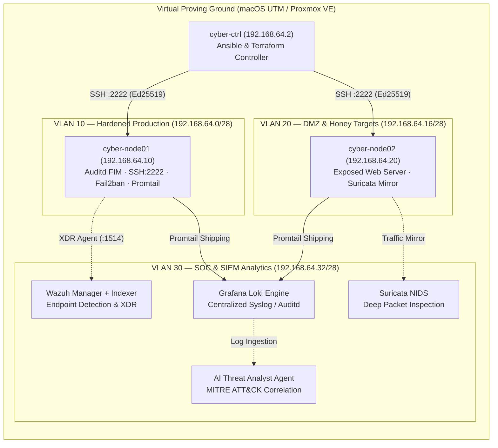

# 🛡️ CyberLab Defense & Operations Wiki

Welcome to the **CyberLab Security Engineering & Threat Operations Knowledge Base**. This repository provides the technical specifications, detection rules, hardening standards, and incident response playbooks for the CyberLab security proving ground.

---

## 📑 Wiki Modules

1. **[[Network Topology & Segmentation|Network-Topology-and-Segmentation]]** — Zero-trust VLAN boundaries, routing rules, and controller access.
2. **[[SIEM & SOC Operations|SIEM-and-SOC-Operations]]** — Wazuh XDR deployment, Loki log aggregation, Promtail rules, and CyberChef.
3. **[[Hardening & CIS Compliance|Hardening-and-CIS-Compliance]]** — Host hardening roles, SSH cryptography, kernel sysctl parameters, and Auditd FIM.
4. **[[Offensive Security & Emulation|Offensive-Security-and-Emulation]]** — Atomic Red Team test execution, BloodHound AD attack graph analysis, and LinPEAS parsing.
5. **[[DFIR & Incident Response|DFIR-and-Incident-Response]]** — Live forensic triage collector, memory acquisition, Chainsaw event log analysis, and host quarantine.
6. **[[Static Analysis & DevSecOps|Static-Analysis-and-DevSecOps]]** — Semgrep SAST rules, Trivy vulnerability scans, and TruffleHog secrets detection.
7. **[[AI Threat Hunting Agent|AI-Threat-Hunting-Agent]]** — Automated log correlation, regex IOC extraction, and MITRE ATT&CK taxonomy classification.
