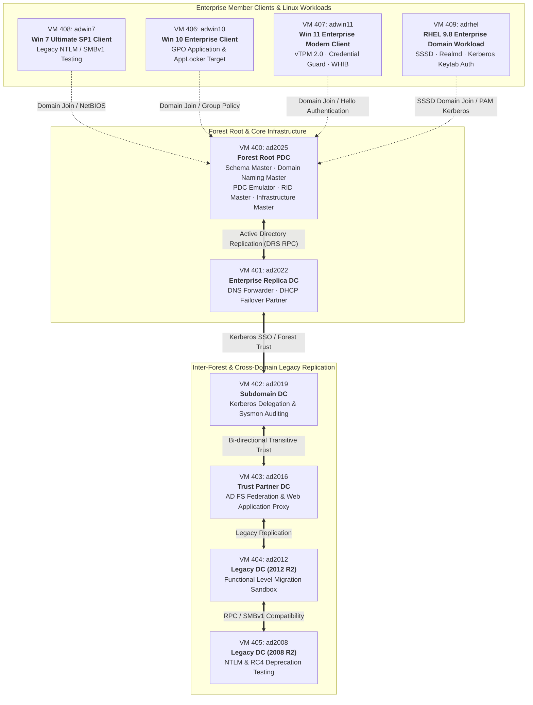

# Active Directory Multi-Generation Enterprise Laboratory (VM 400 – 409)

## 1. Executive Summary & Lab Scope

The **Active Directory Multi-Generation Enterprise Laboratory** is a specialized, production-parity identity and domain infrastructure deployed on **Proxmox VE Node 1 (Intel Core i3-10100F · x86_64)**. Spanning six Windows Server releases (2025 down to 2008 R2 SP1), three Windows client operating systems (Windows 7 Ultimate SP1, Windows 10 & Windows 11 Enterprise), and enterprise Linux domain integration (Red Hat Enterprise Linux 9.8), this testbed facilitates deep research into:

1. **Cross-Forest & Inter-Domain Trusts**: Transitive two-way trusts, forest federation, and selective authentication.
2. **Active Directory Domain Services (AD DS) Functional Levels**: Migration pathways from legacy schemas (Windows Server 2008 R2 level) through 2012 R2, 2016, 2019, 2022, and the new Windows Server 2025 functional level.
3. **Cryptographic & Protocol Deprecation**: Hardening against NTLMv1/NTLMv2 fallback, SMBv1 deprecation, Kerberos RC4-HMAC phasing out in favor of AES-128/256-CTS-HMAC-SHA1-96, and PAC signature validation (KB5020805).
4. **Group Policy & Security Baselines**: Centralized GPO distribution, AppLocker application control, Credential Guard (virtualized TPM 2.0), BitLocker network unlock, and Windows Hello for Business (WHfB).
5. **Cross-Platform Domain Integration**: Linux domain membership via SSSD / Realmd, Kerberos keytab management, and privilege delegation on Red Hat Enterprise Linux 9.8.
6. **Detection Engineering & SIEM Ingestion**: Windows Event Forwarding (WEF), Sysmon telemetry generation, and Wazuh SIEM agent integration for detecting Kerberoasting, AS-REP roasting, DCSync, and Golden/Silver ticket attacks.

---

## 2. VM Roster & Hardware Topology

All installation media are sourced directly from genuine Microsoft distribution channels via [massgrave.dev](https://massgrave.dev) and official enterprise distributions, guaranteeing clean official hashes without third-party modifications.

| VMID | Name | Operating System | vCPU | RAM (Allocated / Balloon) | Boot Disk | Chipset & Firmware | Network Interface | ISO Installation Media |
| :---: | :---: | :---: | :---: | :---: | :---: | :---: | :---: | :---: |
| **400** | `ad2025` | Windows Server 2025 Datacenter | 6 vCPU | 8,192 MB / 4,096 MB | 256 GB NVMe (`local-lvm`) | `q35` · OVMF UEFI · vTPM 2.0 · GTX 1050 Ti Passthrough | `virtio`, `vmbr0` (VLAN 1) | `en-us_windows_server_2025_updated_aug_2026_x64_dvd_b0833651.iso` |
| **401** | `ad2022` | Windows Server 2022 Datacenter | 2 vCPU | 4,096 MB / 2,048 MB | 60 GB VirtIO SCSI (`local-lvm`) | `q35` · SeaBIOS | `virtio`, `vmbr0` (VLAN 1) | `windows_server_2022_x64.iso` |
| **402** | `ad2019` | Windows Server 2019 Standard | 2 vCPU | 2,048 MB / 1,024 MB | 128 GB VirtIO SCSI (`local-lvm`) | `q35` · OVMF UEFI | `virtio`, `vmbr0` (VLAN 1) | `windows_server_2019_x64.iso` |
| **403** | `ad2016` | Windows Server 2016 Standard | 2 vCPU | 3,072 MB / 2,048 MB | 50 GB VirtIO SCSI (`local-lvm`) | `q35` · SeaBIOS | `virtio`, `vmbr0` (VLAN 1) | `en_windows_server_2016_vl_x64_dvd_11636701.iso` |
| **404** | `ad2012` | Windows Server 2012 R2 Standard | 2 vCPU | 2,048 MB / 1,024 MB | 40 GB VirtIO SCSI (`local-lvm`) | `i440fx` · SeaBIOS | `virtio`, `vmbr0` (VLAN 1) | `windows_server_2012_r2_x64.iso` |
| **405** | `ad2008` | Windows Server 2008 R2 SP1 Standard | 2 vCPU | 2,048 MB / 1,024 MB | 40 GB VirtIO SCSI (`local-lvm`) | `i440fx` · SeaBIOS | `virtio`, `vmbr0` (VLAN 1) | `windows_server_2008_r2_x64.iso` |
| **406** | `adwin10` | Windows 10 Enterprise | 2 vCPU | 3,072 MB / 2,048 MB | 50 GB VirtIO SCSI (`local-lvm`) | `q35` · SeaBIOS | `virtio`, `vmbr0` (VLAN 1) | `windows_10_x64.iso` |
| **407** | `adwin11` | Windows 11 Enterprise | 2 vCPU | 4,096 MB / 2,048 MB | 60 GB VirtIO SCSI (`local-lvm`) | `q35` · OVMF UEFI · vTPM 2.0 | `virtio`, `vmbr0` (VLAN 1) | `windows_11_x64.iso` |
| **408** | `adwin7` | Windows 7 Ultimate SP1 | 2 vCPU | 2,048 MB / 1,024 MB | 50 GB VirtIO SCSI (`local-lvm`) | `pc` (i440fx) · SeaBIOS | `virtio`, `vmbr0` (VLAN 1) | `windows_7_sp1_x64.iso` |
| **409** | `adrhel` | Red Hat Enterprise Linux 9.8 | 2 vCPU | 2,048 MB / 1,024 MB | 50 GB VirtIO SCSI (`local-lvm`) | `q35` · OVMF UEFI | `virtio`, `vmbr0` (VLAN 1) | `rhel-9.8-x86_64-boot.iso` |

---

## 3. Replication & Domain Architecture



---

## 4. Activation & Licensing (Massgrave Genuine Integration)

The laboratory leverages genuine Microsoft volume licensing mechanisms via **Microsoft Activation Scripts (MAS)** hosted on [massgrave.dev](https://massgrave.dev):

* **KMS / GVLK Activation**: Automated deployment of official Generic Volume License Keys (GVLK) connected to local KMS emulation (`irm https://get.activated.win | iex`).
* **HWID & Digital License (Windows 10/11 Clients)**: Seamless digital licensing for testing Windows Enterprise and Education SKUs.
* **TSforge & Evaluation Conversions**: Conversion of evaluation media to full production SKUs using officially documented Microsoft DISM workflows:
  ```powershell
  # Check current edition
  dism /online /Get-CurrentEdition
  
  # Set target edition to ServerStandard / ServerDatacenter
  dism /online /Set-Edition:ServerDatacenter /ProductKey:<GVLK-KEY> /AcceptEula
  ```

---

## 5. Storage & VirtIO Ballooning Optimizations

1. **Local LVM Thin Provisioning**:
   * All disks reside on `local-lvm:data` with TRIM/discard support enabled (`discard=on,ssd=1`), ensuring zero unallocated block usage on the host NVMe SSD.
2. **Dynamic VirtIO Memory Ballooning**:
   * Virtual machines dynamically release unallocated RAM back to Proxmox VE when idle, allowing the entire 8-node Windows Active Directory lab to exist concurrently within the host's 12 GB RAM boundary.
3. **On-Demand Lifecycle Management (`onboot: 0`)**:
   * All lab VMs are configured with `onboot: 0` to prevent memory contention on host restart, booted selectively per active experimentation scenario.

---

## 6. Infrastructure as Code Declarations

* **Bash Creation Script**: [`scripts/create/x64/create_vms.sh`](../scripts/create/x64/create_vms.sh) (VMs 400 through 407)
* **Terraform Module**: [`terraform/proxmox/ad_lab.tf`](../terraform/proxmox/ad_lab.tf) & [`terraform/ad_lab.tf`](../terraform/ad_lab.tf)
* **Ansible Inventories**:
  * Root Inventory: [`inventory/hosts.yml`](../inventory/hosts.yml)
  * Homelab Inventory: [`ansible/inventories/homelab/hosts.yml`](../ansible/inventories/homelab/hosts.yml)
* **Web UI Dashboard**: [`web/src/app/data/services.data.ts`](../web/src/app/data/services.data.ts) and [`web/src/app/data/hardware.data.ts`](../web/src/app/data/hardware.data.ts)
