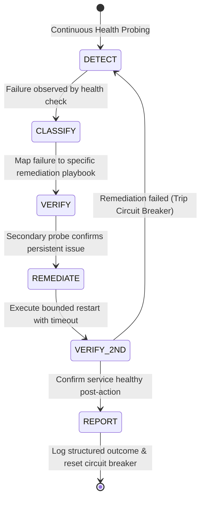

# Homelab Operational Automation & Self-Healing

Automated Day-2 operations, proactive health monitoring, self-healing remediation, and cluster maintenance.

---

## 1. Responsibilities & Ownership

| Layer | Responsibility | Ownership |
| :--- | :--- | :--- |
| **Operations (Automation)** | **WHAT happens next** | Health checks, self-healing, snapshot retention, housekeeping, drift monitoring |
| **Terraform (IaC)** | **WHAT exists** | Virtual Machines, LXC Containers, vCPUs, RAM limits, ZFS disks, VLAN tags, IP assignments |
| **Ansible (CM)** | **HOW it is configured** | OS baseline, packages, systemd services, users, SSH hardening, application prerequisites |

---

## 2. Directory Structure

```
operations/
├── health/
│   └── fleet_healthcheck.py       # Full-cluster health inspector (ICMP, SSH, DNS, HTTP endpoints, GPU)
├── recovery/
│   └── self_healing_engine.py      # Bounded self-healing state machine (DETECT -> CLASSIFY -> REMEDIATE)
├── maintenance/
│   └── housekeeping.py            # Docker prune, journald truncation, ZFS trim trigger
├── drift/
│   └── drift_detector.py          # Declared vs Actual state comparison
└── README.md
```

---

## 3. Self-Healing State Machine



---

## 4. Operational Runbook

```bash
# 1. Run Cluster Health Inspection
python3 operations/health/fleet_healthcheck.py

# 2. Run Self-Healing Engine (Dry-Run Mode)
python3 operations/recovery/self_healing_engine.py --dry-run --service ollama

# 3. Execute Scheduled Housekeeping
python3 operations/maintenance/housekeeping.py

# 4. Check for Infrastructure Configuration Drift
python3 operations/drift/drift_detector.py
```
