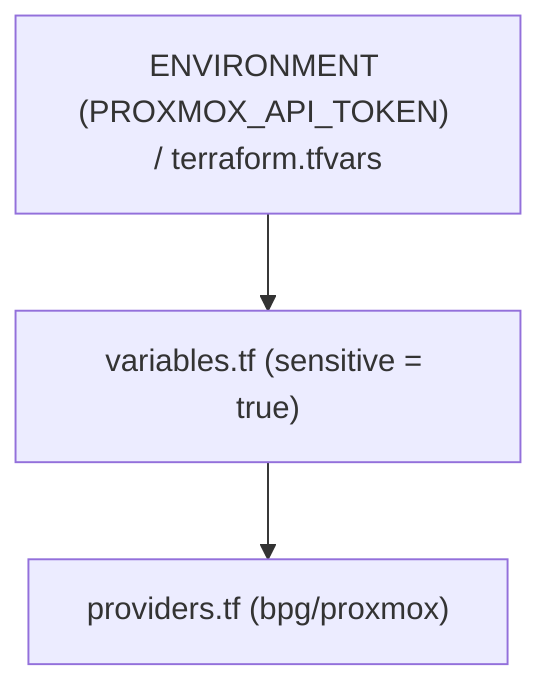

# Homelab Infrastructure as Code (Terraform)

Declarative provisioning of bare-metal hypervisor resources, network segments, QEMU virtual machines, and LXC containers on Proxmox VE using the `bpg/proxmox` provider.

---

## 1. Responsibilities & Ownership

| Layer | Responsibility | Ownership |
| :--- | :--- | :--- |
| **Terraform (IaC)** | **WHAT exists** | Virtual Machines, LXC Containers, vCPUs, RAM limits, ZFS disks, VLAN tags, IP assignments |
| **Ansible (CM)** | **HOW it is configured** | OS baseline, packages, systemd services, users, SSH hardening, application prerequisites |
| **Operations (Automation)** | **WHAT happens next** | Health checks, self-healing, snapshot retention, housekeeping, drift monitoring |

---

## 2. Directory Structure

```
terraform/
├── main.tf                    # Root composition invoking modules for all cluster workloads
├── providers.tf               # Proxmox VE provider and backend declaration
├── variables.tf               # Cluster endpoints, node mappings, and OS templates
├── outputs.tf                 # Machine-readable inventory exports for Ansible handoff
├── terraform.tfvars.example   # Variable template
└── modules/
    ├── proxmox_lxc/           # Reusable, validated LXC container provisioning module
    ├── proxmox_vm/            # Reusable, validated QEMU/KVM virtual machine module
    └── network_segment/       # Declarative VLAN and network bridge abstraction
```

---

## 3. Secret Boundary & Variable Management

Credentials must never be hardcoded into `.tf` files.



```bash
cp terraform.tfvars.example terraform.tfvars
# Populate credentials:
# proxmox_endpoint  = "https://192.168.1.132:8006/"
# proxmox_api_token = "root@pam!terraform=00000000-0000-0000-0000-000000000000"
```

---

## 4. Operational Runbook

```bash
# 1. Format and validate
terraform fmt -check -recursive
terraform validate

# 2. Plan and inspect diff (Dry-Run)
terraform plan -out=tfplan.binary

# 3. Apply changes deterministically
terraform apply tfplan.binary

# 4. Export inventory for Ansible handoff
terraform output -json > ../ansible/inventories/terraform_outputs.json
```

---

## 5. Drift Detection & Rollback

* **Drift Detection**: Run `terraform plan -detailed-exitcode` or `./operations/drift/drift_detector.py`.
* **Rollback Procedure**: Revert git commit and execute `terraform apply` to return to the last known declarative state.
